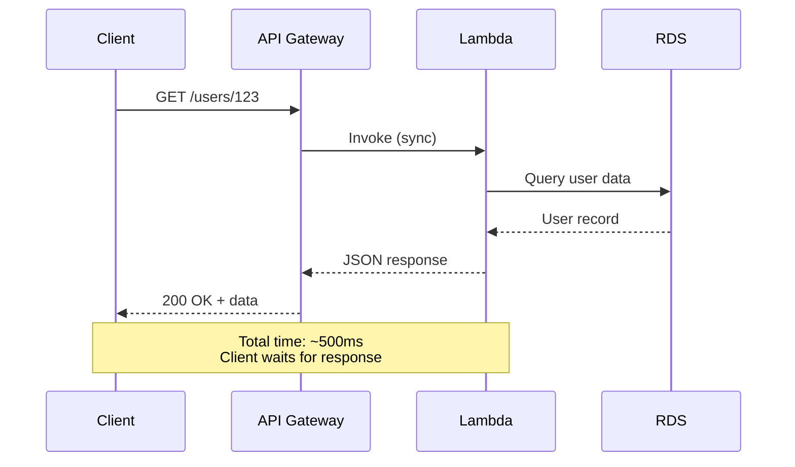
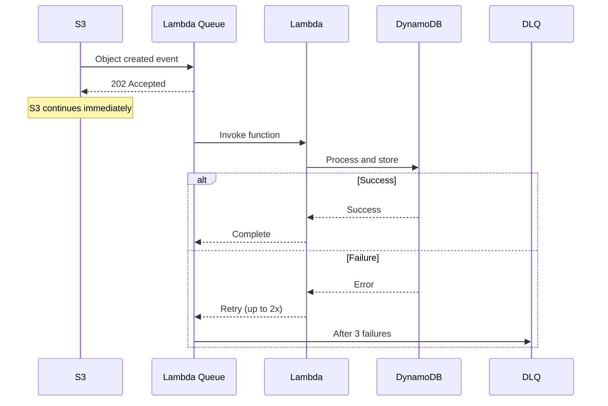
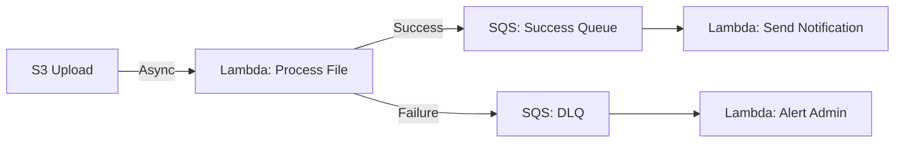
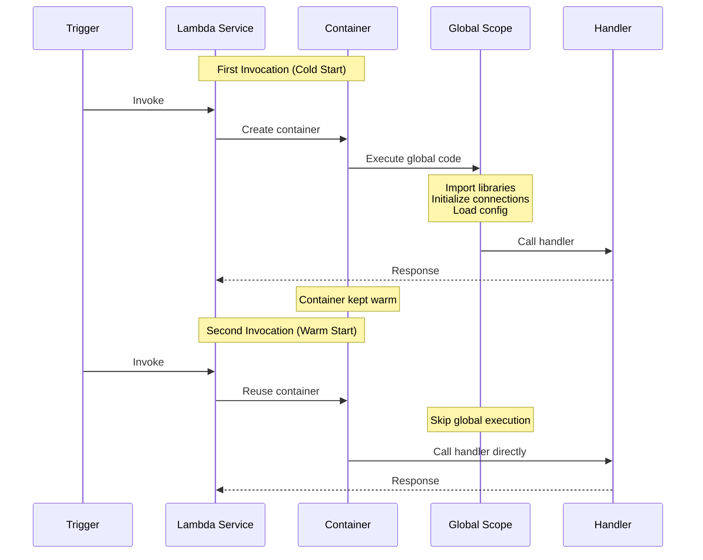
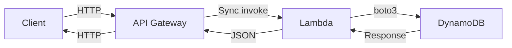
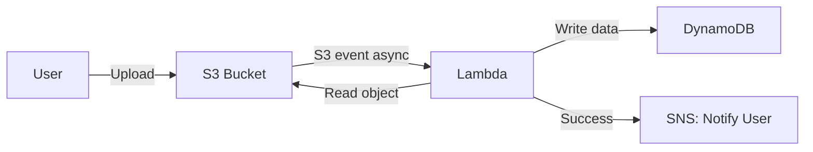
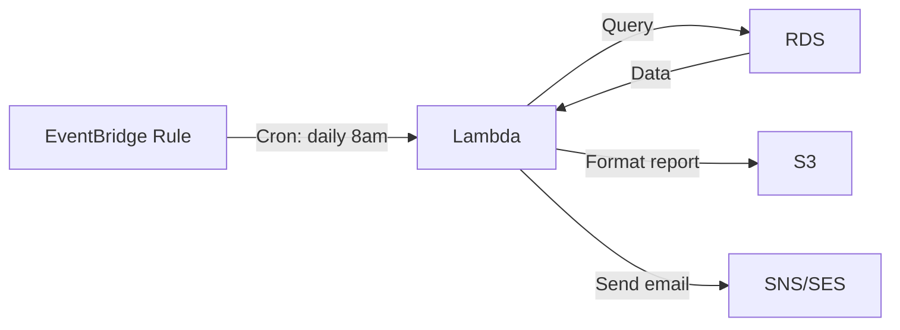
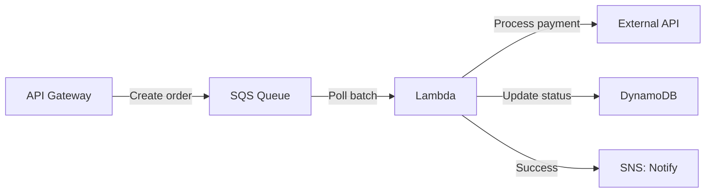

# Lambda Architecture - Event-Driven Design Patterns

## Event-Driven Architecture Principles

Event-driven architecture (EDA) is a design pattern where system components communicate through events rather than direct calls. Lambda functions excel in event-driven architectures by responding to events from various AWS services without maintaining persistent connections or polling mechanisms.

### Core Principles

**Decoupling**: Event producers and consumers are loosely coupled. Services don't need to know about each other's implementation details.

**Scalability**: Each component scales independently based on its workload. Lambda automatically scales to handle varying event volumes.

**Asynchronous Processing**: Many workflows don't require immediate responses. Asynchronous processing improves system resilience and performance.

**Event Immutability**: Events represent facts about what happened and should not be modified after creation.

### Benefits for WorldSkills Scenarios

- **Rapid Development**: Pre-built integrations with AWS services reduce implementation time
- **Automatic Scaling**: No capacity planning required during competition
- **Cost Efficiency**: Pay only for actual event processing
- **Resilience**: Failed events can be retried automatically or routed to dead-letter queues

## Lambda Triggers and Event Sources

Lambda functions can be invoked by numerous AWS services. Understanding trigger types is essential for competition scenarios.

### API Gateway (Synchronous)

**Use Case**: REST APIs, HTTP endpoints for web and mobile applications

**Event Structure**: HTTP method, path, query parameters, headers, body

**Integration Type**: Lambda proxy integration (recommended) or custom integration

**Response Format**: Must return object with `statusCode`, `headers`, and `body`

**Competition Scenarios**:
- User registration endpoints
- Data retrieval APIs
- CRUD operations for web applications

### S3 (Asynchronous)

**Use Case**: File processing, image transformation, data validation

**Event Structure**: Bucket name, object key, event type (ObjectCreated, ObjectRemoved)

**Trigger Configuration**: Filter by prefix (folder) or suffix (file extension)

**Competition Scenarios**:
- Image thumbnail generation
- CSV file parsing and database insertion
- Log file analysis

### EventBridge (CloudWatch Events) (Asynchronous)

**Use Case**: Scheduled tasks, cron jobs, event routing from AWS services

**Event Structure**: Time-based schedule or event pattern matching

**Schedule Expressions**: Rate (every 5 minutes) or Cron (specific times)

**Competition Scenarios**:
- Daily report generation
- Database backup automation
- Periodic data cleanup tasks

### DynamoDB Streams (Event Source Mapping)

**Use Case**: Real-time processing of database changes, data replication, audit logging

**Event Structure**: New item image, old item image, change type (INSERT, MODIFY, REMOVE)

**Processing**: Lambda polls stream and invokes function with batch of records

**Competition Scenarios**:
- Trigger notifications on new order creation
- Maintain materialized views
- Replicate data across tables

### SQS (Event Source Mapping)

**Use Case**: Decoupling microservices, buffering high-volume events, guaranteed message delivery

**Event Structure**: Batch of messages from queue

**Processing**: Lambda polls queue and deletes successfully processed messages

**Competition Scenarios**:
- Order processing pipeline
- Batch job processing
- Handling traffic spikes with queue buffering

### SNS (Asynchronous)

**Use Case**: Fan-out pattern, sending notifications to multiple subscribers

**Event Structure**: Subject, message, message attributes

**Integration**: SNS topic triggers Lambda function when message published

**Competition Scenarios**:
- Send email/SMS notifications
- Trigger multiple Lambda functions from single event
- Event broadcasting to multiple systems

## Synchronous vs Asynchronous Invocation

Understanding invocation patterns is critical for error handling and architecture design.

### Synchronous Invocation (Request-Response)

**Behavior**: Caller waits for function to complete and returns response directly

**Triggers**: API Gateway, ALB, Lambda function URLs, AWS SDK direct invocation

**Error Handling**: Errors returned immediately to caller. Client responsible for retry logic.

**Response**: Function return value sent directly to caller

**Use Cases**: REST APIs, real-time data retrieval, user-facing applications

**Example Flow**:


**Timeout Consideration**: API Gateway timeout is 29 seconds. Lambda must respond within this limit.

### Asynchronous Invocation

**Behavior**: Lambda queues event and returns success immediately. Function processes event independently.

**Triggers**: S3, SNS, EventBridge, SES

**Error Handling**: Lambda automatically retries failed invocations twice (configurable). Use destinations or DLQ for failure handling.

**Response**: Caller receives immediate acceptance (202 Accepted). Function return value not sent to caller.

**Use Cases**: File processing, notifications, background tasks, non-critical workflows

**Example Flow**:


**Retry Behavior**:
- First retry: 1 minute after failure
- Second retry: 2 minutes after first retry
- After 3 total attempts, event sent to DLQ or destination

## Event Source Mapping (Poll-Based Invocation)

Event source mapping is used for stream-based and queue-based sources where Lambda polls for new records.

### How It Works

1. Lambda service polls event source on your behalf
2. Retrieves batch of records (configurable batch size)
3. Invokes function with batch
4. Deletes/checkpoints successfully processed records
5. Repeats continuously

### Supported Sources

- **DynamoDB Streams**: Changes to DynamoDB tables
- **Kinesis Data Streams**: Real-time data streaming
- **SQS**: Message queues (standard and FIFO)
- **MSK**: Apache Kafka topics

### Configuration Parameters

**Batch Size**: Number of records per invocation (1-10,000 depending on source)

**Batch Window**: Maximum time to wait for full batch (0-300 seconds)

**Parallelization Factor**: Number of concurrent batches per shard (Kinesis/DynamoDB only)

**Starting Position**: Where to start reading stream (LATEST, TRIM_HORIZON, AT_TIMESTAMP)

### Error Handling

**Partial Batch Failure**: Return `batchItemFailures` to retry only failed records (SQS, DynamoDB Streams, Kinesis)

**Maximum Retry Attempts**: Configure retry count before discarding or sending to DLQ

**Example**:
```python
def lambda_handler(event, context):
    failed_records = []
    
    for record in event['Records']:
        try:
            process_record(record)
        except Exception as e:
            print(f"Failed to process record: {e}")
            failed_records.append({"itemIdentifier": record['messageId']})
    
    return {"batchItemFailures": failed_records}
```

## Lambda Destinations

Destinations route function results to other AWS services without writing custom code.

### Use Cases

- Route successful executions to one service and failures to another
- Build event-driven workflows without writing integration code
- Replace custom error handling and retry logic

### Supported Destinations

**For Asynchronous Invocations**:
- SNS topics
- SQS queues
- Lambda functions
- EventBridge event buses

**Configuration**:
- Success destination: Invoked when function succeeds
- Failure destination: Invoked after all retry attempts fail

### Example Architecture



### Configuration via AWS Console

1. Navigate to Lambda function configuration
2. Select "Destinations" from left menu
3. Add destination for success or failure
4. Choose destination type (SNS, SQS, Lambda, EventBridge)
5. Select specific resource (topic, queue, function ARN, event bus)

## Execution Context Reuse

Understanding execution context lifecycle is critical for optimization and cost reduction.

### Container Lifecycle



### Optimization Strategies

**Initialize Outside Handler**:
```python
import boto3
import os

# Global scope - executed once per container
dynamodb = boto3.resource('dynamodb')
table = dynamodb.Table(os.environ['TABLE_NAME'])

def lambda_handler(event, context):
    # Handler - executed per invocation
    # Reuses dynamodb client from global scope
    table.put_item(Item={'id': '123', 'data': 'value'})
    return {'statusCode': 200}
```

**Connection Pooling**: Database connections initialized in global scope persist across invocations

**Caching**: Load configuration files or reference data once in global scope

**Avoid Anti-Patterns**: Don't initialize in handler for each invocation

### Execution Context Behavior

**Reuse Duration**: Containers typically reused for 5-15 minutes after last invocation

**No Guarantee**: Lambda may create new container at any time. Never rely on state persistence.

**Temporary Storage**: `/tmp` directory (512MB-10GB configurable) persists across invocations in same container

## Concurrency Model

Lambda concurrency determines how many function instances can run simultaneously.

### Key Concepts

**Account Concurrency Limit**: Default 1,000 concurrent executions per region (can request increase)

**Unreserved Concurrency**: Shared pool available to all functions (minimum 100 reserved for account)

**Reserved Concurrency**: Dedicated capacity for specific function (guarantees availability but limits maximum concurrency)

**Provisioned Concurrency**: Pre-initialized execution environments to eliminate cold starts (additional cost)

### Concurrency Calculation

Concurrency = (Requests per second) × (Average execution duration in seconds)

**Example**:
- 100 requests/second
- 500ms average duration
- Concurrency needed: 100 × 0.5 = 50

### When to Use Reserved Concurrency

- Critical functions requiring guaranteed capacity
- Limiting concurrency to protect downstream resources (database connection limits)
- Preventing one function from consuming all account concurrency

### When to Use Provisioned Concurrency

- Latency-sensitive applications requiring <100ms response times
- Predictable traffic patterns where cold starts are unacceptable
- Competition scenarios requiring consistent performance (rarely needed)

**Cost**: Provisioned concurrency charged for reserved capacity even when idle. Not recommended for Free Tier practice.

## Integration Patterns for WorldSkills

### Pattern 1: API Gateway + Lambda + DynamoDB (REST API)

**Use Case**: User-facing REST API for CRUD operations

**Architecture**:


**Characteristics**:
- Synchronous invocation
- Low latency (<500ms typical)
- Direct response to client
- Suitable for read and write operations

**Competition Time**: 30-45 minutes to implement

### Pattern 2: S3 + Lambda + DynamoDB (File Processing)

**Use Case**: Process uploaded files and extract data to database

**Architecture**:


**Characteristics**:
- Asynchronous invocation
- Background processing
- Automatic retry on failure
- No client waiting

**Competition Time**: 20-30 minutes to implement

### Pattern 3: EventBridge + Lambda + RDS (Scheduled Tasks)

**Use Case**: Daily report generation from database

**Architecture**:


**Characteristics**:
- Time-based trigger
- Runs on schedule
- No external trigger required
- Ideal for maintenance tasks

**Competition Time**: 25-35 minutes to implement

### Pattern 4: SQS + Lambda + External API (Decoupled Processing)

**Use Case**: Process orders from queue, call payment API, update database

**Architecture**:


**Characteristics**:
- Buffering for traffic spikes
- Guaranteed message delivery
- Batch processing efficiency
- Decouples frontend from backend

**Competition Time**: 35-50 minutes to implement

## WorldSkills Architecture Tips

### Time-Saving Patterns

1. **Start with Lambda + API Gateway**: Fastest to implement and test
2. **Use Managed Policies**: Attach `AWSLambdaBasicExecutionRole` instead of creating custom policies initially
3. **Test Incrementally**: Test Lambda function first with test events, then add API Gateway
4. **Use Console for Speed**: AWS Console is 5-10 minutes faster than CLI for Lambda creation during competition

### Common Architecture Mistakes

**Mistake 1: Synchronous Invocation for Long Tasks**
- Problem: API Gateway timeout at 29 seconds
- Solution: Use asynchronous invocation (S3 trigger) or return immediate response with background processing

**Mistake 2: No Error Handling**
- Problem: Failed Lambda invocations with no visibility
- Solution: Add try-except blocks, configure DLQ, enable CloudWatch Logs

**Mistake 3: Overly Complex Architectures**
- Problem: Multiple Lambda functions, Step Functions, complex event chains
- Solution: Keep it simple. Single Lambda + API Gateway + DynamoDB solves 70% of competition scenarios

**Mistake 4: Missing CORS Configuration**
- Problem: Browser-based clients cannot call API
- Solution: Enable CORS on API Gateway during creation

### Evaluation Criteria Alignment

**Functionality (40%)**:
- Lambda executes without errors
- All required integrations work correctly
- Response format matches specification

**Security (25%)**:
- IAM execution role uses least privilege
- No hardcoded credentials in code
- Input validation implemented

**Cost-Optimization (15%)**:
- Appropriate memory allocation (128MB-512MB typical)
- Timeout set to minimum required (3-30 seconds typical)
- Unused functions deleted

**Documentation (10%)**:
- Architecture diagram showing Lambda triggers and integrations
- Comments explaining event processing logic
- Environment variable documentation

## Next Steps

After understanding Lambda architecture patterns:
- [python_examples.md](python_examples.md): Detailed Python code for each integration pattern
- [permissions_iam.md](permissions_iam.md): IAM role configuration for each trigger type
- [serverless_lab.md](serverless_lab.md): Hands-on implementation of API Gateway + Lambda + DynamoDB
- [cost_optimization.md](cost_optimization.md): Concurrency management and cost monitoring
