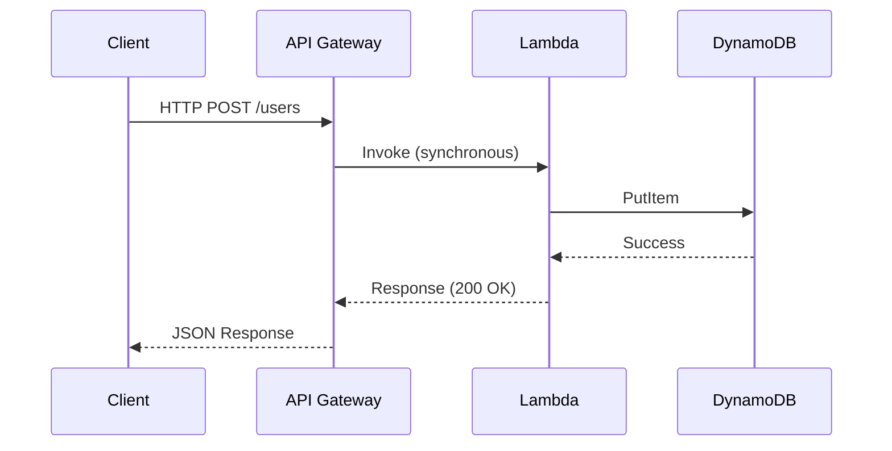
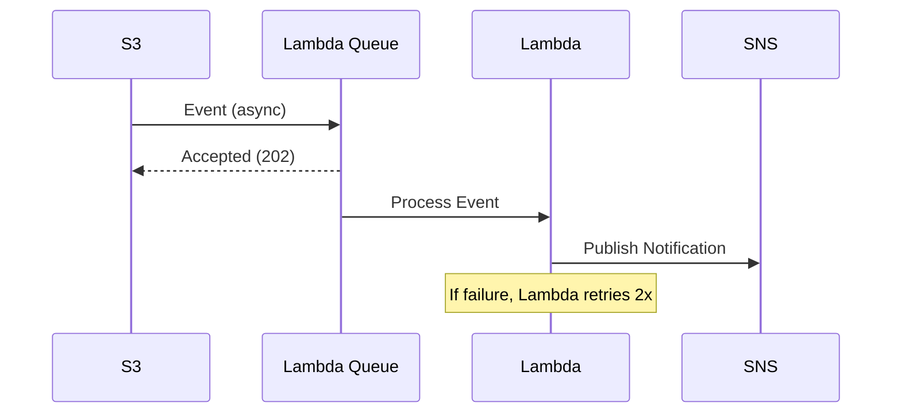
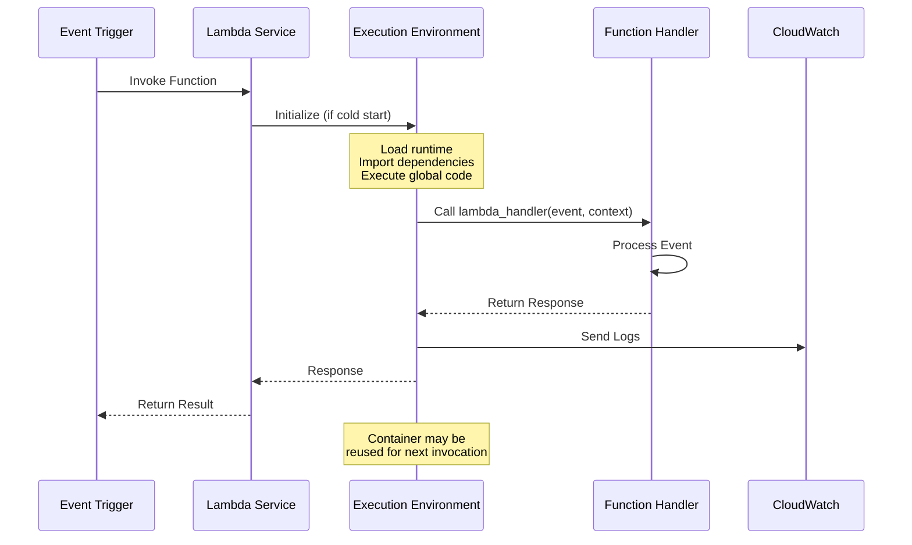

# AWS Lambda Overview - Serverless Computing Fundamentals

## What is AWS Lambda?

AWS Lambda is a serverless compute service that runs your code in response to events without requiring you to provision or manage servers. Lambda automatically scales your application by running code in response to each trigger, executing your code only when needed and scaling automatically from a few requests per day to thousands per second.

**Key Characteristics:**
- **Event-Driven Execution**: Code runs in response to triggers such as HTTP requests, file uploads, database changes, or scheduled events
- **Stateless Computing**: Each function execution is independent with no persistent state between invocations
- **Automatic Scaling**: Lambda automatically handles scaling from zero to thousands of concurrent executions
- **Pay-Per-Use**: You pay only for compute time consumed, measured in milliseconds

### Lambda vs Traditional EC2-Based Computing

| Aspect | AWS Lambda | Amazon EC2 |
|--------|-----------|------------|
| Server Management | No servers to manage | Full server management required |
| Scaling | Automatic, instant scaling | Manual scaling or Auto Scaling Groups |
| Pricing Model | Pay per request and compute time | Pay for running instances (hourly) |
| Idle Cost | Zero cost when not executing | Continuous cost while running |
| Startup Time | Cold start: 100ms-2s, Warm: <1ms | Always running (no cold start) |
| Execution Duration | Maximum 15 minutes | Unlimited runtime |
| State Persistence | Stateless (ephemeral storage) | Persistent storage available |
| Use Case | Event-driven, short tasks | Long-running processes, complex applications |

## Key Concepts

### Functions
A Lambda function is the fundamental unit of deployment. It contains your code, runtime environment configuration, and execution settings.

**Components:**
- **Handler**: Entry point method that Lambda calls to start execution
- **Runtime**: Execution environment (Python 3.9, 3.10, 3.11, Node.js, Java, etc.)
- **Memory Allocation**: 128MB to 10,240MB (affects CPU and network allocation)
- **Timeout**: Maximum execution time (1 second to 15 minutes)
- **Environment Variables**: Configuration values passed to function code

### Handler Function

The handler is the method in your code that processes events. For Python, the standard signature is:

```python
def lambda_handler(event, context):
    # event: Input data (JSON)
    # context: Runtime information
    return response
```

### Runtime Environments

Lambda supports multiple programming languages. For WorldSkills competitions, **Python 3.x** is the standard runtime.

**Available Python Runtimes:**
- Python 3.11 (recommended for new projects)
- Python 3.10
- Python 3.9

**Other Runtimes** (mentioned for awareness):
- Node.js 18.x, 20.x
- Java 17, 21
- .NET 6, 8
- Ruby 3.2
- Custom runtimes using Lambda Layers

### Execution Context

Lambda executes functions within an isolated execution context (container). Understanding the execution context lifecycle is critical for optimization:

1. **Cold Start**: First invocation or after period of inactivity
   - Lambda creates new execution environment
   - Downloads function code
   - Initializes runtime
   - Executes code outside handler (global scope)
   - Duration: 100ms to 2 seconds

2. **Warm Start**: Subsequent invocations reusing same container
   - Execution context already initialized
   - Global variables and connections preserved
   - Duration: Sub-millisecond to tens of milliseconds

**Optimization Strategy**: Initialize database connections, import heavy libraries, and load configuration in global scope (outside handler) to benefit from execution context reuse.

## Use Cases for WorldSkills Competitions

### 1. REST API Backends
Lambda integrates with API Gateway to create serverless REST APIs for web and mobile applications.

**Common Competition Scenario**: Build a user registration API that accepts POST requests, validates input, stores data in DynamoDB, and returns JSON responses.

### 2. Data Processing
Process files uploaded to S3 buckets, transform data formats, generate thumbnails, or extract metadata.

**Common Competition Scenario**: Create an image processing pipeline that resizes uploaded images and stores thumbnails in a separate S3 bucket.

### 3. Scheduled Tasks
Run automated tasks on a schedule using EventBridge (CloudWatch Events) triggers.

**Common Competition Scenario**: Generate daily reports by querying RDS database and sending summary emails via SNS.

### 4. Real-Time File Processing
Respond to S3 events (object creation, deletion) to process files immediately upon upload.

**Common Competition Scenario**: Parse CSV files uploaded to S3, validate data, and insert records into DynamoDB.

### 5. Event-Driven Workflows
Chain multiple Lambda functions together using SNS, SQS, or Step Functions for complex workflows.

**Common Competition Scenario**: Build an order processing system where Lambda functions handle payment, inventory update, and email notification stages.

## Lambda Execution Model

### Request-Response (Synchronous) Invocation

The caller waits for the function to process the event and return a response.

**Triggers**: API Gateway, Application Load Balancer, Lambda function URLs, direct invocation via AWS SDK

**Flow:**


**Error Handling**: Errors returned immediately to caller. Client responsible for retries.

### Asynchronous Invocation

Lambda queues the event and returns success immediately. Function processes event asynchronously.

**Triggers**: S3, SNS, EventBridge, SES

**Flow:**


**Error Handling**: Lambda automatically retries failed executions twice. Configure dead-letter queues (DLQ) or destinations for failed events.

### Event Source Mapping (Poll-Based)

Lambda polls the event source and invokes function with batches of records.

**Triggers**: DynamoDB Streams, Kinesis Data Streams, SQS queues

**Characteristics:**
- Lambda manages polling frequency
- Processes records in batches
- Maintains order for shard-based sources (DynamoDB Streams, Kinesis)

## AWS Free Tier Limits

Lambda offers a **permanent Free Tier** (does not expire after 12 months):

**Monthly Allowances:**
- **1 million requests** per month
- **400,000 GB-seconds** of compute time per month

### Understanding GB-Seconds

GB-seconds = (Memory allocated in GB) × (Execution duration in seconds)

**Example Calculations:**

| Scenario | Memory | Duration | GB-Seconds per Request | Free Tier Capacity |
|----------|--------|----------|----------------------|-------------------|
| Simple API | 128 MB | 200 ms | 0.025 | 16 million requests |
| File Processing | 512 MB | 5 seconds | 2.5 | 160,000 requests |
| Data Transform | 1024 MB | 1 second | 1.0 | 400,000 requests |

**Practical Implications:**
- For 128MB functions running 200ms, Free Tier covers ~16 million requests/month
- For 512MB functions running 5 seconds, Free Tier covers ~160,000 requests/month
- Competition practice typically uses <1% of Free Tier limits

### Beyond Free Tier Pricing

**Requests**: $0.20 per 1 million requests  
**Compute**: $0.0000166667 per GB-second

For WorldSkills practice, staying within Free Tier is easily achievable with proper cleanup practices.

## When to Use Lambda vs EC2

### Use Lambda When:
- **Event-driven workloads**: Responding to HTTP requests, file uploads, database changes
- **Unpredictable traffic**: Automatic scaling handles variable load
- **Short execution times**: Tasks completing within 15 minutes
- **Minimal state**: Stateless processing with external storage (S3, DynamoDB)
- **Cost optimization**: Pay-per-use model reduces costs for sporadic workloads
- **Rapid development**: No infrastructure management, faster deployment cycles

### Use EC2 When:
- **Long-running processes**: Tasks exceeding 15 minutes
- **Persistent state**: Applications requiring local storage or session management
- **Specialized software**: Custom operating system, kernel modules, or legacy applications
- **Consistent high load**: 24/7 workloads where EC2 Reserved Instances are more cost-effective
- **GPU workloads**: Machine learning inference requiring GPU acceleration
- **WebSocket servers**: Long-lived connections (though Lambda function URLs now support response streaming)

## Decision Matrix for WorldSkills Scenarios

| Competition Task | Recommended Service | Reasoning |
|-----------------|-------------------|-----------|
| REST API for user registration | Lambda + API Gateway | Event-driven, stateless, cost-effective |
| Static website hosting | S3 + CloudFront | No compute needed, pure storage solution |
| Image thumbnail generation | Lambda + S3 | Event-driven file processing |
| Scheduled daily reports | Lambda + EventBridge | Periodic task, short execution |
| Real-time chat application | EC2 or ECS | Long-lived WebSocket connections |
| Video encoding pipeline | EC2 or Fargate | Long-running, CPU-intensive tasks |
| Database-backed web app | Lambda + RDS or EC2 + RDS | Depends on traffic pattern and session needs |

## Getting Started with Lambda Console

### Navigating to Lambda Service

1. Log into AWS Management Console
2. Search for "Lambda" in services search bar
3. Click "Lambda" to open Lambda dashboard

### Lambda Dashboard Sections

**Functions**: List of all Lambda functions in current region  
**Applications**: View serverless applications (SAM or CloudFormation stacks)  
**Layers**: Shared code and dependencies used across multiple functions  
**Function URLs**: HTTP endpoints that invoke functions directly without API Gateway

### Exploring a Lambda Function

Key sections in function configuration page:
- **Code**: Inline code editor or deployment package information
- **Test**: Create and run test events to validate function logic
- **Monitor**: CloudWatch metrics (invocations, errors, duration, throttles)
- **Configuration**: Memory, timeout, environment variables, VPC settings
- **Permissions**: Execution role and resource-based policies
- **Aliases**: Version management and traffic routing

## Lambda Invocation Flow



## Key Takeaways for WorldSkills

1. **Serverless Simplicity**: Lambda eliminates server management, allowing focus on application logic
2. **Event-Driven Design**: Design functions to respond to specific events (HTTP requests, file uploads, scheduled triggers)
3. **Cost Efficiency**: Free Tier covers extensive practice and competition usage
4. **Rapid Deployment**: Functions deploy in seconds, enabling fast iteration during competition
5. **Integration Foundation**: Lambda serves as the compute layer for most competition scenarios, integrating with API Gateway, S3, DynamoDB, and other services

## Next Steps

After understanding Lambda fundamentals, proceed to:
- [architecture.md](architecture.md): Deep dive into event-driven architecture patterns
- [python_examples.md](python_examples.md): Practical Python code examples for common scenarios
- [permissions_iam.md](permissions_iam.md): IAM roles and security configuration
- [serverless_lab.md](serverless_lab.md): Hands-on lab building complete serverless API
- [cost_optimization.md](cost_optimization.md): Maximizing Free Tier and cost management strategies
