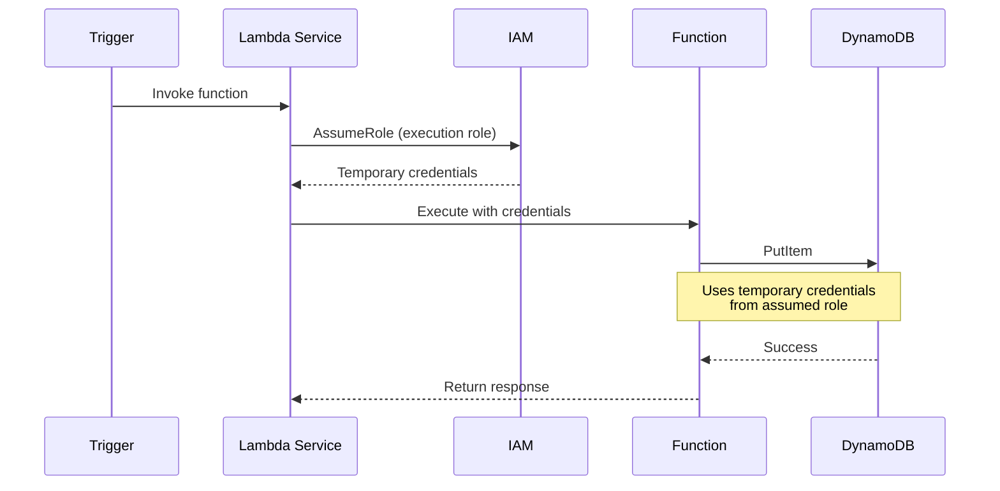
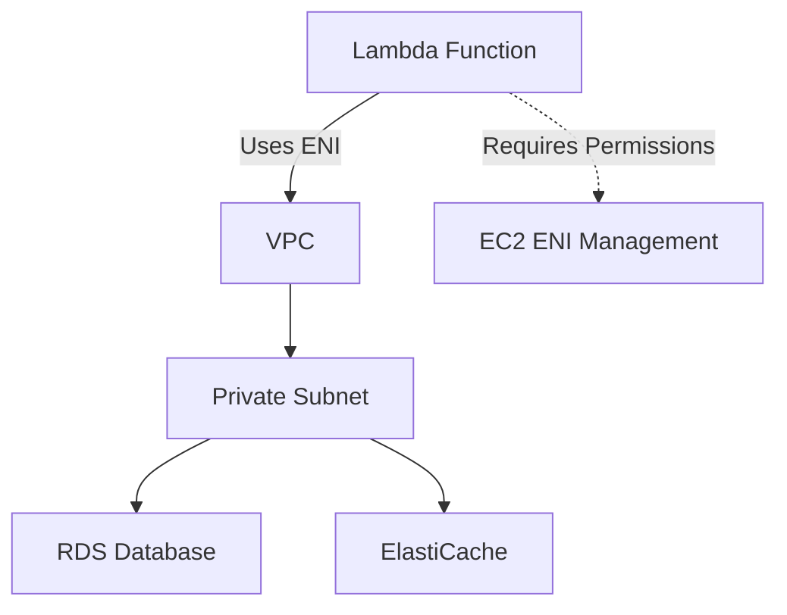

# Lambda IAM Permissions - Roles and Policies

## Lambda Execution Role

Every Lambda function requires an IAM execution role that grants permissions to access AWS services during execution. The function assumes this role when invoked, inheriting all attached policies.

### Execution Role Components

**Trust Policy**: Allows Lambda service to assume the role

```json
{
  "Version": "2012-10-17",
  "Statement": [
    {
      "Effect": "Allow",
      "Principal": {
        "Service": "lambda.amazonaws.com"
      },
      "Action": "sts:AssumeRole"
    }
  ]
}
```

**Permission Policies**: Define what actions the function can perform on which resources

### How Lambda Assumes Roles



## Managed Policies

AWS provides pre-built managed policies for common Lambda use cases. These policies are maintained by AWS and updated as services evolve.

### AWSLambdaBasicExecutionRole

**Purpose**: Grants permissions to write logs to CloudWatch Logs

**Permissions**:
```json
{
  "Version": "2012-10-17",
  "Statement": [
    {
      "Effect": "Allow",
      "Action": [
        "logs:CreateLogGroup",
        "logs:CreateLogStream",
        "logs:PutLogEvents"
      ],
      "Resource": "*"
    }
  ]
}
```

**When to Use**: Attach to every Lambda function as baseline. Required for logging.

**Attaching via Console**:
1. Navigate to IAM > Roles
2. Select Lambda execution role
3. Click "Attach policies"
4. Search for "AWSLambdaBasicExecutionRole"
5. Select and click "Attach policy"

### AWSLambdaDynamoDBExecutionRole

**Purpose**: Grants permissions to read from DynamoDB Streams and write logs

**Permissions**:
- DynamoDB Streams: `dynamodb:DescribeStream`, `dynamodb:GetRecords`, `dynamodb:GetShardIterator`, `dynamodb:ListStreams`
- CloudWatch Logs: Same as AWSLambdaBasicExecutionRole

**When to Use**: Lambda functions triggered by DynamoDB Streams

### AWSLambdaVPCAccessExecutionRole

**Purpose**: Grants permissions to manage network interfaces in VPC

**Permissions**:
- EC2 Network Interfaces: `ec2:CreateNetworkInterface`, `ec2:DescribeNetworkInterfaces`, `ec2:DeleteNetworkInterface`
- CloudWatch Logs: Same as AWSLambdaBasicExecutionRole

**When to Use**: Lambda functions configured to run inside VPC (accessing RDS, ElastiCache, etc.)

### When to Use Managed Policies

**Advantages**:
- Fast implementation (critical during competition)
- AWS maintains and updates policies
- Well-tested and secure

**Use managed policies during WorldSkills competitions** for speed. Create custom policies only when specific restrictions are required.

## Custom Policies

Custom policies implement least-privilege access for specific use cases.

### Policy Structure

```json
{
  "Version": "2012-10-17",
  "Statement": [
    {
      "Effect": "Allow",              // Allow or Deny
      "Action": [                     // API actions permitted
        "dynamodb:PutItem",
        "dynamodb:GetItem"
      ],
      "Resource": "arn:aws:dynamodb:us-east-1:123456789012:table/Users"  // Specific resource
    }
  ]
}
```

**Key Components**:
- **Effect**: `Allow` or `Deny`
- **Action**: List of API operations (e.g., `s3:GetObject`, `dynamodb:PutItem`)
- **Resource**: ARN of specific resources (or `*` for all resources)
- **Condition** (optional): Additional constraints (e.g., IP address restrictions)

## CloudWatch Logs Permissions

All Lambda functions should have CloudWatch Logs permissions for debugging and monitoring.

### Required Permissions

```json
{
  "Version": "2012-10-17",
  "Statement": [
    {
      "Effect": "Allow",
      "Action": [
        "logs:CreateLogGroup",
        "logs:CreateLogStream",
        "logs:PutLogEvents"
      ],
      "Resource": "arn:aws:logs:*:*:*"
    }
  ]
}
```

**Explanation**:
- `logs:CreateLogGroup`: Create log group if it doesn't exist (e.g., `/aws/lambda/MyFunction`)
- `logs:CreateLogStream`: Create new log stream for each function instance
- `logs:PutLogEvents`: Write log entries from `print()` statements

**Best Practice**: Always include CloudWatch Logs permissions. Use `AWSLambdaBasicExecutionRole` managed policy.

## S3 Access Permissions

Grant Lambda functions access to read or write S3 objects.

### Read-Only Access (GetObject)

```json
{
  "Version": "2012-10-17",
  "Statement": [
    {
      "Effect": "Allow",
      "Action": [
        "s3:GetObject"
      ],
      "Resource": "arn:aws:s3:::my-upload-bucket/*"
    }
  ]
}
```

**Use Case**: Reading files uploaded to S3 for processing

### Write Access (PutObject)

```json
{
  "Version": "2012-10-17",
  "Statement": [
    {
      "Effect": "Allow",
      "Action": [
        "s3:PutObject"
      ],
      "Resource": "arn:aws:s3:::my-output-bucket/*"
    }
  ]
}
```

**Use Case**: Writing processed data or generated files to S3

### Full Access to Specific Bucket

```json
{
  "Version": "2012-10-17",
  "Statement": [
    {
      "Effect": "Allow",
      "Action": [
        "s3:GetObject",
        "s3:PutObject",
        "s3:DeleteObject"
      ],
      "Resource": "arn:aws:s3:::my-processing-bucket/*"
    },
    {
      "Effect": "Allow",
      "Action": [
        "s3:ListBucket"
      ],
      "Resource": "arn:aws:s3:::my-processing-bucket"
    }
  ]
}
```

**Note**: `ListBucket` operates on bucket (no `/*`), while object operations require `/*`

### Bucket-Level vs Object-Level Permissions

**Bucket-Level Actions** (Resource: `arn:aws:s3:::bucket-name`):
- `s3:ListBucket`: List objects in bucket
- `s3:CreateBucket`: Create bucket
- `s3:DeleteBucket`: Delete bucket

**Object-Level Actions** (Resource: `arn:aws:s3:::bucket-name/*`):
- `s3:GetObject`: Read object
- `s3:PutObject`: Write object
- `s3:DeleteObject`: Delete object

## DynamoDB Access Permissions

### Read-Only Access

```json
{
  "Version": "2012-10-17",
  "Statement": [
    {
      "Effect": "Allow",
      "Action": [
        "dynamodb:GetItem",
        "dynamodb:Query",
        "dynamodb:Scan"
      ],
      "Resource": "arn:aws:dynamodb:us-east-1:123456789012:table/Users"
    }
  ]
}
```

**Use Case**: Reading user data from DynamoDB table

### Write Access

```json
{
  "Version": "2012-10-17",
  "Statement": [
    {
      "Effect": "Allow",
      "Action": [
        "dynamodb:PutItem",
        "dynamodb:UpdateItem",
        "dynamodb:DeleteItem"
      ],
      "Resource": "arn:aws:dynamodb:us-east-1:123456789012:table/Users"
    }
  ]
}
```

**Use Case**: Creating, updating, or deleting records in DynamoDB

### Full Access to Specific Table

```json
{
  "Version": "2012-10-17",
  "Statement": [
    {
      "Effect": "Allow",
      "Action": [
        "dynamodb:GetItem",
        "dynamodb:PutItem",
        "dynamodb:UpdateItem",
        "dynamodb:DeleteItem",
        "dynamodb:Query",
        "dynamodb:Scan"
      ],
      "Resource": "arn:aws:dynamodb:us-east-1:123456789012:table/Users"
    }
  ]
}
```

### Access to Table and Indexes

```json
{
  "Version": "2012-10-17",
  "Statement": [
    {
      "Effect": "Allow",
      "Action": [
        "dynamodb:Query",
        "dynamodb:Scan"
      ],
      "Resource": [
        "arn:aws:dynamodb:us-east-1:123456789012:table/Users",
        "arn:aws:dynamodb:us-east-1:123456789012:table/Users/index/*"
      ]
    }
  ]
}
```

**Use Case**: Querying global secondary indexes (GSI) requires explicit permission

## VPC Access Permissions

Lambda functions running inside VPC require permissions to manage elastic network interfaces (ENIs).

### Required Permissions

```json
{
  "Version": "2012-10-17",
  "Statement": [
    {
      "Effect": "Allow",
      "Action": [
        "ec2:CreateNetworkInterface",
        "ec2:DescribeNetworkInterfaces",
        "ec2:DeleteNetworkInterface"
      ],
      "Resource": "*"
    }
  ]
}
```

**When Required**: Lambda functions configured with VPC settings (accessing RDS in private subnet)

**Managed Policy Alternative**: Use `AWSLambdaVPCAccessExecutionRole` instead of custom policy

### Lambda VPC Architecture



## Resource-Based Policies

Resource-based policies (function policies) allow other AWS services to invoke Lambda functions.

### API Gateway Invoke Permission

```json
{
  "Version": "2012-10-17",
  "Statement": [
    {
      "Effect": "Allow",
      "Principal": {
        "Service": "apigateway.amazonaws.com"
      },
      "Action": "lambda:InvokeFunction",
      "Resource": "arn:aws:lambda:us-east-1:123456789012:function:MyFunction",
      "Condition": {
        "ArnLike": {
          "AWS:SourceArn": "arn:aws:execute-api:us-east-1:123456789012:abc123/*"
        }
      }
    }
  ]
}
```

**Purpose**: Allows API Gateway to invoke Lambda function

**Added Automatically**: When creating API Gateway integration via console, permission added automatically

### S3 Invoke Permission

```json
{
  "Version": "2012-10-17",
  "Statement": [
    {
      "Effect": "Allow",
      "Principal": {
        "Service": "s3.amazonaws.com"
      },
      "Action": "lambda:InvokeFunction",
      "Resource": "arn:aws:lambda:us-east-1:123456789012:function:MyFunction",
      "Condition": {
        "ArnLike": {
          "AWS:SourceArn": "arn:aws:s3:::my-upload-bucket"
        }
      }
    }
  ]
}
```

**Purpose**: Allows S3 bucket to invoke Lambda when objects are created or deleted

### Adding Resource-Based Policy via AWS CLI

```bash
aws lambda add-permission \
    --function-name MyFunction \
    --statement-id AllowS3Invoke \
    --action lambda:InvokeFunction \
    --principal s3.amazonaws.com \
    --source-arn arn:aws:s3:::my-upload-bucket
```

## Least Privilege Principle

Grant only the minimum permissions necessary for function to operate correctly.

### Why Least Privilege Matters

**Security**: Limits damage if function code is compromised or contains vulnerabilities

**Competition Scoring**: WorldSkills judges evaluate security practices. Overly permissive policies reduce security score.

**Compliance**: Follows AWS best practices and security frameworks

### Common Mistakes to Avoid

**Mistake 1: Wildcard Actions**
```json
// BAD
{
  "Effect": "Allow",
  "Action": "s3:*",           // Allows ALL S3 actions
  "Resource": "*"              // On ALL buckets
}

// GOOD
{
  "Effect": "Allow",
  "Action": "s3:GetObject",    // Only read access
  "Resource": "arn:aws:s3:::my-bucket/*"  // Specific bucket
}
```

**Mistake 2: Wildcard Resources**
```json
// BAD
{
  "Effect": "Allow",
  "Action": "dynamodb:PutItem",
  "Resource": "*"              // Access ALL DynamoDB tables
}

// GOOD
{
  "Effect": "Allow",
  "Action": "dynamodb:PutItem",
  "Resource": "arn:aws:dynamodb:us-east-1:123456789012:table/Users"  // Specific table
}
```

**Mistake 3: Full Administrative Access**
```json
// NEVER DO THIS FOR LAMBDA
{
  "Effect": "Allow",
  "Action": "*",
  "Resource": "*"
}
```

### Implementing Least Privilege

1. **Start with Minimal Permissions**: CloudWatch Logs only
2. **Add Specific Permissions**: Add exact actions and resources as needed
3. **Test Function**: Verify permissions are sufficient
4. **Remove Unused Permissions**: Delete permissions for features not implemented

## Combined Policy Examples

### API Gateway + Lambda + DynamoDB

**Scenario**: REST API that reads and writes user data

```json
{
  "Version": "2012-10-17",
  "Statement": [
    {
      "Effect": "Allow",
      "Action": [
        "logs:CreateLogGroup",
        "logs:CreateLogStream",
        "logs:PutLogEvents"
      ],
      "Resource": "arn:aws:logs:*:*:*"
    },
    {
      "Effect": "Allow",
      "Action": [
        "dynamodb:GetItem",
        "dynamodb:PutItem",
        "dynamodb:UpdateItem",
        "dynamodb:Query"
      ],
      "Resource": "arn:aws:dynamodb:us-east-1:123456789012:table/Users"
    }
  ]
}
```

### S3 + Lambda + DynamoDB (File Processing)

**Scenario**: Process uploaded CSV files and insert data into DynamoDB

```json
{
  "Version": "2012-10-17",
  "Statement": [
    {
      "Effect": "Allow",
      "Action": [
        "logs:CreateLogGroup",
        "logs:CreateLogStream",
        "logs:PutLogEvents"
      ],
      "Resource": "arn:aws:logs:*:*:*"
    },
    {
      "Effect": "Allow",
      "Action": [
        "s3:GetObject"
      ],
      "Resource": "arn:aws:s3:::my-upload-bucket/*"
    },
    {
      "Effect": "Allow",
      "Action": [
        "dynamodb:PutItem"
      ],
      "Resource": "arn:aws:dynamodb:us-east-1:123456789012:table/ProcessedData"
    }
  ]
}
```

### Lambda + S3 + SNS (Processing with Notifications)

**Scenario**: Process files from S3, write results to another bucket, send SNS notification

```json
{
  "Version": "2012-10-17",
  "Statement": [
    {
      "Effect": "Allow",
      "Action": [
        "logs:CreateLogGroup",
        "logs:CreateLogStream",
        "logs:PutLogEvents"
      ],
      "Resource": "arn:aws:logs:*:*:*"
    },
    {
      "Effect": "Allow",
      "Action": [
        "s3:GetObject"
      ],
      "Resource": "arn:aws:s3:::input-bucket/*"
    },
    {
      "Effect": "Allow",
      "Action": [
        "s3:PutObject"
      ],
      "Resource": "arn:aws:s3:::output-bucket/*"
    },
    {
      "Effect": "Allow",
      "Action": [
        "sns:Publish"
      ],
      "Resource": "arn:aws:sns:us-east-1:123456789012:ProcessingComplete"
    }
  ]
}
```

## Creating IAM Role in AWS Console

### Step-by-Step Instructions

1. **Navigate to IAM Service**
   - Open AWS Management Console
   - Search for "IAM" and click to open

2. **Create New Role**
   - Click "Roles" in left sidebar
   - Click "Create role" button

3. **Select Trusted Entity**
   - Choose "AWS service"
   - Select "Lambda" from service list
   - Click "Next"

4. **Attach Permissions Policies**
   - Search for "AWSLambdaBasicExecutionRole"
   - Check the checkbox to attach policy
   - Optionally attach other managed policies
   - Click "Next"

5. **Name the Role**
   - Role name: `LambdaExecutionRole-UserAPI`
   - Description: "Execution role for User API Lambda function"
   - Review permissions
   - Click "Create role"

6. **Add Custom Inline Policy** (Optional)
   - Open created role
   - Click "Add permissions" > "Create inline policy"
   - Switch to JSON editor
   - Paste custom policy JSON
   - Name policy: `DynamoDBUserTableAccess`
   - Click "Create policy"

## AWS CLI Commands

### Create IAM Role

```bash
# Create trust policy file
cat > trust-policy.json <<EOF
{
  "Version": "2012-10-17",
  "Statement": [
    {
      "Effect": "Allow",
      "Principal": {
        "Service": "lambda.amazonaws.com"
      },
      "Action": "sts:AssumeRole"
    }
  ]
}
EOF

# Create role
aws iam create-role \
    --role-name LambdaExecutionRole \
    --assume-role-policy-document file://trust-policy.json
```

### Attach Managed Policy

```bash
aws iam attach-role-policy \
    --role-name LambdaExecutionRole \
    --policy-arn arn:aws:iam::aws:policy/service-role/AWSLambdaBasicExecutionRole
```

### Create and Attach Custom Policy

```bash
# Create policy document
cat > policy.json <<EOF
{
  "Version": "2012-10-17",
  "Statement": [
    {
      "Effect": "Allow",
      "Action": [
        "dynamodb:GetItem",
        "dynamodb:PutItem"
      ],
      "Resource": "arn:aws:dynamodb:us-east-1:123456789012:table/Users"
    }
  ]
}
EOF

# Create policy
aws iam create-policy \
    --policy-name DynamoDBUserTableAccess \
    --policy-document file://policy.json

# Attach policy to role
aws iam attach-role-policy \
    --role-name LambdaExecutionRole \
    --policy-arn arn:aws:iam::123456789012:policy/DynamoDBUserTableAccess
```

### View Role Policies

```bash
# List attached managed policies
aws iam list-attached-role-policies --role-name LambdaExecutionRole

# List inline policies
aws iam list-role-policies --role-name LambdaExecutionRole

# Get inline policy document
aws iam get-role-policy \
    --role-name LambdaExecutionRole \
    --policy-name DynamoDBUserTableAccess
```

## WorldSkills Competition Tips

### Pre-Create Common Roles

Create reusable roles before competition to save time:
- `LambdaBasicRole`: CloudWatch Logs only
- `LambdaDynamoDBRole`: Logs + DynamoDB full access
- `LambdaS3Role`: Logs + S3 read/write access
- `LambdaVPCRole`: Logs + VPC + RDS access

### Use Managed Policies When Possible

**Time Comparison**:
- Managed policy: 30 seconds to attach
- Custom policy: 3-5 minutes to write and test

**Strategy**: Use managed policies during implementation. Create custom policies only if scoring specifically requires least-privilege demonstration.

### Document Permission Requirements

Include IAM requirements in architecture diagrams:

```
API Gateway → Lambda (Role: LambdaDynamoDBRole)
              ↓
              Permissions:
              - CloudWatch Logs: Write
              - DynamoDB Users table: GetItem, PutItem
```

### Common IAM Errors During Competition

**Error**: "User is not authorized to perform: lambda:CreateFunction"
- **Cause**: Your IAM user lacks permission to create Lambda functions
- **Solution**: Ensure competition account has sufficient permissions

**Error**: "Lambda function cannot access DynamoDB table"
- **Cause**: Execution role missing DynamoDB permissions
- **Solution**: Attach appropriate policy to execution role

**Error**: "API Gateway cannot invoke Lambda function"
- **Cause**: Missing resource-based policy
- **Solution**: Re-create API Gateway integration (adds permission automatically)

## Verification Checklist

Before testing Lambda function, verify IAM configuration:

- [ ] Execution role exists with name referencing function purpose
- [ ] Role has trust policy allowing Lambda service to assume it
- [ ] AWSLambdaBasicExecutionRole (or equivalent) attached for logging
- [ ] Service-specific permissions attached (S3, DynamoDB, etc.)
- [ ] Permissions use specific resources (not wildcards) where possible
- [ ] Resource-based policy configured for trigger service (API Gateway, S3)
- [ ] Lambda function configured with correct execution role ARN
- [ ] Test invocation succeeds without permission errors in logs

## Next Steps

After understanding IAM permissions:
- [serverless_lab.md](serverless_lab.md): Apply IAM concepts in hands-on lab
- [cost_optimization.md](cost_optimization.md): IAM has no direct costs but impacts security scoring
