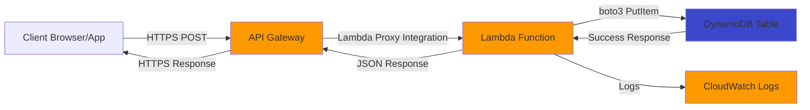

# Lambda Serverless Lab - User Registration API

## Lab Objective

Build a complete serverless REST API that processes user registration data and stores it in DynamoDB. This lab integrates API Gateway, Lambda, and DynamoDB to create a production-ready serverless application following WorldSkills competition standards.

**Learning Outcomes**:
- Deploy serverless API using API Gateway and Lambda
- Configure Lambda function with proper IAM permissions
- Implement DynamoDB data persistence
- Handle CORS for browser-based clients
- Monitor function execution with CloudWatch Logs
- Apply cost optimization using Free Tier resources

## Problem Statement

Create a user registration system with the following requirements:

**Functional Requirements**:
- Accept POST requests with user data (name, email)
- Validate input data (name required, email format validation)
- Store validated user data in DynamoDB with unique user ID
- Return success response with user ID and timestamp
- Handle errors gracefully with appropriate HTTP status codes

**Non-Functional Requirements**:
- API must be publicly accessible via HTTPS
- Response time under 500ms for successful requests
- Support browser-based clients (CORS enabled)
- All operations must stay within AWS Free Tier
- Security: Least privilege IAM roles, input validation

## Architecture Overview



**Components**:
- **API Gateway**: REST API endpoint accepting POST requests to `/register`
- **Lambda Function**: Python 3.11 function processing registration logic
- **DynamoDB Table**: NoSQL table storing user records with `userId` as partition key
- **CloudWatch Logs**: Automatic logging for debugging and monitoring

## Time Constraint

**Target Duration**: 45 minutes (competition simulation)

**Time Breakdown**:
- DynamoDB table creation: 5 minutes
- IAM role configuration: 8 minutes
- Lambda function creation: 12 minutes
- API Gateway setup: 15 minutes
- Testing and verification: 5 minutes

## Prerequisites

**AWS Account Setup**:
- Active AWS Free Tier account
- AWS Management Console access
- Region selected: `us-east-1` (or your preferred region)

**Local Tools**:
- AWS CLI installed and configured (optional for testing)
- curl or Postman for API testing
- Text editor for reviewing code

**Knowledge Prerequisites**:
- Basic understanding of REST APIs
- Python fundamentals (functions, dictionaries, try-except)
- JSON format
- HTTP status codes

## Step-by-Step Implementation

### Step 1: Create DynamoDB Table

**Objective**: Create NoSQL table to store user registration data

**AWS Console Steps**:

1. Navigate to DynamoDB service
   - Open AWS Console
   - Search for "DynamoDB" in services
   - Click "DynamoDB" to open dashboard

2. Create table
   - Click "Create table" button
   - Table name: `UserRegistrations`
   - Partition key: `userId` (String)
   - Leave sort key empty
   - Table settings: Default settings
   - Capacity mode: On-demand (Free Tier eligible)
   - Click "Create table"

3. Wait for table creation
   - Status changes from "Creating" to "Active" (30-60 seconds)

**AWS CLI Alternative**:

```bash
aws dynamodb create-table \
    --table-name UserRegistrations \
    --attribute-definitions AttributeName=userId,AttributeType=S \
    --key-schema AttributeName=userId,KeyType=HASH \
    --billing-mode PAY_PER_REQUEST \
    --region us-east-1
```

**Verification**:
- Table appears in DynamoDB tables list
- Status shows "Active"
- Partition key is `userId` (String)

**Cost**: DynamoDB on-demand pricing is Free Tier eligible for first 25 GB storage and 2.5 million stream read requests per month.

---

### Step 2: Create IAM Role for Lambda

**Objective**: Create execution role granting Lambda access to CloudWatch Logs and DynamoDB

**AWS Console Steps**:

1. Navigate to IAM service
   - Search for "IAM" in AWS Console
   - Click "IAM" to open dashboard

2. Create new role
   - Click "Roles" in left sidebar
   - Click "Create role" button
   - Trusted entity type: "AWS service"
   - Use case: Select "Lambda"
   - Click "Next"

3. Attach managed policy for logging
   - Search for `AWSLambdaBasicExecutionRole`
   - Check checkbox to select policy
   - Click "Next"

4. Name the role
   - Role name: `LambdaUserRegistrationRole`
   - Description: "Execution role for User Registration Lambda function with DynamoDB access"
   - Click "Create role"

5. Add DynamoDB permissions
   - Open created role `LambdaUserRegistrationRole`
   - Click "Add permissions" dropdown
   - Select "Create inline policy"
   - Click "JSON" tab
   - Paste the following policy (replace `123456789012` with your AWS Account ID):

```json
{
  "Version": "2012-10-17",
  "Statement": [
    {
      "Effect": "Allow",
      "Action": [
        "dynamodb:PutItem",
        "dynamodb:GetItem"
      ],
      "Resource": "arn:aws:dynamodb:us-east-1:123456789012:table/UserRegistrations"
    }
  ]
}
```

   - Click "Next"
   - Policy name: `DynamoDBUserRegistrationsAccess`
   - Click "Create policy"

**AWS CLI Alternative**:

```bash
# Create trust policy
cat > trust-policy.json <<EOF
{
  "Version": "2012-10-17",
  "Statement": [{
    "Effect": "Allow",
    "Principal": {"Service": "lambda.amazonaws.com"},
    "Action": "sts:AssumeRole"
  }]
}
EOF

# Create role
aws iam create-role \
    --role-name LambdaUserRegistrationRole \
    --assume-role-policy-document file://trust-policy.json

# Attach managed policy for logging
aws iam attach-role-policy \
    --role-name LambdaUserRegistrationRole \
    --policy-arn arn:aws:iam::aws:policy/service-role/AWSLambdaBasicExecutionRole

# Create DynamoDB access policy (replace 123456789012 with your AWS Account ID)
cat > dynamodb-policy.json <<EOF
{
  "Version": "2012-10-17",
  "Statement": [{
    "Effect": "Allow",
    "Action": ["dynamodb:PutItem", "dynamodb:GetItem"],
    "Resource": "arn:aws:dynamodb:us-east-1:123456789012:table/UserRegistrations"
  }]
}
EOF

# Create and attach inline policy
aws iam put-role-policy \
    --role-name LambdaUserRegistrationRole \
    --policy-name DynamoDBUserRegistrationsAccess \
    --policy-document file://dynamodb-policy.json
```

**Verification**:
- Role `LambdaUserRegistrationRole` exists in IAM Roles list
- Attached policies include:
  - `AWSLambdaBasicExecutionRole` (managed)
  - `DynamoDBUserRegistrationsAccess` (inline)

---

### Step 3: Create Lambda Function

**Objective**: Deploy Python function processing registration requests and writing to DynamoDB

**Lambda Function Code**:

```python
import json
import boto3
import os
import uuid
from datetime import datetime

# Initialize DynamoDB client in global scope (reused across invocations)
dynamodb = boto3.resource('dynamodb')
table_name = os.environ.get('TABLE_NAME', 'UserRegistrations')
table = dynamodb.Table(table_name)

def lambda_handler(event, context):
    """
    User Registration Lambda Handler
    Processes POST requests from API Gateway
    Validates input and stores data in DynamoDB
    """
    
    # Enable CORS
    headers = {
        'Access-Control-Allow-Origin': '*',
        'Access-Control-Allow-Headers': 'Content-Type,Authorization',
        'Access-Control-Allow-Methods': 'POST,OPTIONS',
        'Content-Type': 'application/json'
    }
    
    # Handle preflight OPTIONS request
    if event.get('httpMethod') == 'OPTIONS':
        return {
            'statusCode': 200,
            'headers': headers,
            'body': ''
        }
    
    try:
        # Parse request body
        if not event.get('body'):
            return {
                'statusCode': 400,
                'headers': headers,
                'body': json.dumps({'error': 'Request body is required'})
            }
        
        body = json.loads(event['body'])
        name = body.get('name', '').strip()
        email = body.get('email', '').strip()
        
        # Validate input
        if not name:
            return {
                'statusCode': 400,
                'headers': headers,
                'body': json.dumps({'error': 'Name is required'})
            }
        
        if not email or '@' not in email:
            return {
                'statusCode': 400,
                'headers': headers,
                'body': json.dumps({'error': 'Valid email is required'})
            }
        
        # Generate unique user ID
        user_id = str(uuid.uuid4())
        timestamp = datetime.utcnow().isoformat() + 'Z'
        
        # Store in DynamoDB
        table.put_item(
            Item={
                'userId': user_id,
                'name': name,
                'email': email,
                'registeredAt': timestamp
            }
        )
        
        # Log success
        print(f"User registered: {user_id} - {name} ({email})")
        
        # Return success response
        return {
            'statusCode': 201,
            'headers': headers,
            'body': json.dumps({
                'message': 'User registered successfully',
                'userId': user_id,
                'name': name,
                'email': email,
                'registeredAt': timestamp
            })
        }
        
    except json.JSONDecodeError:
        print("Invalid JSON in request body")
        return {
            'statusCode': 400,
            'headers': headers,
            'body': json.dumps({'error': 'Invalid JSON format'})
        }
    except Exception as e:
        # Log error for debugging
        print(f"Error processing registration: {str(e)}")
        return {
            'statusCode': 500,
            'headers': headers,
            'body': json.dumps({'error': 'Internal server error'})
        }
```

**AWS Console Steps**:

1. Navigate to Lambda service
   - Search for "Lambda" in AWS Console
   - Click "Lambda" to open dashboard

2. Create function
   - Click "Create function" button
   - Choose "Author from scratch"
   - Function name: `UserRegistrationFunction`
   - Runtime: Python 3.11
   - Architecture: x86_64
   - Permissions: "Use an existing role"
   - Existing role: Select `LambdaUserRegistrationRole`
   - Click "Create function"

3. Add function code
   - Wait for function creation (5-10 seconds)
   - Scroll to "Code source" section
   - Replace existing code with Lambda function code above
   - Click "Deploy" button to save changes

4. Configure environment variables
   - Click "Configuration" tab
   - Click "Environment variables" in left sidebar
   - Click "Edit" button
   - Click "Add environment variable"
   - Key: `TABLE_NAME`
   - Value: `UserRegistrations`
   - Click "Save"

5. Configure function settings
   - Click "Configuration" tab
   - Click "General configuration"
   - Click "Edit"
   - Timeout: 10 seconds (increase from default 3 seconds)
   - Memory: 128 MB (minimum for cost optimization)
   - Click "Save"

**AWS CLI Alternative**:

```bash
# Create deployment package
cat > lambda_function.py <<'EOF'
[Paste Lambda function code here]
EOF

zip function.zip lambda_function.py

# Create Lambda function
aws lambda create-function \
    --function-name UserRegistrationFunction \
    --runtime python3.11 \
    --role arn:aws:iam::YOUR_ACCOUNT_ID:role/LambdaUserRegistrationRole \
    --handler lambda_function.lambda_handler \
    --zip-file fileb://function.zip \
    --timeout 10 \
    --memory-size 128 \
    --environment "Variables={TABLE_NAME=UserRegistrations}"
```

**Verification**:
- Function appears in Lambda functions list
- Function code is saved
- Environment variable `TABLE_NAME` set to `UserRegistrations`
- Execution role is `LambdaUserRegistrationRole`

---

### Step 4: Test Lambda Function

**Objective**: Verify Lambda function executes correctly before integrating with API Gateway

**Test Event JSON**:

```json
{
  "httpMethod": "POST",
  "body": "{\"name\":\"John Doe\",\"email\":\"john@example.com\"}"
}
```

**AWS Console Steps**:

1. Create test event
   - Open Lambda function `UserRegistrationFunction`
   - Click "Test" tab
   - Click "Create new event"
   - Event name: `TestRegistration`
   - Event JSON: Paste test event above
   - Click "Save"

2. Execute test
   - Click "Test" button
   - Wait for execution (1-3 seconds)

3. Review results
   - Execution result: "Succeeded" with green background
   - Response should show:
     ```json
     {
       "statusCode": 201,
       "headers": {...},
       "body": "{\"message\":\"User registered successfully\",\"userId\":\"...\",..."
     }
     ```
   - Expand "Logs" section to view print statements

4. Verify DynamoDB entry
   - Navigate to DynamoDB
   - Open `UserRegistrations` table
   - Click "Explore table items"
   - Verify new item with generated `userId`

**Expected Execution Duration**: 100-300ms for warm start, 500-1000ms for cold start

---

### Step 5: Create API Gateway REST API

**Objective**: Create public HTTPS endpoint invoking Lambda function

**AWS Console Steps**:

1. Navigate to API Gateway service
   - Search for "API Gateway" in AWS Console
   - Click "API Gateway" to open dashboard

2. Create REST API
   - Click "Create API" button
   - Choose "REST API" (not REST API Private)
   - Click "Build" button under REST API
   - Protocol: REST
   - Create new API: "New API"
   - API name: `UserRegistrationAPI`
   - Description: "API for user registration with DynamoDB backend"
   - Endpoint type: Regional
   - Click "Create API"

3. Create resource
   - Click "Actions" dropdown (or "Create Resource" button)
   - Select "Create Resource"
   - Resource name: `register`
   - Resource path: `/register`
   - Enable CORS: Check "Enable API Gateway CORS"
   - Click "Create Resource"

4. Create POST method
   - Select `/register` resource in left tree
   - Click "Actions" dropdown
   - Select "Create Method"
   - Choose "POST" from dropdown
   - Click checkmark icon to confirm

5. Configure POST method integration
   - Integration type: "Lambda Function"
   - Use Lambda proxy integration: Check this checkbox
   - Lambda region: Select your region (e.g., us-east-1)
   - Lambda function: Type `UserRegistrationFunction` (autocomplete will appear)
   - Use default timeout: Checked
   - Click "Save"
   - Permission dialog appears: Click "OK" to grant API Gateway permission to invoke Lambda

6. Deploy API
   - Click "Actions" dropdown
   - Select "Deploy API"
   - Deployment stage: "[New Stage]"
   - Stage name: `prod`
   - Stage description: "Production deployment"
   - Click "Deploy"

7. Copy invoke URL
   - After deployment, API Gateway shows stage editor
   - Copy "Invoke URL" at top of page
   - Format: `https://abc123xyz.execute-api.us-east-1.amazonaws.com/prod`
   - Your endpoint: `{Invoke URL}/register`

**AWS CLI Alternative**:

```bash
# Create REST API
API_ID=$(aws apigateway create-rest-api \
    --name UserRegistrationAPI \
    --endpoint-configuration types=REGIONAL \
    --query 'id' --output text)

# Get root resource ID
ROOT_ID=$(aws apigateway get-resources \
    --rest-api-id $API_ID \
    --query 'items[0].id' --output text)

# Create /register resource
RESOURCE_ID=$(aws apigateway create-resource \
    --rest-api-id $API_ID \
    --parent-id $ROOT_ID \
    --path-part register \
    --query 'id' --output text)

# Create POST method
aws apigateway put-method \
    --rest-api-id $API_ID \
    --resource-id $RESOURCE_ID \
    --http-method POST \
    --authorization-type NONE

# Get Lambda function ARN
LAMBDA_ARN=$(aws lambda get-function \
    --function-name UserRegistrationFunction \
    --query 'Configuration.FunctionArn' --output text)

# Create Lambda integration
aws apigateway put-integration \
    --rest-api-id $API_ID \
    --resource-id $RESOURCE_ID \
    --http-method POST \
    --type AWS_PROXY \
    --integration-http-method POST \
    --uri arn:aws:apigateway:us-east-1:lambda:path/2015-03-31/functions/$LAMBDA_ARN/invocations

# Deploy API
aws apigateway create-deployment \
    --rest-api-id $API_ID \
    --stage-name prod

# Print invoke URL
echo "API Endpoint: https://$API_ID.execute-api.us-east-1.amazonaws.com/prod/register"
```

**Verification**:
- API appears in API Gateway APIs list
- `/register` resource exists under root
- POST method configured with Lambda proxy integration
- API deployed to `prod` stage
- Invoke URL available

---

### Step 6: Test the API

**Objective**: Verify end-to-end functionality from external client to DynamoDB

**Using curl (Linux/Mac/Windows PowerShell)**:

```bash
curl -X POST https://YOUR_API_ID.execute-api.us-east-1.amazonaws.com/prod/register \
  -H "Content-Type: application/json" \
  -d '{"name":"Jane Smith","email":"jane@example.com"}'
```

**Expected Response**:
```json
{
  "message": "User registered successfully",
  "userId": "f47ac10b-58cc-4372-a567-0e02b2c3d479",
  "name": "Jane Smith",
  "email": "jane@example.com",
  "registeredAt": "2025-12-30T10:30:00.000Z"
}
```

**Using Postman**:

1. Create new request
2. Method: POST
3. URL: `https://YOUR_API_ID.execute-api.us-east-1.amazonaws.com/prod/register`
4. Headers:
   - Key: `Content-Type`, Value: `application/json`
5. Body:
   - Select "raw" and "JSON"
   - Paste: `{"name":"Test User","email":"test@example.com"}`
6. Click "Send"
7. Verify 201 Created status and response JSON

**Test Validation Errors**:

Missing name:
```bash
curl -X POST https://YOUR_API_ID.execute-api.us-east-1.amazonaws.com/prod/register \
  -H "Content-Type: application/json" \
  -d '{"email":"test@example.com"}'
```

Expected: 400 Bad Request with `{"error": "Name is required"}`

Invalid email:
```bash
curl -X POST https://YOUR_API_ID.execute-api.us-east-1.amazonaws.com/prod/register \
  -H "Content-Type: application/json" \
  -d '{"name":"Test","email":"invalid-email"}'
```

Expected: 400 Bad Request with `{"error": "Valid email is required"}`

---

### Step 7: Verify CloudWatch Logs

**Objective**: Confirm logging is working for debugging and monitoring

**AWS Console Steps**:

1. Navigate to CloudWatch service
2. Click "Logs" > "Log groups" in left sidebar
3. Find log group: `/aws/lambda/UserRegistrationFunction`
4. Click log group name
5. View log streams (one per Lambda invocation context)
6. Click most recent log stream
7. Review log entries:
   - START RequestId: ...
   - User registered: [userId] - [name] ([email])
   - END RequestId: ...
   - REPORT RequestId: Duration: 150ms Memory Used: 75 MB

**Expected Log Entry**:
```
2025-12-30T10:30:00.123Z  [Request ID]  User registered: f47ac10b-58cc-4372-a567-0e02b2c3d479 - Jane Smith (jane@example.com)
```

---

### Step 8: Verify DynamoDB Data

**Objective**: Confirm data persistence in DynamoDB table

**AWS Console Steps**:

1. Navigate to DynamoDB service
2. Click "Tables" in left sidebar
3. Click `UserRegistrations` table
4. Click "Explore table items" button
5. View items:
   - Each item has `userId`, `name`, `email`, `registeredAt` attributes
   - Verify test entries are present

**AWS CLI Alternative**:

```bash
aws dynamodb scan --table-name UserRegistrations
```

---

## Common Mistakes and Solutions

### Mistake 1: Forgetting to Enable CORS

**Symptom**: Browser console shows CORS error
```
Access to fetch at 'https://...' from origin 'http://localhost' has been blocked by CORS policy
```

**Solution**: 
- Lambda function includes CORS headers in response
- API Gateway CORS enabled during resource creation
- OPTIONS method configured (handled in Lambda code)

### Mistake 2: Incorrect IAM Permissions

**Symptom**: Lambda execution fails with error
```
An error occurred (AccessDeniedException) when calling the PutItem operation: User is not authorized
```

**Solution**:
- Verify execution role has `dynamodb:PutItem` permission
- Check resource ARN in IAM policy matches table name
- Ensure role trust policy allows Lambda service

### Mistake 3: Not Deploying API Gateway Stage

**Symptom**: Invoke URL returns 404 Not Found or "Missing Authentication Token"

**Solution**:
- Deploy API to stage after creating methods
- Use correct invoke URL with stage name: `https://.../prod/register`

### Mistake 4: Incorrect JSON Response Format

**Symptom**: API Gateway returns 502 Bad Gateway

**Solution**:
- Lambda response must include `statusCode`, `headers`, and `body`
- Body must be JSON string, not object: `json.dumps(data)`

### Mistake 5: Missing `body` in Event

**Symptom**: Lambda throws KeyError or returns validation error

**Solution**:
- Check `event.get('body')` instead of `event['body']`
- Handle case where body is None or empty string

---

## Verification Checklist

Complete this checklist before considering lab finished:

- [ ] DynamoDB table `UserRegistrations` created with `userId` partition key
- [ ] IAM role `LambdaUserRegistrationRole` exists with correct policies
- [ ] Lambda function `UserRegistrationFunction` deployed with environment variable
- [ ] Lambda test event executes successfully with 201 status code
- [ ] API Gateway `UserRegistrationAPI` created with `/register` POST method
- [ ] API Gateway deployed to `prod` stage with invoke URL
- [ ] curl/Postman test succeeds with 201 Created response
- [ ] Validation errors return 400 Bad Request (missing name, invalid email)
- [ ] DynamoDB table shows registered users
- [ ] CloudWatch Logs show function execution logs
- [ ] Total implementation time under 50 minutes

---

## Cleanup Instructions

To avoid unexpected charges, delete all resources after lab completion:

### Delete Resources (AWS Console)

1. **Delete API Gateway API**
   - Navigate to API Gateway
   - Select `UserRegistrationAPI`
   - Actions > Delete API
   - Confirm deletion

2. **Delete Lambda Function**
   - Navigate to Lambda
   - Select `UserRegistrationFunction`
   - Actions > Delete
   - Confirm deletion

3. **Delete DynamoDB Table**
   - Navigate to DynamoDB
   - Select `UserRegistrations` table
   - Delete > Delete table
   - Type "delete" to confirm

4. **Delete IAM Role**
   - Navigate to IAM > Roles
   - Search for `LambdaUserRegistrationRole`
   - Delete role
   - Confirm deletion

5. **Delete CloudWatch Log Group** (Optional, minimal cost)
   - Navigate to CloudWatch > Logs > Log groups
   - Select `/aws/lambda/UserRegistrationFunction`
   - Actions > Delete log group
   - Confirm deletion

### Delete Resources (AWS CLI)

```bash
# Delete API Gateway
API_ID=your_api_id
aws apigateway delete-rest-api --rest-api-id $API_ID

# Delete Lambda function
aws lambda delete-function --function-name UserRegistrationFunction

# Delete DynamoDB table
aws dynamodb delete-table --table-name UserRegistrations

# Delete IAM role policies first
aws iam detach-role-policy \
    --role-name LambdaUserRegistrationRole \
    --policy-arn arn:aws:iam::aws:policy/service-role/AWSLambdaBasicExecutionRole

aws iam delete-role-policy \
    --role-name LambdaUserRegistrationRole \
    --policy-name DynamoDBUserRegistrationsAccess

# Delete IAM role
aws iam delete-role --role-name LambdaUserRegistrationRole

# Delete CloudWatch log group
aws logs delete-log-group --log-group-name /aws/lambda/UserRegistrationFunction
```

---

## Time Management Tips for Competition

**Before Competition**:
- Practice this lab 3-5 times to build muscle memory
- Create templates for IAM policies
- Familiarize yourself with API Gateway console navigation

**During Competition**:
- Use AWS Console (faster than CLI for first-time implementations)
- Create DynamoDB table and IAM role in parallel (open multiple browser tabs)
- Copy-paste prepared Lambda code instead of typing
- Test incrementally: Lambda first, then API Gateway
- Set 5-minute timer for each major step
- If stuck on one component, move to next and return later

**Common Time Wasters**:
- Debugging typos in resource names (use copy-paste)
- Waiting for table creation (move to IAM role creation)
- Forgetting to deploy API Gateway stage (add to checklist)
- Troubleshooting CORS (include headers in Lambda from start)

---

## Extended Challenges

After completing basic lab, attempt these extensions:

1. **Add GET Endpoint**: Retrieve user by userId
2. **Implement UPDATE**: Modify user email with PUT request
3. **Add DELETE**: Remove user with DELETE request
4. **Query by Email**: Add Global Secondary Index on email attribute
5. **Input Sanitization**: Add advanced email regex validation
6. **Rate Limiting**: Implement API Gateway usage plans and API keys
7. **Error Notifications**: Send SNS notification on Lambda errors

---

## Next Steps

After completing this lab:
- [cost_optimization.md](cost_optimization.md): Analyze costs and optimize this architecture
- [02_api_gateway/](../02_api_gateway/): Deep dive into API Gateway features
- [07_rds/](../07_rds/): Replace DynamoDB with RDS for relational data
