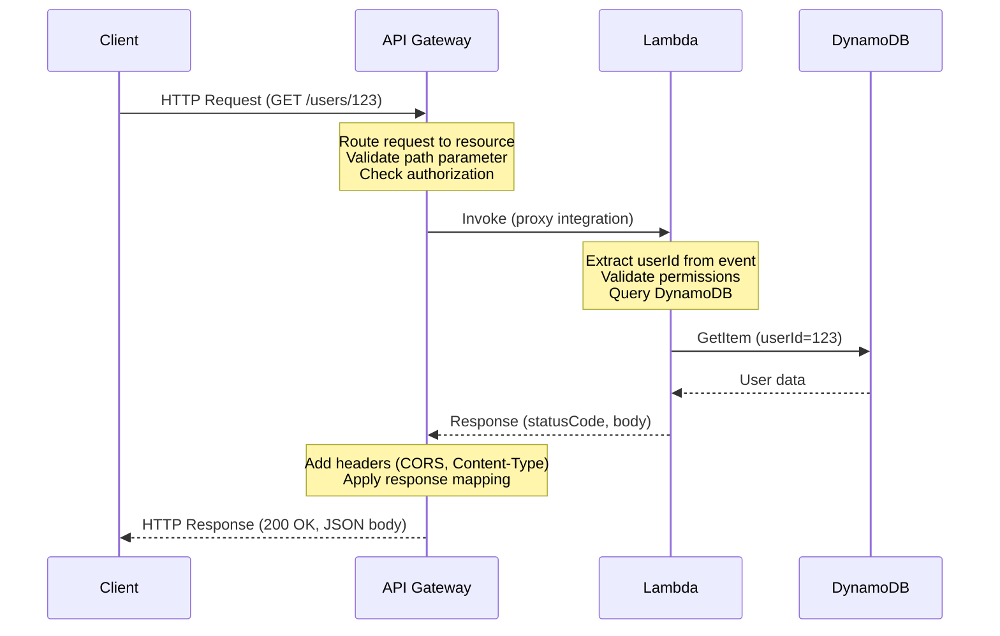
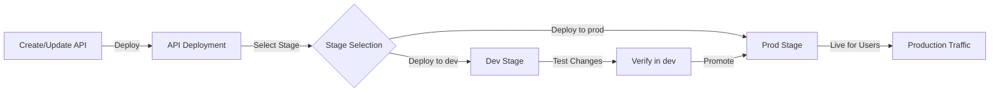

# AWS API Gateway Overview - REST and HTTP APIs

## What is AWS API Gateway?

AWS API Gateway is a fully managed service for creating, publishing, monitoring, and maintaining REST and HTTP APIs at scale. It serves as the "front door" for applications, handling all the aspects of API infrastructure including request routing, throttling, request/response transformation, and integration with backend services like Lambda, DynamoDB, EC2, and external HTTP endpoints.

**Key Characteristics**:
- **Fully Managed**: No servers to manage, automatic scaling from zero to thousands of requests per second
- **Multiple API Types**: Support for REST APIs, HTTP APIs, and WebSocket APIs
- **Integration Flexibility**: Direct integration with Lambda, DynamoDB, EC2, SNS, SQS, and external HTTP services
- **Security Features**: Request/response validation, authorization (IAM, Lambda authorizers, Cognito), API keys, usage plans, WAF integration
- **Monitoring and Logging**: CloudWatch integration, access logging, execution logging, X-Ray tracing
- **Cost Efficient**: Pay per request, Free Tier includes 1 million API calls per month

## Key Concepts

### APIs, Resources, and Methods

**API**: The entire REST or HTTP API resource in API Gateway

**Resource**: A URL path within your API (e.g., `/users`, `/users/{userId}`, `/products`)

**Method**: HTTP verb applied to a resource (GET, POST, PUT, DELETE, PATCH, OPTIONS, HEAD)

**Example Resource Structure**:
```
/users
├── GET    - List all users
├── POST   - Create new user
└── /{userId}
    ├── GET    - Get user details
    ├── PUT    - Update user
    └── DELETE - Delete user
```

### Stages and Deployments

**Stage**: A snapshot of your API at a specific time (dev, test, prod)

**Deployment**: Publishing API changes to one or more stages

**Stage Variables**: Environment-specific settings (e.g., Lambda function version, endpoint URL) that vary per stage

### Integrations

API Gateway supports multiple integration types to connect to backend services:

**Lambda Proxy Integration**: API Gateway sends entire request to Lambda, Lambda returns complete response (recommended for simplicity)

**Lambda Custom Integration**: API Gateway sends mapped request, Lambda returns mapped response (more control, more complexity)

**HTTP Integration**: Forward requests to external HTTP endpoints

**AWS Service Integration**: Direct integration with DynamoDB, SNS, SQS, Kinesis (typically without Lambda)

**Mock Integration**: Return hardcoded responses without calling backend service (useful for testing)

## API Gateway vs Traditional Web Servers

| Aspect | API Gateway | Traditional Web Server (EC2) |
|--------|-----------|------------------------------|
| Server Management | Fully managed, no operations | Full responsibility for patching, updates, security |
| Scaling | Automatic, instantaneous | Manual or Auto Scaling Group setup |
| Pricing | $0 for first 1M requests/month, then $3.50/million (REST) or $1/million (HTTP) | EC2 instance costs 24/7, typically $8-50+/month |
| Availability | Multi-region, high availability built-in | Requires Multi-AZ setup for HA |
| Cold Starts | <100ms for API Gateway, plus Lambda cold start (100-2000ms) | Always warm |
| Scaling Time | Seconds to handle traffic spikes | Minutes to launch new instances |
| Throttling | Automatic, configurable per API/stage | Manual rate limiting required |
| CORS | Built-in support | Must configure in application |
| SSL/TLS | Automatic, AWS managed certificates | Must obtain and manage certificates |
| DDoS Protection | AWS Shield Standard included | Requires additional configuration |
| Authorization | Multiple options (IAM, Cognito, Lambda authorizer) | Application-level authentication only |

## API Types Comparison

| Feature | REST API | HTTP API | WebSocket API |
|---------|----------|----------|---------------|
| **Pricing** | $3.50/million requests | $1.00/million requests | $0.25/million messages |
| **Latency** | 50-100ms typical | 15-20ms typical | Real-time bidirectional |
| **Authorization** | IAM, API keys, Lambda authorizer, Cognito | IAM, JWT, Lambda authorizer | IAM, Lambda authorizer |
| **Request Validation** | Built-in schema validation | Not built-in | N/A |
| **Caching** | Yes, configurable TTL | Limited | N/A |
| **WAF Integration** | Yes | No | N/A |
| **Custom Domains** | Yes | Yes | Yes |
| **CORS Support** | Yes | Yes | N/A |
| **Rate Limiting** | Yes, throttling per method | Limited, per API | Per connection |
| **Deployment** | Stages and manual deployment | Stages and automatic | Single endpoint |
| **Use Case** | Complex APIs, microservices, CRUD operations | Simple CRUD, cost optimization | Real-time chat, notifications |

**WorldSkills Recommendation**: Use **HTTP API** for competitions due to lower cost ($1 vs $3.50 per million requests) and faster deployment unless specific REST API features are required.

## Request/Response Flow



## Integration Types Explained

### Lambda Proxy Integration

**Flow**: API Gateway → Lambda (entire request) → Lambda response returned directly

**Request Event**:
```json
{
  "httpMethod": "GET",
  "path": "/users/123",
  "pathParameters": {"userId": "123"},
  "queryStringParameters": {"filter": "active"},
  "headers": {"Content-Type": "application/json"},
  "body": null
}
```

**Response Format**:
```json
{
  "statusCode": 200,
  "headers": {"Content-Type": "application/json"},
  "body": "{\"userId\":\"123\",\"name\":\"John Doe\"}"
}
```

**Use Cases**: REST APIs with Lambda, microservices, complex business logic

### Lambda Custom Integration

**Flow**: API Gateway → (request mapping) → Lambda → (response mapping) → API Gateway → Client

**Advantage**: Mapping templates allow transforming request/response format before Lambda processing

**Disadvantage**: More complex configuration, rarely needed in competition scenarios

### HTTP Integration

**Flow**: API Gateway → External HTTP endpoint

**Use Case**: Forwarding requests to external APIs without Lambda processing

### Mock Integration

**Flow**: API Gateway returns hardcoded response without calling backend

**Use Case**: Testing API structure before backend implementation

## Use Cases for WorldSkills Competitions

### 1. REST API for Web/Mobile Apps

Build serverless backends for web and mobile applications:
- User authentication and management
- CRUD operations for business entities
- Real-time data queries
- Multi-tenant SaaS applications

### 2. Microservices Architecture

Chain multiple Lambda functions as microservices:
- Order service → Payment service → Notification service
- Each service accessible via API Gateway endpoint
- Event-driven communication between services

### 3. Serverless CRUD Application

Build complete database-backed applications:
- REST API with full CRUD operations
- Single DynamoDB table or relational RDS database
- Automatic scaling for variable load

### 4. Scheduled Batch Operations

Trigger Lambda functions on schedule:
- Daily report generation
- Database cleanup tasks
- Data synchronization

## API Gateway Components

### Resources

URL paths representing entities in your API:
- `/users` - Collection of users
- `/users/{userId}` - Individual user identified by userId
- `/users/{userId}/orders` - Orders for specific user

### Methods

HTTP verbs for operations on resources:
- **GET**: Retrieve data (safe, idempotent)
- **POST**: Create new resource (not idempotent)
- **PUT**: Update entire resource (idempotent)
- **PATCH**: Partial update of resource
- **DELETE**: Remove resource (idempotent)
- **OPTIONS**: CORS preflight requests

### Stages

Separate versions of API for different environments:
- **dev**: Development stage for testing
- **test**: Testing stage for QA
- **prod**: Production stage for users

### Deployments

Publishing API changes to stages:
- Create deployment
- Select stage(s) to update
- Changes propagate to selected stages

## Deployment and Stages Workflow



## Throttling and Quotas

API Gateway automatically throttles requests to prevent abuse and ensure fair usage across all customers.

### Throttling Limits

**Default Account Limits**:
- Steady-state requests per second: 10,000
- Burst capacity: 5,000 simultaneous requests

**Per-Method Limits**:
- Can be configured lower for specific API methods
- Prevents one method from consuming all account capacity

### Usage Plans and API Keys

Control resource consumption and monetize API:
- **Usage Plan**: Rate limits and quotas per API key
- **API Key**: Identifier for tracking usage and applying rate limits
- **Quota**: Maximum requests per day/week/month

### Rate Limiting Strategy

```
Start Request → Check Rate Limit → Within Limit? → Yes → Process Request
                                                ↓ No
                                           Return 429 (Too Many Requests)
```

## Free Tier Limits

AWS API Gateway Free Tier provides generous allowances:

**REST API**:
- 1 million API calls received per month (first 12 months)
- After Free Tier: $3.50 per million calls
- Caching: First 0.5 GB per month included

**HTTP API**:
- 1 million API calls received per month (first 12 months)
- After Free Tier: $1.00 per million calls

**Additional Charges** (beyond free tier):
- Data transfer out: $0.09 per GB
- CloudWatch Logs: $0.50 per GB

## When to Use API Gateway

### Use API Gateway When:
- Building serverless REST APIs with Lambda backends
- Need automatic scaling for variable traffic
- Want to minimize infrastructure management
- Building microservices architectures
- Require API key-based access control
- Need request validation and transformation
- Want pay-per-request pricing model

### Use EC2/Load Balancer When:
- Running existing applications that can't be containerized for Lambda
- Requiring persistent connections (WebSockets with complex logic)
- Long-running processes (batch jobs >15 minutes)
- High-volume, constant traffic where EC2 Reserved Instances are cheaper
- Specific compliance requirements

## API Gateway Console Navigation

### Finding API Gateway Service

1. Open AWS Management Console
2. Search for "API Gateway" in services search
3. Click "API Gateway" to open dashboard

### API Gateway Dashboard Sections

**APIs**: List of all REST and HTTP APIs in current region

**Stages**: View stages for selected API, configure settings

**Resources**: View resource tree and methods for selected API

**Methods**: Configure HTTP method behavior and integration

**Integrations**: View and modify backend integrations

**Settings**: Configure API-level settings (throttling, logging, CORS)

**Models**: Define request/response schema for validation

**Authorizers**: Configure authorization mechanisms

### Creating Your First API

1. **Choose API Type**
   - REST API: For complex APIs with validation, caching
   - HTTP API: For simple CRUD, cost optimization

2. **Name Your API**
   - Example: "UserManagementAPI"
   - Add description for documentation

3. **Create Resources**
   - Root resource created automatically (`/`)
   - Create child resources (e.g., `/users`, `/users/{userId}`)

4. **Create Methods**
   - Add GET, POST, PUT, DELETE methods to resources
   - Configure Lambda integration for each method

5. **Deploy API**
   - Create deployment
   - Select stage (dev, prod, etc.)
   - API becomes accessible via stage URL

6. **Test API**
   - Use API Gateway test console
   - Or use curl/Postman from external client

## AWS CLI Commands

### List APIs

```bash
# List all REST APIs
aws apigateway get-rest-apis

# List all HTTP APIs
aws apigatewayv2 get-apis
```

### Create REST API

```bash
aws apigateway create-rest-api \
    --name UserManagementAPI \
    --description "API for managing users"
```

### Create Resource

```bash
# Get root resource ID first
RESOURCE_ID=root-id-from-above

# Create /users resource
aws apigateway create-resource \
    --rest-api-id abc123 \
    --parent-id $RESOURCE_ID \
    --path-part users
```

### Create Method

```bash
aws apigateway put-method \
    --rest-api-id abc123 \
    --resource-id resource-id \
    --http-method GET \
    --authorization-type NONE
```

### Deploy API

```bash
aws apigateway create-deployment \
    --rest-api-id abc123 \
    --stage-name prod
```

## WorldSkills Competition Tips

### Time-Saving Strategies

1. **Use HTTP API**: Faster to create than REST API, lower cost ($1 vs $3.50/million requests)
2. **Pre-write Lambda Code**: Have common handler templates ready to copy
3. **Use API Gateway Console**: Faster for first-time creation than CLI
4. **Test Incrementally**: Test Lambda function separately before adding API Gateway
5. **Leverage Managed Policies**: Use AWSLambdaBasicExecutionRole instead of custom policies

### Common Pitfalls

1. **Forgetting to Deploy**: Changes aren't live until API is deployed
2. **Missing CORS Configuration**: Browser requests fail without CORS headers
3. **Incorrect Response Format**: Lambda response must include statusCode and body
4. **Not Testing Error Scenarios**: Judges test invalid inputs
5. **Over-Engineering**: Simple solutions score better than complex ones

### Scoring Considerations

**Judges Evaluate**:
- All CRUD operations working (40%)
- Proper HTTP status codes (15%)
- Input validation and error handling (20%)
- CORS configuration (10%)
- Clean code and documentation (10%)
- Cost efficiency (5%)

## Next Steps

After understanding API Gateway fundamentals:
- [rest_api_vs_http_api.md](rest_api_vs_http_api.md): Detailed comparison for choosing API type
- [get_method.md](get_method.md): Implementing GET operations
- [post_method.md](post_method.md): Implementing POST operations
- [delete_method.md](delete_method.md): Implementing DELETE operations
- [python_lambda_integration.md](python_lambda_integration.md): Lambda integration patterns
- [server_lab.md](server_lab.md): Complete hands-on lab
