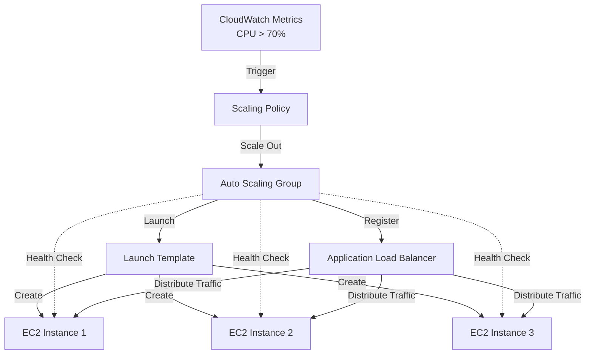
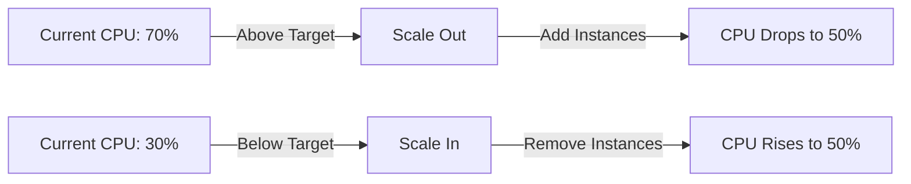

# Auto Scaling Basics - Automatic Capacity Management

## What is Auto Scaling?

AWS Auto Scaling automatically **adjusts the number of EC2 instances** in response to demand, maintaining application availability and optimizing costs.

**Key Benefits**:
- **High Availability**: Maintains desired instance count, replaces unhealthy instances
- **Cost Optimization**: Scale down during low demand, scale up during peaks
- **Fault Tolerance**: Distributes instances across Availability Zones
- **Automated Management**: No manual intervention needed
- **Performance**: Ensures sufficient capacity for traffic spikes

**Use Cases**:
- Web applications with variable traffic
- APIs with unpredictable load
- Batch processing workflows
- Microservices architectures

## Auto Scaling Architecture



## Auto Scaling Components

### 1. Auto Scaling Group (ASG)

The **core component** defining your scaling configuration:

**Key Settings**:
- **Desired Capacity**: Target number of instances
- **Minimum Capacity**: Never scale below this
- **Maximum Capacity**: Never scale above this
- **Subnets**: Where to launch instances (multiple AZs recommended)
- **Health Checks**: EC2 status checks or ELB health checks

**Example**:
```
Min: 2 instances
Desired: 3 instances
Max: 10 instances
```

**How it Works**:
- ASG maintains desired capacity
- If instance fails, launches replacement
- Scaling policies adjust desired capacity
- ASG launches/terminates to match desired

### 2. Launch Template

Defines **what** to launch (replaces Launch Configuration):

**Configuration Includes**:
- AMI ID
- Instance type (t2.micro, t3.small, etc.)
- Key pair
- Security groups
- IAM instance profile
- User data script
- Storage (EBS volumes)
- Network interfaces

**Example Launch Template**:
```json
{
  "LaunchTemplateName": "WebServerTemplate",
  "ImageId": "ami-0c55b159cbfafe1f0",
  "InstanceType": "t2.micro",
  "KeyName": "MyKeyPair",
  "SecurityGroupIds": ["sg-0123456789abcdef"],
  "UserData": "IyEvYmluL2Jhc2gKc3VkbyB5dW0gdXBkYXRlIC15CnN1ZG8geXVtIGluc3RhbGwgaHR0cGQgLXkKc3VkbyBzeXN0ZW1jdGwgc3RhcnQgaHR0cGQKc3VkbyBzeXN0ZW1jdGwgZW5hYmxlIGh0dHBkCg=="
}
```

### 3. Scaling Policies

Define **when** and **how** to scale:

**Policy Types**:
- **Target Tracking**: Maintain target metric (e.g., 50% CPU)
- **Step Scaling**: Scale based on CloudWatch alarm severity
- **Simple Scaling**: Add/remove fixed number when alarm triggered
- **Scheduled Scaling**: Scale at specific times (e.g., 9am scale to 10, 6pm scale to 2)

### 4. CloudWatch Alarms

Monitor metrics and trigger scaling:

**Common Metrics**:
- `CPUUtilization`: Average CPU across instances
- `RequestCountPerTarget`: Requests per instance (with ALB)
- `NetworkIn/Out`: Network traffic
- Custom metrics: Application-specific

## Launch Template vs Launch Configuration

| Feature | Launch Template | Launch Configuration |
|---------|----------------|---------------------|
| **Versioning** | ✅ Multiple versions | ❌ Immutable |
| **Modification** | ✅ Create new version | ❌ Must recreate |
| **Default Version** | ✅ Set default | ❌ N/A |
| **Spot Instances** | ✅ Supported | ❌ Limited |
| **Mixed Instance Types** | ✅ Supported | ❌ Not supported |
| **T2/T3 Unlimited** | ✅ Configurable | ❌ Not configurable |
| **Recommendation** | ✅ **Use this** | ❌ Legacy (deprecated) |

**Migration Path**: AWS recommends using Launch Templates for all new Auto Scaling Groups.

## Creating Launch Template

### AWS Console Steps

1. **Navigate to Launch Templates**:
   - EC2 Dashboard → Instances → Launch Templates
   - Click "Create launch template"

2. **Launch Template Name and Description**:
   - **Name**: WebServerTemplate
   - **Description**: Template for web server instances
   - **Template version description**: v1 - Initial version

3. **Application and OS Images (AMI)**:
   - Select "Amazon Linux 2023"
   - Or specify AMI ID: ami-0c55b159cbfafe1f0

4. **Instance Type**:
   - Select "t2.micro" (Free Tier eligible)

5. **Key Pair**:
   - Select existing key pair: MyKeyPair

6. **Network Settings**:
   - **Security groups**: Select WebServerSG
   - Don't include subnet (specified in ASG)

7. **Storage**:
   - Default 8 GB gp3 (or adjust as needed)

8. **Advanced Details**:
   - **IAM instance profile**: (optional, if instances need AWS API access)
   - **User data**: Add startup script (see below)

9. **Create Launch Template**

### User Data Script Example

```bash
#!/bin/bash
# Update system
yum update -y

# Install Apache web server
yum install httpd -y

# Create custom index page
cat > /var/www/html/index.html <<EOF
<html>
<head><title>Auto Scaled Web Server</title></head>
<body>
<h1>Hello from Auto Scaling!</h1>
<p>Instance ID: $(ec2-metadata --instance-id | cut -d ' ' -f 2)</p>
<p>Availability Zone: $(ec2-metadata --availability-zone | cut -d ' ' -f 2)</p>
</body>
</html>
EOF

# Start and enable Apache
systemctl start httpd
systemctl enable httpd
```

### AWS CLI Commands

**Create launch template**:
```bash
aws ec2 create-launch-template \
    --launch-template-name WebServerTemplate \
    --version-description "v1 - Initial version" \
    --launch-template-data '{
        "ImageId": "ami-0c55b159cbfafe1f0",
        "InstanceType": "t2.micro",
        "KeyName": "MyKeyPair",
        "SecurityGroupIds": ["sg-0123456789abcdef"],
        "UserData": "IyEvYmluL2Jhc2gKc3VkbyB5dW0gdXBkYXRlIC15CnN1ZG8geXVtIGluc3RhbGwgaHR0cGQgLXkKc3VkbyBzeXN0ZW1jdGwgc3RhcnQgaHR0cGQKc3VkbyBzeXN0ZW1jdGwgZW5hYmxlIGh0dHBkCg=="
    }'
```

**Note**: UserData must be base64-encoded. Encode script:
```bash
cat script.sh | base64 -w 0
```

**List launch templates**:
```bash
aws ec2 describe-launch-templates
```

**Describe specific template**:
```bash
aws ec2 describe-launch-template-versions \
    --launch-template-name WebServerTemplate
```

## Creating Auto Scaling Group

### AWS Console Steps

1. **Navigate to Auto Scaling Groups**:
   - EC2 Dashboard → Auto Scaling → Auto Scaling Groups
   - Click "Create Auto Scaling group"

2. **Step 1: Choose Launch Template**:
   - **Name**: WebServerASG
   - **Launch template**: Select WebServerTemplate
   - **Version**: Latest or specific version
   - Click "Next"

3. **Step 2: Network**:
   - **VPC**: Select your VPC
   - **Availability Zones and subnets**: Select 2+ subnets in different AZs
     - Example: us-east-1a (subnet-aaa), us-east-1b (subnet-bbb)
   - Click "Next"

4. **Step 3: Load Balancing** (Optional):
   - **Attach to load balancer**: Choose existing or skip
   - **Health checks**: ELB (if using load balancer) or EC2
   - **Health check grace period**: 300 seconds
   - Click "Next"

5. **Step 4: Group Size**:
   - **Desired capacity**: 2
   - **Minimum capacity**: 1
   - **Maximum capacity**: 5
   - **Scaling policies**: Configure later
   - Click "Next"

6. **Step 5: Add Notifications** (Optional):
   - SNS topic for scaling events
   - Click "Next"

7. **Step 6: Add Tags**:
   - Key: Name, Value: WebServer-ASG
   - Key: Environment, Value: Production
   - Click "Next"

8. **Review and Create**:
   - Review settings
   - Click "Create Auto Scaling group"

### AWS CLI Commands

**Create Auto Scaling Group**:
```bash
aws autoscaling create-auto-scaling-group \
    --auto-scaling-group-name WebServerASG \
    --launch-template LaunchTemplateName=WebServerTemplate,Version='$Latest' \
    --min-size 1 \
    --max-size 5 \
    --desired-capacity 2 \
    --vpc-zone-identifier "subnet-aaa,subnet-bbb" \
    --health-check-type ELB \
    --health-check-grace-period 300 \
    --tags Key=Name,Value=WebServer-ASG,PropagateAtLaunch=true
```

**Describe Auto Scaling Group**:
```bash
aws autoscaling describe-auto-scaling-groups \
    --auto-scaling-group-names WebServerASG
```

**Update capacity**:
```bash
aws autoscaling set-desired-capacity \
    --auto-scaling-group-name WebServerASG \
    --desired-capacity 3
```

## Scaling Policy Types

### 1. Target Tracking Scaling (Recommended)

Automatically adjust capacity to maintain a target metric value.

**Example**: Maintain average CPU at 50%



**AWS Console Steps**:
1. Select Auto Scaling Group
2. Automatic scaling tab → Create dynamic scaling policy
3. **Policy type**: Target tracking scaling
4. **Metric type**: Average CPU utilization
5. **Target value**: 50
6. **Instances need**: 300 seconds warm-up
7. **Create**

**AWS CLI Command**:
```bash
aws autoscaling put-scaling-policy \
    --auto-scaling-group-name WebServerASG \
    --policy-name TargetTrackingScaling \
    --policy-type TargetTrackingScaling \
    --target-tracking-configuration '{
        "PredefinedMetricSpecification": {
            "PredefinedMetricType": "ASGAverageCPUUtilization"
        },
        "TargetValue": 50.0
    }'
```

**Predefined Metrics**:
- `ASGAverageCPUUtilization`: Average CPU across ASG
- `ASGAverageNetworkIn`: Average incoming network traffic
- `ASGAverageNetworkOut`: Average outgoing network traffic
- `ALBRequestCountPerTarget`: Requests per instance (requires ALB)

### 2. Step Scaling

Scale based on alarm severity (multiple steps).

**Example**: Add instances based on CPU level
- 50-60% CPU: Add 1 instance
- 60-80% CPU: Add 2 instances
- 80%+ CPU: Add 3 instances

**AWS Console Steps**:
1. Create CloudWatch Alarm (CPU > 50%)
2. Create scaling policy referencing alarm
3. Define steps: +1 at 50%, +2 at 60%, +3 at 80%

**AWS CLI Command**:
```bash
aws autoscaling put-scaling-policy \
    --auto-scaling-group-name WebServerASG \
    --policy-name StepScalingPolicy \
    --policy-type StepScaling \
    --adjustment-type ChangeInCapacity \
    --metric-aggregation-type Average \
    --step-adjustments \
        MetricIntervalLowerBound=0,MetricIntervalUpperBound=10,ScalingAdjustment=1 \
        MetricIntervalLowerBound=10,MetricIntervalUpperBound=20,ScalingAdjustment=2 \
        MetricIntervalLowerBound=20,ScalingAdjustment=3
```

### 3. Simple Scaling (Legacy)

Single scaling action when alarm triggers.

**Example**: Add 1 instance when CPU > 70%

**Limitation**: Cooldown period (300s default) prevents rapid scaling

**Recommendation**: Use Target Tracking instead

### 4. Scheduled Scaling

Scale at specific times.

**Example**: Weekday 9am scale to 10, 6pm scale to 2

**AWS CLI Command**:
```bash
# Scale up at 9am weekdays
aws autoscaling put-scheduled-action \
    --auto-scaling-group-name WebServerASG \
    --scheduled-action-name ScaleUpMorning \
    --recurrence "0 9 * * 1-5" \
    --desired-capacity 10

# Scale down at 6pm weekdays
aws autoscaling put-scheduled-action \
    --auto-scaling-group-name WebServerASG \
    --scheduled-action-name ScaleDownEvening \
    --recurrence "0 18 * * 1-5" \
    --desired-capacity 2
```

## Health Checks

Auto Scaling replaces unhealthy instances automatically.

### EC2 Status Checks

**System Status**: AWS infrastructure (networking, power)
**Instance Status**: Guest OS, application

**Failure**: Instance marked unhealthy, terminated, replaced

**Check Interval**: Every 1-5 minutes

### ELB Health Checks

**Requires**: ALB or NLB attached to ASG

**How it Works**:
- Load balancer sends HTTP request to instance
- Expected response: 200 OK
- If fails: Instance marked unhealthy

**Configuration**:
- **Healthy threshold**: 2 consecutive successes
- **Unhealthy threshold**: 2 consecutive failures
- **Timeout**: 5 seconds
- **Interval**: 30 seconds

**Advantage**: Application-level health (not just instance running)

### Health Check Grace Period

**Default**: 300 seconds (5 minutes)

**Purpose**: Allow instance to boot and start application before health checks

**Example**:
- Instance launches at 10:00
- Grace period until 10:05
- Health checks start at 10:05

**Adjust if**:
- Application takes longer to start
- User data script is complex

## Monitoring Auto Scaling

### CloudWatch Metrics

**ASG Metrics** (updated every minute):
- `GroupDesiredCapacity`: Target number of instances
- `GroupInServiceInstances`: Healthy instances
- `GroupPendingInstances`: Launching instances
- `GroupTerminatingInstances`: Terminating instances
- `GroupMinSize`: Minimum capacity
- `GroupMaxSize`: Maximum capacity

**View in Console**:
1. CloudWatch → Metrics → EC2 → By Auto Scaling Group
2. Select WebServerASG
3. Graph metrics

**AWS CLI**:
```bash
aws cloudwatch get-metric-statistics \
    --namespace AWS/AutoScaling \
    --metric-name GroupDesiredCapacity \
    --dimensions Name=AutoScalingGroupName,Value=WebServerASG \
    --start-time 2025-01-01T00:00:00Z \
    --end-time 2025-01-01T23:59:59Z \
    --period 300 \
    --statistics Average
```

### Activity History

View scaling events:

**Console**:
1. Auto Scaling Groups → WebServerASG
2. Activity tab → Activity history
3. See: Launched instance, Terminated instance, Failed to launch

**CLI**:
```bash
aws autoscaling describe-scaling-activities \
    --auto-scaling-group-name WebServerASG \
    --max-records 10
```

**Example Output**:
```
Launching a new EC2 instance: i-0123456789abcdef. Status: Successful
Terminating EC2 instance: i-abcdef0123456789. Status: Successful
```

## Cost Considerations for Auto Scaling

### Free Tier Strategy

**Free Tier**: 750 hours/month of t2.micro

**Scenario 1: Min=1, Max=3**
- 1 instance 24/7: 730 hours (within Free Tier)
- Bursts to 3 instances for 10 hours: 730 + 20 = 750 hours (still free!)

**Scenario 2: Min=2, Max=5**
- 2 instances 24/7: 1,460 hours (exceeds Free Tier by 710 hours)
- Cost: 710 hours × $0.0116 = $8.24/month

**Recommendation for WorldSkills**:
- **Min**: 1 (stay within Free Tier)
- **Max**: 3-5 (cap costs, prevent runaway)
- **Desired**: 2 (redundancy for demos)

### Setting Maximum to Prevent Runaway Costs

**Problem**: Infinite loop triggering scale-out can deplete budget

**Solution**: Always set maximum capacity

```bash
aws autoscaling update-auto-scaling-group \
    --auto-scaling-group-name WebServerASG \
    --max-size 5  # Never exceed 5 instances
```

### Cost Per Scaling Event

**No extra charge for Auto Scaling** (AWS service is free)

**Charges**:
- EC2 instance hours
- EBS storage
- Data transfer

**Example**:
- Launch 2 t2.micro for 1 hour: 2 × $0.0116 = $0.0232

## WorldSkills Competition Scenarios

### Scenario 1: Simple ASG with 2 Instances Behind ALB

**Requirements**:
- 2 web servers for redundancy
- Distribute traffic evenly
- Replace failed instances automatically

**Solution**:
```
Launch Template:
  - AMI: Amazon Linux 2023
  - Instance type: t2.micro
  - User data: Install Apache

Auto Scaling Group:
  - Min: 1
  - Desired: 2
  - Max: 3
  - Subnets: us-east-1a, us-east-1b
  - Health checks: ELB
  - Attached to: ALB target group
```

### Scenario 2: Scale Based on CPU Utilization

**Requirements**:
- Maintain average CPU at 50%
- Add instances when load increases
- Remove instances when load decreases

**Solution**:
```
Scaling Policy:
  - Type: Target tracking
  - Metric: ASGAverageCPUUtilization
  - Target: 50%
  - Cooldown: 300 seconds
```

### Scenario 3: Scheduled Scaling for Business Hours

**Requirements**:
- 5 instances during business hours (9am-5pm)
- 1 instance overnight

**Solution**:
```bash
# Scale up at 9am
aws autoscaling put-scheduled-action \
    --auto-scaling-group-name WebServerASG \
    --scheduled-action-name MorningScaleUp \
    --recurrence "0 9 * * *" \
    --desired-capacity 5

# Scale down at 5pm
aws autoscaling put-scheduled-action \
    --auto-scaling-group-name WebServerASG \
    --scheduled-action-name EveningScaleDown \
    --recurrence "0 17 * * *" \
    --desired-capacity 1
```

## Best Practices

1. **Use Multiple AZs**: Deploy across 2+ availability zones for high availability
2. **Set Realistic Targets**: 50-70% CPU utilization (room for bursts)
3. **Configure Health Checks**: Use ELB health checks for application-level monitoring
4. **Set Maximum Capacity**: Prevent runaway costs from misconfigured policies
5. **Use Target Tracking**: Simpler than step scaling for most use cases
6. **Add Grace Period**: Allow time for instances to become healthy
7. **Tag Instances**: Propagate tags from ASG to instances for organization
8. **Monitor Activity**: Regularly check Activity History for scaling events

## Verification Checklist

- [ ] Launch template created with correct AMI and instance type
- [ ] Security group allows required ports (80, 443, 22)
- [ ] User data script tested (installs and starts services)
- [ ] Auto Scaling Group created with min/desired/max capacity
- [ ] Multiple subnets selected (different AZs)
- [ ] Health check type configured (EC2 or ELB)
- [ ] Grace period set appropriately
- [ ] Scaling policy created and active
- [ ] Instances launching successfully (check Activity History)
- [ ] Load balancer distributing traffic (if applicable)
- [ ] Tags propagating to instances
- [ ] CloudWatch metrics visible

## Next Steps

- [server_lab.md](server_lab.md): Deploy complete web server with Auto Scaling
- [cost_optimization.md](cost_optimization.md): Optimize Auto Scaling costs
