# EC2 Cost Optimization and Free Tier Maximization

## Introduction

EC2 costs can escalate quickly if not managed carefully. Understanding pricing models, instance lifecycle costs, and optimization strategies is essential for **WorldSkills competitors** and **learning on a budget**.

**Free Tier Limits**: 750 hours/month of t2.micro (or t3.micro in some regions)  
**Duration**: 12 months from AWS account creation  
**What's Free**: Instance compute time, not data transfer or additional EBS volumes  
**Key Insight**: 750 hours = 24/7 for ONE t2.micro OR 12 hours/day for TWO instances

## AWS Free Tier for EC2

### What's Included

| Resource | Free Tier Limit | Duration | Notes |
|----------|----------------|----------|-------|
| EC2 Instances | 750 hours/month | 12 months | Linux t2.micro or t3.micro |
| EBS Storage | 30 GB | 12 months | General Purpose (gp2 or gp3) |
| EBS Snapshots | 1 GB | 12 months | Per month |
| Data Transfer Out | 100 GB | 12 months | To internet |
| Elastic IP | Free if attached | Always | Charged if detached from running instance |
| Load Balancer | Not included | N/A | ALB/NLB not Free Tier |

### Free Tier Calculation Examples

**Scenario 1: Single Instance 24/7**
- 1 t2.micro running 24/7 = 720 hours/month
- **Free Tier**: ✅ Within 750 hours
- **Cost**: $0

**Scenario 2: Two Instances 24/7**
- 2 t2.micro running 24/7 = 1,440 hours/month
- **Free Tier**: ❌ Exceeds 750 hours by 690 hours
- **Overage**: 690 hours × $0.0116/hour = **$8.00/month**

**Scenario 3: Two Instances 12h/day**
- 2 t2.micro × 12 hours × 30 days = 720 hours/month
- **Free Tier**: ✅ Within 750 hours
- **Cost**: $0

**Scenario 4: Three Instances 8h/day**
- 3 t2.micro × 8 hours × 30 days = 720 hours/month
- **Free Tier**: ✅ Within 750 hours
- **Cost**: $0

**Key Takeaway**: Use stop/start scheduling to maximize Free Tier usage.

## Instance Lifecycle Cost Impact

Understanding instance states and their cost implications is crucial.

### Instance States Cost Table

| State | EC2 Compute | EBS Storage | Elastic IP | Data Transfer |
|-------|-------------|-------------|------------|---------------|
| **Running** | ✅ Charged | ✅ Charged | Free (if attached) | ✅ Charged |
| **Stopped** | ❌ Free | ✅ Charged | ✅ Charged | ❌ Free |
| **Terminated** | ❌ Free | ❌ Free | ❌ Free | ❌ Free |

### Cost Breakdown Example (t2.micro in us-east-1)

**Running Instance (24/7 for 1 month)**:
- EC2 compute: 720 hours × $0.0116 = $8.35
- EBS volume (8 GB gp3): 8 GB × $0.08/GB = $0.64
- Elastic IP (attached): $0
- **Total**: $8.99/month

**Stopped Instance (1 month)**:
- EC2 compute: $0 (not running)
- EBS volume (8 GB gp3): 8 GB × $0.08/GB = $0.64
- Elastic IP (not attached): 720 hours × $0.005 = $3.60
- **Total**: $4.24/month

**Terminated Instance**:
- All resources deleted: **$0**

### Instance Lifecycle Cost Diagram

```mermaid
stateDiagram-v2
    [*] --> Pending: Launch (start billing)
    Pending --> Running: Status checks pass
    
    Running --> Stopping: Stop command
    Running --> ShuttingDown: Terminate command
    
    Stopping --> Stopped: Shutdown complete
    Stopped --> Pending: Start command
    Stopped --> Terminated: Terminate command
    
    ShuttingDown --> Terminated: Shutdown complete
    Terminated --> [*]: Resources released
    
    note right of Running
        💰 EC2 compute charged
        💰 EBS storage charged
        💰 Data transfer charged
    end note
    
    note right of Stopped
        ⚠️ EBS storage charged
        ⚠️ Elastic IP charged
        ✅ EC2 compute FREE
    end note
    
    note right of Terminated
        ✅ All charges stop
        ⚠️ Data lost
    end note
```



## Stop vs Terminate Comparison

Critical decision: Should you stop or terminate instances when not in use?

### Comparison Table

| Factor | Stop | Terminate |
|--------|------|-----------|
| **Data Persistence** | ✅ Retained | ❌ Lost |
| **EBS Volume** | ✅ Preserved | ❌ Deleted |
| **EC2 Compute Cost** | ❌ $0/hour | ❌ $0/hour |
| **EBS Storage Cost** | ✅ ~$0.08/GB/month | ❌ $0/month |
| **Elastic IP Cost** | ✅ $0.005/hour if not attached | ❌ $0/hour |
| **Public IP** | ⚠️ Changes | N/A |
| **Elastic IP** | ✅ Retained | ❌ Released |
| **Instance ID** | ✅ Same | N/A |
| **Startup Time** | ~30 seconds | ~2-3 minutes |
| **Configuration** | ✅ Preserved | ❌ Lost |
| **Use Case** | Development, testing | Temporary, one-time |

### When to Stop

- Development environment (used daily)
- Testing environment (used periodically)
- Learning/practice (need to preserve work)
- Instance has configuration you want to keep

### When to Terminate

- Temporary tasks completed
- One-time data processing
- No longer needed
- Fresh start required
- Minimize all costs

## How to Stop Instances

### AWS Console

1. EC2 Dashboard → Instances
2. Select instance(s)
3. **Instance state** → **Stop instance**
4. Confirm: "Stop" button

**Warning**: "Stop" vs "Stop-hibernate" (hibernate saves RAM to EBS, costs more)

### AWS CLI

```bash
# Stop single instance
aws ec2 stop-instances --instance-ids i-0123456789abcdef

# Stop multiple instances
aws ec2 stop-instances --instance-ids i-abc123 i-def456 i-ghi789

# Wait until stopped
aws ec2 wait instance-stopped --instance-ids i-0123456789abcdef
```

### Check Instance State

```bash
aws ec2 describe-instances \
    --instance-ids i-0123456789abcdef \
    --query 'Reservations[0].Instances[0].State.Name' \
    --output text
```

## Automated Start/Stop Scheduling

Save money by running instances only during business hours.

### Architecture Overview


### Lambda Function for Auto Stop/Start

**Lambda Function (Python)**:
```python
import boto3
import os

ec2 = boto3.client('ec2')

def lambda_handler(event, context):
    # Get action from environment variable
    action = os.environ.get('ACTION', 'stop')  # 'stop' or 'start'
    
    # Find instances with AutoStop=true tag
    response = ec2.describe_instances(
        Filters=[
            {'Name': 'tag:AutoStop', 'Values': ['true']},
            {'Name': 'instance-state-name', 'Values': ['running' if action == 'stop' else 'stopped']}
        ]
    )
    
    instance_ids = []
    for reservation in response['Reservations']:
        for instance in reservation['Instances']:
            instance_ids.append(instance['InstanceId'])
    
    if not instance_ids:
        print(f"No instances to {action}")
        return
    
    if action == 'stop':
        ec2.stop_instances(InstanceIds=instance_ids)
        print(f"Stopped instances: {instance_ids}")
    elif action == 'start':
        ec2.start_instances(InstanceIds=instance_ids)
        print(f"Started instances: {instance_ids}")
    
    return {
        'statusCode': 200,
        'body': f'{action.capitalize()}ped {len(instance_ids)} instances'
    }
```

**EventBridge Rules**:
- **Start Rule**: `cron(0 8 ? * MON-FRI *)` (8 AM weekdays)
- **Stop Rule**: `cron(0 18 ? * MON-FRI *)` (6 PM weekdays)

**Tag Instances**:
```bash
aws ec2 create-tags \
    --resources i-0123456789abcdef \
    --tags Key=AutoStop,Value=true
```

### Cost Calculation

**Before Automation** (24/7):
- Running: 24 hours × 30 days = 720 hours
- Cost: 720 × $0.0116 = $8.35/month

**After Automation** (10 hours/day, weekdays):
- Running: 10 hours × 22 days = 220 hours
- Cost: 220 × $0.0116 = $2.55/month
- **Savings**: $5.80/month (69%)

## Right-Sizing Instances

Choose appropriate instance type based on actual usage.

### CloudWatch Metrics to Monitor

**CPU Utilization**:
- **Too high** (>80%): Instance undersized, consider larger type
- **Too low** (<20%): Instance oversized, consider smaller type
- **Target**: 40-70% average

**Network In/Out**:
- High traffic: May need enhanced networking
- Low traffic: Current size appropriate

**Check CPU Utilization**:
```bash
aws cloudwatch get-metric-statistics \
    --namespace AWS/EC2 \
    --metric-name CPUUtilization \
    --dimensions Name=InstanceId,Value=i-0123456789abcdef \
    --start-time 2024-01-01T00:00:00Z \
    --end-time 2024-01-07T00:00:00Z \
    --period 3600 \
    --statistics Average
```

### Right-Sizing Decision Tree

```mermaid
graph TD
    Start[Monitor Instance] --> Check{CPU Usage?}
    
    Check -->|< 20%| TooLarge[Instance Too Large]
    Check -->|20-70%| Perfect[✅ Right Size]
    Check -->|> 80%| TooSmall[Instance Too Small]
    
    TooLarge --> Downsize[Downsize Instance Type<br/>t2.small → t2.micro]
    TooSmall --> Upsize[Upsize Instance Type<br/>t2.micro → t2.small]
    Perfect --> Monitor[Continue Monitoring]
    
    Downsize --> Save[💰 Save Money]
    Upsize --> Better[⚡ Better Performance]
```



### Example: Downsize from t2.small to t2.micro

**Current**: t2.small (2 vCPU, 2 GB RAM, $0.023/hour)
**Observed**: Average CPU 15%, memory 30%
**Action**: Downsize to t2.micro (1 vCPU, 1 GB RAM, $0.0116/hour)

**Savings**:
- t2.small: 720 hours × $0.023 = $16.56/month
- t2.micro: 720 hours × $0.0116 = $8.35/month
- **Savings**: $8.21/month (50%)

**How to Change Instance Type**:
1. Stop instance
2. Actions → Instance settings → Change instance type
3. Select t2.micro
4. Start instance

```bash
# CLI version
aws ec2 stop-instances --instance-ids i-0123456789abcdef
aws ec2 wait instance-stopped --instance-ids i-0123456789abcdef
aws ec2 modify-instance-attribute \
    --instance-id i-0123456789abcdef \
    --instance-type t2.micro
aws ec2 start-instances --instance-ids i-0123456789abcdef
```

## Reserved Instances (Not for Competitions)

For long-term workloads (NOT recommended for WorldSkills learning):

### Pricing Comparison

| Purchase Option | Upfront | Term | Discount | Monthly Cost (t2.micro) |
|----------------|---------|------|----------|-------------------------|
| **On-Demand** | $0 | None | 0% | $8.35 |
| **Reserved (No Upfront)** | $0 | 1 year | 30% | $5.85 |
| **Reserved (Partial Upfront)** | $30 | 1 year | 40% | $5.00 |
| **Reserved (All Upfront)** | $60 | 1 year | 45% | $0 |
| **Reserved (All Upfront)** | $100 | 3 years | 60% | $0 |

**When to Use**:
- Production workloads running 24/7
- Minimum 1-year commitment
- NOT suitable for learning/testing

## Savings Plans

Flexible commitment model (alternative to Reserved Instances):

**Compute Savings Plans**:
- Commit to $/hour (e.g., $0.01/hour)
- Applies to EC2, Fargate, Lambda
- Up to 66% discount
- 1 or 3-year term

**Example**:
- Commit: $0.01/hour for 1 year
- Total cost: $0.01 × 24 × 365 = $87.60/year
- On-demand equivalent: ~$150/year
- **Savings**: 40%

**Not Recommended** for WorldSkills: Use Free Tier instead.

## Spot Instances

Up to 90% discount, but instances can be interrupted.

**Pricing** (t2.micro example):
- On-Demand: $0.0116/hour
- Spot: ~$0.0035/hour (70% savings)

**Risks**:
- AWS can terminate with 2-minute warning
- Not suitable for critical workloads
- Good for batch processing

**Not Recommended** for WorldSkills competitions: Interruptions cause failures.

## EBS Optimization

Storage costs add up quickly.

### EBS Volume Types Comparison

| Type | Price (GB/month) | IOPS | Throughput | Use Case |
|------|------------------|------|------------|----------|
| **gp3** | $0.08 | 3,000 base | 125 MB/s | General purpose (recommended) |
| **gp2** | $0.10 | 3 per GB | Variable | Legacy general purpose |
| **io2** | $0.125 + IOPS | Up to 64,000 | Up to 1,000 MB/s | Databases (expensive) |
| **st1** | $0.045 | N/A | 500 MB/s | Big data (HDD) |
| **sc1** | $0.015 | N/A | 250 MB/s | Cold storage (HDD) |

**Free Tier**: 30 GB of gp2 or gp3

### Cost Examples

**8 GB gp3 volume**:
- 8 GB × $0.08 = $0.64/month
- Free Tier: ✅ Within 30 GB

**100 GB gp3 volume**:
- 100 GB × $0.08 = $8.00/month
- Free Tier: ❌ 70 GB overage = $5.60/month charge

### Optimization Tips

1. **Delete Unused Volumes**:
```bash
# Find available (unattached) volumes
aws ec2 describe-volumes \
    --filters Name=status,Values=available \
    --query 'Volumes[*].[VolumeId,Size,State]' \
    --output table

# Delete unused volume
aws ec2 delete-volume --volume-id vol-0123456789abcdef
```

2. **Use gp3 Instead of gp2**:
   - gp3: $0.08/GB/month
   - gp2: $0.10/GB/month
   - **Savings**: 20%

3. **Right-Size Volumes**:
   - Don't allocate more than needed
   - Start with 8 GB, expand if necessary

4. **Delete Old Snapshots**:
```bash
# List snapshots
aws ec2 describe-snapshots --owner-ids self \
    --query 'Snapshots[*].[SnapshotId,StartTime,VolumeSize]' \
    --output table

# Delete old snapshot
aws ec2 delete-snapshot --snapshot-id snap-0123456789abcdef
```

## Data Transfer Costs

Often overlooked but can add up.

### Data Transfer Pricing (us-east-1)

| Direction | Price | Free Tier |
|-----------|-------|-----------|
| **Data IN** (from internet) | Free | Always free |
| **Data OUT** (to internet) | $0.09/GB | 100 GB/month (12 months) |
| **Between AZs** | $0.01/GB in, $0.01/GB out | Not included |
| **Same AZ** | Free | Always free |

### Cost Examples

**Scenario 1**: Web server with 10 GB/day traffic
- 10 GB × 30 days = 300 GB/month
- Free Tier: 100 GB
- Overage: 200 GB × $0.09 = **$18/month**

**Scenario 2**: Multi-AZ deployment
- Instance A (us-east-1a) → Instance B (us-east-1b)
- Data transfer: 100 GB/month
- Cost: 100 GB × ($0.01 + $0.01) = **$2/month**

### Optimization

- **Use CloudFront**: 1 TB/month free for 12 months
- **Same AZ deployment**: Free data transfer
- **Minimize cross-region**: Expensive ($0.02/GB)

## Cost Monitoring and Alerts

Track spending before it's too late.

### 1. AWS Cost Explorer

View costs by service, time period, instance:

**Console**: Billing Dashboard → Cost Explorer

**Analyze**:
- Costs by service (EC2, EBS, data transfer)
- Daily/monthly trends
- Forecast future costs

### 2. Billing Alerts

Get notified when costs exceed threshold:

**Create Budget**:
1. Billing Dashboard → Budgets → Create budget
2. **Budget type**: Cost budget
3. **Amount**: $10 (example)
4. **Threshold**: Alert at 80% ($8)
5. **Email**: your-email@example.com

**CLI**:
```bash
aws budgets create-budget \
    --account-id 123456789012 \
    --budget '{
        "BudgetName": "Monthly EC2 Budget",
        "BudgetLimit": {"Amount": "10", "Unit": "USD"},
        "TimeUnit": "MONTHLY",
        "BudgetType": "COST"
    }' \
    --notifications-with-subscribers '[{
        "Notification": {
            "NotificationType": "ACTUAL",
            "ComparisonOperator": "GREATER_THAN",
            "Threshold": 80
        },
        "Subscribers": [{
            "SubscriptionType": "EMAIL",
            "Address": "your-email@example.com"
        }]
    }]'
```

### 3. CloudWatch Billing Metrics

Monitor costs in real-time:

**Enable billing alerts**:
1. Billing Preferences → Receive Billing Alerts → Save
2. CloudWatch → Alarms → Create alarm
3. **Metric**: EstimatedCharges
4. **Threshold**: Greater than $10
5. **Action**: SNS topic → Email

### 4. AWS CLI Cost Tracking

```bash
# Current month's costs
aws ce get-cost-and-usage \
    --time-period Start=2024-01-01,End=2024-01-31 \
    --granularity MONTHLY \
    --metrics UnblendedCost \
    --group-by Type=SERVICE
```

## Cleanup Checklist

Before ending work session or leaving AWS unused:

### Daily Cleanup (Development)

- [ ] Stop instances not in use
- [ ] Verify no instances left running unintentionally
- [ ] Check CloudWatch billing estimate

### Weekly Cleanup

- [ ] Delete unused EBS volumes
- [ ] Delete old snapshots
- [ ] Review unused Elastic IPs
- [ ] Check security groups (delete unused)

### Monthly Cleanup

- [ ] Terminate old test instances
- [ ] Delete unused AMIs
- [ ] Review Cost Explorer
- [ ] Verify Free Tier usage under limits

### Complete Cleanup (End of Learning)

```bash
# 1. Terminate all instances
aws ec2 describe-instances \
    --query 'Reservations[*].Instances[*].InstanceId' \
    --output text | xargs -n 1 aws ec2 terminate-instances --instance-ids

# 2. Wait for termination
aws ec2 wait instance-terminated --instance-ids i-xxx i-yyy

# 3. Delete volumes (after instance termination)
aws ec2 describe-volumes --filters Name=status,Values=available \
    --query 'Volumes[*].VolumeId' --output text | \
    xargs -n 1 aws ec2 delete-volume --volume-id

# 4. Delete snapshots
aws ec2 describe-snapshots --owner-ids self \
    --query 'Snapshots[*].SnapshotId' --output text | \
    xargs -n 1 aws ec2 delete-snapshot --snapshot-id

# 5. Release Elastic IPs
aws ec2 describe-addresses --query 'Addresses[*].AllocationId' \
    --output text | xargs -n 1 aws ec2 release-address --allocation-id

# 6. Delete security groups (except default)
aws ec2 describe-security-groups \
    --query 'SecurityGroups[?GroupName!=`default`].GroupId' \
    --output text | xargs -n 1 aws ec2 delete-security-group --group-id

# 7. Delete key pairs
aws ec2 describe-key-pairs --query 'KeyPairs[*].KeyName' \
    --output text | xargs -n 1 aws ec2 delete-key-pair --key-name
```

## WorldSkills Competition Cost Strategy

### During Practice (Months Before)

1. **Use Free Tier Aggressively**:
   - 1 t2.micro running 24/7
   - Stop when not actively practicing
   - Delete resources after each lab

2. **Script Everything**:
   - Use CloudFormation/Terraform
   - Rebuild quickly instead of keeping instances

3. **Monitor Daily**:
   - Check billing dashboard every day
   - Set budget alerts at $5, $10, $15

### During Competition

**Good news**: Competition tasks are short-term:
- Tasks typically 4-6 hours
- All resources created fresh
- Cleaned up immediately after

**Cost during competition day**:
- 6 hours of EC2 usage
- Free Tier: ✅ Covered
- **Expected cost**: $0

### After Competition

**Immediate cleanup** (within 24 hours):
- Terminate all instances
- Delete all volumes
- Release Elastic IPs
- Delete security groups
- Delete key pairs

**Verify zero charges**:
- Wait 24 hours
- Check billing dashboard
- Verify $0 costs

## Cost Calculation Examples

### Example 1: Single Instance for Learning

**Scenario**: Practice EC2 2 hours/day for 30 days

**Resources**:
- 1 t2.micro instance
- 8 GB gp3 volume
- No Elastic IP

**Usage**:
- Running: 2 hours × 30 days = 60 hours
- Free Tier: 750 hours available
- Within limit: ✅

**Cost**: $0 (Free Tier)

### Example 2: Development Environment

**Scenario**: Development environment, 8 hours/day weekdays

**Resources**:
- 1 t2.small instance
- 20 GB gp3 volume
- 1 Elastic IP

**Usage**:
- Running: 8 hours × 22 days = 176 hours
- Stopped: 16 hours × 22 + 48 hours weekend = 400 hours

**Cost Calculation**:
- EC2 compute: 176 hours × $0.023 = $4.05
- EBS storage: 20 GB × $0.08 = $1.60
- Elastic IP (attached while running): $0
- Elastic IP (detached while stopped): 400 hours × $0.005 = $2.00
- **Total**: $7.65/month

**Optimization**: Use Auto Scaling with no Elastic IP → **Save $2/month**

### Example 3: WorldSkills Practice Schedule

**Scenario**: Intensive practice 1 month before competition

**Schedule**:
- Week 1-2: 2 hours/day (28 hours)
- Week 3: 4 hours/day (28 hours)
- Week 4: 6 hours/day (42 hours)
- Total: 98 hours

**Resources**:
- 1 t2.micro instance
- 8 GB gp3 volume

**Cost**:
- EC2: Within 750 hours Free Tier ✅
- EBS: Within 30 GB Free Tier ✅
- **Total**: $0

**After competition**: Delete all → **Total spent: $0**

## Summary

**Key Takeaways**:
1. ✅ **Free Tier**: 750 hours/month = 1 t2.micro 24/7 for free
2. 🛑 **Stop instances** when not in use (save compute cost, pay EBS only)
3. 🗑️ **Terminate instances** when done (save all costs)
4. 📊 **Monitor daily**: Check billing dashboard
5. 🚨 **Set alerts**: Budget alerts at $5, $10
6. 🧹 **Cleanup religiously**: Delete unused resources immediately
7. 🎯 **Right-size**: Use t2.micro unless you need more
8. 💾 **EBS optimization**: Use gp3, delete unused volumes
9. 🌐 **Data transfer**: Use CloudFront, same AZ deployment
10. 🏆 **Competition**: Clean up within 24 hours

**Cost Management Hierarchy**:
1. Free Tier (750 hours/month) → $0
2. Stop instances → Save 90% (EBS cost only)
3. Terminate instances → Save 100%
4. Right-size instances → Save 50%
5. Scheduled start/stop → Save 60-70%
6. Optimize EBS (gp3, delete unused) → Save 20-50%

**Next Steps**:
- Set up billing alerts today
- Practice cleanup scripts
- Monitor Free Tier usage
- Plan competition resource strategy
