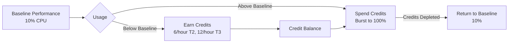
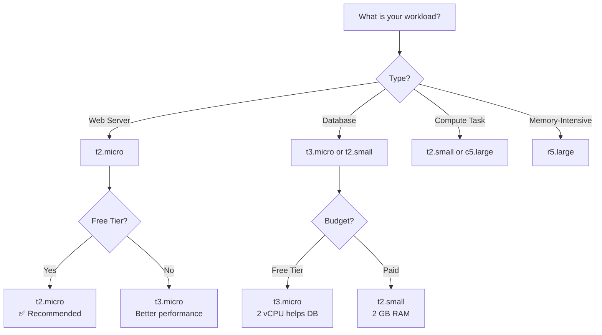

# EC2 Instance Types - Choosing the Right Compute Capacity

## Instance Type Naming Convention

Understanding the naming format helps you quickly identify instance characteristics:

**Format**: `t3.micro`

```
t  3  .  micro
│  │     │
│  │     └─── Size (nano, micro, small, medium, large, xlarge, 2xlarge...)
│  └───────── Generation (higher = newer, better performance)
└───────────── Family (T=burstable, M=general, C=compute, R=memory, etc.)
```

**Examples**:
- `t2.micro` = T family, generation 2, micro size
- `t3.small` = T family, generation 3, small size
- `m5.large` = M family, generation 5, large size
- `c6i.xlarge` = C family, generation 6 Intel, xlarge size

## Instance Families Overview

### General Purpose (T, M)

**Use Cases**: Web servers, development environments, small databases

**T Family** (T2, T3, T3a):
- **Burstable CPU performance**: Baseline with ability to burst
- **CPU Credits**: Earn credits when below baseline, spend during burst
- **Cost-effective**: Lowest price point
- **Free Tier eligible**: t2.micro and t3.micro

**M Family** (M5, M6i, M6a):
- **Balanced**: Equal CPU, memory, network
- **Consistent performance**: No burstable limitation
- **Production workloads**: Reliable for steady-state applications

### Compute Optimized (C)

**Use Cases**: High-performance web servers, batch processing, gaming servers, machine learning inference

**C Family** (C5, C6i, C6a):
- **High CPU-to-memory ratio**: More vCPU, less RAM
- **Best for**: CPU-intensive workloads
- **Performance**: Higher CPU clock speeds

### Memory Optimized (R, X)

**Use Cases**: In-memory databases (Redis, Memcached), big data processing, SAP HANA

**R Family** (R5, R6i, R6a):
- **High memory-to-CPU ratio**: More RAM per vCPU
- **Best for**: Memory-intensive applications
- **Large datasets**: Processing in-memory

### Storage Optimized (I, D)

**Use Cases**: NoSQL databases, data warehousing, log processing

**I Family** (I3, I4i):
- **NVMe SSD storage**: Ultra-low latency
- **High IOPS**: Millions of IOPS
- **Sequential throughput**: High GB/s

### Accelerated Computing (P, G, Inf)

**Use Cases**: Machine learning training, GPU rendering, video transcoding

**P Family** (P3, P4):
- **NVIDIA GPUs**: Tensor cores for ML
- **Parallel processing**: Thousands of cores

## Free Tier Eligible Instances

### T2.micro vs T3.micro Comparison

| Feature | t2.micro | t3.micro |
|---------|----------|----------|
| **vCPU** | 1 | 2 |
| **Memory** | 1 GB | 1 GB |
| **Baseline CPU** | 10% of core | 10% of core |
| **CPU Credits/hour** | 6 | 12 |
| **Network Performance** | Low to Moderate | Up to 5 Gbps |
| **EBS Bandwidth** | - | Up to 2,085 Mbps |
| **Free Tier (Linux)** | ✅ 750 hours/month | ✅ 750 hours/month (eligible regions) |
| **Free Tier (Windows)** | ❌ Not eligible | ✅ 750 hours/month (eligible regions) |
| **Price/hour (us-east-1)** | $0.0116 | $0.0104 |
| **Price/month (24/7)** | ~$8.50 | ~$7.59 |
| **Launch Year** | 2014 | 2018 |
| **Recommendation** | Linux workloads | Windows or CPU-intensive |

### Key Differences

**T2.micro**:
- Single vCPU (may bottleneck multi-threaded apps)
- Lower network performance
- Standard for Linux Free Tier
- Older generation

**T3.micro**:
- Dual vCPU (better multi-threading)
- Unlimited mode available (pay for extra credits)
- Better network and EBS performance
- Eligible for Free Tier on Linux and Windows (where offered); Windows Free Tier uses t3.micro
- Modern generation (better price/performance)

**Recommendation for WorldSkills**:
- **Linux**: Use t2.micro or t3.micro where Free Tier is available
- **Windows**: Use t3.micro (Free Tier option)
- **CPU-intensive**: Consider t3.micro for 2 vCPUs

## Burstable Performance Explained

T2 and T3 instances use a **CPU credit system**:



### How CPU Credits Work

**Baseline Performance**:
- t2.micro / t3.micro: **10% of 1 vCPU**
- Can always use baseline without spending credits
- Enough for web servers with low traffic

**Earning Credits**:
- t2.micro: **6 credits/hour** when at or below baseline
- t3.micro: **12 credits/hour** when at or below baseline
- Maximum balance: 144 credits (t2.micro), 288 credits (t3.micro)

**Spending Credits**:
- 1 credit = 1 vCPU at 100% for 1 minute
- Burst to 100% CPU when needed
- Example: 60 credits = 1 hour at 100% CPU

**Credit Balance Scenarios**:

| Scenario | Credit Status | CPU Performance |
|----------|---------------|-----------------|
| Low traffic website | Earning credits | 5-10% CPU (baseline) |
| Sudden traffic spike | Spending credits | 80-100% CPU (burst) |
| Credits depleted | No credits | 10% CPU (baseline only) |
| Idle instance | Maximum balance | Ready for burst |

### Monitoring CPU Credits

**CloudWatch Metrics**:
- `CPUCreditBalance`: Current credit balance
- `CPUCreditUsage`: Credits spent per hour
- `CPUSurplusCreditBalance`: T3 Unlimited mode

**AWS CLI Command**:
```bash
aws cloudwatch get-metric-statistics \
    --namespace AWS/EC2 \
    --metric-name CPUCreditBalance \
    --dimensions Name=InstanceId,Value=i-0123456789abcdef \
    --start-time 2025-01-01T00:00:00Z \
    --end-time 2025-01-01T23:59:59Z \
    --period 3600 \
    --statistics Average
```

**Console Steps**:
1. EC2 Dashboard → Instances
2. Select instance
3. Monitoring tab → CPU Credit metrics

## Choosing Instance Type for Competition

### Decision Matrix



### Workload-Based Recommendations

**Static Website / Simple Web Server**:
- **Recommended**: t2.micro
- **Reasoning**: Low CPU usage, baseline sufficient
- **Alternative**: t3.micro if expecting traffic spikes

**Dynamic Web Application (PHP, Python, Node.js)**:
- **Recommended**: t2.small (2 GB RAM)
- **Reasoning**: More memory for application runtime
- **Alternative**: t3.micro if Free Tier required

**Database Server (MySQL, PostgreSQL)**:
- **Recommended**: t3.micro (2 vCPU helps queries)
- **Reasoning**: Multi-core improves concurrent connections
- **Alternative**: t2.small for more memory (better caching)

**Batch Processing / Data Analysis**:
- **Recommended**: c5.large (compute optimized)
- **Reasoning**: High CPU performance for calculations
- **Alternative**: t2.small if light processing

**Development Environment**:
- **Recommended**: t2.micro
- **Reasoning**: Low cost, adequate for testing
- **Alternative**: Stop/start as needed to save costs

## Instance Type Specifications

### T2 Family (Free Tier Eligible)

| Instance Type | vCPU | Memory | Baseline CPU | Credits/Hour | Price/Hour (us-east-1) |
|---------------|------|--------|--------------|--------------|------------------------|
| t2.nano | 1 | 0.5 GB | 5% | 3 | $0.0058 |
| **t2.micro** | **1** | **1 GB** | **10%** | **6** | **$0.0116** |
| t2.small | 1 | 2 GB | 20% | 12 | $0.023 |
| t2.medium | 2 | 4 GB | 20% | 24 | $0.0464 |
| t2.large | 2 | 8 GB | 30% | 36 | $0.0928 |

### T3 Family (Improved Performance)

| Instance Type | vCPU | Memory | Baseline CPU | Credits/Hour | Price/Hour (us-east-1) |
|---------------|------|--------|--------------|--------------|------------------------|
| t3.nano | 2 | 0.5 GB | 5% | 6 | $0.0052 |
| **t3.micro** | **2** | **1 GB** | **10%** | **12** | **$0.0104** |
| t3.small | 2 | 2 GB | 20% | 24 | $0.0208 |
| t3.medium | 2 | 4 GB | 20% | 24 | $0.0416 |
| t3.large | 2 | 8 GB | 30% | 36 | $0.0832 |

### Other Common Instance Types

| Instance Type | vCPU | Memory | Use Case | Price/Hour (us-east-1) |
|---------------|------|--------|----------|------------------------|
| m5.large | 2 | 8 GB | General purpose, balanced | $0.096 |
| c5.large | 2 | 4 GB | Compute optimized | $0.085 |
| r5.large | 2 | 16 GB | Memory optimized | $0.126 |
| m6i.large | 2 | 8 GB | Latest gen, better performance | $0.096 |

## Launching Instance with Specific Type

### AWS Console Steps

1. **Navigate to EC2 Dashboard**
2. Click "Launch Instance"
3. **Step 1: Name and Tags**
   - Name: "WebServer"
4. **Step 2: Application and OS Images (AMI)**
   - Select "Amazon Linux 2023"
   - Free tier eligible badge visible
5. **Step 3: Instance Type**
   - Click dropdown showing "t2.micro"
   - See list of available types
    - **For Free Tier**: Select "t2.micro" or "t3.micro" (Linux/Windows in eligible regions; Windows Free Tier uses t3.micro)
   - See specs: vCPU, Memory, Network performance
6. **Continue with launch steps** (key pair, security group, etc.)

### AWS CLI Command

```bash
# Launch t2.micro instance
aws ec2 run-instances \
    --image-id ami-0c55b159cbfafe1f0 \
    --instance-type t2.micro \
    --key-name MyKeyPair \
    --security-group-ids sg-0123456789abcdef \
    --subnet-id subnet-0123456789abcdef \
    --tag-specifications 'ResourceType=instance,Tags=[{Key=Name,Value=WebServer}]'

# Launch t3.micro instance
aws ec2 run-instances \
    --image-id ami-0c55b159cbfafe1f0 \
    --instance-type t3.micro \
    --key-name MyKeyPair \
    --security-group-ids sg-0123456789abcdef \
    --subnet-id subnet-0123456789abcdef
```

### Filtering Available Instance Types

**List all instance types in region**:
```bash
aws ec2 describe-instance-types \
    --query 'InstanceTypes[*].[InstanceType,VCpuInfo.DefaultVCpus,MemoryInfo.SizeInMiB]' \
    --output table
```

**Filter by Free Tier eligibility**:
```bash
aws ec2 describe-instance-types \
    --filters "Name=free-tier-eligible,Values=true" \
    --query 'InstanceTypes[*].[InstanceType,VCpuInfo.DefaultVCpus,MemoryInfo.SizeInMiB]' \
    --output table
```

**Find T2/T3 instances**:
```bash
aws ec2 describe-instance-types \
    --filters "Name=instance-type,Values=t2.*,t3.*" \
    --query 'InstanceTypes[*].[InstanceType,VCpuInfo.DefaultVCpus,MemoryInfo.SizeInMiB,ProcessorInfo.SustainedClockSpeedInGhz]' \
    --output table
```

## Modifying Instance Type

You can change instance type after launch (requires stop/start):

### AWS Console Steps

1. **Stop Instance**:
   - EC2 Dashboard → Instances
   - Select instance
   - Instance state → Stop instance
   - Wait until state = "Stopped"

2. **Change Instance Type**:
   - Select stopped instance
   - Actions → Instance settings → Change instance type
   - Select new type (e.g., t2.micro → t2.small)
   - Click "Apply"

3. **Start Instance**:
   - Instance state → Start instance
   - Wait until state = "Running"
   - Verify new instance type in details tab

### AWS CLI Commands

```bash
# Stop instance
aws ec2 stop-instances --instance-ids i-0123456789abcdef

# Wait for stopped state
aws ec2 wait instance-stopped --instance-ids i-0123456789abcdef

# Change instance type
aws ec2 modify-instance-attribute \
    --instance-id i-0123456789abcdef \
    --instance-type "{\"Value\": \"t2.small\"}"

# Start instance
aws ec2 start-instances --instance-ids i-0123456789abcdef

# Verify new type
aws ec2 describe-instances \
    --instance-ids i-0123456789abcdef \
    --query 'Reservations[0].Instances[0].[InstanceType,State.Name]' \
    --output text
```

**Important Notes**:
- Instance must be stopped (not running)
- Data on EBS volumes persists
- Instance store data is lost
- Public IP may change (use Elastic IP to retain)
- Downtime during stop/start (~2-5 minutes)

## Cost Comparison

### Monthly Cost Calculation (24/7 Operation)

| Instance Type | Hours/Month | Price/Hour | Monthly Cost | Free Tier? |
|---------------|-------------|------------|--------------|------------|
| t2.nano | 730 | $0.0058 | $4.23 | ❌ |
| **t2.micro** | **750** | **$0.0116** | **$0 (Free Tier)** | **✅** |
| t2.micro (over FT) | 730 | $0.0116 | $8.47 | Paid after 750h |
| t2.small | 730 | $0.023 | $16.79 | ❌ |
| t3.micro | 750 | $0.0104 | $0 (Free Tier) | ✅ (Linux/Windows in eligible regions) |
| t3.small | 730 | $0.0208 | $15.18 | ❌ |
| t2.medium | 730 | $0.0464 | $33.87 | ❌ |
| m5.large | 730 | $0.096 | $70.08 | ❌ |

### Cost-Saving Scenarios

**Scenario 1: Single t2.micro (24/7)**
- Hours: 730/month
- Free Tier: 750 hours covers it
- **Cost: $0**

**Scenario 2: Two t2.micro (12 hours each/day)**
- Hours: 2 × 12 × 30 = 720 hours
- Free Tier: 750 hours covers it
- **Cost: $0**

**Scenario 3: One t2.micro (8am-6pm weekdays)**
- Hours: 10 hours × 22 days = 220 hours
- Free Tier: Well within 750 hours
- **Cost: $0**

**Scenario 4: One t2.small (24/7)**
- Hours: 730/month
- Free Tier: Not eligible
- **Cost: $16.79/month**

**Scenario 5: One t2.micro (24/7) after Free Tier expires**
- Hours: 730/month
- Price: $0.0116/hour
- **Cost: $8.47/month**

## Competition Scenarios

### Scenario 1: "Deploy a web server on the smallest Free Tier instance"

**Answer**: t2.micro or t3.micro (Linux/Windows in eligible regions)

**Steps**:
1. Launch instance with t2.micro type
2. Verify Free Tier badge during launch
3. Configure security group (port 80)
4. Install web server (Apache/Nginx)

### Scenario 2: "You need 2 GB RAM for your application"

**Answer**: t2.small (1 vCPU, 2 GB RAM) or t3.small (2 vCPU, 2 GB RAM)

**Decision**:
- t2.small: Lower cost ($0.023/hour)
- t3.small: Better performance with 2 vCPUs ($0.0208/hour)
- **Recommendation**: t3.small (same cost, better specs)

### Scenario 3: "Instance CPU constantly at 100%, slow performance"

**Answer**: Change to larger instance type or compute-optimized

**Steps**:
1. Identify CPU bottleneck via CloudWatch
2. Stop instance
3. Change from t2.micro → t2.small (more baseline) or c5.large (compute optimized)
4. Start instance and retest

### Scenario 4: "Budget is $0, need 2 instances for testing"

**Answer**: Run 2 t2.micro instances part-time to stay within 750 hours

**Strategy**:
- Each runs 12 hours/day max
- Total: 2 × 12 × 30 = 720 hours < 750 hours
- Or run serially: 1 instance full-time, stop before launching second

## Best Practices for Instance Type Selection

1. **Start Small**: Begin with t2.micro, scale up if needed
2. **Monitor Metrics**: Check CPU, memory, network usage
3. **Use Burstable for Variable Workloads**: T2/T3 perfect for web servers
4. **Right-Size**: Don't over-provision (wastes money)
5. **Test Performance**: Benchmark before committing to size
6. **Consider Free Tier**: Always check eligibility
7. **Plan for Growth**: Easy to resize instances later

## Verification Checklist

- [ ] Instance type matches workload requirements
- [ ] Free Tier eligible type selected (if budget is $0)
- [ ] Sufficient vCPU for application
- [ ] Adequate memory for runtime
- [ ] CPU credit balance monitored (for T2/T3)
- [ ] Cost calculated and within budget
- [ ] Performance tested under expected load
- [ ] Documentation of instance type choice

## Next Steps

- [security_groups.md](security_groups.md): Configure firewall rules
- [server_lab.md](server_lab.md): Launch and configure a web server
- [cost_optimization.md](cost_optimization.md): Optimize instance costs
