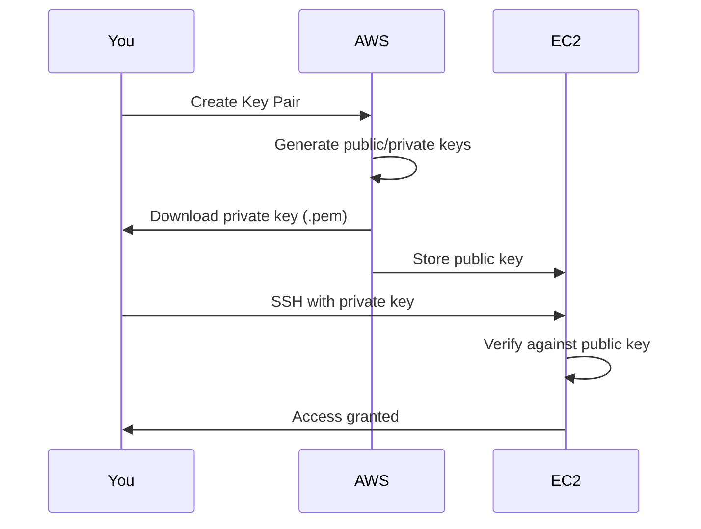
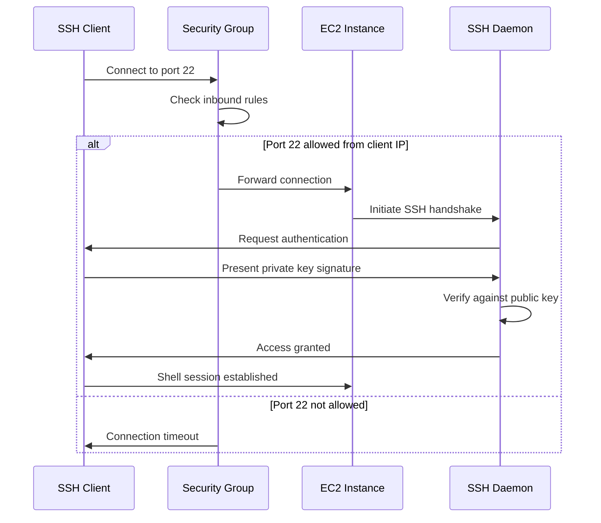

# EC2 Key Pairs and SSH Access

## What are Key Pairs?

Key pairs provide **secure SSH access** to Linux EC2 instances using **public-key cryptography** instead of passwords.

**Components**:
- **Public Key**: Stored on EC2 instance (~/.ssh/authorized_keys)
- **Private Key**: Downloaded by you, kept secure on your computer

**How it Works**:


**Why Key Pairs?**:
- More secure than passwords (2048-bit RSA encryption)
- Cannot brute-force
- Can be easily rotated
- No password to remember or transmit
- Industry standard for server access

## Creating Key Pairs

### AWS Console Steps

1. **Navigate to Key Pairs**:
   - EC2 Dashboard → Network & Security → Key Pairs
   - Click "Create key pair"

2. **Configure Key Pair**:
   - **Name**: MyKeyPair (must be unique in region)
   - **Key pair type**: RSA (recommended) or ED25519
   - **Private key file format**:
     - **.pem**: For OpenSSH (Linux, Mac, Windows OpenSSH)
     - **.ppk**: For PuTTY (Windows)
   - Click "Create key pair"

3. **Download Private Key**:
   - Browser automatically downloads file (e.g., MyKeyPair.pem)
   - **Important**: This is your ONLY chance to download
   - If lost, you must create new key pair

4. **Secure Private Key**:
   - Move to secure location: `~/.ssh/` (Linux/Mac)
   - Set restrictive permissions (see below)
   - Never share or commit to git

### AWS CLI Commands

**Create key pair and save to file**:
```bash
aws ec2 create-key-pair \
    --key-name MyKeyPair \
    --query 'KeyMaterial' \
    --output text > MyKeyPair.pem
```

**Set correct permissions (Linux/Mac)**:
```bash
chmod 400 MyKeyPair.pem
```

**List key pairs**:
```bash
aws ec2 describe-key-pairs
```

**Output**:
```json
{
    "KeyPairs": [
        {
            "KeyPairId": "key-0123456789abcdef",
            "KeyFingerprint": "1f:51:ae:28:bf:89:e9:d8:1f:25:5d:37:2d:7d:b8:ca",
            "KeyName": "MyKeyPair",
            "KeyType": "rsa",
            "Tags": []
        }
    ]
}
```

**Delete key pair**:
```bash
aws ec2 delete-key-pair --key-name MyKeyPair
```

## SSH Access from Linux/Mac

### Setting Permissions

Private key must have restrictive permissions:

```bash
# Set permissions (owner read-only)
chmod 400 MyKeyPair.pem

# Verify permissions
ls -l MyKeyPair.pem
# Expected: -r-------- 1 user user 1704 Jan 01 10:00 MyKeyPair.pem
```

**Why 400?**:
- SSH refuses to use key if permissions too open
- Prevents accidental sharing or modification
- Security best practice

### SSH Command Syntax

**Basic syntax**:
```bash
ssh -i /path/to/private-key.pem username@instance-public-ip
```

**Example**:
```bash
ssh -i ~/.ssh/MyKeyPair.pem ec2-user@54.123.45.67
```

**Components**:
- `-i`: Specifies identity file (private key)
- `ec2-user`: Default username (varies by AMI)
- `54.123.45.67`: Instance public IP or DNS

### Default Usernames by AMI

| AMI | Default Username | Example |
|-----|-----------------|---------|
| **Amazon Linux 2023** | ec2-user | `ssh -i key.pem ec2-user@ip` |
| **Amazon Linux 2** | ec2-user | `ssh -i key.pem ec2-user@ip` |
| **Ubuntu** | ubuntu | `ssh -i key.pem ubuntu@ip` |
| **Debian** | admin | `ssh -i key.pem admin@ip` |
| **Red Hat (RHEL)** | ec2-user | `ssh -i key.pem ec2-user@ip` |
| **CentOS** | centos | `ssh -i key.pem centos@ip` |
| **SUSE** | ec2-user | `ssh -i key.pem ec2-user@ip` |
| **Fedora** | fedora | `ssh -i key.pem fedora@ip` |

**Finding Username**:
- Check AMI documentation
- Look at EC2 console "Connect" button (shows correct username)
- Try common usernames: ec2-user, ubuntu, admin

### SSH Configuration File

Simplify SSH commands by adding to `~/.ssh/config`:

```bash
# ~/.ssh/config
Host mywebserver
    HostName 54.123.45.67
    User ec2-user
    IdentityFile ~/.ssh/MyKeyPair.pem
    
Host *.amazonaws.com
    User ec2-user
    IdentityFile ~/.ssh/MyKeyPair.pem
```

**Now connect with**:
```bash
ssh mywebserver
```

### First SSH Connection

**Initial connection prompts for host verification**:
```
The authenticity of host '54.123.45.67 (54.123.45.67)' can't be established.
ECDSA key fingerprint is SHA256:xxxxxxxxxxxxxxxxxxxxxxxxxxxxxxxxxxxxxxx.
Are you sure you want to continue connecting (yes/no)?
```

**Type**: `yes`

**What happens**:
- Host key added to `~/.ssh/known_hosts`
- Future connections won't prompt
- Protects against man-in-the-middle attacks

## SSH Access from Windows

### Method 1: Windows OpenSSH (Recommended)

Windows 10/11 includes OpenSSH client:

**Check if installed**:
```powershell
ssh -V
```

**Connect**:
```powershell
ssh -i C:\Users\YourName\.ssh\MyKeyPair.pem ec2-user@54.123.45.67
```

**Set permissions** (Windows requires different approach):
```powershell
# Remove inheritance
icacls MyKeyPair.pem /inheritance:r

# Grant read to current user only
icacls MyKeyPair.pem /grant:r "$env:USERNAME:R"
```

### Method 2: PuTTY

**Prerequisites**:
- Download PuTTY: https://www.putty.org/
- Download PuTTYgen (included with PuTTY installer)

**Steps**:

1. **Convert .pem to .ppk**:
   - Open PuTTYgen
   - Conversions → Import key
   - Select MyKeyPair.pem
   - Save private key → MyKeyPair.ppk

2. **Connect with PuTTY**:
   - Host Name: ec2-user@54.123.45.67
   - Connection → SSH → Auth → Credentials
   - Private key file: Browse to MyKeyPair.ppk
   - Session → Save (optional, for future use)
   - Click "Open"

3. **Accept host key**:
   - Click "Yes" on security alert

### Method 3: WSL (Windows Subsystem for Linux)

If WSL installed:

```bash
# Same as Linux
chmod 400 /mnt/c/Users/YourName/.ssh/MyKeyPair.pem
ssh -i /mnt/c/Users/YourName/.ssh/MyKeyPair.pem ec2-user@54.123.45.67
```

## SSH Connection Flow



## Troubleshooting SSH Issues

### Permission Denied (Publickey)

**Symptom**:
```
Permission denied (publickey).
```

**Causes & Solutions**:

**1. Wrong private key**:
```bash
# Verify correct key
aws ec2 describe-instances \
    --instance-ids i-0123456789abcdef \
    --query 'Reservations[0].Instances[0].KeyName'
```

**2. Wrong username**:
```bash
# Try different usernames
ssh -i key.pem ec2-user@ip    # Amazon Linux
ssh -i key.pem ubuntu@ip       # Ubuntu
ssh -i key.pem admin@ip        # Debian
```

**3. Incorrect permissions (Linux/Mac)**:
```bash
chmod 400 MyKeyPair.pem
```

**4. Key not in ~/.ssh/authorized_keys on instance**:
- Instance launched without key pair
- User data script may have modified authorized_keys

### Connection Timeout

**Symptom**:
```
ssh: connect to host 54.123.45.67 port 22: Connection timed out
```

**Causes & Solutions**:

**1. Security group doesn't allow port 22**:
```bash
# Check security group rules
aws ec2 describe-security-groups \
    --group-ids sg-xxxxx \
    --query 'SecurityGroups[0].IpPermissions[?FromPort==`22`]'

# Add rule if missing
aws ec2 authorize-security-group-ingress \
    --group-id sg-xxxxx \
    --protocol tcp \
    --port 22 \
    --cidr YOUR_IP/32
```

**2. Network ACL blocking**:
- Check subnet's Network ACL allows port 22 inbound and outbound

**3. Instance not in public subnet**:
- Verify instance has public IP
- Ensure subnet has route to Internet Gateway

**4. Wrong IP address**:
```bash
# Get current public IP
aws ec2 describe-instances \
    --instance-ids i-0123456789abcdef \
    --query 'Reservations[0].Instances[0].PublicIpAddress' \
    --output text
```

### Host Key Verification Failed

**Symptom**:
```
@@@@@@@@@@@@@@@@@@@@@@@@@@@@@@@@@@@@@@@@@@@@@@@@@@@@@@@@@@@
@ WARNING: REMOTE HOST IDENTIFICATION HAS CHANGED! @
@@@@@@@@@@@@@@@@@@@@@@@@@@@@@@@@@@@@@@@@@@@@@@@@@@@@@@@@@@@
```

**Cause**: Instance recreated or IP reused, old host key in known_hosts

**Solution**:
```bash
# Remove old host key
ssh-keygen -R 54.123.45.67

# Or edit ~/.ssh/known_hosts and remove line with that IP
```

### Too Many Authentication Failures

**Symptom**:
```
Received disconnect from 54.123.45.67 port 22:2: Too many authentication failures
```

**Cause**: ssh-agent has too many keys, tries all before correct one

**Solution**:
```bash
# Explicitly specify key and disable agent
ssh -i MyKeyPair.pem -o IdentitiesOnly=yes ec2-user@54.123.45.67
```

## Importing Existing Key Pair

If you already have an SSH key pair:

### AWS Console Steps

1. **Navigate to Key Pairs**
2. Click "Actions" → "Import key pair"
3. **Name**: MyExistingKey
4. **Key pair file**: Upload public key file (.pub)
   - Or paste public key directly
5. Click "Import key pair"

### AWS CLI Command

```bash
# Import from public key file
aws ec2 import-key-pair \
    --key-name MyExistingKey \
    --public-key-material fileb://~/.ssh/id_rsa.pub
```

**Generate public key from private key** (if needed):
```bash
ssh-keygen -y -f ~/.ssh/id_rsa > ~/.ssh/id_rsa.pub
```

## Security Best Practices

### 1. Never Share Private Keys

**❌ Don't**:
- Email private keys
- Commit to git repositories
- Store in shared folders
- Send via messaging apps

**✅ Do**:
- Keep private keys secure on your workstation
- Use separate keys per environment
- Revoke access by deleting key pair and launching new instance

### 2. Use Separate Keys Per Environment

```
~/.ssh/
  ├── dev-key.pem        # Development
  ├── staging-key.pem    # Staging
  └── prod-key.pem       # Production
```

**Benefits**:
- Limit blast radius if key compromised
- Easier to revoke access
- Clear separation of environments

### 3. Rotate Keys Periodically

**Every 90 days**:
1. Create new key pair
2. Add new public key to instances (~/.ssh/authorized_keys)
3. Test SSH with new key
4. Remove old public key from instances
5. Delete old key pair from AWS

### 4. Use Bastion Hosts for Private Instances

**Architecture**:
```
Internet → Bastion (Public) → Private Instances
```

**Benefits**:
- Single entry point for SSH
- Centralized access control
- Private instances not exposed to internet

**SSH through bastion**:
```bash
# SSH to bastion
ssh -i bastion-key.pem ec2-user@bastion-ip

# From bastion, SSH to private instance
ssh -i private-key.pem ec2-user@private-ip
```

**SSH proxy jump** (one command):
```bash
ssh -i private-key.pem \
    -o ProxyCommand="ssh -i bastion-key.pem -W %h:%p ec2-user@bastion-ip" \
    ec2-user@private-ip
```

### 5. Use AWS Systems Manager Session Manager

**Alternative to SSH** (no key pairs needed):
- IAM-based access control
- Audit trail in CloudWatch
- No need for bastion hosts
- Works with private instances

**Connect via console**:
1. EC2 Dashboard → Instances
2. Select instance
3. Connect → Session Manager → Connect

**Connect via CLI**:
```bash
aws ssm start-session --target i-0123456789abcdef
```

**Requirements**:
- SSM agent installed (pre-installed on Amazon Linux 2023)
- IAM role with `AmazonSSMManagedInstanceCore` policy
- No public IP required

### 6. Restrict SSH Source IP

**❌ Bad**:
```
Security Group: Port 22 from 0.0.0.0/0
```

**✅ Good**:
```
Security Group: Port 22 from 203.0.113.25/32 (your office IP)
```

**For Dynamic IPs**: Use VPN or update security group when IP changes

### 7. Disable Password Authentication

**On instance** (enforce key-only auth):
```bash
# Edit SSH config
sudo vi /etc/ssh/sshd_config

# Ensure these lines:
PasswordAuthentication no
ChallengeResponseAuthentication no
UsePAM no

# Restart SSH
sudo systemctl restart sshd
```

## Backup and Recovery

### Lost Private Key

**Scenario**: Private key deleted or corrupted

**Options**:

**Option 1: Launch new instance** (if data not critical):
1. Create new key pair
2. Launch new instance with new key
3. Migrate data from old instance
4. Terminate old instance

**Option 2: Stop instance and attach volume** (preserve data):
1. Stop old instance
2. Detach root EBS volume
3. Attach volume to temporary instance (as /dev/sdf)
4. Mount volume on temporary instance
5. Modify ~/.ssh/authorized_keys with your new public key
6. Detach and reattach volume to original instance
7. Start instance with new key access

**Option 3: Use Systems Manager** (if already configured):
```bash
aws ssm start-session --target i-0123456789abcdef
```

### Backup Private Keys

**Best practices**:
- Store encrypted backup (use GPG or similar)
- Use password manager with file attachments
- Keep offline backup (USB drive in safe)
- Document key locations and purposes

## WorldSkills Competition Tips

### Pre-Competition Preparation

**1. Create Key Pairs in Advance**:
```bash
# Create key for competition
aws ec2 create-key-pair \
    --key-name WorldSkills2026 \
    --query 'KeyMaterial' \
    --output text > WorldSkills2026.pem

chmod 400 WorldSkills2026.pem

# Test immediately
```

**2. Test SSH from Competition Network**:
- Verify internet access allows outbound SSH (port 22)
- Some networks block SSH
- Test with a temporary instance

**3. Have Backup Access Method**:
- Systems Manager Session Manager
- EC2 Instance Connect (browser-based)
- Secondary key pair

### During Competition

**1. Test SSH Immediately After Launch**:
```bash
# Don't wait until the end
ssh -i key.pem ec2-user@instance-ip

# Verify connectivity works
```

**2. Note Public IP**:
```bash
# Save to file for quick access
echo "54.123.45.67" > instance-ip.txt
```

**3. Use SSH Config for Speed**:
```bash
# Add to ~/.ssh/config
Host competition
    HostName 54.123.45.67
    User ec2-user
    IdentityFile ~/.ssh/WorldSkills2026.pem

# Connect quickly
ssh competition
```

**4. Keep Private Key Secure**:
- Don't leave terminal unattended
- Use screen lock
- Don't share with other competitors

## Verification Checklist

- [ ] Key pair created in correct region
- [ ] Private key downloaded and saved securely
- [ ] Correct permissions set (400 on Linux/Mac)
- [ ] Instance launched with correct key pair
- [ ] Security group allows SSH (port 22)
- [ ] SSH connection successful
- [ ] Correct username used (ec2-user, ubuntu, etc.)
- [ ] Host key accepted and saved
- [ ] Can execute commands on instance
- [ ] Exit and reconnect successful

## Next Steps

- [security_groups.md](security_groups.md): Configure SSH security group rules
- [server_lab.md](server_lab.md): Deploy web server with SSH access
- [autoscaling_basics.md](autoscaling_basics.md): Key pairs with Auto Scaling
