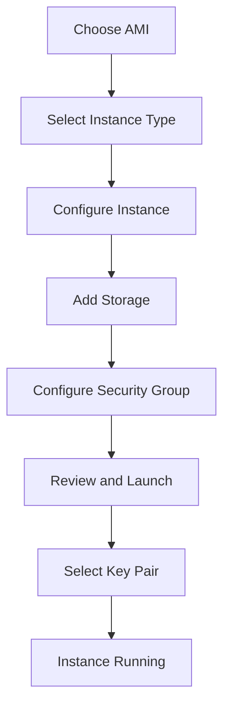
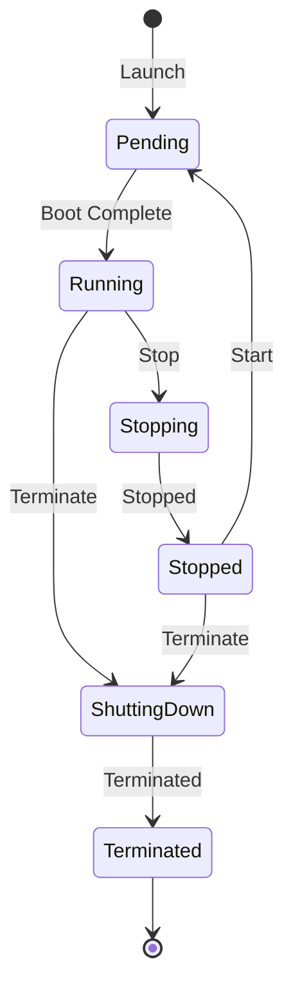
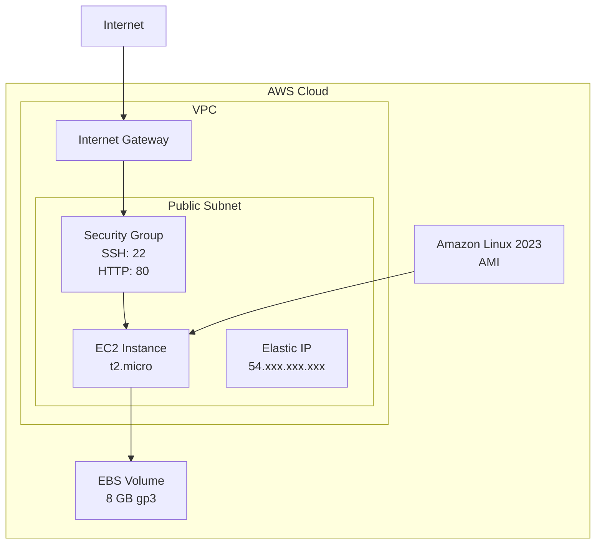
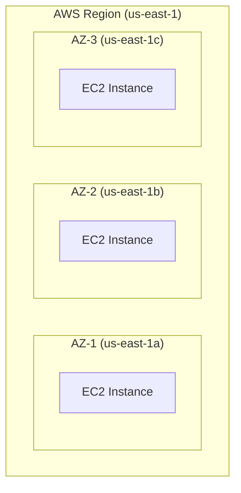

# Amazon EC2 - Elastic Compute Cloud Overview

## What is Amazon EC2?

Amazon Elastic Compute Cloud (EC2) provides **resizable virtual servers** (called instances) in the AWS cloud. EC2 eliminates the need to invest in hardware upfront, allowing you to develop and deploy applications faster.

**Key Benefits**:
- **Elasticity**: Scale capacity up or down within minutes
- **Complete Control**: Full root/administrator access to instances
- **Flexible**: Choose instance types, operating systems, software packages
- **Integrated**: Works seamlessly with other AWS services (S3, RDS, VPC)
- **Reliable**: 99.99% availability SLA for each region
- **Secure**: Multiple security layers (VPC, security groups, IAM)
- **Cost-Effective**: Pay only for what you use, no upfront costs

## EC2 Fundamentals

### What is an Instance?

An **instance** is a virtual server running in AWS cloud. Think of it as a computer in a data center, but virtual:
- Has CPU, memory, storage, and networking capacity
- Runs an operating system (Linux, Windows)
- Can install and run any software
- Accessible via SSH (Linux) or RDP (Windows)

### How EC2 Works



## EC2 vs Lambda Comparison

| Feature | EC2 | Lambda |
|---------|-----|--------|
| **Compute Model** | Virtual servers | Serverless functions |
| **Control** | Full OS control | No server management |
| **Scaling** | Manual or Auto Scaling | Automatic |
| **Runtime** | Any (install anything) | Limited to supported runtimes |
| **Cost Model** | Per-hour/second (while running only) | Per-invocation + duration |
| **Startup Time** | Minutes | Milliseconds |
| **Max Duration** | Unlimited | 15 minutes max |
| **Use Cases** | Long-running apps, databases, custom software | Event-driven, short tasks, APIs |
| **Free Tier** | 750 hours/month (t2.micro) | 1M requests + 400K GB-seconds |
| **Suitable For** | Web servers, app servers, persistent workloads | Microservices, batch processing, scheduled tasks |
| **Best When** | Need OS access, long-running, predictable load | Short tasks, variable load, event-driven |

**When to Use EC2**:
- Need full OS control
- Run databases (MySQL, PostgreSQL, MongoDB)
- Legacy applications requiring specific OS/software
- Long-running applications (24/7 web servers)
- High-performance computing
- Custom network configuration

**When to Use Lambda**:
- Stateless, short-duration tasks
- Event-driven processing
- Unpredictable or variable workload
- No need for OS-level management
- Cost optimization for intermittent workloads

## Instance Lifecycle

EC2 instances transition through several states:



### Instance States

| State | Description | Billing | Data Persistence |
|-------|-------------|---------|------------------|
| **Pending** | Instance starting up | Not billed | N/A |
| **Running** | Instance fully operational | Billed hourly | All data intact |
| **Stopping** | Instance shutting down | Not billed | Data on EBS persists |
| **Stopped** | Instance shut down | EBS storage billed only | EBS data persists |
| **Shutting-down** | Instance terminating | Not billed | Preparing to delete |
| **Terminated** | Instance deleted | Not billed | All data lost (unless EBS retained) |

**Important Notes**:
- **Stop**: Standard shutdown (memory state lost unless hibernation explicitly configured); EBS volumes persist; compute billing stops
- **Terminate**: Permanently deletes instance, default EBS volumes deleted
- **Stopped instances**: Only pay for EBS storage and any detached Elastic IPs, not compute time
- **Instance store**: Data lost on stop or terminate (use EBS for persistence)

## Key EC2 Concepts

### 1. Amazon Machine Image (AMI)

A template containing:
- Operating system (Amazon Linux, Ubuntu, Windows)
- Pre-installed software
- Configuration settings

**Common AMIs**:
- Amazon Linux 2023 (recommended for most use cases)
- Ubuntu Server 22.04 LTS
- Red Hat Enterprise Linux
- Windows Server 2022
- Deep Learning AMI (pre-configured for ML)

**AMI Types**:
- **Quick Start**: AWS-provided, regularly updated
- **My AMIs**: Custom AMIs you created
- **AWS Marketplace**: Third-party AMIs (paid/free)
- **Community AMIs**: Shared by AWS community

### 2. Instance Types

Instance types determine:
- vCPU count (virtual CPUs)
- Memory (RAM)
- Storage performance
- Network performance

**Naming Convention**: `t2.micro`
- **t** = Family (general purpose)
- **2** = Generation
- **micro** = Size

**Instance Families**:
- **T** (T2, T3): Burstable performance, general purpose
- **M** (M5, M6i): Balanced compute/memory/network
- **C** (C5, C6i): Compute optimized
- **R** (R5, R6i): Memory optimized
- **I** (I3, I4i): Storage optimized

### 3. Storage Options

**Elastic Block Store (EBS)**:
- Persistent block storage
- Survives instance stop/start
- Snapshots for backup
- Types: gp3 (general purpose), io2 (high performance)

**Instance Store**:
- Temporary storage
- Physically attached to host
- Data lost on stop/terminate
- High I/O performance

### 4. Networking

**Virtual Private Cloud (VPC)**:
- Isolated network for your instances
- Public and private subnets
- Internet Gateway for internet access

**Security Groups**:
- Virtual firewall for instances
- Control inbound/outbound traffic
- Stateful (return traffic automatically allowed)

**Elastic IP**:
- Static public IP address
- Persists across instance stop/start
- Free when associated with running instance

### 5. Key Pairs

- Public-private key cryptography
- Secure SSH access to Linux instances
- Secure RDP password retrieval for Windows
- Create before launching instance

## EC2 Components Architecture



## Use Cases for WorldSkills Competitions

### 1. Web Server Hosting
- Host Apache/Nginx web servers
- Serve static websites or web applications
- Common competition task: "Deploy web server accessible from internet"

### 2. Application Servers
- Run Node.js, Python, Java applications
- Backend APIs for mobile/web apps
- Integration with RDS for database layer

### 3. Bastion Hosts (Jump Servers)
- Secure SSH access to private instances
- Single entry point for administration
- Security best practice for production environments

### 4. Development Environments
- Test code before production deployment
- Experiment with different configurations
- Disposable environments (terminate when done)

### 5. Database Servers
- Self-managed MySQL, PostgreSQL, MongoDB
- When RDS doesn't meet requirements
- Learning database administration

## Free Tier Limits (Important!)

AWS Free Tier for EC2 includes:

| Resource | Free Tier Limit | Notes |
|----------|-----------------|-------|
| **Compute** | 750 hours/month | t2.micro or t3.micro (Linux/Windows where available) |
| **Storage** | 30 GB EBS (SSD or Magnetic) | General Purpose (gp2/gp3) |
| **Snapshots** | 1 GB of snapshot storage | For EBS backups |
| **Data Transfer** | 100 GB outbound | To internet per month |

**Key Points**:
- 750 hours = 1 instance running 24/7 for entire month
- Or 2 instances running 12 hours each per day
- Must use t2.micro (Linux) or t3.micro (Windows)
- Free tier valid for **12 months** from account creation
- Exceeding limits incurs charges

**Cost After Free Tier** (us-east-1):
- t2.micro: ~$0.0116/hour = ~$8.50/month
- t2.small: ~$0.023/hour = ~$16.80/month
- t3.micro: ~$0.0104/hour = ~$7.59/month

## AWS Console Navigation

### Accessing EC2 Dashboard

1. Sign in to AWS Console
2. Search for "EC2" in top search bar
3. Click "EC2" (Virtual Servers in the Cloud)

**Dashboard Sections**:
- **Resources**: Quick view of running instances, volumes, security groups
- **Instances**: Launch, manage, connect to instances
- **Images**: AMIs, snapshots
- **Elastic Block Store**: Volumes, snapshots
- **Network & Security**: Security groups, key pairs, Elastic IPs
- **Load Balancing**: Application and Network Load Balancers
- **Auto Scaling**: Auto Scaling Groups, Launch Templates

### Quick Navigation Tips

**Left Sidebar**:
- **Instances → Instances**: View/manage all instances
- **Instances → Instance Types**: Browse available types
- **Images → AMIs**: Create/manage custom AMIs
- **Network & Security → Security Groups**: Manage firewall rules
- **Network & Security → Key Pairs**: Create/import SSH keys

## AWS CLI Commands

### Installation

```bash
# Install AWS CLI v2 (Linux/Mac)
curl "https://awscli.amazonaws.com/awscli-exe-linux-x86_64.zip" -o "awscliv2.zip"
unzip awscliv2.zip
sudo ./aws/install

# Verify installation
aws --version
```

### Configuration

```bash
# Configure AWS credentials
aws configure
# Enter: Access Key ID, Secret Access Key, Region (us-east-1), Output format (json)
```

### Common EC2 CLI Commands

**List all instances**:
```bash
aws ec2 describe-instances
```

**List running instances only**:
```bash
aws ec2 describe-instances \
    --filters "Name=instance-state-name,Values=running" \
    --query 'Reservations[*].Instances[*].[InstanceId,InstanceType,PublicIpAddress,State.Name]' \
    --output table
```

**Launch new instance**:
```bash
aws ec2 run-instances \
    --image-id ami-0c55b159cbfafe1f0 \
    --instance-type t2.micro \
    --key-name MyKeyPair \
    --security-group-ids sg-0123456789abcdef \
    --subnet-id subnet-0123456789abcdef \
    --tag-specifications 'ResourceType=instance,Tags=[{Key=Name,Value=WebServer}]'
```

**Stop instance**:
```bash
aws ec2 stop-instances --instance-ids i-0123456789abcdef
```

**Start instance**:
```bash
aws ec2 start-instances --instance-ids i-0123456789abcdef
```

**Terminate instance**:
```bash
aws ec2 terminate-instances --instance-ids i-0123456789abcdef
```

**Get instance details**:
```bash
aws ec2 describe-instances \
    --instance-ids i-0123456789abcdef \
    --query 'Reservations[0].Instances[0].[InstanceId,PublicIpAddress,State.Name]' \
    --output text
```

## WorldSkills Competition Tips

### Time-Saving Strategies

1. **Pre-create Resources**:
   - Create key pairs before competition starts
   - Prepare security group templates
   - Bookmark AMI IDs for commonly used OS

2. **Use AWS CLI for Speed**:
   - Launching instances via CLI faster than console
   - Script repetitive tasks
   - Use `--query` to filter output

3. **Leverage User Data**:
   - Automate software installation on launch
   - Configure services automatically
   - Reduce manual SSH configuration time

4. **Tag Everything**:
   - Add Name tags to identify resources quickly
   - Use consistent naming convention
   - Makes cleanup easier

### Common Pitfalls

**❌ Mistake 1**: Forgetting to start/stop instances
- **Impact**: Running instance 24/7 exceeds Free Tier
- **Solution**: Stop instances when not testing

**❌ Mistake 2**: Wrong security group rules
- **Impact**: Cannot SSH or access web server
- **Solution**: Double-check port numbers (22, 80, 443)

**❌ Mistake 3**: Losing private key
- **Impact**: Cannot SSH into instance
- **Solution**: Download key immediately, backup securely

**❌ Mistake 4**: Selecting wrong instance type
- **Impact**: Costs exceed budget, or insufficient performance
- **Solution**: Verify t2.micro/t3.micro for Free Tier

**❌ Mistake 5**: Not testing before submission
- **Impact**: Solution doesn't work, lose points
- **Solution**: Test SSH, HTTP access, verify all requirements

### Scoring Considerations

**High-Scoring Actions**:
- ✅ Instance accessible and functional
- ✅ Security groups configured correctly (least privilege)
- ✅ Appropriate instance type selected
- ✅ Proper tagging and naming
- ✅ Cost-effective solution (Free Tier usage)
- ✅ Documentation of steps taken

**Point Deductions**:
- ❌ Instance not accessible
- ❌ Overly permissive security rules (0.0.0.0/0 for SSH)
- ❌ Wrong instance type (oversized or undersized)
- ❌ Missing tags or poor naming
- ❌ Excessive costs

## Regions and Availability Zones

### Understanding Regions

**Region**: Geographic area with multiple data centers
- Example: us-east-1 (N. Virginia), eu-west-1 (Ireland)
- Each region isolated and independent
- Lower latency when close to users

**Choosing Region**:
- Proximity to users (lower latency)
- Service availability (some services not in all regions)
- Pricing (varies by region)
- Compliance requirements (data residency)

### Availability Zones (AZs)

**Availability Zone**: One or more data centers within a region
- Example: us-east-1a, us-east-1b, us-east-1c
- Isolated from failures in other AZs
- Connected via low-latency links
- Deploy across multiple AZs for high availability



## Verification Checklist

After launching an EC2 instance, verify:

- [ ] Instance state shows "Running"
- [ ] Public IP address assigned (if in public subnet)
- [ ] Security group rules allow required ports
- [ ] Key pair selected during launch
- [ ] SSH connection successful (Linux)
- [ ] Correct instance type (t2.micro for Free Tier)
- [ ] EBS volume attached and correct size
- [ ] Tags applied (Name tag minimum)
- [ ] Instance in correct VPC/subnet
- [ ] CloudWatch monitoring enabled

## Next Steps

Now that you understand EC2 fundamentals, explore:

- [instance_types.md](instance_types.md): Deep dive into instance types and choosing the right size
- [security_groups.md](security_groups.md): Configure firewall rules for secure access
- [keypairs_ssh.md](keypairs_ssh.md): Set up SSH access to your instances
- [autoscaling_basics.md](autoscaling_basics.md): Automatically scale capacity
- [server_lab.md](server_lab.md): Hands-on lab deploying a web server
- [cost_optimization.md](cost_optimization.md): Maximize Free Tier and reduce costs
