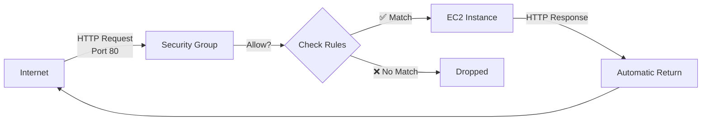
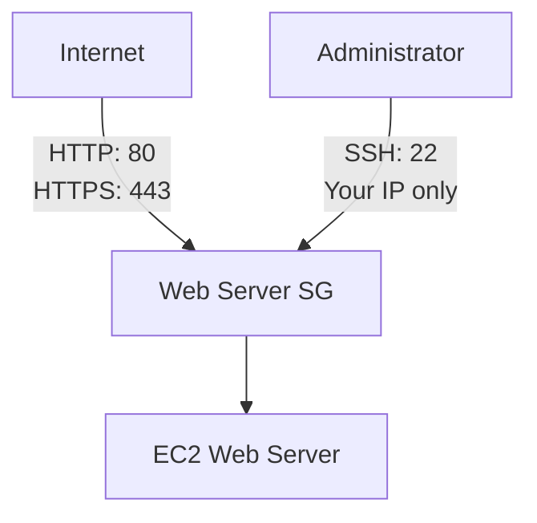
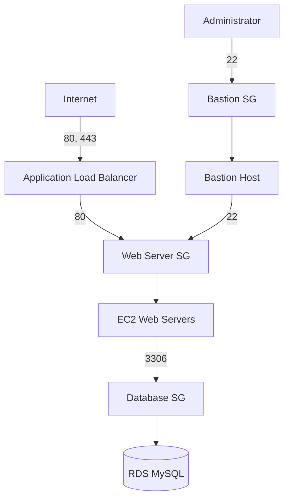
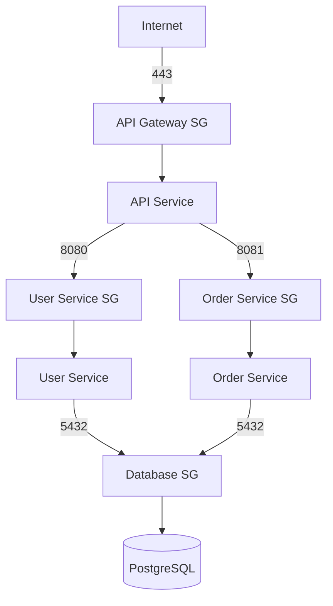

# Security Groups - EC2 Firewall Configuration

## What are Security Groups?

Security groups act as **virtual firewalls** controlling inbound and outbound traffic to EC2 instances. They operate at the **instance level** and use **stateful** packet filtering.

**Key Characteristics**:
- **Stateful**: If you allow inbound traffic, response traffic is automatically allowed
- **Allow rules only**: You specify what to allow, everything else is denied by default
- **Instance-level**: Applied to network interface, not subnet
- **Multiple instances**: Same security group can protect multiple instances
- **Multiple groups**: Instance can have multiple security groups (rules combined)



## Security Groups vs Network ACLs

| Feature | Security Groups | Network ACLs |
|---------|----------------|--------------|
| **Level** | Instance (ENI) | Subnet |
| **State** | Stateful | Stateless |
| **Rules** | Allow only | Allow and Deny |
| **Return Traffic** | Automatic | Must explicitly allow |
| **Rule Evaluation** | All rules evaluated | Rules in number order |
| **Applies To** | Instances with SG assigned | All instances in subnet |
| **Default** | Deny all inbound, allow all outbound | Allow all in/out |
| **Changes** | Immediate effect | Immediate effect |
| **Best For** | Instance-specific security | Subnet-wide filtering |
| **WorldSkills Use** | Primary firewall method | Rarely needed |

**When to Use**:
- **Security Groups**: 99% of scenarios, instance-level control
- **NACLs**: Additional subnet-level protection, blocking specific IPs

## Inbound Rules

Control **incoming** traffic to your instance.

### Rule Components

**Protocol**: TCP, UDP, ICMP, All
**Port Range**: Single port (22) or range (8000-9000)
**Source**: Where traffic originates
- **CIDR block**: 0.0.0.0/0 (anywhere), 203.0.113.0/24 (specific network)
- **Security group ID**: sg-0123456789abcdef (other instances)
- **Prefix list**: AWS managed IP ranges

### Common Inbound Rules

**SSH Access (Linux)**:
```
Protocol: TCP
Port: 22
Source: Your IP (e.g., 203.0.113.25/32)
Description: SSH from my workstation
```

**RDP Access (Windows)**:
```
Protocol: TCP
Port: 3389
Source: Your IP
Description: RDP from my workstation
```

**HTTP Web Server**:
```
Protocol: TCP
Port: 80
Source: 0.0.0.0/0 (anywhere)
Description: Allow HTTP from internet
```

**HTTPS Web Server**:
```
Protocol: TCP
Port: 443
Source: 0.0.0.0/0
Description: Allow HTTPS from internet
```

**Custom Application**:
```
Protocol: TCP
Port: 8080
Source: sg-webserver (security group ID)
Description: App server to API server
```

### Example Inbound Configuration

```json
{
  "IpPermissions": [
    {
      "IpProtocol": "tcp",
      "FromPort": 22,
      "ToPort": 22,
      "IpRanges": [{"CidrIp": "203.0.113.25/32", "Description": "SSH from office"}]
    },
    {
      "IpProtocol": "tcp",
      "FromPort": 80,
      "ToPort": 80,
      "IpRanges": [{"CidrIp": "0.0.0.0/0", "Description": "HTTP from anywhere"}]
    },
    {
      "IpProtocol": "tcp",
      "FromPort": 443,
      "ToPort": 443,
      "IpRanges": [{"CidrIp": "0.0.0.0/0", "Description": "HTTPS from anywhere"}]
    }
  ]
}
```

## Outbound Rules

Control **outgoing** traffic from your instance.

### Default Behavior

By default, security groups allow **all outbound traffic**:
```
Protocol: All
Port: All
Destination: 0.0.0.0/0
```

**Why?**: Instances need to download updates, connect to databases, make API calls.

### Restricting Outbound (Advanced)

For high-security environments:

**Allow only HTTP/HTTPS**:
```
Rule 1:
  Protocol: TCP
  Port: 80
  Destination: 0.0.0.0/0

Rule 2:
  Protocol: TCP
  Port: 443
  Destination: 0.0.0.0/0
```

**Allow database connection**:
```
Protocol: TCP
Port: 3306 (MySQL)
Destination: sg-database
```

**Important**: If you remove the default "allow all" outbound rule, you must explicitly allow DNS (port 53) and any other required outbound connections.

## Common Port Numbers

| Service | Protocol | Port | Description |
|---------|----------|------|-------------|
| **SSH** | TCP | 22 | Linux remote access |
| **RDP** | TCP | 3389 | Windows remote access |
| **HTTP** | TCP | 80 | Web traffic |
| **HTTPS** | TCP | 443 | Secure web traffic |
| **MySQL** | TCP | 3306 | MySQL database |
| **PostgreSQL** | TCP | 5432 | PostgreSQL database |
| **MongoDB** | TCP | 27017 | MongoDB database |
| **Redis** | TCP | 6379 | Redis cache |
| **SMTP** | TCP | 25, 587 | Email sending |
| **DNS** | UDP | 53 | Domain name resolution |
| **NFS** | TCP | 2049 | Network file system |
| **Custom App** | TCP | 3000-9000 | Node.js, Flask, etc. |

## Security Group Architecture Patterns

### Pattern 1: Simple Web Server



**Security Group Rules**:
```
Inbound:
- Port 80 from 0.0.0.0/0 (HTTP)
- Port 443 from 0.0.0.0/0 (HTTPS)
- Port 22 from 203.0.113.25/32 (SSH from your IP)

Outbound:
- All traffic to 0.0.0.0/0 (default)
```

### Pattern 2: Web Server + Database (3-Tier)



**Web Server Security Group**:
```
Inbound:
- Port 80 from sg-alb (ALB only)
- Port 22 from sg-bastion (Bastion only)

Outbound:
- Port 3306 to sg-database (Database access)
- Port 443 to 0.0.0.0/0 (External APIs)
```

**Database Security Group**:
```
Inbound:
- Port 3306 from sg-webserver (Web servers only)

Outbound:
- None needed (or allow all by default)
```

**Bastion Security Group**:
```
Inbound:
- Port 22 from 203.0.113.25/32 (Your IP only)

Outbound:
- Port 22 to sg-webserver (SSH to web servers)
```

### Pattern 3: Microservices with Internal Communication



**Best Practice**: Reference security group IDs instead of IP ranges for internal communication.

## Common Security Group Configurations

### Web Server (Apache/Nginx)

```
Name: WebServerSG
Description: Allow HTTP, HTTPS, and SSH

Inbound Rules:
┌──────────┬──────┬─────────────────┬─────────────────┐
│ Protocol │ Port │ Source          │ Description     │
├──────────┼──────┼─────────────────┼─────────────────┤
│ TCP      │ 80   │ 0.0.0.0/0       │ HTTP from web   │
│ TCP      │ 443  │ 0.0.0.0/0       │ HTTPS from web  │
│ TCP      │ 22   │ 203.0.113.25/32 │ SSH from office │
└──────────┴──────┴─────────────────┴─────────────────┘

Outbound Rules:
All traffic to 0.0.0.0/0
```

### Database Server (MySQL)

```
Name: DatabaseSG
Description: Allow MySQL from app servers only

Inbound Rules:
┌──────────┬──────┬──────────────────┬───────────────────┐
│ Protocol │ Port │ Source           │ Description       │
├──────────┼──────┼──────────────────┼───────────────────┤
│ TCP      │ 3306 │ sg-appserver     │ MySQL from apps   │
│ TCP      │ 22   │ sg-bastion       │ SSH from bastion  │
└──────────┴──────┴──────────────────┴───────────────────┘

Outbound Rules:
All traffic to 0.0.0.0/0 (or remove for stricter security)
```

### SSH Bastion Host

```
Name: BastionSG
Description: SSH jump server for private instances

Inbound Rules:
┌──────────┬──────┬─────────────────┬──────────────────┐
│ Protocol │ Port │ Source          │ Description      │
├──────────┼──────┼─────────────────┼──────────────────┤
│ TCP      │ 22   │ 203.0.113.25/32 │ SSH from my IP   │
└──────────┴──────┴─────────────────┴──────────────────┘

Outbound Rules:
┌──────────┬──────┬─────────────────┬──────────────────────┐
│ Protocol │ Port │ Destination     │ Description          │
├──────────┼──────┼─────────────────┼──────────────────────┤
│ TCP      │ 22   │ sg-webserver    │ SSH to web servers   │
│ TCP      │ 22   │ sg-database     │ SSH to DB servers    │
└──────────┴──────┴─────────────────┴──────────────────────┘
```

### Application Server (Node.js, Python, etc.)

```
Name: AppServerSG
Description: Application server with custom port

Inbound Rules:
┌──────────┬──────┬─────────────────┬──────────────────────┐
│ Protocol │ Port │ Source          │ Description          │
├──────────┼──────┼─────────────────┼──────────────────────┤
│ TCP      │ 3000 │ sg-loadbalancer │ App from ALB         │
│ TCP      │ 22   │ sg-bastion      │ SSH from bastion     │
└──────────┴──────┴─────────────────┴──────────────────────┘
```

### Redis Cache Server

```
Name: RedisSG
Description: Redis cache for application servers

Inbound Rules:
┌──────────┬──────┬──────────────┬───────────────────┐
│ Protocol │ Port │ Source       │ Description       │
├──────────┼──────┼──────────────┼───────────────────┤
│ TCP      │ 6379 │ sg-appserver │ Redis from apps   │
└──────────┴──────┴──────────────┴───────────────────┘
```

## Creating Security Groups

### AWS Console Steps

1. **Navigate to Security Groups**:
   - EC2 Dashboard → Network & Security → Security Groups
   - Click "Create security group"

2. **Basic Details**:
   - **Security group name**: WebServerSG
   - **Description**: Allow HTTP and SSH
   - **VPC**: Select your VPC

3. **Inbound Rules**:
   - Click "Add rule"
   - **Type**: HTTP (auto-fills port 80)
   - **Source**: Anywhere-IPv4 (0.0.0.0/0)
   - **Description**: HTTP from internet
   
   - Click "Add rule"
   - **Type**: SSH
   - **Source**: My IP (auto-detects your IP)
   - **Description**: SSH from my workstation

4. **Outbound Rules**:
   - Default: All traffic to 0.0.0.0/0 (leave as-is for most cases)

5. **Tags** (Optional):
   - Key: Name, Value: WebServerSG
   - Key: Environment, Value: Production

6. **Create**:
   - Click "Create security group"
   - Note the security group ID (sg-0123456789abcdef)

### AWS CLI Commands

**Create security group**:
```bash
aws ec2 create-security-group \
    --group-name WebServerSG \
    --description "Allow HTTP and SSH" \
    --vpc-id vpc-0123456789abcdef
```

**Output**:
```json
{
    "GroupId": "sg-0a1b2c3d4e5f60001"
}
```

**Add inbound rule for HTTP**:
```bash
aws ec2 authorize-security-group-ingress \
    --group-id sg-0a1b2c3d4e5f60001 \
    --protocol tcp \
    --port 80 \
    --cidr 0.0.0.0/0
```

**Add inbound rule for SSH from specific IP**:
```bash
aws ec2 authorize-security-group-ingress \
    --group-id sg-0a1b2c3d4e5f60001 \
    --protocol tcp \
    --port 22 \
    --cidr 203.0.113.25/32
```

**Add rule referencing another security group**:
```bash
aws ec2 authorize-security-group-ingress \
    --group-id sg-database \
    --protocol tcp \
    --port 3306 \
    --source-group sg-webserver
```

**Describe security groups**:
```bash
aws ec2 describe-security-groups \
    --group-ids sg-0a1b2c3d4e5f60001
```

**Delete security group**:
```bash
aws ec2 delete-security-group \
    --group-id sg-0a1b2c3d4e5f60001
```

## Best Practices

### 1. Principle of Least Privilege

**❌ Bad**: Allow SSH from anywhere
```
Port 22 from 0.0.0.0/0
```

**✅ Good**: Allow SSH from specific IP
```
Port 22 from 203.0.113.25/32
```

### 2. Use Security Group References

**❌ Bad**: Hardcode IP addresses
```
Database SG allows port 3306 from 10.0.1.0/24
```

**✅ Good**: Reference security group
```
Database SG allows port 3306 from sg-webserver
```

**Benefits**:
- No need to update rules when instances change
- Automatically includes all instances with that SG
- More maintainable

### 3. Descriptive Names and Descriptions

**❌ Bad**:
```
Name: sg-123
Description: security group
```

**✅ Good**:
```
Name: prod-webserver-sg
Description: Production web servers - Allow HTTP/HTTPS from ALB, SSH from bastion
```

### 4. Separate Security Groups by Function

**❌ Bad**: One security group for everything
```
AllServersSG:
  - Port 22 from 0.0.0.0/0
  - Port 80 from 0.0.0.0/0
  - Port 3306 from 0.0.0.0/0
```

**✅ Good**: Separate groups
```
WebServerSG: Ports 80, 443
DatabaseSG: Port 3306 from app tier only
BastionSG: Port 22 from admin IP only
```

### 5. Regularly Audit Rules

- Remove unused rules
- Verify source IPs are still valid
- Check for overly permissive rules (0.0.0.0/0)
- Use AWS Config for compliance

### 6. Don't Rely Solely on Security Groups

**Defense in Depth**:
- Security Groups (instance-level firewall)
- Network ACLs (subnet-level firewall)
- OS firewall (iptables, Windows Firewall)
- Application authentication and authorization

## Common Mistakes

### Mistake 1: Allowing SSH from Anywhere

**Problem**:
```
Port 22 from 0.0.0.0/0
```

**Impact**: Exposes instance to brute-force attacks

**Solution**: Restrict to your IP or use bastion host
```
Port 22 from 203.0.113.25/32
```

### Mistake 2: Forgetting to Allow HTTP/HTTPS

**Problem**: Security group created but ports 80/443 not added

**Impact**: Web server deployed but not accessible

**Solution**: Always add HTTP/HTTPS rules for web servers
```
Port 80 from 0.0.0.0/0
Port 443 from 0.0.0.0/0
```

### Mistake 3: Not Testing After Changes

**Problem**: Added rules but didn't verify connectivity

**Impact**: Assume it works, but rule is incorrect

**Solution**: Test immediately after adding rules
```bash
# Test SSH
ssh -i keypair.pem ec2-user@instance-ip

# Test HTTP
curl http://instance-ip
```

### Mistake 4: Deleting Default Outbound Rule

**Problem**: Removed "allow all outbound", instance can't reach internet

**Impact**: Updates fail, API calls fail, DNS doesn't work

**Solution**: Keep default outbound or explicitly allow required ports (80, 443, 53)

### Mistake 5: Security Group Attached to Wrong Instance

**Problem**: Created perfect rules, but instance still not accessible

**Impact**: Waste time debugging firewall when issue is assignment

**Solution**: Verify security group attached to correct instance
```bash
aws ec2 describe-instances \
    --instance-ids i-0123456789abcdef \
    --query 'Reservations[0].Instances[0].SecurityGroups'
```

## Troubleshooting Connectivity

### SSH Connection Timeout

**Check 1**: Security group allows port 22
```bash
aws ec2 describe-security-groups \
    --group-ids sg-xxxxx \
    --query 'SecurityGroups[0].IpPermissions[?FromPort==`22`]'
```

**Check 2**: Source IP matches your current IP
```bash
curl ifconfig.me  # Get your current public IP
```

**Check 3**: Instance in public subnet with Internet Gateway

**Check 4**: Network ACL allows port 22

### HTTP Not Loading

**Check 1**: Security group allows port 80
```bash
# Test if port is open
telnet instance-ip 80
# or
nc -zv instance-ip 80
```

**Check 2**: Web server service running
```bash
ssh -i keypair.pem ec2-user@instance-ip
sudo systemctl status httpd  # Apache
sudo systemctl status nginx  # Nginx
```

**Check 3**: Web server listening on port 80
```bash
sudo netstat -tlnp | grep :80
```

### Database Connection Refused

**Check 1**: Database security group allows port 3306 from application SG

**Check 2**: Application instance has correct security group assigned

**Check 3**: Database listening on 0.0.0.0 (not just 127.0.0.1)

## WorldSkills Competition Scenarios

### Scenario 1: Deploy Web Server Accessible from Internet

**Requirements**:
- HTTP accessible from anywhere
- SSH accessible from your IP only

**Solution**:
```
WebServerSG:
  Inbound:
    - Protocol: TCP, Port: 80, Source: 0.0.0.0/0
    - Protocol: TCP, Port: 22, Source: [Your IP]/32
```

### Scenario 2: Database Accessible Only from Web Server

**Requirements**:
- MySQL accessible from web tier only
- No direct internet access

**Solution**:
```
DatabaseSG:
  Inbound:
    - Protocol: TCP, Port: 3306, Source: sg-webserver
  (No outbound restrictions needed)
```

### Scenario 3: Bastion Host for SSH to Private Instances

**Requirements**:
- Bastion accessible via SSH from internet
- Private instances accessible via SSH from bastion only

**Solution**:
```
BastionSG:
  Inbound:
    - Protocol: TCP, Port: 22, Source: 0.0.0.0/0

PrivateInstanceSG:
  Inbound:
    - Protocol: TCP, Port: 22, Source: sg-bastion
```

## Verification Checklist

- [ ] Security group created in correct VPC
- [ ] Inbound rules allow required ports
- [ ] Source IP/security group correct
- [ ] Outbound rules configured (or default all allowed)
- [ ] Security group attached to instance
- [ ] Connectivity tested (SSH, HTTP, etc.)
- [ ] No overly permissive rules (0.0.0.0/0 on non-public ports)
- [ ] Descriptions added to all rules
- [ ] Tags applied for organization

## Next Steps

- [keypairs_ssh.md](keypairs_ssh.md): Set up SSH access with key pairs
- [server_lab.md](server_lab.md): Deploy web server with proper security groups
- [cost_optimization.md](cost_optimization.md): Optimize costs without compromising security
