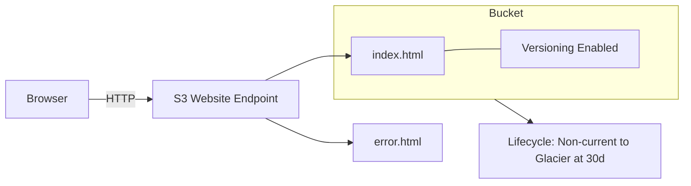

# S3 Website Hosting Lab - Portfolio Site with Versioning and Lifecycle

## Lab Goal
Deploy a public portfolio website on S3 with versioning enabled and a lifecycle rule to archive old versions after 30 days. Complete within 30 minutes, stay within Free Tier, region us-east-1.

## Problem Statement
- Host a static website on S3.
- Enable versioning for updates/rollback.
- Add lifecycle rule to transition non-current versions after 30 days to Glacier Flexible Retrieval.
- Ensure public read access for website assets.
- Deliver endpoint URL and show multiple versions exist.

## Constraints
- Region: us-east-1
- Budget: $0 (Free Tier: 5 GB storage, 20k GET, 2k PUT/month)
- Time: 30 minutes
- No CloudFront; use S3 website endpoint

## Architecture Overview



## Step-by-Step Execution

### 1) Create Bucket (5 min)
1. S3 → Create bucket.
2. Name: `portfolio-yourname-2025` (lowercase, hyphens).
3. Region: us-east-1.
4. Uncheck **Block all public access** → acknowledge warning (required for public site).
5. Create bucket.

### 2) Upload Website Files (5 min)
Create basic files locally:

`index.html`
```html
<!DOCTYPE html>
<html>
<head><title>Portfolio</title></head>
<body>
  <h1>Your Name</h1>
  <p>Projects, skills, and contact links.</p>
</body>
</html>
```

`error.html`
```html
<!DOCTYPE html>
<html>
<head><title>404</title></head>
<body><h1>Page not found</h1></body>
</html>
```

Upload via console: Bucket → **Upload** → add both files → **Upload**.

### 3) Enable Static Website Hosting (3 min)
- Bucket → **Properties** → Static website hosting → Enable.
- Index document: `index.html`; Error document: `error.html` → Save.
- Note endpoint (example): `http://portfolio-yourname-2025.s3-website-us-east-1.amazonaws.com`.

### 4) Configure Bucket Policy (Public Read) (5 min)
- Bucket → **Permissions** → **Bucket policy** → Edit → paste:
```json
{
  "Version": "2012-10-17",
  "Statement": [{
    "Sid": "PublicReadGetObject",
    "Effect": "Allow",
    "Principal": "*",
    "Action": "s3:GetObject",
    "Resource": "arn:aws:s3:::portfolio-yourname-2025/*"
  }]
}
```
- Save and confirm no errors.

### 5) Enable Versioning (2 min)
- Bucket → **Properties** → **Versioning** → Enable → Save.

### 6) Create Lifecycle Rule (5 min)
- Bucket → **Management** → **Lifecycle rules** → Create rule.
- Name: `archive-noncurrent-30d`.
- Scope: Apply to whole bucket.
- Transitions: Non-current versions → Glacier Flexible Retrieval after 30 days.
- (Optional) Abort incomplete multipart uploads after 7 days.
- Save (Status = Enabled).

### 7) Test Website and Versions (5 min)
- Open endpoint URL in browser; ensure page renders.
- Modify `index.html` locally (add another line), upload again (same key) to create new version.
- In bucket → **List versions** to confirm multiple versions exist.
- Test 404 by visiting `/not-found.html` to see custom error page.

## AWS CLI Reference

```bash
REGION=us-east-1
BUCKET=portfolio-yourname-2025

# Create bucket
aws s3 mb s3://$BUCKET --region $REGION

# Upload site
aws s3 sync ./website s3://$BUCKET/

# Configure website
aws s3 website s3://$BUCKET/ --index-document index.html --error-document error.html

# Apply bucket policy
cat > policy.json <<EOF
{
  "Version": "2012-10-17",
  "Statement": [{
    "Sid": "PublicReadGetObject",
    "Effect": "Allow",
    "Principal": "*",
    "Action": "s3:GetObject",
    "Resource": "arn:aws:s3:::$BUCKET/*"
  }]
}
EOF
aws s3api put-bucket-policy --bucket $BUCKET --policy file://policy.json

# Enable versioning
aws s3api put-bucket-versioning \
  --bucket $BUCKET \
  --versioning-configuration Status=Enabled

# Lifecycle rule (non-current to Glacier at 30d)
cat > lifecycle.json <<'EOF'
{
  "Rules": [{
    "ID": "ArchiveNonCurrent30d",
    "Status": "Enabled",
    "Filter": {"Prefix": ""},
    "NoncurrentVersionTransitions": [{
      "NoncurrentDays": 30,
      "StorageClass": "GLACIER"
    }],
    "AbortIncompleteMultipartUpload": {
      "DaysAfterInitiation": 7
    }
  }]
}
EOF
aws s3api put-bucket-lifecycle-configuration \
  --bucket $BUCKET \
  --lifecycle-configuration file://lifecycle.json
```

## Python boto3 Snippet

```python
import json, boto3
bucket = 'portfolio-yourname-2025'
s3 = boto3.client('s3')

# Enable versioning
s3.put_bucket_versioning(
    Bucket=bucket,
    VersioningConfiguration={'Status': 'Enabled'}
)

# Apply lifecycle
rule = {
    "Rules": [{
        "ID": "ArchiveNonCurrent30d",
        "Status": "Enabled",
        "Filter": {"Prefix": ""},
        "NoncurrentVersionTransitions": [{
            "NoncurrentDays": 30,
            "StorageClass": "GLACIER"
        }]
    }]
}
s3.put_bucket_lifecycle_configuration(
    Bucket=bucket,
    LifecycleConfiguration=rule
)
```

## Verification Checklist

- [ ] Website endpoint loads index.html
- [ ] Custom error page works
- [ ] Versioning status = Enabled
- [ ] Multiple versions appear after re-upload
- [ ] Lifecycle rule status = Enabled and targets non-current versions at 30 days
- [ ] Bucket policy allows public read (`/*` correct)
- [ ] Block Public Access appropriately configured for public site
- [ ] Free Tier usage within limits (storage and requests)

## Common Mistakes

- Forgetting to disable Block Public Access for public hosting (causes 403).
- Missing `/*` in policy Resource (objects stay private).
- Wrong index document name.
- Not re-uploading to create a second version for verification.
- Lifecycle rule set on current versions instead of non-current.

## Troubleshooting

- **403 Forbidden**: Check BPA settings, bucket policy JSON, and correct bucket ARN.
- **404 Not Found**: Confirm `index.html` exists and path is correct.
- **No versions**: Ensure versioning was enabled *before* re-upload; check Versions toggle in console.
- **Lifecycle not applying**: Confirm rule Status=Enabled and object age meets transition days.

## Cleanup Steps

1. Empty bucket including all versions and delete markers:
```bash
aws s3api delete-objects --bucket $BUCKET --delete "$(aws s3api list-object-versions --bucket $BUCKET --output=json --query='{Objects: Versions[].{Key:Key,VersionId:VersionId}}')"
aws s3api delete-objects --bucket $BUCKET --delete "$(aws s3api list-object-versions --bucket $BUCKET --output=json --query='{Objects: DeleteMarkers[].{Key:Key,VersionId:VersionId}}')"
```
2. Delete bucket: `aws s3 rb s3://$BUCKET --force`
3. Verify no charges in billing after 24 hours.

## Expected Outcomes

- Public website available at S3 website endpoint.
- Versioning enabled with at least two versions of `index.html`.
- Lifecycle rule configured to transition non-current versions after 30 days.
- All tasks completed within 30 minutes using Free Tier allowances.
