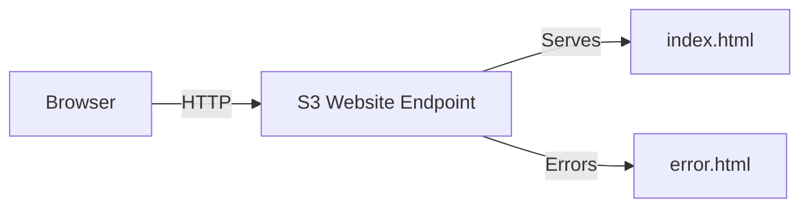

# Host a Static Website on S3

## Concept Overview

S3 can serve static websites directly from a bucket. It supports HTML, CSS, JS, images, and client-side assets. There is **no server-side code** (no PHP/Node). Use cases: portfolios, documentation, landing pages.

## Architecture Diagram



## Prerequisites

- Bucket name suitable for website: `my-portfolio-2025` (lowercase, hyphens).
- HTML files: `index.html`, `error.html`, plus assets (CSS/JS/images).
- Region chosen (e.g., us-east-1).

## Step-by-Step Implementation (Console)

1. **Create Bucket**
   - S3 → Create bucket → name `my-portfolio-2025` → Region `us-east-1`.
   - Uncheck **Block all public access** (for public website) and acknowledge.

2. **Upload Files**
   - Open bucket → **Upload** → add `index.html`, `error.html`, and asset folder → **Upload**.

3. **Enable Static Website Hosting**
   - Bucket → **Properties** tab.
   - **Static website hosting** → Edit → Enable.
   - Index document: `index.html`; Error document: `error.html` → Save.

4. **Bucket Policy for Public Read**
   - Bucket → **Permissions** tab → **Bucket policy** → Edit.
   - Paste public read policy (replace bucket name):
```json
{
  "Version": "2012-10-17",
  "Statement": [{
    "Sid": "PublicReadGetObject",
    "Effect": "Allow",
    "Principal": "*",
    "Action": "s3:GetObject",
    "Resource": "arn:aws:s3:::my-portfolio-2025/*"
  }]
}
```
   - Save.

5. **Test Website**
   - Get the endpoint from **Properties → Static website hosting**.
   - Example: `http://my-portfolio-2025.s3-website-us-east-1.amazonaws.com`.
   - Open in browser; verify index and custom 404.

## AWS CLI Commands

```bash
# Create bucket (public website requires BPA off via console or API)
aws s3 mb s3://my-portfolio-2025 --region us-east-1

# Upload content
aws s3 sync ./website s3://my-portfolio-2025/

# Configure website
aws s3 website s3://my-portfolio-2025/ \
  --index-document index.html \
  --error-document error.html

# Apply bucket policy
cat > policy.json <<'EOF'
{
  "Version": "2012-10-17",
  "Statement": [{
    "Sid": "PublicReadGetObject",
    "Effect": "Allow",
    "Principal": "*",
    "Action": "s3:GetObject",
    "Resource": "arn:aws:s3:::my-portfolio-2025/*"
  }]
}
EOF
aws s3api put-bucket-policy --bucket my-portfolio-2025 --policy file://policy.json
```

## Python boto3 Example

```python
import boto3, json
s3 = boto3.client('s3')
bucket = 'my-portfolio-2025'

# Upload a file
s3.upload_file('index.html', bucket, 'index.html', ExtraArgs={'ContentType': 'text/html'})

# Configure website
s3.put_bucket_website(
    Bucket=bucket,
    WebsiteConfiguration={
        'IndexDocument': {'Suffix': 'index.html'},
        'ErrorDocument': {'Key': 'error.html'}
    }
)

# Attach public read policy (after ensuring BPA is off intentionally)
policy = {
    "Version": "2012-10-17",
    "Statement": [{
        "Sid": "PublicReadGetObject",
        "Effect": "Allow",
        "Principal": "*",
        "Action": "s3:GetObject",
        "Resource": f"arn:aws:s3:::{bucket}/*"
    }]
}
s3.put_bucket_policy(Bucket=bucket, Policy=json.dumps(policy))
```

## Custom Domain (Brief)

- Register domain in Route 53.
- Create S3 bucket **named exactly the domain** (example.com) and enable website hosting.
- Point Route 53 A/AAAA records (Alias) to a CloudFront distribution fronting the S3 website for HTTPS.

## HTTPS with CloudFront (Brief)

- Create CloudFront distribution with S3 as origin (website or REST endpoint).
- Attach ACM certificate for the domain (in us-east-1 for global distributions).
- Benefit: HTTPS, caching, lower latency, geo-distribution.

## Verification Steps

- [ ] Bucket public access configured as intended (BPA off only if public site).
- [ ] Website endpoint loads index page.
- [ ] Custom 404 page works.
- [ ] Objects return HTTP 200 via curl.
- [ ] Policy includes `/*` and correct bucket name.

## Common Mistakes

- Leaving Block Public Access ON when needing a public site (403 errors).
- Wrong index document name (causes 403/404).
- Forgetting to set Content-Type for assets (CSS/JS served as binary).
- Missing `/*` in policy resource.
- Using HTTPS on website endpoint (only HTTP unless via CloudFront).

## Competition Tips

- Test in incognito to avoid cached errors.
- Validate every link/image after upload.
- Use short, lowercase bucket names to reduce typos.
- Keep assets small to stay within Free Tier and speed uploads.

## Free Tier Notes

- 5 GB Standard storage, 20,000 GET, 2,000 PUT per month for 12 months.
- Website traffic beyond Free Tier incurs data transfer and request charges; keep assets lean.

## Troubleshooting

- **403 Forbidden**: Check BPA, bucket policy, and object ACLs.
- **404 Not Found**: Confirm object key paths; ensure index.html exists at root.
- **Slow loads**: Compress images; consider CloudFront caching if allowed.

## Next Steps

- Apply versioning and lifecycle from [versioning_lifecycle.md](versioning_lifecycle.md).
- Practice full lab in [server_lab.md](server_lab.md).
