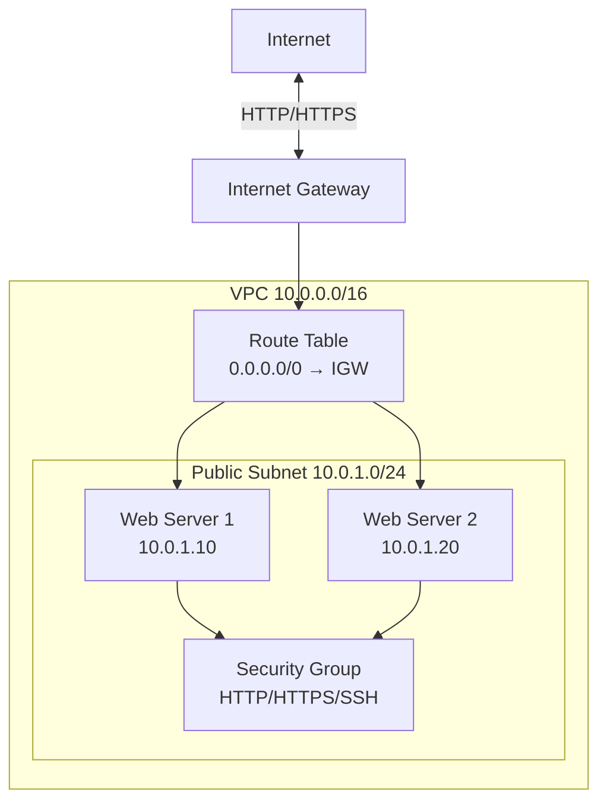
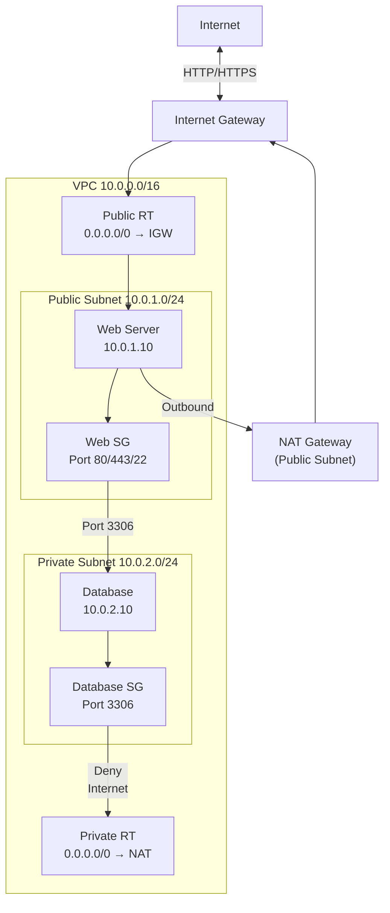
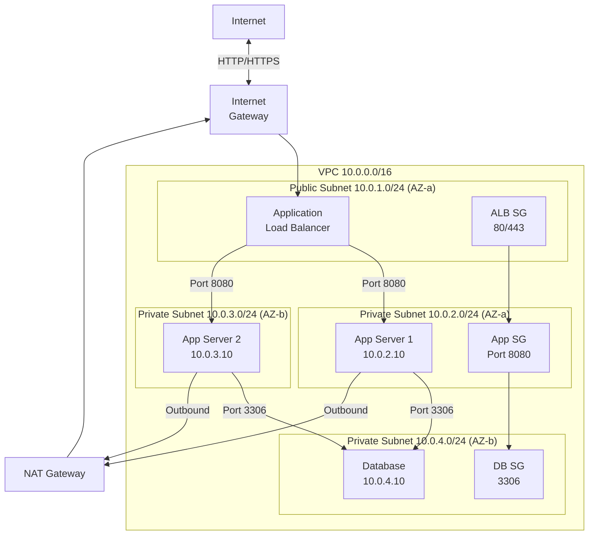
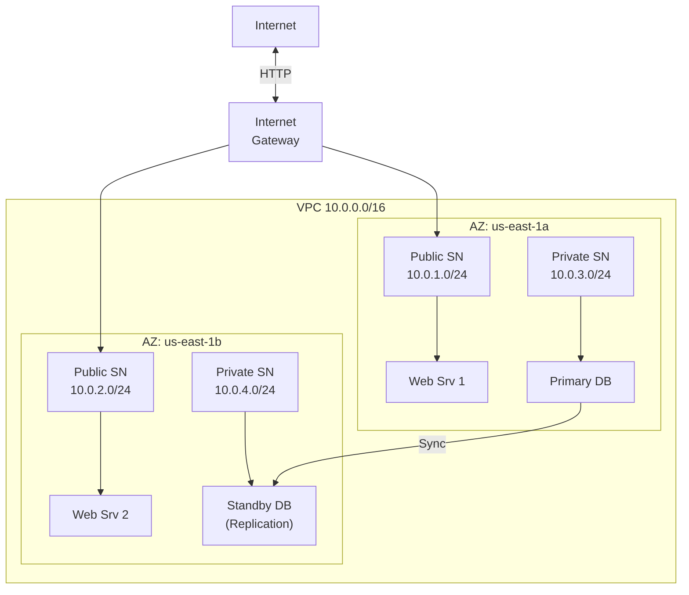
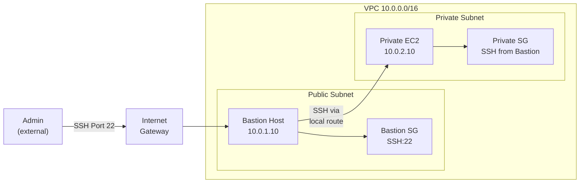
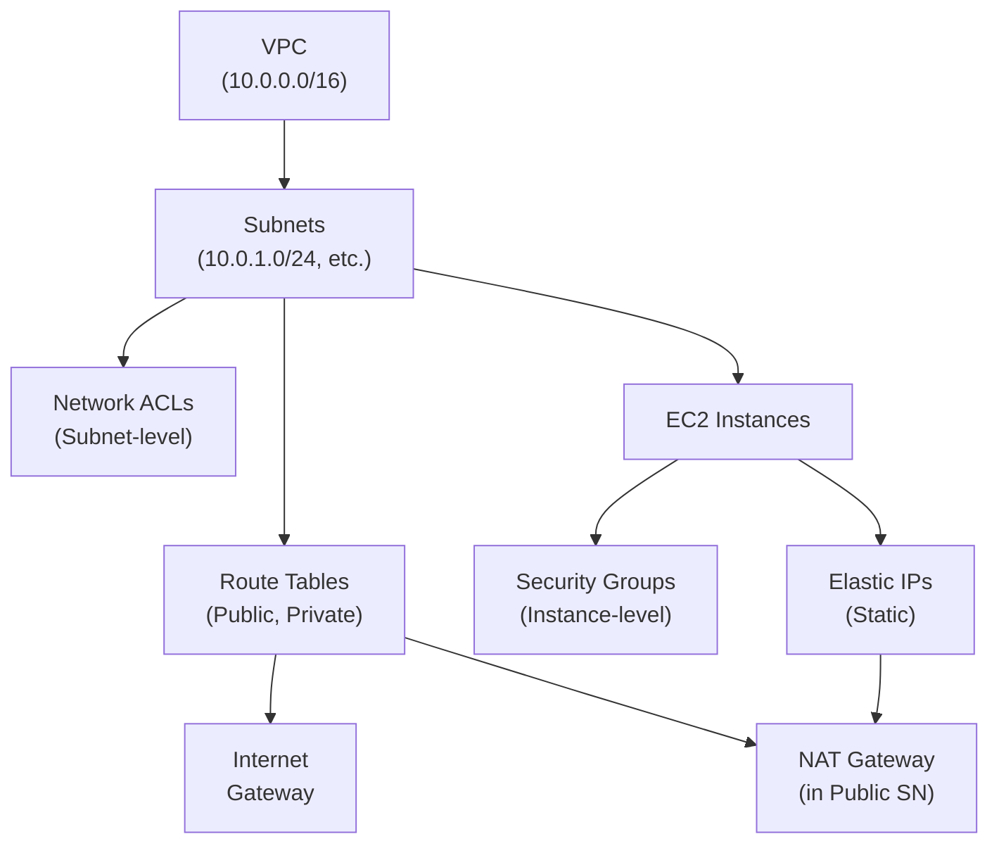
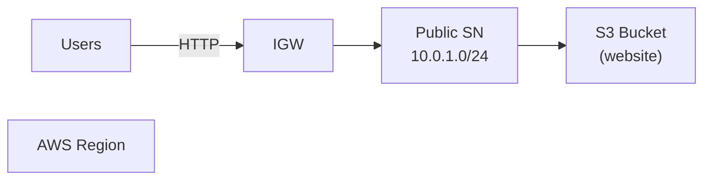
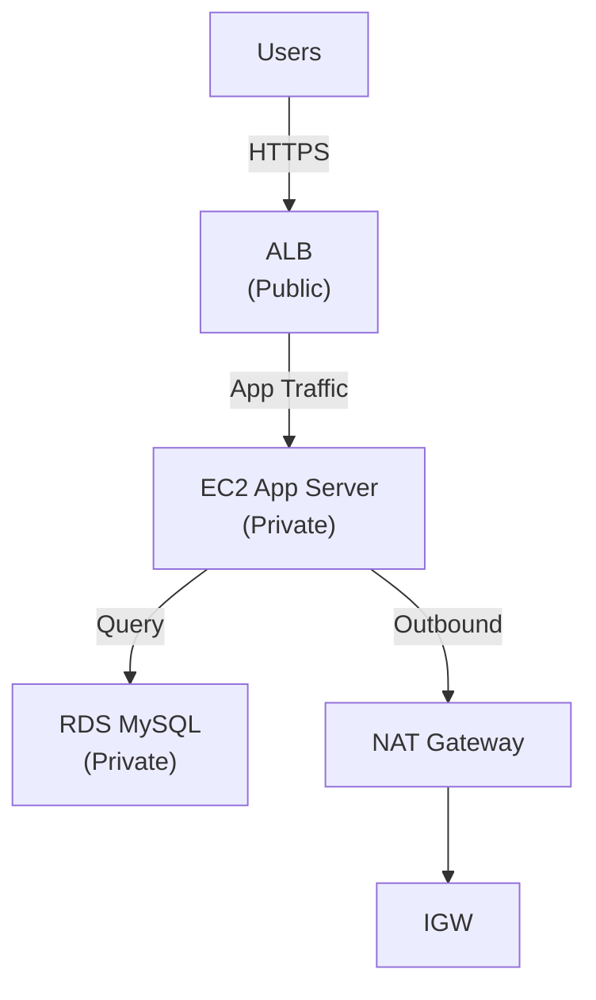
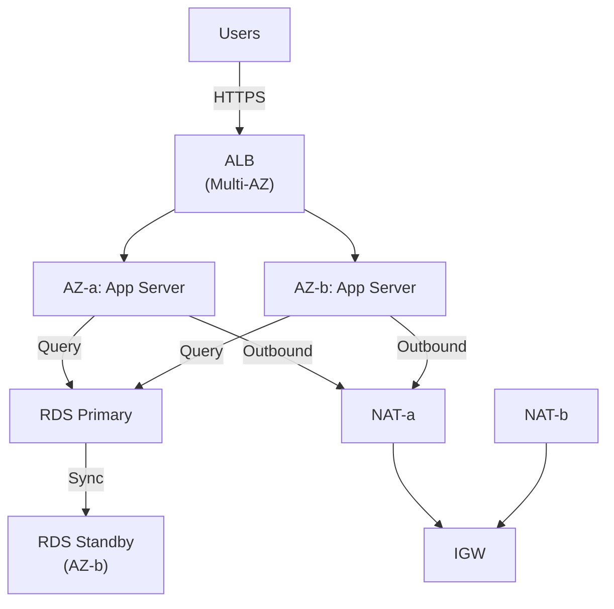

# VPC Architecture Patterns and Diagrams

## Single-Tier Architecture

Simple public subnet with web servers. Use for learning and simple applications.



**When to use**:
- Static websites
- Learning labs
- Temporary testing

**Limitations**:
- No database protection (everything public)
- Single AZ (no redundancy)
- Not production-ready

## Two-Tier Architecture

Public subnet (web) + private subnet (database). Standard for applications.



**When to use**:
- E-commerce sites (web + database)
- Web applications with backend
- Most production deployments

**Security**:
- Database not directly internet-accessible
- Web server accesses database over local route
- Web can reach internet via NAT for updates

## Three-Tier Architecture

Public (load balancer) + private (app servers) + private (database).



**When to use**:
- Enterprise applications
- High-traffic sites
- Multi-AZ for resilience
- Load-balanced services

**Security**:
- ALB only public tier
- App servers hidden behind ALB
- Database isolated
- Each tier has restrictive SG

## High Availability Pattern (Multi-AZ)

Replicate across multiple availability zones.



**When to use**:
- Production deployments
- Resilience to AZ failures
- Regional redundancy requirement

**Benefits**:
- Automatic failover
- Load distribution
- Database replication

## Bastion Host Pattern (Secure SSH Access)

Jump server in public subnet for SSH to private instances.



**When to use**:
- Accessing private instances without internet access
- Single entry point for security audits
- Privilege separation

**Security**:
- Bastion SG: SSH from admin IP only
- Private SG: SSH from Bastion SG only
- Private instances unreachable from internet

## Component Relationships (Dependency Diagram)



## Traffic Flow: Inbound Internet

Internet traffic to public instance:

```
1. Internet packet (destination: public IP)
2. IGW receives packet
3. Route table: check destination
4. If 0.0.0.0/0 → IGW: route to public subnet
5. NACL: if allow, pass to instance
6. Security Group: if allow, pass to instance
7. Instance receives packet on public NIC
8. Application processes
9. Return path: reverse (IGW → Internet)
```

## Traffic Flow: Outbound Internet (Private)

Private instance reaching internet via NAT:

```
1. EC2 (10.0.2.10) initiates connection (curl example.com)
2. Route table check: destination not in 10.0.0.0/16 local
3. 0.0.0.0/0 → NAT Gateway route matched
4. Traffic sent to NAT Gateway
5. NAT translates source IP to Elastic IP
6. IGW route: 0.0.0.0/0 → IGW
7. IGW sends to internet (source: NAT Elastic IP)
8. Return traffic: Internet → IGW (destination: NAT EIP)
9. NAT: reverse translation (destination: 10.0.2.10)
10. Return packet reaches EC2
```

## Inter-Subnet Communication

Local route (automatic in all subnets):

```
Source: 10.0.1.10 (public subnet)
Destination: 10.0.2.10 (private subnet)

Route table check:
- Destination 10.0.2.10 matches 10.0.0.0/16 (local)
- Target: local (direct subnet-to-subnet via local NIC)
- NACL: allow (if rules permit)
- SG: allow (if rules permit)
- Packet delivered
```

## WorldSkills Competition Architectures

### Scenario 1: Static Website



**Setup**: S3 website endpoint, CloudFront optional.

### Scenario 2: Web Application (2-Tier)



**Setup**: 1 public ALB, 1 private app EC2, 1 private RDS.

### Scenario 3: Secure Multi-AZ



**Setup**: Multi-AZ ALB, replicated app servers, RDS failover.

## Design Principles

1. **Least Privilege**: Allow only necessary traffic.
2. **Defense in Depth**: Layer security (NACL → SG → app firewall).
3. **High Availability**: Multi-AZ deployment.
4. **Separation of Concerns**: Tier isolation (web, app, database).
5. **Cost Optimization**: Minimize NAT, use free tier resources.
6. **Monitoring**: CloudWatch alarms on network metrics.

## Diagram Legend

| Symbol | Meaning |
|--------|---------|
| Rectangle | AWS service or component |
| Arrow → | Traffic or data flow |
| Dashed arrow ⇢ | Optional/secondary flow |
| **Bold text** | Critical components |
| Subgraph box | VPC, subnet, or AZ boundary |

## Next Steps

- [server_lab.md](server_lab.md): Build complete secure VPC from scratch.
