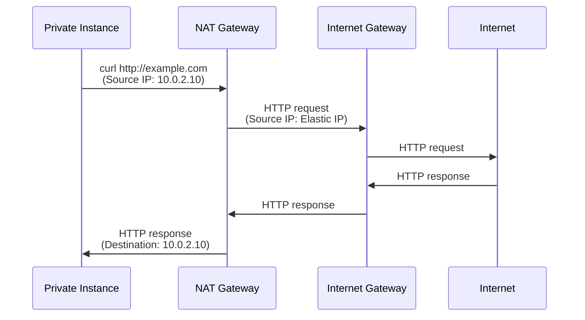

# Internet and NAT Gateway

## Internet Gateway (IGW)

**Purpose**: Enables instances in public subnets to connect to the internet and vice versa.

### Key Characteristics

- **One per VPC**: Only one IGW can be attached to a VPC.
- **Stateless**: Does not maintain connection state; symmetric (inbound = outbound).
- **Horizontally scaled**: AWS manages capacity automatically.
- **High availability**: Redundant across availability zones.
- **No charge**: Using an IGW is free.

### How It Works

1. Attach IGW to VPC.
2. Add route in public subnet's route table: `0.0.0.0/0 → IGW`.
3. Instance in public subnet with Elastic IP or public IP can now receive traffic from internet.
4. Return traffic automatically flows back through IGW.

## NAT Gateway

**Purpose**: Allows instances in private subnets to **initiate** outbound internet traffic while remaining unreachable from the internet.

### Key Characteristics

- **Managed service**: AWS handles scaling, patching, high availability.
- **Placed in public subnet**: Must be in a public subnet to reach IGW.
- **Requires Elastic IP**: Static IP address for outbound source.
- **Stateful**: Remembers outbound connections and routes return traffic correctly.
- **Cost**: $0.045/hour + $0.045/GB data processed (can be expensive if idle).
- **Horizontal scaling**: One NAT per AZ recommended for multi-AZ (cost trade-off).

### How It Works

1. Private instance initiates connection to internet (e.g., `curl http://example.com`).
2. Outbound traffic hits private subnet route: `0.0.0.0/0 → NAT Gateway`.
3. NAT translates source IP to NAT Gateway's Elastic IP.
4. Traffic goes through IGW to internet.
5. Return traffic arrives at NAT Gateway (via Elastic IP).
6. NAT translates back to private instance IP and routes to private subnet.

## NAT Gateway vs NAT Instance (Comparison)

| Aspect | NAT Gateway | NAT Instance |
|--------|------------|--------------|
| **Management** | AWS-managed | Self-managed EC2 |
| **Performance** | High (up to 100 Gbps) | Lower (limited by instance type) |
| **Availability** | High; auto-failover | Manual failover required |
| **Scaling** | Auto | Manual (larger instance) |
| **Cost** | $0.045/hour + $0.045/GB | EC2 compute + data transfer |
| **Effort** | Setup once | Ongoing maintenance |
| **Recommendation** | **Best for most cases** | Only if cost-critical and can monitor |

**For WorldSkills competitions**: Use NAT Gateway (managed, less overhead).

## Architecture Pattern: NAT Gateway



## Routing Configuration

### Public Subnet Route Table

```
Destination    | Target
10.0.0.0/16    | local
0.0.0.0/0      | igw-xxx
```

**Effect**: Instances get public IPs; internet traffic flows directly via IGW.

### Private Subnet Route Table

```
Destination    | Target
10.0.0.0/16    | local
0.0.0.0/0      | nat-xxx (NAT Gateway in public subnet)
```

**Effect**: Instances have no public IP; all internet traffic goes through NAT.

## AWS Console Steps (IGW and NAT)

### Create and Attach Internet Gateway

1. VPC Dashboard → Internet Gateways → Create internet gateway.
2. Name: `main-igw`.
3. Create.
4. Select the IGW → Attach to VPC → choose your VPC → Attach.
5. Status changes to "Attached".

### Create NAT Gateway

1. VPC Dashboard → NAT Gateways → Create NAT gateway.
2. Subnet: choose your **public subnet** (e.g., `10.0.1.0/24`).
3. Elastic IP allocation: Click "Allocate Elastic IP" → Allocate.
4. Create NAT gateway.
5. Wait for status to change to "Available" (2-3 minutes).

## AWS CLI Commands

```bash
VPC_ID="vpc-xxxxx"
PUBLIC_SUBNET_ID="subnet-xxxxx"
IGW_ID="igw-xxxxx"

# Create Internet Gateway
IGW_ID=$(aws ec2 create-internet-gateway \
  --query 'InternetGateway.InternetGatewayId' \
  --output text)

# Attach to VPC
aws ec2 attach-internet-gateway \
  --internet-gateway-id $IGW_ID \
  --vpc-id $VPC_ID

# Allocate Elastic IP for NAT Gateway
ALLOC_ID=$(aws ec2 allocate-address \
  --domain vpc \
  --query 'AllocationId' \
  --output text)

# Create NAT Gateway
NAT_GW=$(aws ec2 create-nat-gateway \
  --subnet-id $PUBLIC_SUBNET_ID \
  --allocation-id $ALLOC_ID \
  --query 'NatGateway.NatGatewayId' \
  --output text)

# Wait for available (takes ~2 min)
aws ec2 wait nat-gateway-available --nat-gateway-ids $NAT_GW

# Add route to private route table
aws ec2 create-route \
  --route-table-id rtb-xxxxx \
  --destination-cidr-block 0.0.0.0/0 \
  --nat-gateway-id $NAT_GW
```

## Python boto3 Example

```python
import boto3
import time

ec2 = boto3.client('ec2')

vpc_id = 'vpc-xxxxx'
public_subnet_id = 'subnet-xxxxx'

# Create IGW
igw = ec2.create_internet_gateway()
igw_id = igw['InternetGateway']['InternetGatewayId']

# Attach to VPC
ec2.attach_internet_gateway(InternetGatewayId=igw_id, VpcId=vpc_id)

# Allocate Elastic IP
eip = ec2.allocate_address(Domain='vpc')
alloc_id = eip['AllocationId']

# Create NAT Gateway
nat = ec2.create_nat_gateway(SubnetId=public_subnet_id, AllocationId=alloc_id)
nat_id = nat['NatGateway']['NatGatewayId']

# Wait for available
while True:
    status = ec2.describe_nat_gateways(NatGatewayIds=[nat_id])['NatGateways'][0]['State']
    if status == 'available':
        print(f"NAT Gateway {nat_id} is available")
        break
    print(f"Status: {status}... waiting")
    time.sleep(10)
```

## Cost Optimization Strategy

**For State-Level Competitions**:
- Use **single NAT Gateway** in one public subnet.
- Stop the NAT Gateway when not actively testing (saves ~$1/day).
- Delete NAT Gateway and release Elastic IP when done (immediate cost savings).

**Multi-AZ Production** (high cost):
- Deploy NAT Gateway in each AZ for resilience.
- Cost: $0.045/hour × 2 × 24 × 30 = ~$65/month (significant).

**Avoid High Data Transfer**:
- Keep compute resources in the same region as data.
- Use S3 VPC endpoint to avoid data transfer charges for S3 access.

## Verification Steps

- [ ] IGW created and attached to VPC (status = Attached)
- [ ] NAT Gateway created in public subnet (status = Available)
- [ ] Elastic IP allocated and associated with NAT Gateway
- [ ] Public route table has route: 0.0.0.0/0 → IGW
- [ ] Private route table has route: 0.0.0.0/0 → NAT Gateway
- [ ] Test from public instance: `curl http://checkip.amazonaws.com` (returns public IP)
- [ ] Test from private instance: `curl http://checkip.amazonaws.com` (returns NAT Gateway's Elastic IP, not private IP)

## Common Mistakes

- **NAT Gateway in private subnet**: Must be in public subnet to reach IGW. Result: Private instances still can't reach internet.
- **Forgetting Elastic IP**: NAT Gateway requires one; attaching NAT without EIP fails.
- **Wrong route table**: Private subnet route table still points to non-existent NAT (or missing route). Result: 504 timeout or connection refused.
- **Not waiting for NAT to be available**: Trying to use NAT Gateway before it's ready. Result: route table route appears to work, but traffic is dropped.
- **Leaving NAT running idle**: Costs money even if no traffic. Best practice: Delete after testing.

## Troubleshooting

- **Private instance can't reach internet**: Check route table (should have 0.0.0.0/0 → NAT Gateway).
- **NAT Gateway stuck "pending"**: Usually takes 2-3 minutes; wait longer.
- **Connection times out from private instance**: Verify NAT Gateway is "Available" and Elastic IP is associated.
- **Public instance can't reach internet**: Check IGW attached and route table has 0.0.0.0/0 → IGW.

## Next Steps

- [security_nacl_vs_sg.md](security_nacl_vs_sg.md): Add security rules at network and instance levels.
- [server_lab.md](server_lab.md): Implement complete VPC with IGW and NAT.
