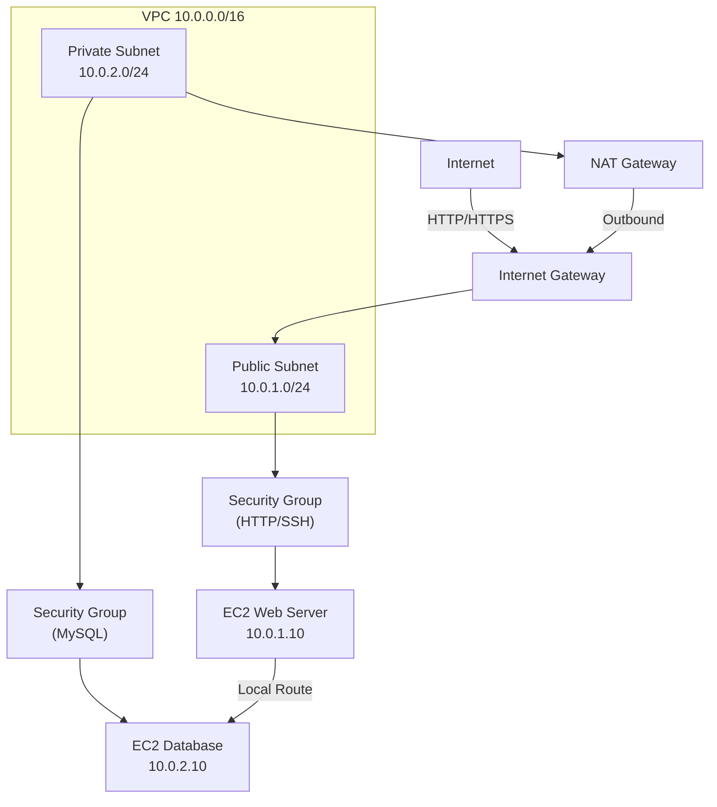

# Amazon VPC - Virtual Private Cloud Overview

## What is a VPC?

Amazon Virtual Private Cloud (VPC) is a **logically isolated network environment** within AWS where you launch resources. It's software-defined networking: you define the IP address range, subnets, routing, gateways, and security.

- **Isolated**: Your VPC is separate from other customers' networks.
- **Customizable**: You control all networking components.
- **Scalable**: Add subnets, instances, and gateways as needed.
- **Default VPC**: AWS provides one per region; safe for beginners.
- **Custom VPC**: Build exactly what you need.

## VPC vs Traditional Networking

| Aspect | Physical Datacenter | AWS VPC |
|--------|-------------------|---------|
| **Setup Time** | Weeks/months | Minutes |
| **Hardware** | Physical switches, routers | Software-defined |
| **Scaling** | Buy new equipment | Add subnets instantly |
| **Security** | Physical locks, firewalls | Security groups, NACLs |
| **Cost** | High upfront capital | Pay-as-you-go |
| **Control** | Full control but complex | Simple, intuitive API |
| **Networking** | Manual IP planning | Automated IP management |

## Key Concepts

### CIDR Notation

**CIDR** (Classless Inter-Domain Routing) defines IP ranges:
- `10.0.0.0/16` = 10.0.0.0 to 10.0.255.255 (65,536 addresses)
- `10.0.1.0/24` = 10.0.1.0 to 10.0.1.255 (256 addresses)
- `/24` = 24 bits for network, 8 bits for hosts

**RFC 1918 Private Ranges** (safe for internal networks):
- `10.0.0.0/8` (16 million addresses)
- `172.16.0.0/12` (1 million addresses)
- `192.168.0.0/16` (65k addresses)

### Default VPC vs Custom VPC

| Feature | Default VPC | Custom VPC |
|---------|-------------|-----------|
| **Auto-created** | Yes (per region) | Manual creation |
| **CIDR** | 172.31.0.0/16 (fixed) | You choose |
| **Public Subnets** | Enabled by default | You configure |
| **Internet Gateway** | Auto-attached | You attach |
| **DNS** | Enabled | You enable |
| **Use Case** | Learning, testing | Production |
| **Recommendation** | Quick start | For competitions |

## VPC Components

| Component | Purpose |
|-----------|---------|
| **Subnet** | Subdivision of VPC CIDR; lives in one AZ |
| **Route Table** | Rules for routing traffic; directs packets to destinations |
| **Internet Gateway** | Enables internet access for public subnets |
| **NAT Gateway** | Allows private subnets to access internet (outbound) |
| **Security Group** | Virtual firewall at instance level; stateful |
| **NACL** | Network ACL; subnet-level firewall; stateless |
| **Elastic IP** | Static public IP for instances |
| **VPC Endpoint** | Private connection to AWS services (no internet) |

## VPC Architecture Diagram



## Use Cases for WorldSkills Competitions

- **Secure application hosting**: Web tier public, database tier private.
- **Multi-tier architectures**: Load balancer, application servers, database layer.
- **Isolated environments**: Dev/staging/prod VPCs separated by security groups.
- **On-premises connectivity**: VPN to corporate network (advanced).

## Free Tier Considerations

- **VPC itself**: Free.
- **Subnets**: Free.
- **Route tables, security groups, NACLs**: Free.
- **Internet Gateway**: Free.
- **NAT Gateway**: **$0.045/hour** + $0.045/GB data → ~$1/day (costs accumulate; stop when not testing).
- **Elastic IP**: Free when attached to running instance; $0.005/hour if detached.
- **Data transfer out**: First 15 GB free per month; then $0.09/GB.

## AWS Console Navigation

1. Sign in to AWS Console.
2. Search for "VPC" in top search bar.
3. Click **VPC** (Virtual Private Cloud).
4. Dashboard shows:
   - Your VPCs (default + custom)
   - Subnets
   - Route Tables
   - Security Groups
   - Internet Gateways

**Quick Links**:
- **VPCs**: View, create custom, delete.
- **Subnets**: Create, edit, associate with route tables.
- **Route Tables**: Manage routes, associate with subnets.
- **Internet Gateways**: Create, attach/detach from VPCs.
- **NAT Gateways**: Create, allocate Elastic IPs, monitor usage.
- **Security Groups**: Manage inbound/outbound rules.
- **NACLs**: Manage subnet-level rules.

## AWS CLI Quick Commands

```bash
# Create custom VPC
aws ec2 create-vpc --cidr-block 10.0.0.0/16 --region us-east-1

# List VPCs
aws ec2 describe-vpcs

# Get VPC ID
VPC_ID=$(aws ec2 describe-vpcs --filters "Name=cidr,Values=10.0.0.0/16" --query 'Vpcs[0].VpcId' --output text)

# Delete VPC (all subnets/gateways must be removed first)
aws ec2 delete-vpc --vpc-id $VPC_ID
```

## Python boto3 Basics

```python
import boto3

ec2 = boto3.client('ec2', region_name='us-east-1')

# Create VPC
response = ec2.create_vpc(CidrBlock='10.0.0.0/16')
vpc_id = response['Vpc']['VpcId']
print(f"Created VPC: {vpc_id}")

# List VPCs
vpcs = ec2.describe_vpcs()
for vpc in vpcs['Vpcs']:
    print(f"{vpc['VpcId']}: {vpc['CidrBlock']}")
```

## Competition Tips

- Start with the default VPC to save time; only create custom VPC if task explicitly requires it.
- Use 10.0.0.0/16 for custom VPC (large, familiar).
- Plan subnet sizes early to avoid CIDR conflicts.
- Document your VPC CIDR, subnets, and gateway attachments (required in competition submission).
- Test connectivity before submission: SSH works, web servers respond, private instances unreachable.

## Common Mistakes

- Overlapping CIDR blocks (e.g., 10.0.0.0/16 and 10.0.1.0/16 overlap).
- Forgetting to enable DNS resolution (web servers won't resolve domain names).
- NAT Gateway in private subnet instead of public.
- Security groups too restrictive (all denied by default; must explicitly allow).
- Not waiting for NAT Gateway to reach "available" status.

## Verification Checklist

- [ ] VPC created with correct CIDR block
- [ ] DNS resolution and DNS hostnames enabled
- [ ] Subnets created in different AZs
- [ ] Route tables configured (public → IGW, private → NAT)
- [ ] Internet Gateway attached to VPC
- [ ] NAT Gateway in available state
- [ ] Security groups have appropriate rules
- [ ] Elastic IP allocated for NAT Gateway
- [ ] No overlapping CIDR ranges

## Next Steps

- [subnets_route_tables.md](subnets_route_tables.md): Deep dive into subnet design and routing.
- [internet_nat_gateway.md](internet_nat_gateway.md): Configure internet connectivity.
- [security_nacl_vs_sg.md](security_nacl_vs_sg.md): Understand network security layers.
- [architecture_diagram.md](architecture_diagram.md): Visualize VPC patterns.
- [server_lab.md](server_lab.md): Hands-on lab building a complete VPC.
