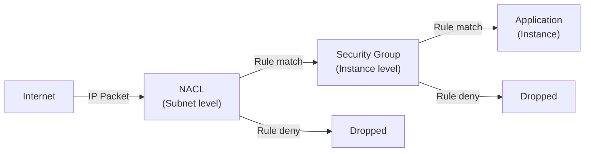

# Network Security: NACLs vs Security Groups

## Security Groups (SG)

A **security group** is a **stateful, instance-level** virtual firewall.

### Key Characteristics

- **Scope**: Instance level (attach to individual EC2s, Lambda, RDS, ALB).
- **Statefulness**: Remember connections; return traffic automatically allowed.
- **Rules**: Allow rules only; no explicit deny (default deny all).
- **Direction**: Separate inbound and outbound rules.
- **Multiple SGs**: An instance can have multiple security groups (all rules combined).
- **Modification**: Changes take effect immediately.

### SG Default Behavior

| Direction | Default |
|-----------|---------|
| **Inbound** | Deny all (unless explicitly allowed) |
| **Outbound** | Allow all |

### SG Rule Evaluation

All inbound/outbound rules are evaluated:
- **Match any rule**: Traffic is allowed.
- **No match**: Traffic is denied.
- **Most permissive wins**: If any rule allows, traffic passes.

## Network ACLs (NACL)

A **network ACL** is a **stateless, subnet-level** firewall.

### Key Characteristics

- **Scope**: Subnet level (all instances in subnet follow same NACL).
- **Statefulness**: Stateless; must explicitly allow return traffic.
- **Rules**: Allow and deny rules.
- **Rule evaluation**: Numbered rules evaluated in order; first match wins.
- **Default NACL**: Associated with all subnets by default (allows all traffic).
- **Custom NACL**: Can replace default with stricter rules.

### NACL Rule Numbers

Rules are numbered (100, 200, 300, etc., incrementing by 100). AWS evaluates rules in order:

| Rule # | Type | Protocol | Port | Source | Action |
|--------|------|----------|------|--------|--------|
| 100 | Inbound | TCP | 80 | 0.0.0.0/0 | ALLOW |
| 200 | Inbound | TCP | 443 | 0.0.0.0/0 | ALLOW |
| 300 | Inbound | TCP | 22 | 10.0.0.0/8 | ALLOW |
| 32767 | Inbound | ALL | ALL | 0.0.0.0/0 | DENY (default) |

First matching rule wins. Rules 101-99 skip (reserved). Rule 32767 is implicit deny-all.

### NACL Statelessness

| Direction | Required |
|-----------|----------|
| **Inbound** | Explicitly allow incoming traffic |
| **Outbound** | Explicitly allow outgoing traffic (including return traffic) |

**Example**: Allow inbound SSH (port 22):
- Inbound rule: Allow TCP 22 from 0.0.0.0/0.
- Outbound rule: Allow TCP 1024-65535 (ephemeral ports) to 0.0.0.0/0 (for return traffic).

## Security Groups vs NACLs: Comprehensive Comparison

| Aspect | Security Group | NACL |
|--------|----------------|------|
| **Scope** | Instance level | Subnet level |
| **Stateful** | Yes; remembers connections | No; must explicitly allow returns |
| **Rule Types** | Allow only | Allow and Deny |
| **Rule Evaluation** | All rules checked; most permissive wins | Rules in order; first match wins |
| **Rule Numbers** | No numbers; rule order arbitrary | Numbered (100, 200, ...); evaluated in order |
| **Modification Impact** | Takes effect immediately | Takes effect immediately |
| **Instance Count** | 1 instance = 1+ SGs | 1 subnet = 1 NACL (all instances) |
| **Portability** | Move SG between instances/subnets | NACL tied to subnet; can replace |
| **Performance** | Slight overhead per rule | Minimal overhead (single packet check) |
| **Ease of Use** | Simpler for most scenarios | More complex; powerful for subnet-level blocks |
| **Default** | Deny all inbound, allow all outbound | Allow all (default NACL) |
| **Common Use** | Day-to-day access control | Block specific IPs/subnets, enforce corporate policy |
| **Recommendation** | Use for instance-level access control | Use for subnet-level blocking only |

## Defense in Depth Strategy

Layered security: NACL → Security Group → Instance



Even if NACL allows, SG can still block. Even if SG allows, application firewall can block.

## Common Configuration Patterns

### Web Server Security Group

```
Inbound Rules:
- TCP 80 (HTTP) from 0.0.0.0/0
- TCP 443 (HTTPS) from 0.0.0.0/0
- TCP 22 (SSH) from 10.0.0.0/8 (admin IP range)

Outbound Rules:
- All traffic (default)
```

### Database Security Group

```
Inbound Rules:
- TCP 3306 (MySQL) from web-server-sg only
- (Don't allow from 0.0.0.0/0 to prevent internet access)

Outbound Rules:
- All traffic (default) to allow replication/backups
```

### NACL: Block Specific IP Range

```
Inbound:
- Rule 100: Allow TCP 22 from 0.0.0.0/0
- Rule 200: Deny TCP 22 from 203.0.113.0/24 (block malicious range)
- Rule 300: Allow TCP 80 from 0.0.0.0/0
- Rule 32767: Deny all (default)

Outbound:
- Rule 100: Allow all traffic to 0.0.0.0/0
- Rule 32767: Deny all (default)
```

## Hands-on: Create and Modify Security Groups

### Console: Create Security Group

1. VPC → Security Groups → Create security group.
2. Name: `web-server-sg`.
3. VPC: Your VPC.
4. Inbound rules:
   - Add rule → Type: HTTP → Source: 0.0.0.0/0.
   - Add rule → Type: HTTPS → Source: 0.0.0.0/0.
   - Add rule → Type: SSH → Source: 10.0.0.0/8.
5. Outbound rules: Leave default (all traffic).
6. Create security group.

### CLI: Create and Modify Security Group

```bash
VPC_ID="vpc-xxxxx"

# Create security group
SG_ID=$(aws ec2 create-security-group \
  --group-name web-server-sg \
  --description "Web server security group" \
  --vpc-id $VPC_ID \
  --query 'GroupId' \
  --output text)

# Add inbound rule: HTTP
aws ec2 authorize-security-group-ingress \
  --group-id $SG_ID \
  --protocol tcp \
  --port 80 \
  --cidr 0.0.0.0/0

# Add inbound rule: SSH from admin range
aws ec2 authorize-security-group-ingress \
  --group-id $SG_ID \
  --protocol tcp \
  --port 22 \
  --cidr 10.0.0.0/8
```

## Hands-on: Create and Modify NACLs

### Console: Create NACL

1. VPC → NACLs → Create network ACL.
2. Name: `custom-nacl`.
3. VPC: Your VPC.
4. Create.
5. Select NACL → Inbound rules → Edit:
   - Rule 100: TCP 22 from 0.0.0.0/0, Allow.
   - Rule 200: TCP 80 from 0.0.0.0/0, Allow.
6. Outbound rules → Edit:
   - Rule 100: All traffic to 0.0.0.0/0, Allow.
7. Associate with subnet: Select NACL → Subnet associations → Edit → select subnet.

### CLI: Create and Modify NACL

```bash
VPC_ID="vpc-xxxxx"
SUBNET_ID="subnet-xxxxx"

# Create custom NACL
NACL_ID=$(aws ec2 create-network-acl \
  --vpc-id $VPC_ID \
  --query 'NetworkAcl.NetworkAclId' \
  --output text)

# Add inbound rule: SSH
aws ec2 create-network-acl-entry \
  --network-acl-id $NACL_ID \
  --rule-number 100 \
  --protocol tcp \
  --port-range From=22,To=22 \
  --cidr-block 0.0.0.0/0 \
  --ingress

# Add inbound rule: HTTP
aws ec2 create-network-acl-entry \
  --network-acl-id $NACL_ID \
  --rule-number 200 \
  --protocol tcp \
  --port-range From=80,To=80 \
  --cidr-block 0.0.0.0/0 \
  --ingress

# Add outbound rule: All traffic
aws ec2 create-network-acl-entry \
  --network-acl-id $NACL_ID \
  --rule-number 100 \
  --protocol -1 \
  --cidr-block 0.0.0.0/0 \
  --egress

# Associate with subnet
aws ec2 associate-network-acl \
  --network-acl-id $NACL_ID \
  --subnet-id $SUBNET_ID
```

## Troubleshooting: Connection Issues

### Symptoms vs Cause

| Symptom | Likely Cause |
|---------|-------------|
| Connection refused | SG blocking, or application not running |
| Connection timeout | NACL or SG blocking, no response |
| All traffic works | Both NACL and SG allow all (verify rules) |
| Intermittent failures | Asymmetric rules (inbound allowed, outbound denied) |

### Debugging Checklist

- [ ] NACL inbound rule exists for traffic type.
- [ ] NACL outbound rule exists for return traffic (ephemeral ports).
- [ ] SG inbound rule exists for traffic type.
- [ ] SG outbound rule exists (usually default allow all).
- [ ] Rule numbers in correct order (NACLs).
- [ ] Source/destination IPs/CIDR blocks correct.
- [ ] Application firewall on instance not blocking.

## Competition Best Practices

- Use **Security Groups** for most access control (simpler, sufficient).
- Use **NACLs** only when you need subnet-level blocking (rare in competitions).
- **Principle of least privilege**: Allow only required ports from required IPs.
- **Document your rules**: Especially for submissions (required by judges).
- Test connectivity: SSH works, HTTP responds, unauthorized blocked.

## Verification Checklist

- [ ] Security groups created with appropriate inbound rules
- [ ] SSH allowed only from admin IP (not 0.0.0.0/0)
- [ ] Web ports (80/443) allowed from 0.0.0.0/0
- [ ] Database ports restricted to application SG only
- [ ] NACLs (if custom) have rules in correct order
- [ ] Instance can be pinged (if ICMP needed)
- [ ] Outbound internet access working (test with curl)

## Next Steps

- [architecture_diagram.md](architecture_diagram.md): Visualize complete architectures using SG and NACL patterns.
- [server_lab.md](server_lab.md): Build a full VPC with security configured.
