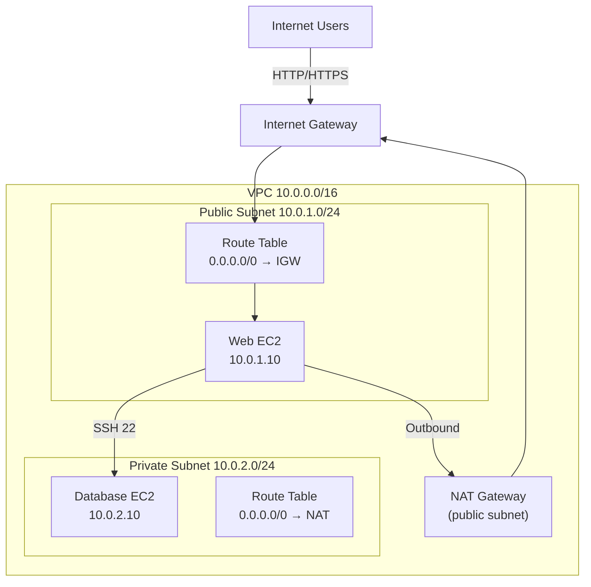

# VPC Server Lab: Build a Secure Multi-Tier Architecture

**Duration**: 45 minutes  
**Free Tier**: Partial (EC2 and EBS covered; NAT Gateway incurs charges)  
**Difficulty**: Intermediate  
**Skills**: VPC design, subnets, routing, security groups, NAT

## Problem Statement

You are a systems architect designing a secure web application infrastructure. Your company requires:

- **Requirement 1**: Public web tier with internet access (HTTP/HTTPS)
- **Requirement 2**: Private database tier without internet access
- **Requirement 3**: Ability to SSH into private instances via bastion host
- **Requirement 4**: Outbound internet access for private tier (updates, package downloads)
- **Requirement 5**: Cost tracking and Free Tier optimization

**Task**: Deploy a complete VPC (10.0.0.0/16) with public subnet (10.0.1.0/24), private subnet (10.0.2.0/24), internet connectivity, and security isolation. Verify all traffic flows and document the architecture.

**Need a beginner, click-by-click version?** Follow the practice walkthrough in ../practice/state_level/q1_vpc_cidr.md for console navigation, screenshot checkpoints, and verification scripts aligned to this lab.

## Architecture Diagram



## Step-by-Step Implementation

### Step 1: Create VPC (5 minutes)

#### AWS Console

1. **Open VPC Dashboard**: Navigate to VPC service
2. **Click "Your VPCs"** on left sidebar
3. **Click "Create VPC"** button (orange)
4. **Configuration**:
   - Name tag: `lab-vpc`
   - IPv4 CIDR: `10.0.0.0/16`
   - Tenancy: `Default`
5. **Click "Create VPC"**
6. **Verify**: Status changes from "Pending" to "Available"

**Key Points**:
- CIDR block 10.0.0.0/16 gives 65,536 usable IPs (256 subnets of /24)
- Region: Check you're in **us-east-1** (Free Tier region)
- Tenancy: "Default" for shared hardware (cheaper)

#### AWS CLI

```bash
# Create VPC
aws ec2 create-vpc \
  --cidr-block 10.0.0.0/16 \
  --tag-specifications 'ResourceType=vpc,Tags=[{Key=Name,Value=lab-vpc}]' \
  --region us-east-1

# Output: vpc-xxxxx (note this VPC ID)

# Enable DNS hostnames for VPC
aws ec2 modify-vpc-attribute \
  --vpc-id vpc-xxxxx \
  --enable-dns-hostnames \
  --region us-east-1
```

**Expected Output**:
```
{
    "Vpc": {
  "VpcId": "vpc-0a1b2c3d4e5f6g7h8",
        "CidrBlock": "10.0.0.0/16",
        "State": "available"
    }
}
```

#### Python Boto3

```python
import boto3

ec2 = boto3.client('ec2', region_name='us-east-1')

# Create VPC
response = ec2.create_vpc(
    CidrBlock='10.0.0.0/16',
    TagSpecifications=[
        {
            'ResourceType': 'vpc',
            'Tags': [{'Key': 'Name', 'Value': 'lab-vpc'}]
        }
    ]
)

vpc_id = response['Vpc']['VpcId']
print(f"Created VPC: {vpc_id}")

# Enable DNS hostnames
ec2.modify_vpc_attribute(
    VpcId=vpc_id,
    EnableDnsHostnames={'Value': True}
)

print(f"VPC {vpc_id} ready")
```

### Step 2: Create Subnets (5 minutes)

#### Public Subnet 10.0.1.0/24

**AWS Console**:
1. Click **"Subnets"** → **"Create subnet"**
2. **VPC ID**: Select `lab-vpc`
3. **Subnet settings**:
   - Subnet name: `lab-public-subnet`
   - Availability Zone: `us-east-1a`
   - IPv4 CIDR block: `10.0.1.0/24`
4. **Click "Create subnet"**
5. **Modify settings**: Click subnet → **"Edit subnet settings"**
   - ☑ Enable auto-assign public IPv4 address → **Save**

**AWS CLI**:

```bash
# Create public subnet
aws ec2 create-subnet \
  --vpc-id vpc-xxxxx \
  --cidr-block 10.0.1.0/24 \
  --availability-zone us-east-1a \
  --tag-specifications 'ResourceType=subnet,Tags=[{Key=Name,Value=lab-public-subnet}]' \
  --region us-east-1

# Enable auto-assign public IP
aws ec2 modify-subnet-attribute \
  --subnet-id subnet-xxxxx \
  --map-public-ip-on-launch \
  --region us-east-1
```

#### Private Subnet 10.0.2.0/24
**AWS Console**:
1. Click **"Subnets"** → **"Create subnet"**
2. **VPC ID**: Select `lab-vpc`
3. **Subnet settings**:
   - Subnet name: `lab-private-subnet`
   - Availability Zone: `us-east-1a`
   - IPv4 CIDR block: `10.0.2.0/24`
4. **Click "Create subnet"**
5. Confirm **auto-assign public IPv4** stays disabled (default)

**AWS CLI**:

```bash
# Create private subnet
aws ec2 create-subnet \
  --vpc-id vpc-xxxxx \
  --cidr-block 10.0.2.0/24 \
  --availability-zone us-east-1a \
  --tag-specifications 'ResourceType=subnet,Tags=[{Key=Name,Value=lab-private-subnet}]' \
  --region us-east-1
```

### Step 3: Create and Attach Internet Gateway (5 minutes)

#### AWS Console

1. Click **"Internet Gateways"** → **"Create internet gateway"**
2. Name tag: `lab-igw`
3. Click **"Create internet gateway"**
4. Select the IGW → **"Actions"** → **"Attach to VPC"**
5. **Select VPC**: `lab-vpc`
6. **Click "Attach internet gateway"**

**Verification**: State shows "Attached"

#### AWS CLI

```bash
# Create IGW
aws ec2 create-internet-gateway \
  --tag-specifications 'ResourceType=internet-gateway,Tags=[{Key=Name,Value=lab-igw}]' \
  --region us-east-1

# Output: igw-xxxxx

# Attach to VPC
aws ec2 attach-internet-gateway \
  --internet-gateway-id igw-xxxxx \
  --vpc-id vpc-xxxxx \
  --region us-east-1
```

### Step 4: Create NAT Gateway (10 minutes)

#### Step 4a: Allocate Elastic IP

**AWS Console**:
1. Navigate to **"Elastic IPs"** (under "Network & Security")
2. **Click "Allocate Elastic IP address"**
3. **Network Border Group**: `us-east-1` (default)
4. **Click "Allocate"**
5. **Copy the public IP**: e.g., `203.0.113.45`

**AWS CLI**:

```bash
# Allocate Elastic IP
aws ec2 allocate-address \
  --domain vpc \
  --region us-east-1

# Output: PublicIp (e.g., 203.0.113.45), AllocationId: eipalloc-xxxxx
```

#### Step 4b: Create NAT Gateway

**AWS Console**:
1. Navigate to **"NAT Gateways"** (under "Network & Security")
2. **Click "Create NAT gateway"**
3. **Configuration**:
   - Subnet: `lab-public-subnet` (10.0.1.0/24)
   - Elastic IP allocation ID: Select the EIP allocated above
   - Name tag: `lab-nat-gateway`
4. **Click "Create NAT gateway"**
5. **Wait for state**: "Available" (1-2 minutes)

**AWS CLI**:

```bash
# Create NAT Gateway in public subnet
aws ec2 create-nat-gateway \
  --subnet-id subnet-xxxxx \
  --allocation-id eipalloc-xxxxx \
  --tag-specifications 'ResourceType=nat-gateway,Tags=[{Key=Name,Value=lab-nat-gateway}]' \
  --region us-east-1

# Output: NatGatewayId (e.g., natgw-xxxxx)
```

**Cost Alert**: NAT Gateway is **NOT covered by Free Tier**. Pricing in us-east-1: **$0.045/hour + $0.045/GB**. For ~30 minutes and minimal data, expect **~$0.02**. Delete immediately after verification to stop hourly charges.

### Step 5: Configure Route Tables (10 minutes)
#### Public Route Table

**AWS Console**:
1. Navigate to **"Route Tables"**
2. **Find "Main" route table** for lab-vpc (right-click → Edit name): `lab-public-rt`
3. **Select it** → **"Routes"** tab
4. **Click "Edit routes"**
5. **Add route**:
   - Destination: `0.0.0.0/0`
   - Target: Select Internet Gateway → `lab-igw`
6. **Save routes**
7. **"Subnet associations"** tab → **"Edit subnet associations"**
   - ☑ Associate `lab-public-subnet`
   - **Save associations**

**Expected routes**:
| Destination | Target | Status |
|-------------|--------|--------|
| 10.0.0.0/16 | Local | Active |
| 0.0.0.0/0 | lab-igw | Active |

**AWS CLI**:

```bash
# Create public route table
aws ec2 create-route-table \
  --vpc-id vpc-xxxxx \
  --tag-specifications 'ResourceType=route-table,Tags=[{Key=Name,Value=lab-public-rt}]' \
  --region us-east-1

# Output: RouteTableId (e.g., rtb-xxxxx)

# Add route to IGW
aws ec2 create-route \
  --route-table-id rtb-xxxxx \
  --destination-cidr-block 0.0.0.0/0 \
  --gateway-id igw-xxxxx \
  --region us-east-1

# Associate public subnet
aws ec2 associate-route-table \
  --route-table-id rtb-xxxxx \
  --subnet-id subnet-xxxxx \
  --region us-east-1
```

#### Private Route Table

**AWS Console**:
1. **Create route table**:
   - VPC: `lab-vpc`
   - Name: `lab-private-rt`
2. **Select it** → **"Routes"** tab
3. **Add route**:
   - Destination: `0.0.0.0/0`
   - Target: NAT Gateway → Select `lab-nat-gateway`
4. **Save routes**
5. **"Subnet associations"** tab → Associate `lab-private-subnet`

**Expected routes**:
| Destination | Target | Status |
|-------------|--------|--------|
| 10.0.0.0/16 | Local | Active |
| 0.0.0.0/0 | natgw-xxxxx | Available |

**AWS CLI**:

```bash
# Create private route table
aws ec2 create-route-table \
  --vpc-id vpc-xxxxx \
  --tag-specifications 'ResourceType=route-table,Tags=[{Key=Name,Value=lab-private-rt}]' \
  --region us-east-1

# Add route to NAT Gateway
aws ec2 create-route \
  --route-table-id rtb-private \
  --destination-cidr-block 0.0.0.0/0 \
  --nat-gateway-id natgw-xxxxx \
  --region us-east-1

# Associate private subnet
aws ec2 associate-route-table \
  --route-table-id rtb-private \
  --subnet-id subnet-private \
  --region us-east-1
```

### Step 6: Create Security Groups (7 minutes)

#### Web Security Group

**AWS Console**:
1. Navigate to **"Security Groups"** → **"Create security group"**
2. **Configuration**:
   - Name: `lab-web-sg`
   - Description: `Web tier security group`
   - VPC: `lab-vpc`
3. **Inbound rules**:
   - Rule 1: Type: `HTTP`, Port: `80`, Source: `0.0.0.0/0`
   - Rule 2: Type: `HTTPS`, Port: `443`, Source: `0.0.0.0/0`
   - Rule 3: Type: `SSH`, Port: `22`, Source: `YOUR_ADMIN_IP/32` (your workstation public IP; **do not use 0.0.0.0/0**)
4. **Outbound rules**: Default (all traffic allowed)
5. **Click "Create security group"**
6. **Find your public IP**: e.g., via https://whatismyip.com and enter it as `YOUR_ADMIN_IP/32`
**AWS CLI**:

```bash
# Create SG
aws ec2 create-security-group \
  --group-name lab-web-sg \
  --description "Web tier security group" \
  --vpc-id vpc-xxxxx \
  --region us-east-1

# Output: GroupId (sg-xxxxx)

# Add inbound HTTP
aws ec2 authorize-security-group-ingress \
  --group-id sg-xxxxx \
  --protocol tcp \
  --port 80 \
  --cidr 0.0.0.0/0 \
  --region us-east-1

# Add inbound HTTPS
aws ec2 authorize-security-group-ingress \
  --group-id sg-xxxxx \
  --protocol tcp \
  --port 443 \
  --cidr 0.0.0.0/0 \
  --region us-east-1

# Add inbound SSH (RESTRICTED to admin IP)
aws ec2 authorize-security-group-ingress \
  --group-id sg-xxxxx \
  --protocol tcp \
  --port 22 \
  --cidr YOUR_ADMIN_IP/32 \
  --region us-east-1
# Replace YOUR_ADMIN_IP with your workstation public IP (e.g., 203.0.113.100/32)
```

#### Database Security Group

**AWS Console**:
1. **Create security group**:
   - Name: `lab-database-sg`
   - Description: `Database tier security group`
   - VPC: `lab-vpc`
2. **Inbound rules**:
   - Rule 1: Type: `MySQL/Aurora`, Port: `3306`, Source: `lab-web-sg` (web SG)
   - Rule 2: Type: `SSH`, Port: `22`, Source: `lab-web-sg` (SSH from web only)
3. **Outbound rules**: Default (all allowed)

**AWS CLI**:

```bash
# Create DB SG
aws ec2 create-security-group \
  --group-name lab-database-sg \
  --description "Database tier security group" \
  --vpc-id vpc-xxxxx \
  --region us-east-1

# Output: sg-db-xxxxx

# Allow MySQL from web SG
aws ec2 authorize-security-group-ingress \
  --group-id sg-db-xxxxx \
  --protocol tcp \
  --port 3306 \
  --source-group sg-web-xxxxx \
  --region us-east-1

# Allow SSH from web SG (bastion pattern)
aws ec2 authorize-security-group-ingress \
  --group-id sg-db-xxxxx \
  --protocol tcp \
  --port 22 \
  --source-group sg-web-xxxxx \
  --region us-east-1
```

### Step 7: Launch EC2 Instances (8 minutes)

#### Public Web Instance

**AWS Console**:
1. Navigate to **EC2** → **Instances** → **Launch instances**
2. **Step 1 - Name and OS**:
   - Name: `lab-web-server`
   - AMI: `Amazon Linux 2023 AMI` (Free Tier eligible)
3. **Step 2 - Instance type**:
  - Instance type: `t2.micro` (Free Tier default)
4. **Step 3 - Key pair**:
   - Key pair name: Create new or select existing (e.g., `lab-key`)
   - If new: Download and save `lab-key.pem` to safe location
5. **Step 4 - Network settings**:
   - VPC: `lab-vpc`
   - Subnet: `lab-public-subnet`
   - Auto-assign public IP: Enable
   - Security group: `lab-web-sg`
6. **Step 5 - Storage**: Default (8GB)
7. **Step 6 - Advanced**: Leave defaults
8. **Click "Launch instances"**
9. **Wait for state**: "Running" (1-2 minutes)
10. **Note public IP**: Will be assigned automatically

**AWS CLI**:

```bash
# Create key pair (if needed)
aws ec2 create-key-pair \
  --key-name lab-key \
  --query 'KeyMaterial' \
  --output text > lab-key.pem

chmod 400 lab-key.pem  # Linux/Mac only

# Launch web instance
aws ec2 run-instances \
  --image-id ami-0c55b159cbfafe1f0 \
  --instance-type t2.micro \
  --key-name lab-key \
  --network-interfaces "[{
    'DeviceIndex': 0,
    'SubnetId': 'subnet-public-xxxxx',
    'Groups': ['sg-web-xxxxx'],
    'AssociatePublicIpAddress': true
  }]" \
  --tag-specifications 'ResourceType=instance,Tags=[{Key=Name,Value=lab-web-server}]' \
  --region us-east-1

# Output: InstanceId (i-xxxxx)

# Wait for public IP
aws ec2 describe-instances \
  --instance-ids i-xxxxx \
  --query 'Reservations[0].Instances[0].PublicIpAddress' \
  --region us-east-1
```

#### Private Database Instance

**AWS Console**:
1. **Launch instances** (same as above, but):
   - Name: `lab-database-server`
   - Subnet: `lab-private-subnet`
   - Auto-assign public IP: **Disable** (private)
   - Security group: `lab-database-sg`
2. **Click "Launch instances"**

**AWS CLI**:

```bash
aws ec2 run-instances \
  --image-id ami-0c55b159cbfafe1f0 \
  --instance-type t2.micro \
  --key-name lab-key \
  --network-interfaces "[{
    'DeviceIndex': 0,
    'SubnetId': 'subnet-private-xxxxx',
    'Groups': ['sg-database-xxxxx'],
    'AssociatePublicIpAddress': false
  }]" \
  --tag-specifications 'ResourceType=instance,Tags=[{Key=Name,Value=lab-database-server}]' \
  --region us-east-1
```

## Verification Checklist

### Network Verification

- [ ] **VPC Created**: Status "Available" in VPC dashboard
- [ ] **Public Subnet**: Created with 10.0.1.0/24 CIDR
- [ ] **Private Subnet**: Created with 10.0.2.0/24 CIDR
- [ ] **IGW Attached**: IGW status "Attached" to lab-vpc
- [ ] **NAT Gateway**: Status "Available" in public subnet
- [ ] **Elastic IP**: Associated with NAT Gateway
- [ ] **Public Route Table**: 0.0.0.0/0 → IGW with public subnet associated
- [ ] **Private Route Table**: 0.0.0.0/0 → NAT Gateway with private subnet associated

### Security Group Verification

- [ ] **Web SG Inbound**: 80 (HTTP), 443 (HTTPS) from 0.0.0.0/0, 22 (SSH) from YOUR_ADMIN_IP/32 only
- [ ] **Web SG Outbound**: All traffic allowed (default)
- [ ] **Database SG Inbound**: 3306 (MySQL) from web SG, 22 (SSH) from web SG
- [ ] **Database SG**: No inbound from internet (0.0.0.0/0)

### Instance Verification

- [ ] **Web Instance**: Running, has public IP, in public subnet
- [ ] **Database Instance**: Running, NO public IP, in private subnet
- [ ] **Web Instance Network**: eth0 with 10.0.1.x private IP
- [ ] **Database Instance Network**: eth0 with 10.0.2.x private IP

### Connectivity Tests

#### Test 1: SSH to Web Instance

```bash
# From your local machine (with lab-key.pem)
ssh -i lab-key.pem ec2-user@<WEB_PUBLIC_IP>

# Expected: Connected to web server
```

#### Test 2: Public Internet Access from Web

```bash
# SSH to web server, then:
curl https://www.example.com

# Expected: HTML response (200 OK)
```

#### Test 3: Verify Database Unreachable from Internet

```bash
# Try to SSH from outside (should fail)
ssh -i lab-key.pem ec2-user@<DATABASE_PRIVATE_IP>

# Expected: Connection timeout (no public IP, no IGW access)
```

#### Test 4: SSH to Private Database via Web (Bastion)

```bash
# From your machine: SSH to web server
ssh -i lab-key.pem ec2-user@<WEB_PUBLIC_IP>

# From web server: Get database private IP from web instance
aws ec2 describe-instances \
  --filters "Name=tag:Name,Values=lab-database-server" \
  --query 'Reservations[0].Instances[0].PrivateIpAddress'
# Output: 10.0.2.x

# SSH to database via private route (using web instance)
ssh -i <copied-key> ec2-user@10.0.2.x

# Expected: Connected to database server
```

**Note**: For this test to work, copy lab-key.pem to web instance or use SSH agent forwarding.

#### Test 5: Outbound Internet from Private

```bash
# SSH to database instance (via bastion)
ssh -i lab-key.pem ec2-user@<WEB_IP>
ssh -i lab-key.pem ec2-user@<DB_IP>

# From database: Reach internet via NAT
curl https://www.example.com

# Expected: HTML response (via NAT Gateway translation)
```

#### Test 6: Database Can't Reach Internet Directly

```bash
# SSH to database
# Check security group: no 0.0.0.0/0 inbound rules
aws ec2 describe-security-groups \
  --group-ids sg-database-xxxxx

# Verify: Inbound shows only source=sg-web-xxxxx (CIDR 10.0.1.0/24)
```

### AWS CLI Verification Commands

```bash
# List VPCs
aws ec2 describe-vpcs --filters "Name=tag:Name,Values=lab-vpc"

# List subnets
aws ec2 describe-subnets --filters "Name=vpc-id,Values=vpc-xxxxx"

# Describe route tables with routes
aws ec2 describe-route-tables \
  --filters "Name=vpc-id,Values=vpc-xxxxx" \
  --query 'RouteTables[].[Tags[0].Value,Routes]'

# Verify NAT Gateway state
aws ec2 describe-nat-gateways \
  --filter "Name=vpc-id,Values=vpc-xxxxx" \
  --query 'NatGateways[].[NatGatewayId,State,PublicIp]'

# List instances with subnets
aws ec2 describe-instances \
  --filters "Name=vpc-id,Values=vpc-xxxxx" \
  --query 'Reservations[].Instances[].[InstanceId,Tags[0].Value,SubnetId,PrivateIpAddress,PublicIpAddress,State.Name]'
```

### Python Boto3 Verification Script

```python
import boto3
import json

ec2 = boto3.client('ec2', region_name='us-east-1')

# Get VPC
vpcs = ec2.describe_vpcs(Filters=[{'Name': 'tag:Name', 'Values': ['lab-vpc']}])
vpc_id = vpcs['Vpcs'][0]['VpcId']
print(f"VPC: {vpc_id}")

# Get subnets
subnets = ec2.describe_subnets(Filters=[{'Name': 'vpc-id', 'Values': [vpc_id]}])
for subnet in subnets['Subnets']:
    subnet_type = "Public" if subnet['MapPublicIpOnLaunch'] else "Private"
    print(f"  {subnet_type} Subnet: {subnet['CidrBlock']} (AZ: {subnet['AvailabilityZone']})")

# Get instances
instances = ec2.describe_instances(Filters=[{'Name': 'vpc-id', 'Values': [vpc_id]}])
for reservation in instances['Reservations']:
    for instance in reservation['Instances']:
        name = [t['Value'] for t in instance['Tags'] if t['Key'] == 'Name'][0]
        private_ip = instance['PrivateIpAddress']
        public_ip = instance.get('PublicIpAddress', 'None')
        print(f"  Instance: {name} | Private IP: {private_ip} | Public IP: {public_ip}")

# Verify routes
route_tables = ec2.describe_route_tables(Filters=[{'Name': 'vpc-id', 'Values': [vpc_id]}])
for rt in route_tables['RouteTables']:
    rt_name = [t['Value'] for t in rt.get('Tags', []) if t['Key'] == 'Name']
    rt_name = rt_name[0] if rt_name else rt['RouteTableId']
    print(f"  Route Table: {rt_name}")
    for route in rt['Routes']:
        dest = route.get('DestinationCidrBlock', 'N/A')
        target = route.get('GatewayId') or route.get('NatGatewayId') or 'Local'
        state = route.get('State', 'N/A')
        print(f"    {dest} → {target} ({state})")
```

## Common Mistakes and Troubleshooting

| Problem | Cause | Solution |
|---------|-------|----------|
| **Web instance has no public IP** | Auto-assign public IP not enabled on subnet | Go to Subnet settings → Edit → Enable auto-assign public IPv4 |
| **Can't SSH to web instance** | SG missing port 22 or wrong subnet | Add SSH rule (port 22) to web SG |
| **Database instance unreachable from web** | Wrong route in private route table | Verify private RT has 0.0.0.0/0 → NAT Gateway |
| **Private instance can't reach internet** | NAT Gateway not in public subnet | Delete NAT Gateway, recreate in public subnet |
| **IGW shows "Detached"** | Not attached to VPC | Click IGW → Attach to VPC → Select lab-vpc |
| **NACL blocking traffic** | Default NACL restrictive | Check NACL rules; allow ephemeral ports (1024-65535) for replies |
| **Database publicly accessible** | Database SG allows 0.0.0.0/0 | Remove inbound rules from 0.0.0.0/0, allow only from web SG |
| **NAT Gateway fails to create** | No Elastic IP available | Allocate Elastic IP first, then create NAT |

## Lab Architecture Diagram (Text Summary)
│                                                               │
│  ┌────────────────────────────────────────────────────────┐  │
│  │ VPC 10.0.0.0/16 (lab-vpc)                             │  │
│  │                                                         │  │
│  │  ┌─────────────┐              ┌─────────────────────┐ │  │
│  │  │ Public SN   │              │ Private SN          │ │  │
│  │  │ 10.0.1.0/24 │              │ 10.0.2.0/24         │ │  │
│  │  │             │              │                     │ │  │
│  │  │ ┌─────────┐ │              │ ┌──────────────────┐│ │  │
│  │  │ │Web EC2  │ │              │ │Database EC2      ││ │  │
│  │  │ │10.0.1.10│◄──────────────◄│ │10.0.2.10         ││ │  │
│  │  │ │:80/443  │ │              │ │:3306             ││ │  │
│  │  │ └─────────┘ │              │ └──────────────────┘│ │  │
│  │  │   ↑ SSH     │              │                     │ │  │
│  │  │   (22)      │              │ No Public IP        │ │  │
│  │  │             │              │ (Private)           │ │  │
│  │  └─────────────┘              └─────────────────────┘ │  │
│  │        │                                   │            │  │
│  │        │ Route: 0.0.0.0/0→IGW             │ Route:      │  │
│  │        ▼                                   ▼ 0.0.0.0/0  │  │
│  │    ┌────────────┐                     ┌─────────────┐   │  │
│  │    │ IGW        │                     │ NAT Gateway │   │  │
│  │    └────────────┘                     │ 10.0.1.250  │   │  │
│  │        │                              └─────────────┘   │  │
│  └────────┼──────────────────────────────────────┼─────────┘  │
│           │                                      │             │
│           └──────────────────┬───────────────────┘             │
│                              │ Route: 0.0.0.0/0               │
└──────────────────────────────┼───────────────────────────────┘
                               ▼
                        │ (HTTP/HTTPS) │
                        └──────────────┘
```

## Cost Breakdown

| Resource | Cost | Notes |
|----------|------|-------|
| VPC | Free | No charge for VPC itself |
| Subnets | Free | No charge |
| IGW | Free | No inbound/outbound charges |
| NAT Gateway | $0.045/hour + $0.045/GB | **NOT Free Tier** – charges start immediately |
| EC2 t2.micro | $0.0116/hour | Free Tier eligible (750 hours/month) |
| EBS 8GB | $0.10/month | Free Tier: 30 GB/month included |
| Elastic IP | $0.005/hour (if unused) | Free while attached |
| **Lab Total** | **~$0.01–$0.03** | Driven by NAT Gateway (~30 min ≈ $0.01–$0.02) plus minimal data |

**Lab Runtime**: 30 minutes NAT Gateway usage ≈ $0.02 hourly charge + $0.045/GB data (typically <$0.05). Delete NAT Gateway immediately after verification.

## Cleanup

### AWS Console

1. **Delete instances**: EC2 → Instances → Select both → Instance State → Terminate
2. **Delete NAT Gateway**: VPC → NAT Gateways → Select → Delete
3. **Release Elastic IP**: EC2 → Elastic IPs → Select → Release
4. **Delete IGW**: VPC → IGW → Detach from VPC → Delete
5. **Delete subnets**: VPC → Subnets → Delete each
6. **Delete route tables** (if not main): VPC → Route Tables → Delete
7. **Delete VPC**: VPC → Your VPCs → Select → Delete VPC (auto-deletes main route table and NACL)
8. **Delete security groups**: EC2 → Security Groups → Delete each (default SG may not delete)

### AWS CLI

```bash
# Delete instances
aws ec2 terminate-instances --instance-ids i-web i-db --region us-east-1

# Wait for termination
aws ec2 wait instance-terminated --instance-ids i-web i-db --region us-east-1

# Delete NAT Gateway
aws ec2 delete-nat-gateway --nat-gateway-id natgw-xxxxx --region us-east-1

# Wait for NAT deletion
aws ec2 wait nat-gateway-deleted --nat-gateway-ids natgw-xxxxx --region us-east-1

# Release Elastic IP
aws ec2 release-address --allocation-id eipalloc-xxxxx --region us-east-1

# Detach and delete IGW
aws ec2 detach-internet-gateway --internet-gateway-id igw-xxxxx --vpc-id vpc-xxxxx --region us-east-1
aws ec2 delete-internet-gateway --internet-gateway-id igw-xxxxx --region us-east-1

# Delete subnets
aws ec2 delete-subnet --subnet-id subnet-public-xxxxx --region us-east-1
aws ec2 delete-subnet --subnet-id subnet-private-xxxxx --region us-east-1

# Delete route tables (if custom)
aws ec2 delete-route-table --route-table-id rtb-public-xxxxx --region us-east-1
aws ec2 delete-route-table --route-table-id rtb-private-xxxxx --region us-east-1

# Delete security groups
aws ec2 delete-security-group --group-id sg-web-xxxxx --region us-east-1
aws ec2 delete-security-group --group-id sg-database-xxxxx --region us-east-1

# Delete VPC (cascades deletion)
aws ec2 delete-vpc --vpc-id vpc-xxxxx --region us-east-1
```

### Python Cleanup Script

```python
import boto3

ec2 = boto3.client('ec2', region_name='us-east-1')

vpc_id = 'vpc-xxxxx'  # Replace with your VPC ID

# Terminate instances
instances = ec2.describe_instances(Filters=[{'Name': 'vpc-id', 'Values': [vpc_id]}])
for reservation in instances['Reservations']:
    for instance in reservation['Instances']:
        ec2.terminate_instances(InstanceIds=[instance['InstanceId']])
        print(f"Terminated {instance['InstanceId']}")

# Delete NAT Gateways
nat_gateways = ec2.describe_nat_gateways(Filters=[{'Name': 'vpc-id', 'Values': [vpc_id]}])
for nat in nat_gateways['NatGateways']:
    ec2.delete_nat_gateway(NatGatewayId=nat['NatGatewayId'])
    print(f"Deleted NAT Gateway {nat['NatGatewayId']}")

# Release Elastic IPs
addresses = ec2.describe_addresses(Filters=[{'Name': 'vpc-id', 'Values': [vpc_id]}])
for addr in addresses['Addresses']:
    ec2.release_address(AllocationId=addr['AllocationId'])
    print(f"Released {addr['PublicIp']}")

# Delete IGW
igws = ec2.describe_internet_gateways(Filters=[{'Name': 'attachment.vpc-id', 'Values': [vpc_id]}])
for igw in igws['InternetGateways']:
    ec2.detach_internet_gateway(InternetGatewayId=igw['InternetGatewayId'], VpcId=vpc_id)
    ec2.delete_internet_gateway(InternetGatewayId=igw['InternetGatewayId'])
    print(f"Deleted IGW {igw['InternetGatewayId']}")

# Delete VPC
ec2.delete_vpc(VpcId=vpc_id)
print(f"Deleted VPC {vpc_id}")
```

## Expected Outcomes

After completing this lab, you should have:

1. ✓ Custom VPC with two subnets (public/private)
2. ✓ Internet connectivity (IGW for public, NAT for private)
3. ✓ Two EC2 instances running (web + database)
4. ✓ Web instance publicly accessible via SSH
5. ✓ Database instance only accessible from web (bastion pattern)
6. ✓ Both instances can reach the internet (download updates)
7. ✓ Understanding of CIDR ranges (10.0.0.0/16 → 10.0.1.0/24 + 10.0.2.0/24)
8. ✓ Knowledge of routing tables, route priority, and longest prefix matching
9. ✓ Security group rules (stateful, allow-only)
10. ✓ NAT Gateway concepts (stateful address translation)

## WorldSkills Mark Mapping

This lab aligns with WorldSkills judging criteria:

| Criterion | Points | This Lab |
|-----------|--------|----------|
| VPC Creation & Configuration | 10 | Create VPC 10.0.0.0/16 with correct CIDR |
| Subnet Design & CIDR Calculation | 15 | Public 10.0.1.0/24, Private 10.0.2.0/24 |
| Internet Connectivity | 15 | IGW → public, NAT → private |
| Security Group Configuration | 20 | Web SG (web traffic), DB SG (app→DB traffic) |
| EC2 Deployment & Verification | 20 | Launch 2 instances, verify connectivity |
| Routing & Traffic Flow | 15 | Route tables, prefix matching, NAT function |
| Documentation & Cleanup | 5 | Resource tagging, cleanup script |
| **TOTAL** | **100** | **Complete lab** |

**Exam Tip**: Document your choices (why NAT in public subnet, why private SG restricts to web SG). Judges often ask about security rationale.

## Next Steps

- Advance to multi-AZ for high availability
- Add ALB (Application Load Balancer) for load distribution
- Implement RDS in private subnet for managed database
- Configure VPC Peering or Transit Gateway for multi-VPC communication
- Add VPC Flow Logs for traffic troubleshooting

---

**Related Files**: [overview.md](overview.md) | [subnets_route_tables.md](subnets_route_tables.md) | [internet_nat_gateway.md](internet_nat_gateway.md) | [security_nacl_vs_sg.md](security_nacl_vs_sg.md) | [architecture_diagram.md](architecture_diagram.md)
