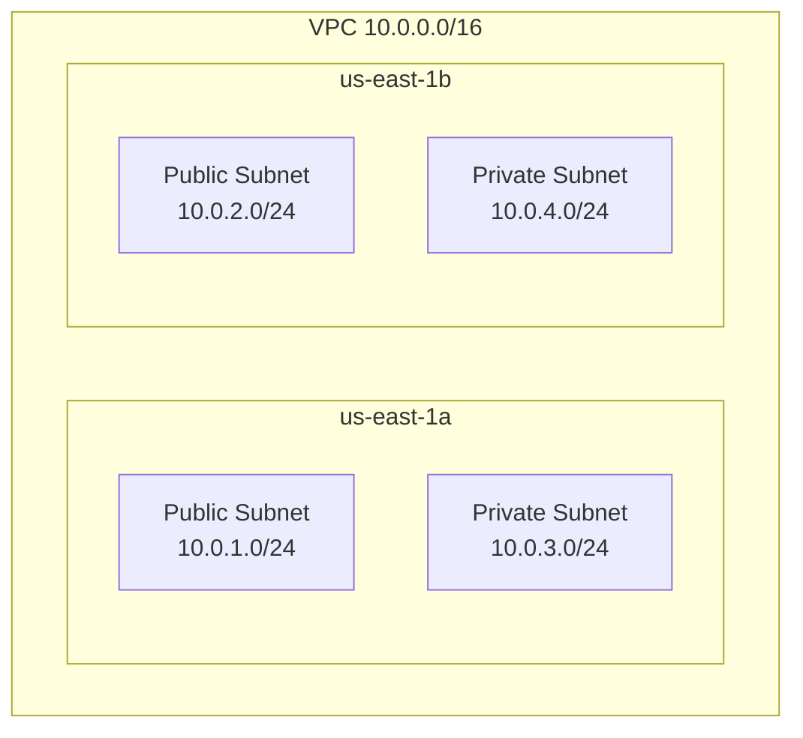

# Subnets and Route Tables

## What are Subnets?

A **subnet** is a subdivision of your VPC's CIDR block. Each subnet lives in **one availability zone** (AZ) and is assigned a unique CIDR block within the VPC range.

- Subnets enable multi-AZ deployment for high availability.
- Different subnets can have different routing (public vs private).
- Each subnet automatically has a `local` route (10.0.0.0/16 → local) for intra-VPC traffic.

## Public vs Private Subnets

| Aspect | Public Subnet | Private Subnet |
|--------|---------------|----------------|
| **Route** | 0.0.0.0/0 → IGW | 0.0.0.0/0 → NAT Gateway |
| **Public IP** | Auto-assign public IP to instances | No automatic public IP |
| **Internet Access** | Instances can reach internet | Outbound via NAT only |
| **Direct Internet** | Instances directly accessible | Not directly accessible |
| **Use Case** | Web servers, load balancers | Databases, app servers |
| **Security** | More exposed | Better isolation |

## CIDR Block Calculation

### Example: Split 10.0.0.0/16 into Two /24 Subnets

**VPC CIDR**: `10.0.0.0/16` (10.0.0.0 to 10.0.255.255; 65,536 addresses)

**Subnet 1** (Public): `10.0.1.0/24` (10.0.1.0 to 10.0.1.255; 256 addresses)
- First 256 addresses in the VPC range

**Subnet 2** (Private): `10.0.2.0/24` (10.0.2.0 to 10.0.2.255; 256 addresses)
- Next 256 addresses

**Reserved AWS IPs per subnet**:
- `.0` = network address
- `.1` = default gateway
- `.2`, `.3` = reserved for AWS use
- `.255` = broadcast

**Usable IPs**: 256 - 5 = 251 per /24 subnet

## Subnet Sizing Best Practices

- Start large: 10.0.0.0/16 leaves room to add many /24 subnets.
- Reserve space for growth: If you think you need 3 subnets, create 5+ worth of space.
- Avoid overlapping ranges: 10.0.1.0/24 and 10.0.1.0/25 overlap; use 10.0.1.0/24 and 10.0.2.0/24.
- Document all CIDR blocks: Keep a simple table of which subnets are for what (web, app, db).

## Route Tables Explained

A **route table** is a set of rules (called routes) that determine where network traffic from your subnet or gateway is directed.

### Main Route Table vs Custom Route Table

| Aspect | Main | Custom |
|--------|------|--------|
| **Default** | Created with VPC | You create |
| **Subnets** | Auto-associated with new subnets | You explicitly associate |
| **Modification** | Affects all associated subnets | Only associated subnets |
| **Recommendation** | Leave for local traffic only | Use for public/private routing |

### Route Priority and Longest Prefix Matching

Routes are evaluated in order of **specificity** (longest prefix match wins):
- `10.0.0.0/16 → local` (always first)
- `10.0.1.0/24 → local` (if you add more specific)
- `0.0.0.0/0 → igw-xxx` (default route for everything else)

**Example**: Traffic to `10.0.1.5`:
1. Matches `10.0.0.0/16` (✓), `10.0.1.0/24` (✓), `0.0.0.0/0` (✓)
2. Longest prefix `/24` wins → route to specific local subnet.

### Local Routes (Automatic)

Every VPC automatically has a local route:
- **Destination**: `10.0.0.0/16` (your VPC CIDR)
- **Target**: `local`
- **Purpose**: Enables traffic between any two subnets in the VPC.

### Default Route (0.0.0.0/0) for Internet Access

To allow internet traffic, add a default route:
- **Public subnet**: `0.0.0.0/0 → IGW`
- **Private subnet**: `0.0.0.0/0 → NAT Gateway` (for outbound only)

## Route Table Association

**Explicit Association**: You associate a subnet with a custom route table.
**Implicit Association**: Subnets not explicitly associated use the main route table.

**Best Practice**: Use explicit associations to avoid unexpected routing changes when the main route table is modified.

## Multi-AZ Subnet Design

Spread subnets across 2-3 availability zones for resilience:



## AWS Console Steps (Create Subnet and Route Table)

### Create Subnet
1. VPC Dashboard → Subnets → Create subnet.
2. VPC: Select your VPC (10.0.0.0/16).
3. Name: `public-subnet-1a` (descriptive).
4. Availability Zone: `us-east-1a`.
5. IPv4 CIDR: `10.0.1.0/24`.
6. Create subnet.
7. Repeat for other subnets (e.g., `10.0.2.0/24` in `us-east-1b`).

### Create Custom Route Table
1. VPC Dashboard → Route Tables → Create route table.
2. Name: `public-routes` (descriptive).
3. VPC: Your VPC.
4. Create route table.
5. Add route: Destination `0.0.0.0/0`, Target `igw-xxx` (Internet Gateway).
6. Associate with public subnet: Select route table → Subnet Associations → Edit → check public subnets.

## AWS CLI Commands

```bash
VPC_ID="vpc-xxxxx"
IGW_ID="igw-xxxxx"

# Create public subnet
aws ec2 create-subnet \
  --vpc-id $VPC_ID \
  --cidr-block 10.0.1.0/24 \
  --availability-zone us-east-1a

# Create private subnet
aws ec2 create-subnet \
  --vpc-id $VPC_ID \
  --cidr-block 10.0.2.0/24 \
  --availability-zone us-east-1b

# Create custom route table
RT_ID=$(aws ec2 create-route-table \
  --vpc-id $VPC_ID \
  --query 'RouteTable.RouteTableId' \
  --output text)

# Add default route to IGW
aws ec2 create-route \
  --route-table-id $RT_ID \
  --destination-cidr-block 0.0.0.0/0 \
  --gateway-id $IGW_ID

# Associate route table with subnet
SUBNET_ID="subnet-xxxxx"
aws ec2 associate-route-table \
  --route-table-id $RT_ID \
  --subnet-id $SUBNET_ID
```

## Python boto3 Example

```python
import boto3

ec2 = boto3.client('ec2')

# Create subnet
subnet_resp = ec2.create_subnet(
    VpcId='vpc-xxxxx',
    CidrBlock='10.0.1.0/24',
    AvailabilityZone='us-east-1a'
)
subnet_id = subnet_resp['Subnet']['SubnetId']

# Create route table
rt_resp = ec2.create_route_table(VpcId='vpc-xxxxx')
rt_id = rt_resp['RouteTable']['RouteTableId']

# Add route to IGW
ec2.create_route(
    RouteTableId=rt_id,
    DestinationCidrBlock='0.0.0.0/0',
    GatewayId='igw-xxxxx'
)

# Associate route table with subnet
ec2.associate_route_table(
    RouteTableId=rt_id,
    SubnetId=subnet_id
)
```

## Verification Steps

- [ ] Subnets created with correct CIDR blocks
- [ ] Subnets span different AZs
- [ ] Route tables created and routes added
- [ ] Subnets associated with appropriate route tables
- [ ] Local routes present for VPC CIDR
- [ ] Default routes (0.0.0.0/0) point to IGW (public) or NAT (private)

## Common Mistakes

- **Overlapping CIDR**: 10.0.1.0/24 and 10.0.1.128/25 overlap; fix by using 10.0.1.0/24 and 10.0.2.0/24.
- **Wrong route table association**: Public subnet associated with private route table (or vice versa).
- **Missing local route**: Routes appear incomplete; local route is automatic and hidden by default.
- **Insufficient IP space**: Subnets too small; plan for growth early.

## Troubleshooting

- **EC2 can't reach internet**: Check subnet's route table has 0.0.0.0/0 route.
- **Instances in different subnets can't communicate**: Verify local route exists (it should).
- **Route table changes don't apply**: Ensure subnet is explicitly associated, not just using main route table.

## Next Steps

- [internet_nat_gateway.md](internet_nat_gateway.md): Configure IGW and NAT Gateway.
- [security_nacl_vs_sg.md](security_nacl_vs_sg.md): Add security layers to subnets.
