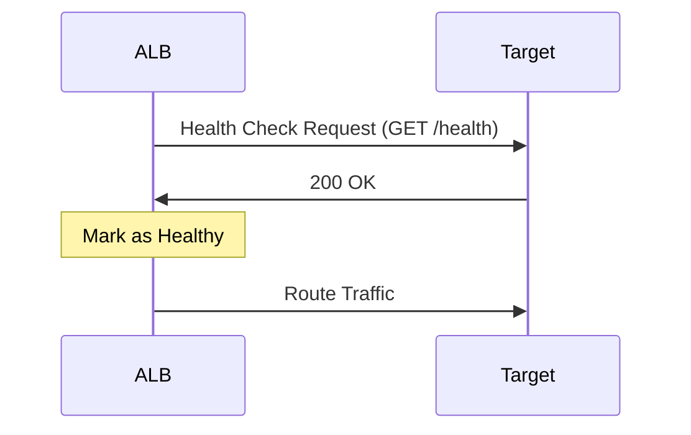

# ALB Health Checks

**Duration**: 15 minutes  
**Difficulty**: Intermediate  
**Skills**: Health check tuning, troubleshooting

## Fundamentals
ALB sends periodic health check requests to targets in each target group. Only healthy targets receive traffic.

## Parameters

| Parameter | Purpose | Recommended (lab) |
|-----------|---------|-------------------|
| Protocol | HTTP/HTTPS | HTTP for simple labs |
| Path | Endpoint to test | `/health` |
| Port | Target port | 80 (match target) |
| Interval | Time between checks | 30s |
| Timeout | Wait for response | 5s |
| Healthy threshold | Successes to mark healthy | 3 |
| Unhealthy threshold | Failures to mark unhealthy | 2 |

## States
- Initial: waiting for thresholds
- Healthy: receiving traffic
- Unhealthy: removed from rotation
- Draining: deregistration delay in progress

## Diagram


## Console Configuration
1. EC2 console → **Target Groups**
2. Select target group → **Health checks** → **Edit**
3. Set protocol HTTP, path `/health`, interval 30s, timeout 5s, healthy=3, unhealthy=2
4. Save changes and observe status

## AWS CLI
```bash
# Update health check
aws elbv2 modify-target-group \
  --target-group-arn arn:aws:elasticloadbalancing:...:targetgroup/tg-web/... \
  --health-check-protocol HTTP \
  --health-check-path /health \
  --health-check-interval-seconds 30 \
  --health-check-timeout-seconds 5 \
  --healthy-threshold-count 3 \
  --unhealthy-threshold-count 2 \
  --region us-east-1

# View health
aws elbv2 describe-target-health \
  --target-group-arn arn:aws:elasticloadbalancing:...:targetgroup/tg-web/... \
  --region us-east-1
```

## Troubleshooting
- SG blocks health checks: allow inbound from ALB SG to target port
- App not serving `/health`: add simple endpoint returning 200
- Timeout too short: increase timeout/interval for slower apps
- Wrong port/path: align with application config

## Verification Checklist
- [ ] All targets show **healthy**
- [ ] Health check graph shows 200 responses
- [ ] No 503 errors from ALB

## Competition Tips
- Keep health checks lightweight (static 200)
- Adjust thresholds for faster failover during demos

## Cross-References
- Target groups: [aws-worldskills-notes/06_alb/target_groups.md](aws-worldskills-notes/06_alb/target_groups.md)
- VPC networking: [aws-worldskills-notes/05_vpc/overview.md](aws-worldskills-notes/05_vpc/overview.md)
- Security groups: [aws-worldskills-notes/03_ec2/security_groups.md](aws-worldskills-notes/03_ec2/security_groups.md)
- Forward: RDS integration: [aws-worldskills-notes/07_rds/overview.md](aws-worldskills-notes/07_rds/overview.md)
