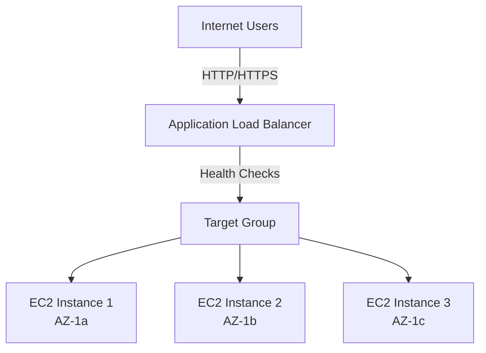

# Application Load Balancer (ALB) Overview

**Duration**: 20 minutes  
**Free Tier**: 750 ALB hours/month (first 12 months) + data processing charges  
**Difficulty**: Intermediate  
**Skills**: Layer 7 routing, listeners, rules, target groups

## Introduction
Application Load Balancer (ALB) provides Layer 7 HTTP/HTTPS load balancing with content-based routing for modern web and microservice architectures.

- Routes based on path and host headers
- Integrates with target groups for dynamic scaling
- Supports WebSocket and HTTP/2
- Health checks ensure traffic goes only to healthy targets

## ALB vs NLB vs CLB

| Feature | ALB (L7) | NLB (L4) | CLB (Legacy) |
|---------|----------|----------|--------------|
| Protocols | HTTP/HTTPS/WebSocket | TCP/UDP/TLS | HTTP/HTTPS/TCP |
| Routing | Path/host-based | Flow-based | Basic L4/L7 |
| Health Checks | HTTP/HTTPS | TCP/HTTP/HTTPS | HTTP/HTTPS/TCP |
| Best For | Web apps, microservices | High-performance TCP/UDP | Legacy/monolithic |
| Sticky Sessions | Yes (cookies) | Yes (source IP) | Yes |
| Free Tier | 750 hours/mo (12 mo) | None | None |

## Layer 7 Routing Capabilities
- Path-based: `/api/*`, `/app/*`
- Host-based: `app.example.com`, `api.example.com`
- Header/query inspection via rules
- WebSocket and HTTP/2 supported

## Core Components
- Listeners (ports 80/443)
- Rules (priority, conditions, actions)
- Target Groups (instance/IP/Lambda)
- Health Checks (per target group)

## Use Cases (WorldSkills)
- Multi-tier web apps requiring URL routing
- Microservices fan-out from a single endpoint
- Blue/green via weighted target groups

## Architecture Diagram


## Free Tier Notes
- 750 LCU-hours/month for ALB for 12 months (hours + data processing)
- Data processed and LCU usage can exceed Free Tier with heavy traffic

## AWS Console Navigation
1. Open **EC2** service
2. Left menu: **Load Balancing → Load Balancers**
3. Click **Create load balancer** → **Application Load Balancer**

## AWS CLI Basics
```bash
# List ALBs
aws elbv2 describe-load-balancers --region us-east-1

# Create ALB (skeleton)
aws elbv2 create-load-balancer \
  --name lab-alb \
  --subnets subnet-1 subnet-2 \
  --security-groups sg-alb \
  --scheme internet-facing \
  --type application \
  --region us-east-1
```

## Competition Tips
- Prefer ALB for HTTP apps; use NLB for TCP/low latency
- Ensure ALB subnets are public (IGW route) for internet-facing setups
- Keep SG rules minimal: ALB allows 80/443; targets allow from ALB SG only

## Common Mistakes
- Selecting private subnets with no IGW for internet-facing ALB
- Missing SG rule allowing ALB to reach targets
- Wrong VPC or AZ mismatch between ALB and targets

## Cross-References
- EC2 fundamentals: [aws-worldskills-notes/03_ec2/overview.md](aws-worldskills-notes/03_ec2/overview.md)
- VPC networking: [aws-worldskills-notes/05_vpc/overview.md](aws-worldskills-notes/05_vpc/overview.md)
- Security groups: [aws-worldskills-notes/03_ec2/security_groups.md](aws-worldskills-notes/03_ec2/security_groups.md)
- Forward: RDS integration: [aws-worldskills-notes/07_rds/overview.md](aws-worldskills-notes/07_rds/overview.md)
