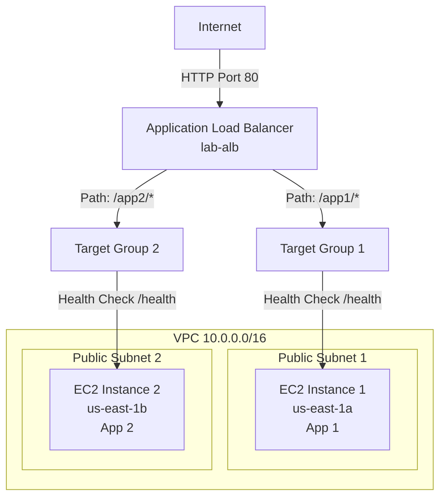

# ALB Server Lab: Path-Based Routing

**Duration**: 60-75 minutes  
**Free Tier**: Yes (t2.micro + ALB hours within limits)  
**Difficulty**: Intermediate  
**Skills**: ALB creation, path rules, target groups, health checks

## Problem Statement
WorldSkills-style task: Deploy a highly available ALB distributing traffic across two EC2 web servers with path-based routing.

**Requirements**:
- Two EC2 `t2.micro` instances in different AZs (public subnets)
- Internet-facing ALB in two public subnets
- Path rules: `/app1/*` → Instance 1; `/app2/*` → Instance 2
- Health checks on `/health`
- Security groups: ALB allows 80 from internet; EC2 allows 80 from ALB SG only
- Verify distribution and failover

## Architecture Diagram


## Step-by-Step Implementation

### Step 1: Launch 2 EC2 Instances (20 minutes)
1. Create SG `sg-alb-targets`: inbound HTTP 80 **from ALB SG only**; outbound all
2. Launch Instance 1 (us-east-1a, public subnet 1) `t2.micro`, SG `sg-alb-targets`, user data for App 1
3. Launch Instance 2 (us-east-1b, public subnet 2) `t2.micro`, SG `sg-alb-targets`, user data for App 2
4. Ensure both have public IPs (for initial testing) and running state

**User data - Instance 1**
```bash
#!/bin/bash
yum install -y httpd
mkdir -p /var/www/html/app1
cat <<'EOF' >/var/www/html/app1/index.html
<h1>App 1</h1>
EOF
cat <<'EOF' >/var/www/html/health
OK
EOF
systemctl enable httpd
systemctl start httpd
```

**User data - Instance 2**
```bash
#!/bin/bash
yum install -y httpd
mkdir -p /var/www/html/app2
cat <<'EOF' >/var/www/html/app2/index.html
<h1>App 2</h1>
EOF
cat <<'EOF' >/var/www/html/health
OK
EOF
systemctl enable httpd
systemctl start httpd
```

### Step 2: Create Target Groups (10 minutes)
1. Create `TG-App1` (instance type), HTTP:80, health check `/health`
2. Create `TG-App2` (instance type), HTTP:80, health check `/health`
3. Register Instance 1 to `TG-App1`; Instance 2 to `TG-App2`
4. Verify targets become **healthy**

### Step 3: Create Application Load Balancer (15 minutes)
1. Create SG `sg-alb`: inbound 80 from 0.0.0.0/0; outbound all
2. Create ALB `lab-alb`: internet-facing, select two public subnets (1a, 1b), SG `sg-alb`
3. Listener HTTP 80: default action **fixed response** "Welcome to ALB"

### Step 4: Configure Path-Based Rules (10 minutes)
1. Add rule priority 10: IF path `/app1/*` → forward to `TG-App1`
2. Add rule priority 20: IF path `/app2/*` → forward to `TG-App2`
3. Save listener

### Step 5: Verification and Testing (15 minutes)
- ALB DNS: `lab-alb-xxxxx.region.elb.amazonaws.com`
- Test default: `curl http://<alb-dns>/` → "Welcome to ALB"
- Test App1: `curl http://<alb-dns>/app1/` → "App 1"
- Test App2: `curl http://<alb-dns>/app2/` → "App 2"
- Stop Instance 1 and confirm `/app1/` fails over after health checks

## AWS CLI Alternative (abridged)
```bash
REGION=us-east-1
VPC=vpc-xxxxx
PUB1=subnet-1a
PUB2=subnet-1b
AMI=ami-0c55b159cbfafe1f0

# SGs
SG_ALB=$(aws ec2 create-security-group --group-name sg-alb --description sg-alb --vpc-id $VPC --region $REGION --query GroupId --output text)
SG_TG=$(aws ec2 create-security-group --group-name sg-alb-targets --description sg-alb-targets --vpc-id $VPC --region $REGION --query GroupId --output text)
aws ec2 authorize-security-group-ingress --group-id $SG_ALB --protocol tcp --port 80 --cidr 0.0.0.0/0 --region $REGION
aws ec2 authorize-security-group-ingress --group-id $SG_TG --protocol tcp --port 80 --source-group $SG_ALB --region $REGION

# Instances
I1=$(aws ec2 run-instances --image-id $AMI --instance-type t2.micro --subnet-id $PUB1 --security-group-ids $SG_TG --user-data file://user-data-app1.sh --query 'Instances[0].InstanceId' --output text --region $REGION)
I2=$(aws ec2 run-instances --image-id $AMI --instance-type t2.micro --subnet-id $PUB2 --security-group-ids $SG_TG --user-data file://user-data-app2.sh --query 'Instances[0].InstanceId' --output text --region $REGION)

# Target groups
TG1_ARN=$(aws elbv2 create-target-group --name TG-App1 --protocol HTTP --port 80 --vpc-id $VPC --health-check-path /health --target-type instance --query 'TargetGroups[0].TargetGroupArn' --output text --region $REGION)
TG2_ARN=$(aws elbv2 create-target-group --name TG-App2 --protocol HTTP --port 80 --vpc-id $VPC --health-check-path /health --target-type instance --query 'TargetGroups[0].TargetGroupArn' --output text --region $REGION)
aws elbv2 register-targets --target-group-arn $TG1_ARN --targets Id=$I1 --region $REGION
aws elbv2 register-targets --target-group-arn $TG2_ARN --targets Id=$I2 --region $REGION

# ALB
ALB_ARN=$(aws elbv2 create-load-balancer --name lab-alb --type application --scheme internet-facing --subnets $PUB1 $PUB2 --security-groups $SG_ALB --query 'LoadBalancers[0].LoadBalancerArn' --output text --region $REGION)
LISTENER_ARN=$(aws elbv2 create-listener --load-balancer-arn $ALB_ARN --protocol HTTP --port 80 --default-actions Type=fixed-response,FixedResponseConfig='{MessageBody="Welcome to ALB",StatusCode="200",ContentType="text/plain"}' --query 'Listeners[0].ListenerArn' --output text --region $REGION)
aws elbv2 create-rule --listener-arn $LISTENER_ARN --priority 10 --conditions Field=path-pattern,Values='/app1/*' --actions Type=forward,TargetGroupArn=$TG1_ARN --region $REGION
aws elbv2 create-rule --listener-arn $LISTENER_ARN --priority 20 --conditions Field=path-pattern,Values='/app2/*' --actions Type=forward,TargetGroupArn=$TG2_ARN --region $REGION
```

## Verification Checklist
- [ ] 2 EC2 instances running in different AZs
- [ ] Targets healthy in both target groups
- [ ] ALB DNS resolves
- [ ] Default path returns fixed response
- [ ] `/app1/` routes to Instance 1
- [ ] `/app2/` routes to Instance 2
- [ ] Health checks passing
- [ ] Failover works when an instance stops

## Common Mistakes
- ALB or targets in wrong VPC/subnets
- SG not allowing ALB to reach targets
- Health check path missing or returns non-200
- Subnets not in different AZs (no HA)
- Cross-zone load balancing disabled when needed

## Troubleshooting
- 503 errors: no healthy targets; check health checks and SGs
- Unhealthy targets: verify `/health`, port, and SG from ALB SG
- Path routing failures: confirm rule priority and patterns

## Cleanup
1. Delete ALB (wait for deletion)
2. Delete target groups
3. Terminate EC2 instances
4. Delete security groups

## Time Breakdown

| Step | Time |
|------|------|
| Launch instances | 20 min |
| Target groups | 10 min |
| ALB create | 15 min |
| Path rules | 10 min |
| Verification | 15 min |

## Summary
- Deployed ALB with path-based routing and health checks
- Validated traffic flow and failover
- Ready for extension to HTTPS and advanced rules

## Cross-References
- ALB overview: [aws-worldskills-notes/06_alb/overview.md](aws-worldskills-notes/06_alb/overview.md)
- Target groups: [aws-worldskills-notes/06_alb/target_groups.md](aws-worldskills-notes/06_alb/target_groups.md)
- EC2 fundamentals: [aws-worldskills-notes/03_ec2/overview.md](aws-worldskills-notes/03_ec2/overview.md)
- VPC networking: [aws-worldskills-notes/05_vpc/overview.md](aws-worldskills-notes/05_vpc/overview.md)
- Security groups: [aws-worldskills-notes/03_ec2/security_groups.md](aws-worldskills-notes/03_ec2/security_groups.md)
- Forward: RDS integration: [aws-worldskills-notes/07_rds/overview.md](aws-worldskills-notes/07_rds/overview.md)
