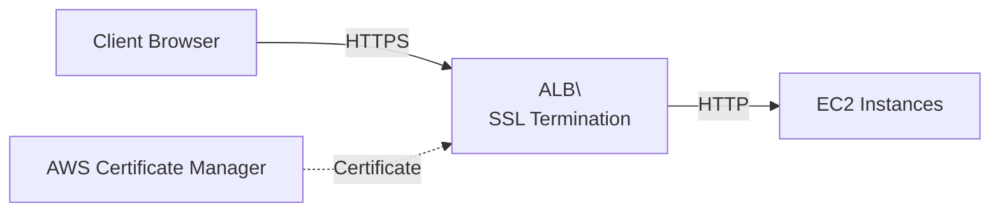

# ALB SSL/HTTPS

**Duration**: 20 minutes  
**Difficulty**: Intermediate  
**Skills**: TLS termination, ACM certificates, HTTPS listeners

## HTTPS Fundamentals
- ALB terminates SSL/TLS at the load balancer (Layer 7)
- Uses certificates from AWS Certificate Manager (ACM) or imported
- Can re-encrypt to targets (end-to-end) or forward HTTP internally

## Certificate Options
- ACM-issued (free) public certificates
- Imported third-party certificates

## HTTP vs HTTPS

| Listener | Port | Encryption | Use Case |
|----------|------|------------|----------|
| HTTP | 80 | None | Dev/test, internal ALBs |
| HTTPS | 443 | TLS | Production, internet-facing |

## Diagram


## Console Steps
1. **Request certificate**: ACM → **Request a certificate** → public certificate → add domain → DNS validation
2. Validate via DNS record; wait for **Issued** status
3. Create/Select ALB → **Listeners** → **Add listener** (HTTPS 443)
4. Choose ACM certificate, select security policy (e.g., `ELBSecurityPolicy-TLS13-1-2-Ext2018-06`)
5. Default action: forward to target group; optionally add HTTP→HTTPS redirect on port 80

## AWS CLI
```bash
# Request certificate
aws acm request-certificate \
  --domain-name example.com \
  --validation-method DNS \
  --region us-east-1

# Describe certificate
aws acm describe-certificate \
  --certificate-arn arn:aws:acm:...:certificate/... \
  --region us-east-1

# Create HTTPS listener
aws elbv2 create-listener \
  --load-balancer-arn arn:aws:elasticloadbalancing:...:loadbalancer/app/lab-alb/... \
  --protocol HTTPS --port 443 \
  --certificates CertificateArn=arn:aws:acm:...:certificate/... \
  --ssl-policy ELBSecurityPolicy-TLS13-1-2-Ext2018-06 \
  --default-actions Type=forward,TargetGroupArn=arn:aws:elasticloadbalancing:...:targetgroup/tg-web/... \
  --region us-east-1
```

## HTTP→HTTPS Redirect
- Add HTTP listener rule: **Redirect** to HTTPS 443 with 301 status

## Free Tier Notes
- ACM public certs are free; ALB hours/LCUs still bill beyond Free Tier
- Domain required for public certificate; for labs, use self-signed and proceed with browser warning

## Common Mistakes
- Certificate not validated before attaching
- SG missing port 443 to ALB
- Wrong security policy causing client compatibility issues

## Verification
- Access `https://<alb-dns>` and inspect certificate chain
- Confirm redirect from HTTP to HTTPS if configured

## Cross-References
- ALB overview: [aws-worldskills-notes/06_alb/overview.md](aws-worldskills-notes/06_alb/overview.md)
- Target groups: [aws-worldskills-notes/06_alb/target_groups.md](aws-worldskills-notes/06_alb/target_groups.md)
- VPC networking: [aws-worldskills-notes/05_vpc/overview.md](aws-worldskills-notes/05_vpc/overview.md)
- Security groups: [aws-worldskills-notes/03_ec2/security_groups.md](aws-worldskills-notes/03_ec2/security_groups.md)
