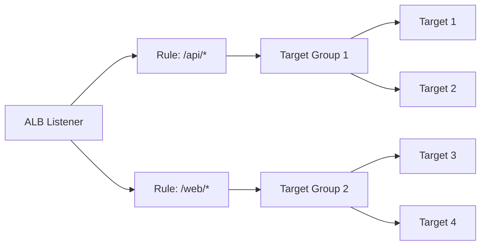

# ALB Target Groups

**Duration**: 20 minutes  
**Difficulty**: Intermediate  
**Skills**: Target registration, health checks, attributes

## Concept
Target groups are logical collections of targets (instances, IPs, Lambda) that ALB forwards traffic to based on listener rules.

## Target Types

| Target Type | Use Case | Notes |
|-------------|----------|-------|
| Instance | EC2 targets in VPC | Registers by instance ID; uses instance port |
| IP | On-prem/other VPC IPs | Must be in RFC1918/CIDR allowed; great for containers without instance IDs |
| Lambda | Event-driven | Invokes Lambda; payload JSON |

## Registration Flow
1. Create target group with type, port, protocol
2. Configure health check settings
3. Register targets (instances/IPs/Lambda)
4. Attach target group to listener rules

## Health Checks
- Per target group
- Protocol: HTTP/HTTPS
- Path: `/health` recommended
- Thresholds: tune for faster failover vs stability

## Attributes
- Deregistration delay (default 300s): wait time before removing target
- Slow start (0-900s): gradually increases traffic to new targets
- Load balancing algorithm: round robin (HTTP) or least outstanding requests
- Stickiness: duration-based cookie (up to 7 days)

## Diagram


## AWS Console Steps
1. EC2 console → **Target Groups** → **Create target group**
2. Choose type (Instance/IP/Lambda), protocol HTTP, port 80, VPC
3. Health checks: path `/health`, interval 30s, healthy=3, unhealthy=2
4. Attributes: set deregistration delay, slow start as needed
5. Register targets → select instances → **Include as pending below** → **Create**

## AWS CLI
```bash
# Create target group (instance targets)
aws elbv2 create-target-group \
  --name tg-web \
  --protocol HTTP \
  --port 80 \
  --vpc-id vpc-xxxxx \
  --health-check-path /health \
  --target-type instance \
  --region us-east-1

# Register targets
aws elbv2 register-targets \
  --target-group-arn arn:aws:elasticloadbalancing:...:targetgroup/tg-web/... \
  --targets Id=i-0123456789abcdef0 \
  --region us-east-1

# Check health
aws elbv2 describe-target-health \
  --target-group-arn arn:aws:elasticloadbalancing:...:targetgroup/tg-web/... \
  --region us-east-1
```

## boto3 Example
```python
import boto3
elbv2 = boto3.client('elbv2', region_name='us-east-1')

tg_arn = elbv2.create_target_group(
    Name='tg-web', Protocol='HTTP', Port=80, VpcId='vpc-xxxxx',
    HealthCheckPath='/health', TargetType='instance'
)['TargetGroups'][0]['TargetGroupArn']

elbv2.register_targets(
    TargetGroupArn=tg_arn,
    Targets=[{'Id': 'i-0123456789abcdef0'}]
)
```

## Verification
- Targets show **healthy** in Target Groups page
- Health check graph shows 200 responses

## Common Mistakes
- Targets in the wrong VPC or subnet
- Port mismatch between target group and instance listener
- Health check path not present on the app

## Troubleshooting Unhealthy Targets
- SG blocks ALB: allow inbound from ALB SG to target port
- App not listening on target port
- Health check path returns non-200

## Cross-References
- EC2 fundamentals: [aws-worldskills-notes/03_ec2/overview.md](aws-worldskills-notes/03_ec2/overview.md)
- VPC networking: [aws-worldskills-notes/05_vpc/overview.md](aws-worldskills-notes/05_vpc/overview.md)
- Security groups: [aws-worldskills-notes/03_ec2/security_groups.md](aws-worldskills-notes/03_ec2/security_groups.md)
- Forward: RDS integration: [aws-worldskills-notes/07_rds/overview.md](aws-worldskills-notes/07_rds/overview.md)
