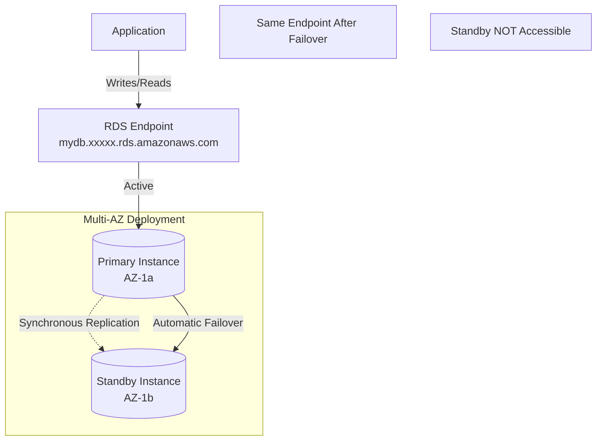
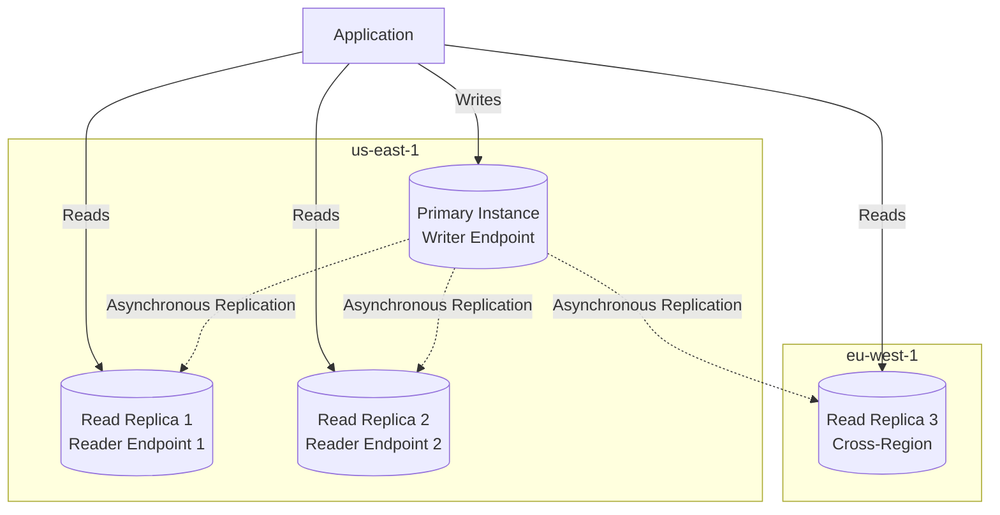
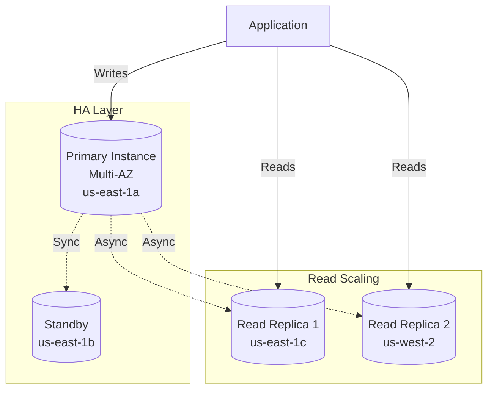

# RDS Multi-AZ and Read Replicas

**Duration**: 25 minutes  
**Difficulty**: Advanced  
**Skills**: High availability, read scaling, disaster recovery

## Multi-AZ Deployments

### Architecture



### How Multi-AZ Works

1. **Primary instance** handles all read and write traffic
2. **Synchronous replication** to standby in different AZ
3. **Standby is NOT accessible** for reads (high availability only)
4. **Automatic failover** in 1-2 minutes during:
   - AZ outage
   - Primary instance failure
   - Network issues
   - Maintenance operations
5. **Same endpoint** before and after failover (DNS update)

### Benefits

| Benefit | Description |
|---------|-------------|
| High Availability | 99.95% SLA vs 99.5% single-AZ |
| Automatic Failover | 1-2 minute recovery, no manual intervention |
| Data Durability | Synchronous replication = zero data loss |
| Maintenance | Standby updated first, minimal downtime |
| Backup | Taken from standby, no performance impact on primary |

### Limitations

| Limitation | Impact |
|------------|--------|
| No Read Scaling | Standby cannot serve read queries |
| Cost | 2x instance cost (primary + standby) |
| Same Region | Cannot span regions (use Read Replicas for DR) |
| No Free Tier | Multi-AZ exceeds Free Tier limits |
| Performance Overhead | Slight write latency (synchronous replication) |

### Console Steps

1. Create/Modify database
2. **Availability & durability** section
3. Select **Multi-AZ DB instance**
4. Review additional cost (doubles instance cost)
5. Apply changes immediately or during maintenance window

### CLI Commands

```bash
# Enable Multi-AZ on existing instance
aws rds modify-db-instance \
  --db-instance-identifier mydb \
  --multi-az \
  --apply-immediately \
  --region us-east-1

# Create new instance with Multi-AZ
aws rds create-db-instance \
  --db-instance-identifier prod-db \
  --db-instance-class db.t3.small \
  --engine mysql \
  --master-username admin \
  --master-user-password SecurePass123 \
  --allocated-storage 100 \
  --multi-az \
  --vpc-security-group-ids sg-xxxxx \
  --db-subnet-group-name prod-subnet-group \
  --region us-east-1
```

## Read Replicas

### Architecture



### How Read Replicas Work

1. **Primary instance** handles all writes
2. **Asynchronous replication** to read replicas
3. **Separate endpoints** for each replica
4. **Eventually consistent** reads (replication lag: seconds to minutes)
5. **Manual promotion** to standalone instance
6. **Up to 15 replicas** per primary (MySQL, PostgreSQL)
7. **Cross-region** replicas for disaster recovery

### Benefits

| Benefit | Description |
|---------|-------------|
| Read Scaling | Distribute read traffic across multiple replicas |
| Disaster Recovery | Promote replica in different region |
| Analytics | Run reports on replica without impacting primary |
| Low-Latency Reads | Place replicas closer to users geographically |
| Backup Alternative | Take snapshots from replica |

### Limitations

| Limitation | Impact |
|------------|--------|
| Replication Lag | Reads may be stale (monitor `ReplicaLag` metric) |
| Manual Promotion | Application must handle failover logic |
| Application Changes | Must direct writes to primary, reads to replicas |
| Cost | Each replica billed separately |
| Eventual Consistency | Not suitable for read-after-write scenarios |

### Console Steps

1. Select primary database
2. **Actions** → **Create read replica**
3. Specify replica identifier: `mydb-replica-1`
4. Choose instance class (can differ from primary)
5. Select AZ or region (cross-region: additional cost)
6. Configure networking and security groups
7. Create replica (takes 5-15 minutes)

### CLI Commands

```bash
# Create read replica in same region
aws rds create-db-instance-read-replica \
  --db-instance-identifier mydb-replica-1 \
  --source-db-instance-identifier mydb \
  --db-instance-class db.t3.micro \
  --availability-zone us-east-1b \
  --region us-east-1

# Create cross-region read replica
aws rds create-db-instance-read-replica \
  --db-instance-identifier mydb-replica-eu \
  --source-db-instance-identifier arn:aws:rds:us-east-1:123456789012:db:mydb \
  --db-instance-class db.t3.small \
  --region eu-west-1

# Promote replica to standalone instance
aws rds promote-read-replica \
  --db-instance-identifier mydb-replica-1 \
  --region us-east-1
```

## Multi-AZ vs Read Replicas

| Feature | Multi-AZ | Read Replicas |
|---------|----------|---------------|
| **Purpose** | High availability | Read scaling, DR |
| **Replication** | Synchronous | Asynchronous |
| **Endpoints** | 1 (automatic failover) | Multiple (separate) |
| **Standby Access** | No (standby not accessible) | Yes (all replicas accessible) |
| **Failover** | Automatic (1-2 min) | Manual promotion |
| **Data Loss** | Zero (synchronous) | Possible (replication lag) |
| **Read Scaling** | No | Yes |
| **Cost** | 2x instance cost | Per-replica cost |
| **Maintenance** | Standby updated first | Replicas updated independently |
| **Free Tier** | ❌ No | ❌ No |
| **Region** | Same region only | Cross-region supported |
| **Use Case** | Production HA | Read-heavy workloads, DR, analytics |

## When to Use Multi-AZ

✅ **Use Multi-AZ when**:
- Production database requiring 99.95% uptime
- Zero data loss tolerance
- Automatic failover required
- Compliance mandates high availability
- No manual intervention desired

❌ **Avoid Multi-AZ when**:
- Development/testing environment
- Cost is primary concern (Free Tier)
- Read scaling is the goal (use Read Replicas)

## When to Use Read Replicas

✅ **Use Read Replicas when**:
- Read-heavy workload (reporting, analytics)
- Geographic distribution of users
- Disaster recovery in different region
- Need to offload read traffic from primary
- Running long-running queries without impacting primary

❌ **Avoid Read Replicas when**:
- Application requires strong consistency
- Write-heavy workload
- Cannot modify application to route reads
- Replication lag is unacceptable

## Combining Multi-AZ and Read Replicas

**Maximum Availability and Performance**:



**Configuration**:
1. Enable Multi-AZ on primary (high availability)
2. Create Read Replicas (read scaling)
3. Application routes writes to primary, reads to replicas
4. Automatic failover for primary, manual promotion for replicas

## Failover Testing (Competition Verification)

### Multi-AZ Failover Test

1. **Trigger failover**:
   - Console: Modify → Apply maintenance immediately → Reboot with failover
   - CLI: `aws rds reboot-db-instance --db-instance-identifier mydb --force-failover`

2. **Monitor**:
   - CloudWatch: `DatabaseConnections` drops briefly
   - Event log: Failover started/completed messages
   - Downtime: 1-2 minutes

3. **Verify**:
   - Application reconnects automatically
   - Endpoint unchanged
   - New primary in different AZ

### Read Replica Promotion Test

1. **Promote replica**: Console → Actions → Promote
2. **Update application**: Change endpoint to promoted replica
3. **Monitor**: Replication stops, replica becomes independent
4. **Verify**: Writes now go to promoted instance

## Monitoring Replication Lag

```bash
# Check replica lag (CloudWatch metric)
aws cloudwatch get-metric-statistics \
  --namespace AWS/RDS \
  --metric-name ReplicaLag \
  --dimensions Name=DBInstanceIdentifier,Value=mydb-replica-1 \
  --start-time 2025-12-31T00:00:00Z \
  --end-time 2025-12-31T23:59:59Z \
  --period 300 \
  --statistics Average \
  --region us-east-1
```

**Acceptable Lag**: <5 seconds (real-time), <60 seconds (analytics)

## Cost Comparison (us-east-1)

| Configuration | Monthly Cost | Notes |
|---------------|--------------|-------|
| Single db.t3.micro | ~$12 | No HA, no read scaling |
| Multi-AZ db.t3.micro | ~$24 | 2x instance cost |
| Single + 1 Read Replica (t3.micro) | ~$24 | Read scaling, manual DR |
| Multi-AZ + 2 Read Replicas | ~$48 | Max HA + read scaling |

**Free Tier**: Only single-AZ db.t3.micro qualifies

## Competition Tips

- **State-level**: Multi-AZ rarely required (cost constraint)
- **National/International**: Multi-AZ expected for production scenarios
- Always document HA strategy in solution design
- Understand failover behavior for oral exam
- Read Replicas: know replication lag implications

## Common Mistakes

- Enabling Multi-AZ in Free Tier labs (cost violation)
- Expecting standby to serve reads (Multi-AZ standby is inaccessible)
- Not monitoring replication lag on Read Replicas
- Using Read Replicas for strong consistency requirements
- Forgetting to update application endpoints after replica promotion
- Creating too many replicas (15 max, cost adds up)

## Cross-References

- RDS overview: [aws-worldskills-notes/07_rds/overview.md](aws-worldskills-notes/07_rds/overview.md)
- Engine selection: [aws-worldskills-notes/07_rds/engine_selection.md](aws-worldskills-notes/07_rds/engine_selection.md)
- Security and backups: [aws-worldskills-notes/07_rds/security_backup.md](aws-worldskills-notes/07_rds/security_backup.md)
- VPC networking: [aws-worldskills-notes/05_vpc/overview.md](aws-worldskills-notes/05_vpc/overview.md)
