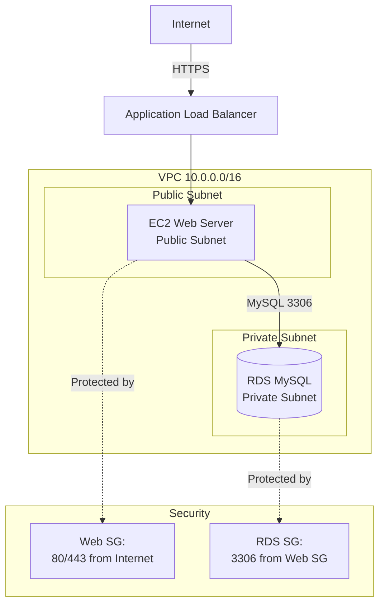

# Amazon RDS Overview

**Duration**: 20 minutes  
**Free Tier**: 750 hours/month db.t2.micro or db.t3.micro (first 12 months), 20GB storage, 20GB backups  
**Difficulty**: Intermediate  
**Skills**: Managed databases, RDS fundamentals, AWS Console navigation

## What is Amazon RDS?

Amazon Relational Database Service (RDS) is a fully managed database service that automates time-consuming administration tasks like hardware provisioning, database setup, patching, and backups.

**Key Benefits**:
- Automated backups with point-in-time recovery
- Automated software patching and version upgrades
- Integrated CloudWatch monitoring
- Push-button scaling for compute and storage
- Multi-AZ high availability with automatic failover
- Read Replicas for read scaling

## RDS vs Self-Managed Database on EC2

| Feature | RDS | EC2 Database |
|---------|-----|--------------|
| Management | AWS handles patching, backups | Manual administration required |
| Backups | Automated with PITR | Manual scripts/tools |
| High Availability | Multi-AZ with auto failover | Manual clustering setup |
| Scaling | Console/API clicks | Manual configuration |
| Monitoring | Built-in CloudWatch | Manual setup required |
| Cost | Pay for managed service | Lower compute, higher labor |
| Control | Limited OS/DB access | Full root/admin access |
| Expertise | Basic SQL knowledge | DBA expertise required |
| **Best For** | Standard workloads, fast deployment | Custom engines, specific tuning |

## Database Instance Lifecycle

1. **Creating**: Select engine, instance class, storage, network, security
2. **Available**: Instance is running and accepting connections
3. **Modifying**: Applying configuration changes
4. **Backing up**: Automated or manual snapshot in progress
5. **Stopping**: Temporary shutdown (max 7 days)
6. **Stopped**: Instance stopped, storage persists, no compute charges
7. **Starting**: Resuming from stopped state
8. **Deleting**: Permanent removal with optional final snapshot

## RDS Components

- **DB Instance**: The database server (compute + storage)
- **DB Parameter Group**: Database configuration settings (buffer sizes, character sets)
- **DB Subnet Group**: Collection of subnets (AZs) for RDS placement
- **Option Groups**: Additional features (encryption, auditing)
- **Security Groups**: Firewall rules controlling network access

## Supported Database Engines

| Engine | Free Tier | Latest Version | Use Cases |
|--------|-----------|----------------|-----------|
| MySQL | Yes (t2/t3.micro) | 8.0 | Web apps, WordPress, general purpose |
| PostgreSQL | Yes (t2/t3.micro) | 15 | Advanced features, JSON, geospatial |
| MariaDB | Yes (t2/t3.micro) | 10.11 | MySQL replacement, performance |
| Oracle | No (Licensed) | 19c | Enterprise apps, legacy systems |
| SQL Server | No (Licensed) | 2022 | Windows apps, .NET integration |
| Aurora | No (t3.small min) | MySQL/PostgreSQL compatible | High performance, serverless |

## Free Tier Eligibility

**12 months from AWS account creation**:
- 750 hours/month of db.t2.micro or db.t3.micro instances
- 20GB General Purpose (SSD) storage
- 20GB backup storage
- No Multi-AZ, no Read Replicas

**Cost beyond Free Tier**: ~$0.017/hour (db.t3.micro), $0.115/GB-month storage

## Use Cases (WorldSkills Competitions)

- **Web Application Backend**: Store user accounts, sessions, application data
- **Data Persistence**: Transactional data requiring ACID guarantees
- **Session Storage**: Alternative to ElastiCache for small-scale applications
- **Reporting**: Analytics queries on structured data
- **CMS Databases**: WordPress, Drupal, Joomla backends

## RDS vs Alternatives

| Scenario | Recommendation |
|----------|----------------|
| Structured relational data, ACID transactions | RDS |
| Key-value, NoSQL, serverless | DynamoDB |
| High performance MySQL/PostgreSQL, auto-scaling | Aurora |
| Simple data storage without DB server | S3 |
| In-memory caching, session storage | ElastiCache |

## Architecture Diagram



## AWS Console Navigation

1. Open **AWS Management Console**
2. Search for **RDS** in services search bar
3. Click **RDS** → **Databases**
4. View existing instances or click **Create database**
5. Left menu: **Databases**, **Snapshots**, **Automated backups**, **Subnet groups**, **Parameter groups**

## AWS CLI Basics

```bash
# List all RDS instances
aws rds describe-db-instances --region us-east-1

# List specific instance
aws rds describe-db-instances \
  --db-instance-identifier mydb \
  --region us-east-1

# Get instance status
aws rds describe-db-instances \
  --db-instance-identifier mydb \
  --query 'DBInstances[0].DBInstanceStatus' \
  --output text \
  --region us-east-1
```

## Competition Tips

- Always place RDS in **private subnets** (no internet gateway route)
- Use security groups to restrict access to specific EC2 instances
- Stay within Free Tier: db.t3.micro, 20GB storage, no Multi-AZ
- Enable automated backups (required for PITR and compliance)
- Use descriptive DB identifiers: `web-app-db`, `cms-mysql`

## Common Mistakes

- Enabling public accessibility (security risk, mark deduction)
- Selecting db.t2.small or larger (exceeds Free Tier)
- Placing RDS in public subnet
- Opening security group to 0.0.0.0/0
- Forgetting to create DB subnet group with multiple AZs
- Not testing connection before final submission

## Cross-References

- VPC fundamentals: [aws-worldskills-notes/05_vpc/overview.md](aws-worldskills-notes/05_vpc/overview.md)
- Security groups: [aws-worldskills-notes/03_ec2/security_groups.md](aws-worldskills-notes/03_ec2/security_groups.md)
- EC2 instances: [aws-worldskills-notes/03_ec2/overview.md](aws-worldskills-notes/03_ec2/overview.md)
- ALB integration: [aws-worldskills-notes/06_alb/overview.md](aws-worldskills-notes/06_alb/overview.md)
