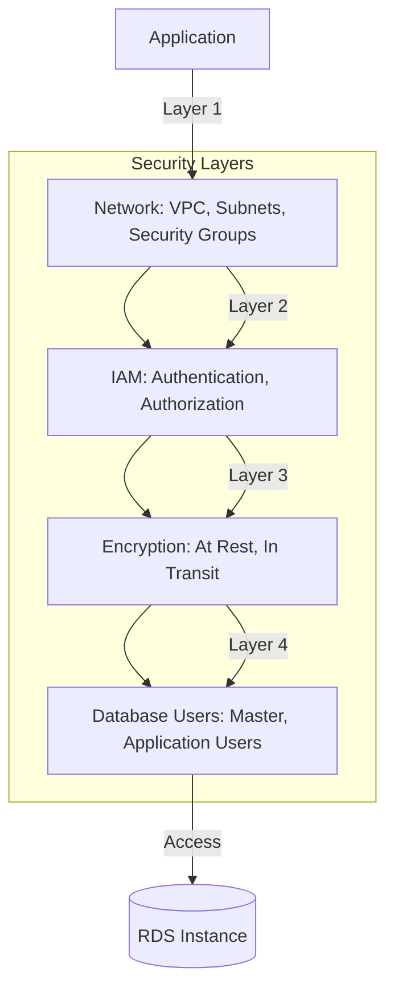

# RDS Security and Backup

**Duration**: 30 minutes  
**Difficulty**: Advanced  
**Skills**: Security groups, encryption, IAM, backups, snapshots, PITR

## RDS Security Layers



## Network Security

### VPC Placement Best Practices

✅ **Production**:
- Place RDS in **private subnets** (no IGW route)
- **Publicly accessible**: `No`
- Multi-AZ: across different private subnets

❌ **Avoid**:
- Public subnets with IGW
- `Publicly accessible: Yes`
- Single subnet (no redundancy)

### Security Group Configuration

**RDS Security Group** (inbound rules):

| Type | Protocol | Port | Source | Purpose |
|------|----------|------|--------|---------|
| MySQL/Aurora | TCP | 3306 | `sg-web-servers` | Web tier access |
| PostgreSQL | TCP | 5432 | `sg-app-servers` | App tier access |
| Custom TCP | TCP | 3306 | `sg-bastion` | Admin access (bastion) |

**Best Practices**:
- **Never** allow `0.0.0.0/0` (internet) to database port
- Use **source security groups** instead of CIDR blocks
- Separate SGs for different application tiers
- No outbound rules needed (responses allowed by default)

### Console Steps

1. EC2 console → **Security Groups** → **Create security group**
2. Name: `sg-rds-mysql`, VPC: select your VPC
3. **Inbound rules** → **Add rule**:
   - Type: `MySQL/Aurora`
   - Source: `Custom` → select `sg-web-servers`
4. **Create security group**
5. Attach to RDS instance during creation or modify later

### CLI Commands

```bash
# Create RDS security group
SG_RDS=$(aws ec2 create-security-group \
  --group-name sg-rds-mysql \
  --description "RDS MySQL access from web tier" \
  --vpc-id vpc-xxxxx \
  --region us-east-1 \
  --query 'GroupId' \
  --output text)

# Add inbound rule (source: web server SG)
aws ec2 authorize-security-group-ingress \
  --group-id $SG_RDS \
  --protocol tcp \
  --port 3306 \
  --source-group sg-web-xxxxx \
  --region us-east-1
```

## IAM Database Authentication

### Overview

- Use IAM credentials instead of database passwords
- Token-based authentication (15-minute validity)
- Centralized access management via IAM policies
- Works with MySQL and PostgreSQL

### Console Steps

1. Create/Modify RDS instance
2. **Database authentication** → Enable **Password and IAM database authentication**
3. Apply changes

### IAM Policy Example

```json
{
  "Version": "2012-10-17",
  "Statement": [
    {
      "Effect": "Allow",
      "Action": "rds-db:connect",
      "Resource": "arn:aws:rds-db:us-east-1:123456789012:dbuser:db-ABCDEFGHIJK/app_user"
    }
  ]
}
```

### Connecting with IAM

```bash
# Generate authentication token
TOKEN=$(aws rds generate-db-auth-token \
  --hostname mydb.xxxxx.us-east-1.rds.amazonaws.com \
  --port 3306 \
  --username app_user \
  --region us-east-1)

# Connect with token as password
mysql -h mydb.xxxxx.us-east-1.rds.amazonaws.com \
  -P 3306 \
  -u app_user \
  --password="$TOKEN" \
  --enable-cleartext-plugin
```

## Encryption

### Encryption at Rest

- **KMS-based**: AWS managed keys or customer managed keys
- **Cannot enable after creation**: must create new encrypted instance and migrate
- Encrypts: DB storage, backups, snapshots, logs, replicas

**Console Steps** (during creation only):
1. Create database → **Encryption** section
2. Enable **Encryption**
3. Choose KMS key: `(Default) aws/rds` or custom key
4. Create instance

**CLI Example**:
```bash
aws rds create-db-instance \
  --db-instance-identifier encrypted-db \
  --db-instance-class db.t3.micro \
  --engine mysql \
  --master-username admin \
  --master-user-password SecurePass123 \
  --allocated-storage 20 \
  --storage-encrypted \
  --kms-key-id arn:aws:kms:us-east-1:123456789012:key/xxxxx \
  --region us-east-1
```

### Encryption in Transit (SSL/TLS)

**Forcing SSL Connections** (MySQL):

```sql
-- Connect as master user and create user requiring SSL
CREATE USER 'app_user'@'%' IDENTIFIED BY 'password' REQUIRE SSL;
GRANT ALL PRIVILEGES ON mydb.* TO 'app_user'@'%';
FLUSH PRIVILEGES;
```

**Connecting with SSL**:

```bash
# Download RDS CA certificate
wget https://truststore.pki.rds.amazonaws.com/global/global-bundle.pem

# Connect with SSL
mysql -h mydb.xxxxx.us-east-1.rds.amazonaws.com \
  -P 3306 \
  -u app_user \
  -p \
  --ssl-ca=global-bundle.pem \
  --ssl-mode=REQUIRED
```

## Database User Management

### Master User

- Created during instance launch
- Has all privileges except `SUPER`
- Used for administrative tasks and creating other users

### Creating Application Users

```sql
-- Connect as master user
mysql -h mydb.endpoint.rds.amazonaws.com -u admin -p

-- Create read-only user
CREATE USER 'readonly'@'%' IDENTIFIED BY 'ReadOnlyPass123';
GRANT SELECT ON mydb.* TO 'readonly'@'%';

-- Create read-write user (least privilege)
CREATE USER 'appuser'@'%' IDENTIFIED BY 'AppUserPass123';
GRANT SELECT, INSERT, UPDATE, DELETE ON mydb.app_tables TO 'appuser'@'%';

FLUSH PRIVILEGES;
```

**Best Practice**: Never use master user in application code

## Automated Backups

### Configuration

| Parameter | Value | Notes |
|-----------|-------|-------|
| **Backup retention** | 0-35 days | 0 = disabled, 7 days recommended |
| **Backup window** | HH:MM-HH:MM | Specify or let AWS choose |
| **Backup storage** | Automated | Up to 20GB free (Free Tier) |

### How It Works

1. Daily full snapshot during backup window
2. Transaction logs captured continuously
3. Enables Point-in-Time Recovery (PITR)
4. Deleted when instance is deleted (unless final snapshot taken)

### Console Steps

1. Create/Modify database
2. **Backup** section
3. **Backup retention period**: `7` days
4. **Backup window**: `03:00-04:00 UTC` or **No preference**
5. Apply changes

### CLI Commands

```bash
# Enable automated backups (modify existing instance)
aws rds modify-db-instance \
  --db-instance-identifier mydb \
  --backup-retention-period 7 \
  --preferred-backup-window "03:00-04:00" \
  --region us-east-1

# Create instance with backups
aws rds create-db-instance \
  --db-instance-identifier mydb \
  --backup-retention-period 7 \
  --preferred-backup-window "03:00-04:00" \
  [other parameters...] \
  --region us-east-1
```

## Manual Snapshots

### Overview

- User-initiated backups
- Retained indefinitely until manually deleted
- Useful for pre-maintenance, pre-migration, archival
- Can be shared with other AWS accounts
- Can be copied to other regions

### Console Steps

1. RDS console → **Databases** → select instance
2. **Actions** → **Take snapshot**
3. **Snapshot name**: `mydb-pre-upgrade-2025-12-31`
4. **Take snapshot** (5-15 minutes depending on size)

### CLI Commands

```bash
# Create manual snapshot
aws rds create-db-snapshot \
  --db-instance-identifier mydb \
  --db-snapshot-identifier mydb-pre-upgrade-2025-12-31 \
  --region us-east-1

# List snapshots
aws rds describe-db-snapshots \
  --db-instance-identifier mydb \
  --region us-east-1

# Copy snapshot to another region
aws rds copy-db-snapshot \
  --source-db-snapshot-identifier arn:aws:rds:us-east-1:123456789012:snapshot:mydb-snapshot \
  --target-db-snapshot-identifier mydb-snapshot-replica \
  --source-region us-east-1 \
  --region eu-west-1

# Share snapshot with another account
aws rds modify-db-snapshot-attribute \
  --db-snapshot-identifier mydb-snapshot \
  --attribute-name restore \
  --values-to-add 987654321098 \
  --region us-east-1
```

## Point-in-Time Recovery (PITR)

### Overview

- Restore database to any point within backup retention period
- Uses automated backups + transaction logs
- 5-minute granularity
- Creates new instance (cannot overwrite existing)

### Console Steps

1. RDS console → **Automated backups**
2. Select backup → **Actions** → **Restore to point in time**
3. **Restore date and time**: `2025-12-31 10:30:00 UTC`
4. **DB instance identifier**: `mydb-restored`
5. Configure networking, security (same as original or different)
6. **Restore DB instance**

### CLI Commands

```bash
# Restore to specific time
aws rds restore-db-instance-to-point-in-time \
  --source-db-instance-identifier mydb \
  --target-db-instance-identifier mydb-restored \
  --restore-time 2025-12-31T10:30:00Z \
  --db-instance-class db.t3.micro \
  --vpc-security-group-ids sg-xxxxx \
  --db-subnet-group-name mydb-subnet-group \
  --region us-east-1

# Restore to latest restorable time
aws rds restore-db-instance-to-point-in-time \
  --source-db-instance-identifier mydb \
  --target-db-instance-identifier mydb-restored-latest \
  --use-latest-restorable-time \
  --region us-east-1
```

## Backup vs Snapshot Comparison

| Feature | Automated Backups | Manual Snapshots |
|---------|-------------------|------------------|
| **Trigger** | Automatic (daily) | Manual (user-initiated) |
| **Retention** | 0-35 days (configurable) | Indefinite (until deleted) |
| **PITR** | Yes (5-min granularity) | No (snapshot time only) |
| **Cost** | Free up to DB size (20GB Free Tier) | $0.095/GB-month beyond Free Tier |
| **Deletion** | With instance (unless final snapshot) | Manual deletion required |
| **Sharing** | No | Yes (cross-account, cross-region) |
| **Use Case** | Day-to-day recovery | Pre-maintenance, archival, DR |

## Restore Procedures

### From Automated Backup (PITR)

1. Identify restore time (application log timestamp)
2. Restore to point in time (creates new instance)
3. Verify data integrity
4. Update application endpoint
5. Delete old instance if restore successful

### From Manual Snapshot

1. Select snapshot → **Actions** → **Restore snapshot**
2. Specify new DB instance identifier
3. Configure networking, security groups
4. Restore (creates new instance)
5. Verify and update application

### Testing Restores (Competition Verification)

```bash
# 1. Create snapshot
aws rds create-db-snapshot \
  --db-instance-identifier mydb \
  --db-snapshot-identifier mydb-test-restore \
  --region us-east-1

# 2. Restore to new instance
aws rds restore-db-instance-from-db-snapshot \
  --db-instance-identifier mydb-restored \
  --db-snapshot-identifier mydb-test-restore \
  --db-instance-class db.t3.micro \
  --region us-east-1

# 3. Connect and verify data
mysql -h mydb-restored.xxxxx.rds.amazonaws.com -u admin -p

# 4. Delete test instance
aws rds delete-db-instance \
  --db-instance-identifier mydb-restored \
  --skip-final-snapshot \
  --region us-east-1
```

## Backup Verification Checklist

- [ ] Automated backups enabled (retention ≥7 days)
- [ ] Backup window configured (off-peak hours)
- [ ] Manual snapshot taken before major changes
- [ ] PITR tested successfully
- [ ] Restore process documented
- [ ] Backup storage within Free Tier (≤20GB)
- [ ] Cross-region snapshot copy for DR (if required)

## Cost Considerations

| Resource | Free Tier | Beyond Free Tier |
|----------|-----------|------------------|
| DB storage | 20GB | $0.115/GB-month (gp3) |
| Backup storage | 20GB (DB size) | $0.095/GB-month |
| Snapshot storage | Included in backup | $0.095/GB-month |
| Data transfer | 1GB/month out | $0.09/GB |
| PITR | Included | Included |

**Tips**:
- Delete old manual snapshots
- Use lifecycle policies for automated cleanup
- Monitor backup storage in billing dashboard

## Competition Tips

- **Always enable** automated backups (7 days minimum)
- Document backup strategy in solution design
- Test restore procedure if time permits
- Use manual snapshots before risky operations
- Know PITR granularity (5 minutes)
- Understand encryption requirements (cannot enable post-creation)

## Common Mistakes

- Disabling automated backups (retention = 0)
- Not testing restore procedures
- Allowing 0.0.0.0/0 in RDS security group
- Using master user in application code
- Forgetting to enable encryption at creation
- Not documenting DB password securely
- Public accessibility enabled
- Placing RDS in public subnet

## Cross-References

- RDS overview: [aws-worldskills-notes/07_rds/overview.md](aws-worldskills-notes/07_rds/overview.md)
- VPC security: [aws-worldskills-notes/05_vpc/overview.md](aws-worldskills-notes/05_vpc/overview.md)
- Security groups: [aws-worldskills-notes/03_ec2/security_groups.md](aws-worldskills-notes/03_ec2/security_groups.md)
- Hands-on lab: [aws-worldskills-notes/07_rds/server_lab.md](aws-worldskills-notes/07_rds/server_lab.md)
