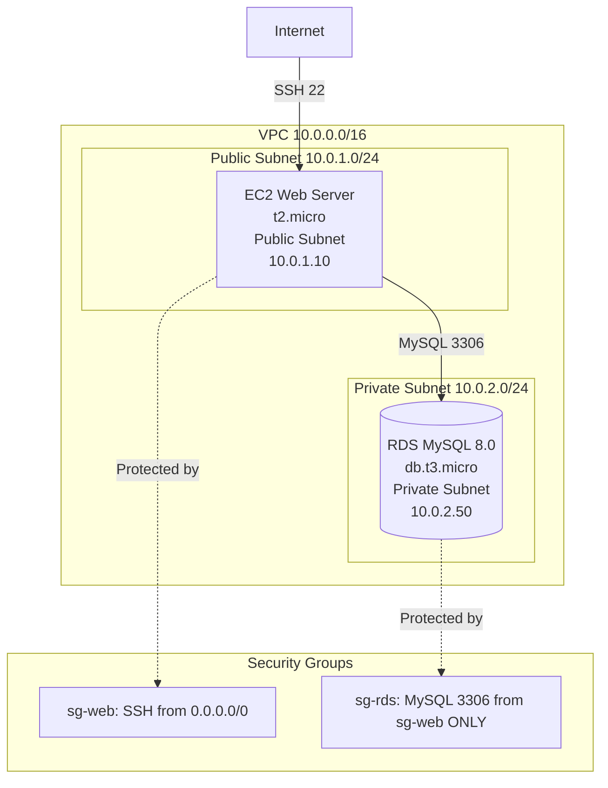

# RDS Server Lab: EC2-RDS Connection

**Duration**: 30 minutes  
**Free Tier**: Yes (db.t3.micro + t2.micro EC2)  
**Difficulty**: Intermediate  
**Skills**: RDS creation, VPC networking, security groups, MySQL client

## Problem Statement

Deploy a secure RDS MySQL database in a private subnet and connect from an EC2 web server in a public subnet. The database will store user data for a web application.

**Requirements**:
- RDS MySQL 8.0 instance (db.t3.micro) in **private subnet**
- EC2 web server (t2.micro) in **public subnet**
- Database accessible **only from EC2 instance** (security group restriction)
- Automated backups enabled (7 days retention)
- No public accessibility for RDS
- Create sample database with test data

**Constraints**:
- Region: `us-east-1`
- Time limit: 30 minutes
- Budget: Free Tier only
- VPC: Use existing VPC with public/private subnets

## Architecture Diagram



## Step-by-Step Implementation

### Step 1: Create DB Subnet Group (5 minutes)

DB subnet groups define which subnets RDS can use (must span ≥2 AZs).

#### AWS Console

1. RDS console → **Subnet groups** (left menu)
2. **Create DB subnet group**
3. **Name**: `mydb-subnet-group`
4. **Description**: `Private subnets for RDS`
5. **VPC**: Select your VPC (e.g., `lab-vpc`)
6. **Availability Zones**: Select `us-east-1a` and `us-east-1b`
7. **Subnets**: Select **private subnets** in both AZs
   - Example: `10.0.2.0/24` (1a), `10.0.3.0/24` (1b)
8. **Create**

#### AWS CLI

```bash
# Create DB subnet group
aws rds create-db-subnet-group \
  --db-subnet-group-name mydb-subnet-group \
  --db-subnet-group-description "Private subnets for RDS" \
  --subnet-ids subnet-private-1a subnet-private-1b \
  --region us-east-1
```

### Step 2: Create RDS Security Group (5 minutes)

#### AWS Console

1. EC2 console → **Security Groups** → **Create security group**
2. **Name**: `sg-rds-mysql`
3. **Description**: `Allow MySQL from web servers only`
4. **VPC**: Select your VPC
5. **Inbound rules** → **Add rule**:
   - Type: `MySQL/Aurora` (auto-fills port 3306)
   - Source: `Custom` → Select `sg-web` (EC2 security group)
   - Description: `MySQL from web tier`
6. **Outbound rules**: Leave default (all traffic)
7. **Create security group**

#### AWS CLI

```bash
# Get web server security group ID
SG_WEB=sg-web-xxxxx

# Create RDS security group
SG_RDS=$(aws ec2 create-security-group \
  --group-name sg-rds-mysql \
  --description "Allow MySQL from web servers only" \
  --vpc-id vpc-xxxxx \
  --region us-east-1 \
  --query 'GroupId' \
  --output text)

# Add inbound rule
aws ec2 authorize-security-group-ingress \
  --group-id $SG_RDS \
  --protocol tcp \
  --port 3306 \
  --source-group $SG_WEB \
  --region us-east-1
```

### Step 3: Launch RDS MySQL Instance (15 minutes)

**Note**: Instance creation takes 5-10 minutes; proceed to Step 4 while waiting.

#### AWS Console

1. RDS console → **Databases** → **Create database**
2. **Engine options**:
   - Engine type: **MySQL**
   - Version: **MySQL 8.0.35** (latest)
3. **Templates**: **Free tier** (auto-selects db.t3.micro)
4. **Settings**:
   - DB instance identifier: `web-app-db`
   - Master username: `admin`
   - Master password: `MySecurePass123!` (note this down)
   - Confirm password: `MySecurePass123!`
5. **Instance configuration**: **db.t3.micro** (pre-selected)
6. **Storage**:
   - Storage type: **General Purpose SSD (gp3)**
   - Allocated storage: `20` GB
   - Disable **Enable storage autoscaling** (stay in Free Tier)
7. **Connectivity**:
   - VPC: Select your VPC
   - DB subnet group: **mydb-subnet-group**
   - Public access: **No** (critical for security)
   - VPC security group: **Choose existing** → `sg-rds-mysql`
   - Availability Zone: `us-east-1a` (or No preference)
8. **Database authentication**: **Password authentication**
9. **Additional configuration**:
   - Initial database name: `appdb`
   - Backup retention period: `7` days
   - Backup window: **No preference**
   - Enable auto minor version upgrade: Yes
   - Maintenance window: **No preference**
10. **Create database** (takes 5-10 minutes)

#### AWS CLI

```bash
aws rds create-db-instance \
  --db-instance-identifier web-app-db \
  --db-instance-class db.t3.micro \
  --engine mysql \
  --engine-version 8.0.35 \
  --master-username admin \
  --master-user-password MySecurePass123! \
  --allocated-storage 20 \
  --storage-type gp3 \
  --db-name appdb \
  --vpc-security-group-ids $SG_RDS \
  --db-subnet-group-name mydb-subnet-group \
  --backup-retention-period 7 \
  --no-publicly-accessible \
  --region us-east-1

# Monitor creation status
aws rds describe-db-instances \
  --db-instance-identifier web-app-db \
  --query 'DBInstances[0].DBInstanceStatus' \
  --output text \
  --region us-east-1
# Output: creating → backing-up → available
```

### Step 4: Launch EC2 Instance (5 minutes)

While RDS is creating, launch EC2 instance with MySQL client.

#### AWS Console

1. EC2 console → **Launch instance**
2. **Name**: `web-server`
3. **AMI**: Amazon Linux 2023
4. **Instance type**: `t2.micro`
5. **Key pair**: Select existing or create new
6. **Network settings**:
   - VPC: Select your VPC
   - Subnet: **Public subnet** (10.0.1.0/24)
   - Auto-assign public IP: **Enable**
   - Security group: Select `sg-web` (allows SSH)
7. **Advanced details** → **User data**:

```bash
#!/bin/bash
yum update -y
yum install -y mysql
echo "MySQL client installed" > /tmp/mysql-setup.log
```

8. **Launch instance**

#### AWS CLI

```bash
# User data script
cat > userdata.sh << 'EOF'
#!/bin/bash
yum update -y
yum install -y mysql
echo "MySQL client installed" > /tmp/mysql-setup.log
EOF

# Launch instance
aws ec2 run-instances \
  --image-id ami-0c55b159cbfafe1f0 \
  --instance-type t2.micro \
  --key-name lab-key \
  --subnet-id subnet-public-1a \
  --security-group-ids sg-web-xxxxx \
  --associate-public-ip-address \
  --user-data file://userdata.sh \
  --tag-specifications 'ResourceType=instance,Tags=[{Key=Name,Value=web-server}]' \
  --region us-east-1
```

### Step 5: Retrieve RDS Endpoint (2 minutes)

#### AWS Console

1. RDS console → **Databases** → `web-app-db`
2. Wait for **Status**: `Available`
3. **Connectivity & security** tab
4. Copy **Endpoint**: `web-app-db.xxxxxxxxxxxxx.us-east-1.rds.amazonaws.com`
5. Note **Port**: `3306`

#### AWS CLI

```bash
# Get endpoint
aws rds describe-db-instances \
  --db-instance-identifier web-app-db \
  --query 'DBInstances[0].Endpoint.Address' \
  --output text \
  --region us-east-1
```

### Step 6: Connect from EC2 to RDS (3 minutes)

#### SSH to EC2

```bash
# From your local machine
ssh -i lab-key.pem ec2-user@<EC2_PUBLIC_IP>

# Verify MySQL client installed
mysql --version
# Output: mysql  Ver 8.0.35 for Linux on x86_64
```

#### Connect to RDS

```bash
# Replace with your RDS endpoint
mysql -h web-app-db.xxxxxxxxxxxxx.us-east-1.rds.amazonaws.com \
  -P 3306 \
  -u admin \
  -p

# Enter password when prompted: MySecurePass123!
```

**Expected Output**:
```
Welcome to the MySQL monitor.  Commands end with ; or \g.
Your MySQL connection id is 12
Server version: 8.0.35 Source distribution

mysql>
```

### Step 7: Create Sample Database and Data (5 minutes)

```sql
-- Verify default database
SHOW DATABASES;
-- Output: appdb, information_schema, mysql, performance_schema

-- Use application database
USE appdb;

-- Create users table
CREATE TABLE users (
    id INT AUTO_INCREMENT PRIMARY KEY,
    username VARCHAR(50) NOT NULL UNIQUE,
    email VARCHAR(100) NOT NULL,
    created_at TIMESTAMP DEFAULT CURRENT_TIMESTAMP
);

-- Insert test data
INSERT INTO users (username, email) VALUES
    ('john_doe', 'john@example.com'),
    ('jane_smith', 'jane@example.com'),
    ('bob_wilson', 'bob@example.com');

-- Verify data
SELECT * FROM users;
```

**Expected Output**:
```
+----+------------+-------------------+---------------------+
| id | username   | email             | created_at          |
+----+------------+-------------------+---------------------+
|  1 | john_doe   | john@example.com  | 2025-12-31 10:30:00 |
|  2 | jane_smith | jane@example.com  | 2025-12-31 10:30:01 |
|  3 | bob_wilson | bob@example.com   | 2025-12-31 10:30:02 |
+----+------------+-------------------+---------------------+
3 rows in set (0.00 sec)
```

### Step 8: Verify Security (2 minutes)

#### Test 1: Connection from EC2 (Should Succeed)

Already tested in Step 6 ✅

#### Test 2: Connection from Internet (Should Fail)

```bash
# From your local machine (outside AWS)
mysql -h web-app-db.xxxxxxxxxxxxx.us-east-1.rds.amazonaws.com \
  -P 3306 \
  -u admin \
  -p

# Expected: Timeout or connection refused (security group blocks)
```

If connection succeeds from local machine:
- ❌ **CRITICAL ERROR**: RDS is publicly accessible or security group misconfigured
- Fix: Modify RDS to disable public accessibility and verify security group

## Verification Checklist

- [ ] RDS instance status: **Available**
- [ ] RDS in **private subnet** (no IGW route)
- [ ] Public accessibility: **No**
- [ ] Security group allows MySQL (3306) from `sg-web` only
- [ ] EC2 instance running in **public subnet**
- [ ] MySQL client installed on EC2
- [ ] Connection from EC2 to RDS: **Success**
- [ ] Database `appdb` created
- [ ] Table `users` with 3 rows
- [ ] Automated backups enabled (7 days retention)
- [ ] Connection from internet: **Fails** (security validation)

## Common Mistakes

| Mistake | Impact | Fix |
|---------|--------|-----|
| RDS in public subnet | Security risk | Recreate in private subnet |
| Public accessibility: Yes | Internet exposed | Modify instance, disable |
| Security group: 0.0.0.0/0 | Anyone can connect | Change source to `sg-web` |
| Forgot MySQL client on EC2 | Cannot connect | Install: `yum install -y mysql` |
| Using writer endpoint as reader | None (works but inefficient) | Use correct endpoint for role |
| Wrong password | Authentication failed | Check saved password |
| DB subnet group in 1 AZ | Cannot create Multi-AZ | Add subnets in ≥2 AZs |
| Multi-AZ enabled | Exceeds Free Tier | Disable during creation |

## Troubleshooting

### Connection Timeout from EC2

```bash
# Check security group
aws ec2 describe-security-groups \
  --group-ids $SG_RDS \
  --query 'SecurityGroups[0].IpPermissions' \
  --region us-east-1

# Verify source is sg-web, not 0.0.0.0/0
```

**Fix**: Add rule allowing port 3306 from `sg-web`

### Access Denied

```
ERROR 1045 (28000): Access denied for user 'admin'@'x.x.x.x' (using password: YES)
```

**Fix**: Verify password, username (`admin`), and master credentials

### Unknown Database 'appdb'

```sql
-- Check databases
SHOW DATABASES;

-- Create if missing
CREATE DATABASE appdb;
```

### RDS Creation Takes Too Long

- Normal: 5-10 minutes for db.t3.micro
- Check status: Console → Databases → `web-app-db` → Status
- If >15 minutes: Check CloudTrail for errors

## Mark Mapping (60 marks total)

| Task | Marks | Verification |
|------|-------|--------------|
| DB subnet group created (≥2 AZs) | 5 | Console: Subnet groups |
| RDS security group (MySQL from sg-web only) | 10 | Console: Security group rules |
| RDS instance created (correct specs) | 15 | Status: Available, db.t3.micro |
| Connection from EC2 succeeds | 10 | MySQL prompt, `SHOW DATABASES;` |
| Database and table creation | 5 | `SELECT * FROM users;` returns 3 rows |
| Automated backups configured (7 days) | 5 | Console: Maintenance & backups |
| Security validation (no external access) | 5 | Connection from local machine fails |
| Documentation and verification | 5 | Screenshots, checklist completed |

## Cleanup

To avoid charges after lab:

```bash
# Delete RDS instance
aws rds delete-db-instance \
  --db-instance-identifier web-app-db \
  --skip-final-snapshot \
  --region us-east-1

# Terminate EC2 instance
aws ec2 terminate-instances \
  --instance-ids i-xxxxx \
  --region us-east-1

# Delete security groups (after instances deleted)
aws ec2 delete-security-group --group-id $SG_RDS --region us-east-1
aws ec2 delete-security-group --group-id $SG_WEB --region us-east-1

# Delete DB subnet group
aws rds delete-db-subnet-group \
  --db-subnet-group-name mydb-subnet-group \
  --region us-east-1
```

## Time Breakdown

| Step | Time |
|------|------|
| Create DB subnet group | 5 min |
| Create RDS security group | 5 min |
| Launch RDS instance | 15 min (10 min waiting) |
| Launch EC2 instance | 5 min |
| Retrieve endpoint | 2 min |
| Connect from EC2 | 3 min |
| Create database/data | 5 min |
| Verify security | 2 min |
| **Total** | **30 min** |

## Summary

- ✅ Deployed secure RDS MySQL in private subnet
- ✅ Connected from EC2 in public subnet
- ✅ Created sample database with test data
- ✅ Verified security (no public access)
- ✅ Automated backups enabled
- ✅ Stayed within Free Tier limits

## Next Steps

- Enable Multi-AZ for high availability
- Create Read Replica for read scaling
- Implement IAM database authentication
- Enable encryption at rest (new instance required)
- Configure CloudWatch alarms for monitoring

## Cross-References

- RDS overview: [aws-worldskills-notes/07_rds/overview.md](aws-worldskills-notes/07_rds/overview.md)
- Engine selection: [aws-worldskills-notes/07_rds/engine_selection.md](aws-worldskills-notes/07_rds/engine_selection.md)
- Multi-AZ: [aws-worldskills-notes/07_rds/multi_az_read_replica.md](aws-worldskills-notes/07_rds/multi_az_read_replica.md)
- Security: [aws-worldskills-notes/07_rds/security_backup.md](aws-worldskills-notes/07_rds/security_backup.md)
- VPC fundamentals: [aws-worldskills-notes/05_vpc/overview.md](aws-worldskills-notes/05_vpc/overview.md)
- Security groups: [aws-worldskills-notes/03_ec2/security_groups.md](aws-worldskills-notes/03_ec2/security_groups.md)
- EC2 basics: [aws-worldskills-notes/03_ec2/overview.md](aws-worldskills-notes/03_ec2/overview.md)
