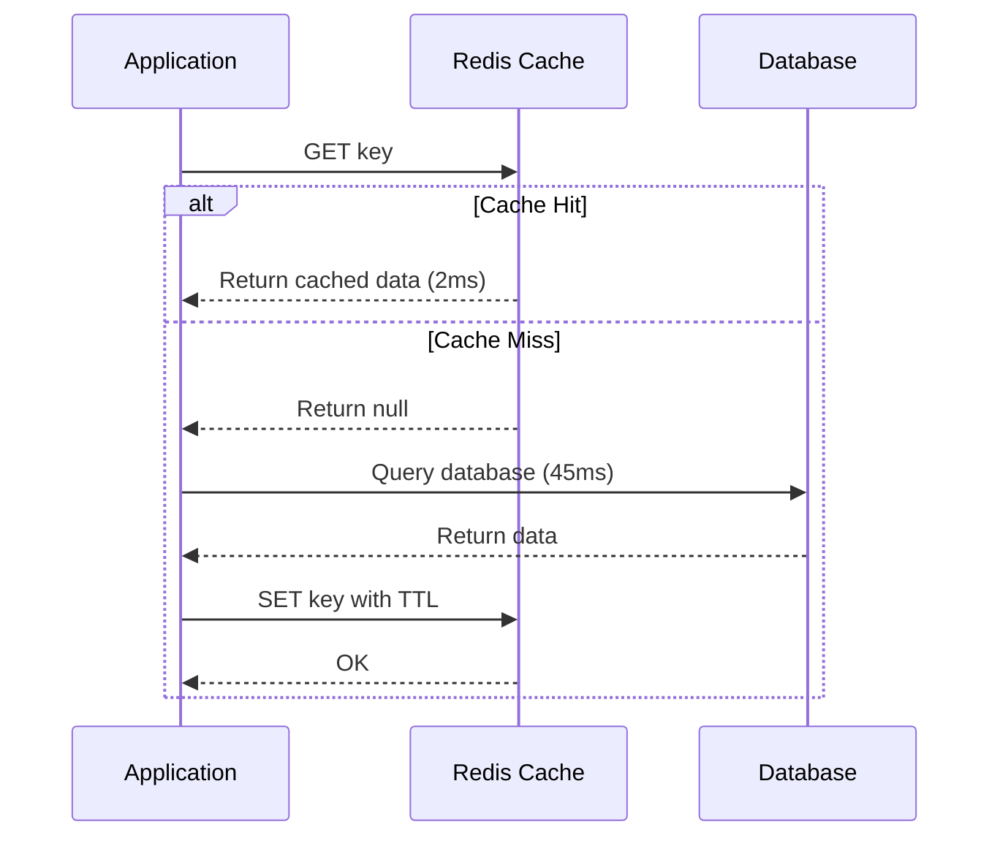
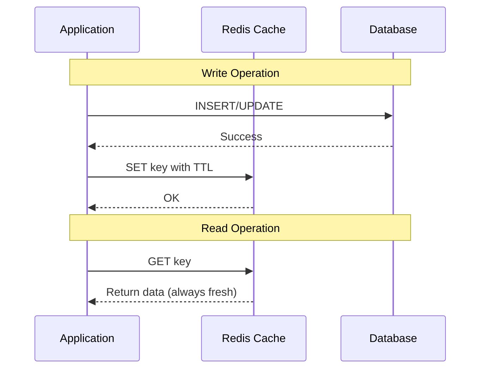

# Caching Patterns

**Duration**: 25 minutes  
**Difficulty**: Advanced  
**Skills**: Architecture design, consistency management, performance optimization

## Why Patterns Matter

Caching patterns define **how** and **when** data moves between cache and database. The wrong pattern can lead to:
- Stale data serving incorrect information
- Cache stampede (thundering herd problem)
- Wasted cache memory
- Poor cache hit ratios

Choosing the right pattern depends on:
- Read vs write frequency
- Consistency requirements
- Performance goals
- Failure tolerance

## Pattern 1: Lazy Loading (Cache-Aside)

### Concept

Application checks cache first. On miss, query database and populate cache. On hit, return cached data immediately.

**Flow Diagram**:



### Advantages

✅ **Memory efficient**: Only requested data is cached  
✅ **Resilient**: Cache failures don't break application (degraded performance only)  
✅ **Simple to implement**: Straightforward logic  
✅ **Works with existing code**: Minimal refactoring required

### Disadvantages

❌ **Cache miss penalty**: Three round trips (cache check, DB query, cache write)  
❌ **Stale data possible**: If not invalidated, serves old data until TTL expires  
❌ **Cold cache problem**: Initial requests are slow  
❌ **Cache stampede risk**: Multiple requests hit DB simultaneously on popular key expiration

### Python Implementation

```python
import redis
import pymysql
import json

# Connect to Redis
r = redis.Redis(
    host='redis-endpoint.cache.amazonaws.com',
    port=6379,
    decode_responses=True
)

# Connect to MySQL
db = pymysql.connect(
    host='db-endpoint.rds.amazonaws.com',
    user='admin',
    password='password',
    database='mydb'
)

def get_user(user_id):
    """Lazy loading pattern for user profile"""
    cache_key = f'user:{user_id}'
    
    # 1. Try cache first
    cached_data = r.get(cache_key)
    
    if cached_data:
        print(f"Cache HIT for user {user_id}")
        return json.loads(cached_data)
    
    # 2. Cache miss - query database
    print(f"Cache MISS for user {user_id}")
    cursor = db.cursor(pymysql.cursors.DictCursor)
    cursor.execute("SELECT * FROM users WHERE id = %s", (user_id,))
    user_data = cursor.fetchone()
    cursor.close()
    
    if user_data:
        # 3. Store in cache with 1 hour TTL
        r.setex(cache_key, 3600, json.dumps(user_data))
    
    return user_data

# Usage
user = get_user(1000)
print(user)
# First call: Cache MISS (slow)
# Subsequent calls: Cache HIT (fast)
```

### When to Use

✅ **Read-heavy workloads**: 90%+ reads, <10% writes  
✅ **Data that doesn't change frequently**: Product catalogs, configuration  
✅ **Acceptable to serve slightly stale data**: Not financial transactions  
✅ **Development/testing environments**: Simple to debug

### WorldSkills Example: Product Catalog

```python
def get_product(product_id):
    """Cache product details with 24h TTL"""
    cache_key = f'product:{product_id}'
    
    # Check cache
    cached_product = r.get(cache_key)
    if cached_product:
        return json.loads(cached_product)
    
    # Query database
    cursor = db.cursor(pymysql.cursors.DictCursor)
    cursor.execute(
        "SELECT id, name, price, description FROM products WHERE id = %s",
        (product_id,)
    )
    product = cursor.fetchone()
    cursor.close()
    
    # Cache for 24 hours (products rarely change)
    if product:
        r.setex(cache_key, 86400, json.dumps(product))
    
    return product
```

## Pattern 2: Write-Through

### Concept

Write to cache and database **simultaneously**. Cache is always up-to-date. No cache misses for written data.

**Flow Diagram**:



### Advantages

✅ **Data consistency**: Cache and database always in sync  
✅ **No cache miss penalty**: Written data immediately available in cache  
✅ **Predictable performance**: No surprise slow queries  
✅ **Strong consistency**: Ideal for read-after-write scenarios

### Disadvantages

❌ **Write latency**: Two write operations (cache + database)  
❌ **Wasted cache space**: Data written but never read  
❌ **Complex error handling**: Must handle partial failures  
❌ **Write amplification**: Every write goes to cache (even if not read)

### Python Implementation

```python
def create_user(user_data):
    """Write-through pattern for user creation"""
    # 1. Write to database first (source of truth)
    cursor = db.cursor()
    cursor.execute(
        "INSERT INTO users (name, email, age) VALUES (%s, %s, %s)",
        (user_data['name'], user_data['email'], user_data['age'])
    )
    db.commit()
    user_id = cursor.lastrowid
    cursor.close()
    
    # 2. Write to cache immediately
    cache_key = f'user:{user_id}'
    user_data['id'] = user_id
    r.setex(cache_key, 3600, json.dumps(user_data))
    
    return user_id

def update_user(user_id, user_data):
    """Write-through pattern for user update"""
    cache_key = f'user:{user_id}'
    
    # 1. Update database
    cursor = db.cursor()
    cursor.execute(
        "UPDATE users SET name=%s, email=%s WHERE id=%s",
        (user_data['name'], user_data['email'], user_id)
    )
    db.commit()
    cursor.close()
    
    # 2. Update cache (or invalidate)
    r.setex(cache_key, 3600, json.dumps(user_data))
    
    return True
```

### When to Use

✅ **Write-heavy workloads**: Frequent updates  
✅ **Strong consistency required**: Financial transactions, inventory  
✅ **Frequently read after write**: User profiles after registration  
✅ **Predictable performance needed**: No cache miss surprises

### WorldSkills Example: User Session Management

```python
def create_session(user_id, session_token):
    """Write-through for session creation"""
    session_data = {
        'user_id': user_id,
        'created_at': time.time(),
        'last_active': time.time()
    }
    
    # Write to database
    cursor = db.cursor()
    cursor.execute(
        "INSERT INTO sessions (token, user_id, created_at) VALUES (%s, %s, %s)",
        (session_token, user_id, session_data['created_at'])
    )
    db.commit()
    cursor.close()
    
    # Write to cache (30 min TTL)
    cache_key = f'session:{session_token}'
    r.setex(cache_key, 1800, json.dumps(session_data))
    
    return session_token
```

## Pattern 3: Time-To-Live (TTL) Strategy

### Concept

Set expiration time on cached data. Automatic eviction after TTL expires. Balance freshness and performance.

### TTL Selection Guidelines

| Data Type | TTL | Reasoning |
|-----------|-----|-----------|
| Static content (CSS, images) | 24 hours (86400s) | Rarely changes |
| Product catalog | 1 hour (3600s) | Updates during business hours |
| User profiles | 15 minutes (900s) | Moderate update frequency |
| Stock prices | 10 seconds (10s) | High volatility |
| Session data | 30 minutes (1800s) | Security/timeout requirement |
| Configuration | 5 minutes (300s) | Balance freshness and performance |

### Python Implementation

```python
# Set with TTL
r.setex('product:123', 86400, json.dumps(product_data))  # 24 hours

# Set without TTL, add later
r.set('session:abc', json.dumps(session_data))
r.expire('session:abc', 1800)  # 30 minutes

# Check remaining TTL
ttl = r.ttl('product:123')
if ttl > 0:
    print(f"Expires in {ttl} seconds")
elif ttl == -1:
    print("Key exists but no TTL set")
elif ttl == -2:
    print("Key does not exist")

# Refresh TTL on access
def get_product_with_ttl_refresh(product_id):
    cache_key = f'product:{product_id}'
    product = r.get(cache_key)
    
    if product:
        # Refresh TTL on access (sliding expiration)
        r.expire(cache_key, 3600)
        return json.loads(product)
    
    # Cache miss logic...
```

### Best Practices

- **Always set TTL**: Prevents memory exhaustion
- **Short TTL for dynamic data**: Stock prices, live scores (10-60s)
- **Long TTL for static data**: Product catalogs, images (hours to days)
- **TTL based on business rules**: Session timeout, compliance requirements
- **Monitor evictions**: High eviction rate = TTL too short or node too small

## Pattern 4: Cache Invalidation

### Concept

Explicitly remove or update cache when data changes. Ensures consistency without waiting for TTL expiration.

### Strategies

**1. Delete on Write**:
```python
def delete_user(user_id):
    cache_key = f'user:{user_id}'
    
    # Delete from database
    cursor = db.cursor()
    cursor.execute("DELETE FROM users WHERE id=%s", (user_id,))
    db.commit()
    cursor.close()
    
    # Invalidate cache
    r.delete(cache_key)
    
    return True
```

**2. Update on Write** (Write-through):
```python
def update_user(user_id, user_data):
    cache_key = f'user:{user_id}'
    
    # Update database
    cursor = db.cursor()
    cursor.execute(
        "UPDATE users SET name=%s WHERE id=%s",
        (user_data['name'], user_id)
    )
    db.commit()
    cursor.close()
    
    # Update cache
    r.setex(cache_key, 3600, json.dumps(user_data))
    
    return True
```

**3. Pattern-Based Invalidation**:
```python
def invalidate_user_cache(user_id):
    """Delete all keys related to user"""
    # Find all user-related keys
    pattern = f'user:{user_id}:*'
    keys = r.keys(pattern)
    
    if keys:
        r.delete(*keys)
        print(f"Invalidated {len(keys)} keys for user {user_id}")
```

**4. Event-Driven Invalidation**:
```python
# Use Redis Pub/Sub for distributed invalidation
def publish_invalidation(cache_key):
    """Notify all app instances to invalidate cache"""
    r.publish('cache_invalidation', cache_key)

# Subscriber (in each app instance)
pubsub = r.pubsub()
pubsub.subscribe('cache_invalidation')

for message in pubsub.listen():
    if message['type'] == 'message':
        cache_key = message['data']
        r.delete(cache_key)
        print(f"Invalidated {cache_key}")
```

## Pattern 5: Cache Warming

### Concept

Pre-populate cache with frequently accessed data. Avoid cold cache performance issues.

### Scheduled Warming

```python
import time

def warm_product_cache():
    """Warm cache with top 100 products"""
    print("Starting cache warming...")
    start_time = time.time()
    
    # Fetch popular products
    cursor = db.cursor(pymysql.cursors.DictCursor)
    cursor.execute(
        "SELECT * FROM products ORDER BY views DESC LIMIT 100"
    )
    products = cursor.fetchall()
    cursor.close()
    
    # Populate cache
    warmed_count = 0
    for product in products:
        cache_key = f'product:{product["id"]}'
        r.setex(cache_key, 3600, json.dumps(product))
        warmed_count += 1
    
    elapsed = time.time() - start_time
    print(f"Warmed {warmed_count} products in {elapsed:.2f}s")

# Run on application startup or scheduled (cron)
warm_product_cache()
```

### On-Demand Warming

```python
def warm_user_cache(user_id):
    """Warm cache for specific user before they access"""
    cache_key = f'user:{user_id}'
    
    # Check if already cached
    if r.exists(cache_key):
        print(f"User {user_id} already cached")
        return
    
    # Fetch from database
    cursor = db.cursor(pymysql.cursors.DictCursor)
    cursor.execute("SELECT * FROM users WHERE id = %s", (user_id,))
    user = cursor.fetchone()
    cursor.close()
    
    # Populate cache
    if user:
        r.setex(cache_key, 3600, json.dumps(user))
        print(f"Warmed cache for user {user_id}")
```

## WorldSkills Competition Scenarios

### Scenario 1: E-commerce Product Catalog

**Requirements**: 10,000 products, high read traffic, daily price updates

**Pattern**: Lazy loading + 24h TTL + cache warming

```python
def get_product_optimized(product_id):
    """Lazy loading with long TTL for products"""
    cache_key = f'product:{product_id}'
    
    # Try cache
    cached = r.get(cache_key)
    if cached:
        return json.loads(cached)
    
    # Query DB
    cursor = db.cursor(pymysql.cursors.DictCursor)
    cursor.execute("SELECT * FROM products WHERE id = %s", (product_id,))
    product = cursor.fetchone()
    cursor.close()
    
    # Cache for 24 hours
    if product:
        r.setex(cache_key, 86400, json.dumps(product))
    
    return product

# Warm top 100 products on startup
def warm_top_products():
    cursor = db.cursor(pymysql.cursors.DictCursor)
    cursor.execute("SELECT * FROM products ORDER BY sales DESC LIMIT 100")
    products = cursor.fetchall()
    cursor.close()
    
    for product in products:
        r.setex(f'product:{product["id"]}', 86400, json.dumps(product))
```

**Expected Performance**:
- Cold cache: 50ms (DB query)
- Warm cache: 2ms (Redis retrieval)
- Cache hit ratio: >95%

### Scenario 2: User Session Management

**Requirements**: 100,000 active sessions, 30-min timeout, strong consistency

**Pattern**: Write-through + 30min TTL

```python
def validate_session(session_token):
    """Write-through for session validation"""
    cache_key = f'session:{session_token}'
    
    # Try cache
    session = r.get(cache_key)
    if session:
        # Refresh TTL on activity
        r.expire(cache_key, 1800)
        return json.loads(session)
    
    # Query DB
    cursor = db.cursor(pymysql.cursors.DictCursor)
    cursor.execute("SELECT * FROM sessions WHERE token = %s", (session_token,))
    session_data = cursor.fetchone()
    cursor.close()
    
    # Cache with 30min TTL
    if session_data:
        r.setex(cache_key, 1800, json.dumps(session_data))
    
    return session_data
```

### Scenario 3: API Rate Limiting

**Requirements**: 1000 requests/hour per user, sliding window

**Pattern**: Counters with TTL

```python
def check_rate_limit(user_id):
    """Rate limiting with Redis counters"""
    cache_key = f'ratelimit:{user_id}:{int(time.time() / 3600)}'
    
    # Increment counter
    current = r.incr(cache_key)
    
    # Set TTL on first request
    if current == 1:
        r.expire(cache_key, 3600)  # 1 hour
    
    # Check limit
    if current > 1000:
        return False, f"Rate limit exceeded: {current}/1000"
    
    return True, f"Requests remaining: {1000 - current}"

# Usage
allowed, message = check_rate_limit(user_id=123)
if not allowed:
    return {"error": message}, 429
```

### Scenario 4: Database Query Results

**Requirements**: Complex JOIN query taking 500ms, results change every 5 minutes

**Pattern**: Lazy loading + 5min TTL + cache warming

```python
def get_dashboard_stats():
    """Cache expensive aggregation query"""
    cache_key = 'dashboard:stats'
    
    # Try cache
    cached = r.get(cache_key)
    if cached:
        return json.loads(cached)
    
    # Expensive query
    cursor = db.cursor(pymysql.cursors.DictCursor)
    cursor.execute("""
        SELECT 
            COUNT(DISTINCT user_id) as total_users,
            SUM(amount) as total_sales,
            AVG(amount) as avg_order
        FROM orders
        WHERE created_at > NOW() - INTERVAL 24 HOUR
    """)
    stats = cursor.fetchone()
    cursor.close()
    
    # Cache for 5 minutes
    r.setex(cache_key, 300, json.dumps(stats))
    
    return stats
```

## Best Practices Summary

### DO ✅

- **Always set TTL**: Prevents memory exhaustion
- **Monitor cache hit ratio**: Target >80% for effective caching
- **Use consistent key naming**: `resource:id:attribute` format
- **Handle cache failures gracefully**: Degrade to database, don't crash
- **Log cache operations**: Debug performance issues
- **Test cache invalidation**: Ensure consistency
- **Use connection pooling**: Reuse Redis connections

### DON'T ❌

- **Never cache sensitive data without encryption**: Passwords, credit cards
- **Avoid KEYS command in production**: Use SCAN for iteration
- **Don't cache data larger than 100KB**: Use compression or store reference
- **Never assume cache is always available**: Implement fallback
- **Avoid cache stampede**: Use locking or staggered TTLs
- **Don't over-cache**: Balance memory vs performance gain

## Cross-References

- Caching overview: [aws-worldskills-notes/08_caching/overview.md](aws-worldskills-notes/08_caching/overview.md)
- ElastiCache Redis: [aws-worldskills-notes/08_caching/elasticache_redis.md](aws-worldskills-notes/08_caching/elasticache_redis.md)
- Hands-on lab: [aws-worldskills-notes/08_caching/server_lab.md](aws-worldskills-notes/08_caching/server_lab.md)
- RDS integration: [aws-worldskills-notes/07_rds/overview.md](aws-worldskills-notes/07_rds/overview.md)
