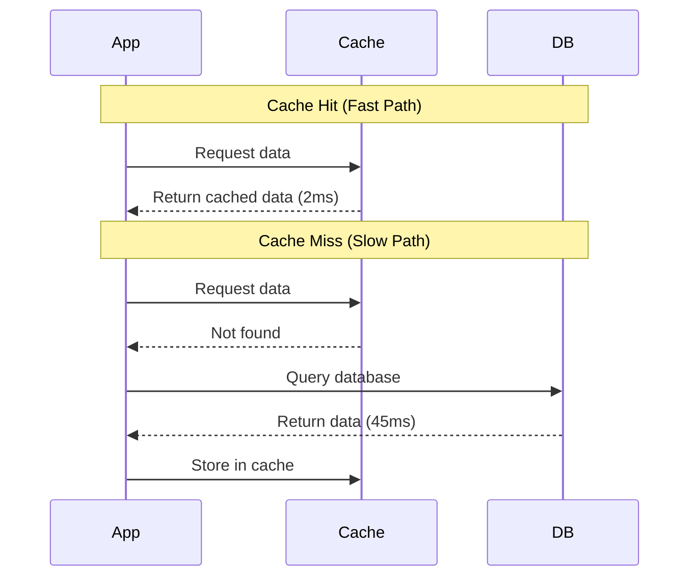
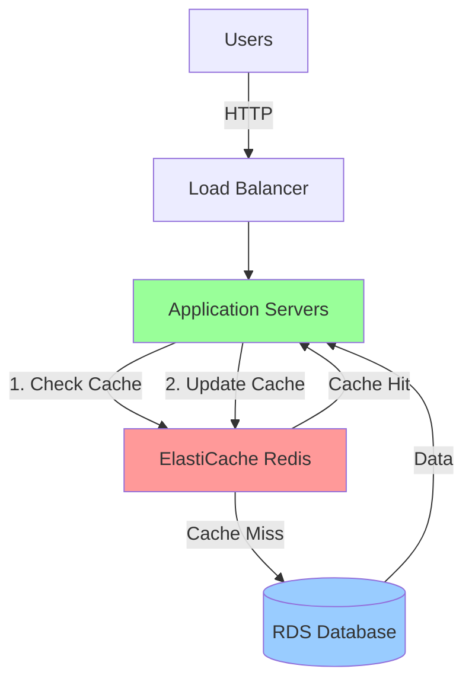

# Caching Overview

**Duration**: 20 minutes  
**Free Tier**: 750 hours/month cache.t2.micro or cache.t3.micro (first 12 months)  
**Difficulty**: Intermediate  
**Skills**: Performance optimization, distributed systems, cost reduction

## What is Caching?

Caching is the practice of storing frequently accessed data in fast, temporary storage (memory) to reduce latency and database load. In cloud architectures, caching sits between the application and data store, serving requests from memory instead of slower disk-based databases.

## Why Caching Matters

### Performance Benefits
- **Reduced latency**: Memory access (microseconds) vs database queries (milliseconds)
- **Decreased database load**: Fewer queries = lower CPU/memory usage
- **Improved user experience**: Faster page loads, API responses
- **Higher throughput**: Serve 10-100x more requests with same infrastructure

### Cost Benefits
- **Fewer database reads**: Reduced RDS instance size requirements
- **Lower compute time**: Less CPU processing, faster Lambda executions
- **Reduced data transfer**: Fewer queries = less network traffic
- **Better resource utilization**: One cached result serves thousands of requests

## Cache Hit vs Cache Miss

### Cache Hit
- Data found in cache
- Response time: 1-5ms
- No database load

### Cache Miss
- Data not in cache
- Must query database
- Response time: 40-100ms+
- Subsequent requests benefit from caching

## AWS ElastiCache Service

### Overview
Amazon ElastiCache is a fully managed in-memory data store service supporting Redis and Memcached engines.

**Managed Service Benefits**:
- Automatic failover and recovery
- Automated patching and upgrades
- Built-in monitoring via CloudWatch
- Backup and restore (Redis only)
- Multi-AZ support for high availability

### Architecture Position

### Redis vs Memcached

| Feature | Redis | Memcached |
|---------|-------|-----------|
| Data Structures | Strings, lists, sets, hashes, sorted sets | Strings only |
| Persistence | Optional disk persistence | In-memory only |
| Replication | Master-replica support | None |
| Pub/Sub | Yes | No |
| Transactions | Yes | No |
| Multi-threading | Single-threaded | Multi-threaded |
| **WorldSkills Recommendation** | **Primary choice** | Special use cases |

### Node Types and Free Tier

| Node Type | vCPU | Memory | Network | Free Tier |
|-----------|------|--------|---------|-----------|
| cache.t2.micro | 1 | 555 MB | Low | ✅ 750 hrs/mo |
| cache.t3.micro | 2 | 512 MB | Up to 5 Gbps | ✅ 750 hrs/mo |
| cache.t2.small | 1 | 1.55 GB | Low-Moderate | ❌ No |
| cache.m5.large | 2 | 6.38 GB | Up to 10 Gbps | ❌ No |

**Free Tier Eligibility**: 750 hours/month for 12 months (single cache.t2.micro or cache.t3.micro)

### Cluster Modes

**Single Node** (Free Tier compatible):
- One cache node
- No replication
- Suitable for dev/test, non-critical workloads

**Cluster Mode Disabled** (Redis):
- Primary node + read replicas
- Automatic failover
- Read scaling

**Cluster Mode Enabled** (Redis):
- Multiple shards (partitions)
- Horizontal scaling
- Advanced use cases

## When to Use Caching

✅ **Ideal Scenarios**:
- High-read, low-write workloads (90%+ reads)
- Expensive database queries (complex joins, aggregations)
- Frequently accessed static data (product catalogs, configuration)
- Session storage for web applications
- Rate limiting and API throttling
- Real-time leaderboards and counters

❌ **Avoid When**:
- Write-heavy workloads (cache becomes stale quickly)
- Data requires strong consistency (financial transactions)
- Unique, rarely repeated queries
- Very small datasets (overhead not worth it)

## Time-To-Live (TTL) Concept

TTL defines how long data remains in cache before expiration.

| Data Type | TTL | Reasoning |
|-----------|-----|-----------|
| Static content (images, CSS) | 24 hours | Rarely changes |
| Product catalog | 1 hour | Updates during business hours |
| User profiles | 15 minutes | Moderate update frequency |
| Stock prices | 10 seconds | High volatility |
| Session data | 30 minutes | Security/timeout requirement |

**Best Practice**: Always set TTL to prevent memory exhaustion

## Cache Invalidation Strategies

### 1. TTL-Based (Automatic)
- Data expires after fixed time
- Simplest approach
- Risk: serving stale data before expiration

### 2. Event-Based (Proactive)
- Invalidate cache when data changes (UPDATE/DELETE)
- Ensures consistency
- More complex implementation

### 3. Manual (On-Demand)
- Explicit cache clearing
- Administrative operations
- Use for debugging or emergency fixes

## Use Cases for WorldSkills Competitions

### Scenario 1: E-commerce Product Catalog
- Cache product details (name, price, description)
- TTL: 1 hour
- Pattern: Lazy loading
- Expected improvement: 95% faster response

### Scenario 2: User Session Management
- Store session tokens, user preferences
- TTL: 30 minutes
- Pattern: Write-through
- Benefit: No database queries for session validation

### Scenario 3: API Rate Limiting
- Track request counts per user/IP
- TTL: 1 minute (sliding window)
- Pattern: Counters with INCR
- Benefit: Prevent abuse, protect backend

### Scenario 4: Database Query Results
- Cache expensive JOIN queries
- TTL: 5-15 minutes
- Pattern: Lazy loading + cache warming
- Expected improvement: 80% reduction in database CPU

## AWS Console Navigation

1. **Access ElastiCache**:
   - AWS Console → Search "ElastiCache" → Click service
   
2. **Dashboard Overview**:
   - Left menu: **Redis clusters**, **Memcached clusters**
   - **Subnet groups**: Define VPC placement
   - **Parameter groups**: Configuration settings
   - **Backup**: Automated snapshots (Redis only)

3. **Create Redis Cluster**:
   - Click **Redis clusters** → **Create Redis cluster**
   - Choose creation method (Easy vs Standard)
   - Configure node type, subnet group, security
   
4. **Monitoring**:
   - Select cluster → **Metrics** tab
   - CloudWatch: CPUUtilization, CacheHits, CacheMisses

## Cost Considerations

### Free Tier (First 12 Months)
- 750 hours/month of cache.t2.micro or cache.t3.micro
- Run 1 instance 24/7 for entire month
- No data transfer charges within Free Tier limits

### Beyond Free Tier
| Resource | Cost (us-east-1) |
|----------|------------------|
| cache.t3.micro | ~$0.017/hour (~$12/month) |
| cache.t2.small | ~$0.034/hour (~$25/month) |
| Data transfer (out) | $0.09/GB |
| Backup storage (Redis) | $0.095/GB-month |

### Cost Comparison: Caching vs Scaling Database

**Scenario**: Application needs to handle 2x traffic

**Option 1: Scale RDS**
- db.t3.micro → db.t3.small
- Cost increase: $12 → $25/month (+$13)

**Option 2: Add cache.t3.micro**
- Keep db.t3.micro
- Add cache.t3.micro: +$12/month
- **Better performance, same cost**

## Performance Metrics

### Key Metrics to Monitor

| Metric | Target | Meaning |
|--------|--------|---------|
| Cache Hit Ratio | >80% | Percentage of requests served from cache |
| Average Latency | <5ms | Response time for cached requests |
| Evictions | <1% | Data removed due to memory pressure |
| CPU Utilization | <75% | Cache node processing load |
| Memory Usage | <80% | Used memory vs available |

**Formula**: Cache Hit Ratio = CacheHits / (CacheHits + CacheMisses) × 100

## Competition Tips

- **Always demonstrate measurable improvements**: Show before/after metrics
- **Document hit ratio**: Prove caching is effective (>80% target)
- **Use Free Tier instances**: cache.t2.micro or cache.t3.micro
- **Place in private subnets**: Security best practice
- **Set TTL on all keys**: Prevent memory exhaustion
- **Test failover scenarios**: Understand degraded mode behavior

## Common Mistakes

- **No TTL**: Memory fills up, evictions occur, performance degrades
- **Public accessibility**: Security vulnerability (never expose Redis to internet)
- **Wrong subnet**: Cache and application in different VPCs/subnets
- **Security group misconfiguration**: Port 6379 not accessible from app tier
- **Over-caching**: Storing data that's never read again (waste of memory)
- **Cache stampede**: Multiple requests hit database simultaneously on cache miss

## Cross-References

- ElastiCache Redis: [aws-worldskills-notes/08_caching/elasticache_redis.md](aws-worldskills-notes/08_caching/elasticache_redis.md)
- Caching patterns: [aws-worldskills-notes/08_caching/caching_patterns.md](aws-worldskills-notes/08_caching/caching_patterns.md)
- Hands-on lab: [aws-worldskills-notes/08_caching/server_lab.md](aws-worldskills-notes/08_caching/server_lab.md)
- VPC networking: [aws-worldskills-notes/05_vpc/overview.md](aws-worldskills-notes/05_vpc/overview.md)
- RDS integration: [aws-worldskills-notes/07_rds/overview.md](aws-worldskills-notes/07_rds/overview.md)
- EC2 setup: [aws-worldskills-notes/03_ec2/overview.md](aws-worldskills-notes/03_ec2/overview.md)
