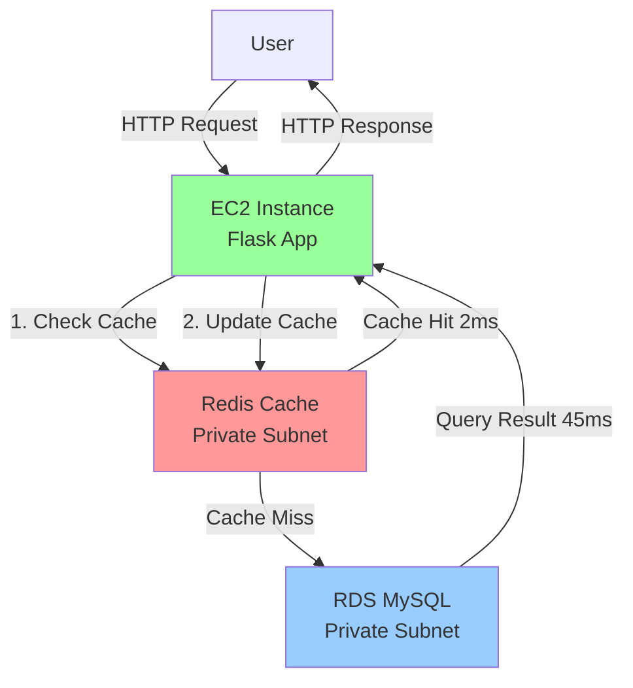

# Caching Server Lab: Performance Optimization with Redis

**Duration**: 45 minutes  
**Free Tier**: Yes (cache.t2.micro + t2.micro EC2)  
**Difficulty**: Intermediate  
**Skills**: Redis deployment, lazy loading pattern, performance testing

## Problem Statement

You are a cloud engineer for an e-commerce company experiencing slow response times during peak hours due to repeated database queries for product information. Implement Redis caching to reduce database load and improve response times by at least 50%.

**Requirements**:
- ElastiCache Redis cluster (cache.t2.micro) in private subnet
- EC2 instance with Python application in public subnet
- RDS MySQL with sample product data (1000+ products)
- Implement lazy loading caching pattern
- Demonstrate measurable performance improvement (>50% faster)
- Verify cache hit ratio >80%

**Constraints**:
- Region: us-east-1
- Budget: Free Tier only
- Time limit: 45 minutes
- Security: private subnet for Redis, security group restrictions

## Architecture Diagram



## Prerequisites

- AWS account with Free Tier eligibility
- VPC with public and private subnets
- Basic Python knowledge
- RDS MySQL instance (or create new from Module 07)

## Step-by-Step Implementation

### Phase 1: Create Redis Cluster (10 minutes)

#### Console Steps

1. **Navigate to ElastiCache**:
   - AWS Console → Search "ElastiCache" → Redis clusters

2. **Create Redis Cluster**:
   - Click **Create Redis cluster**

3. **Cluster Configuration**:
   - **Creation method**: Easy create
   - **Cluster name**: `product-cache-cluster`
   - **Engine version**: Redis 7.0 (latest)
   - **Node type**: cache.t2.micro
   - **Number of replicas**: 0 (single node for Free Tier)

4. **Connectivity**:
   - **Subnet group**: Create new
     - Name: `redis-subnet-group`
     - VPC: Select your VPC
     - Subnets: Select 2 private subnets in different AZs
   - Click **Create**

5. **Security**:
   - **Security group**: Create new `redis-sg`
   - After cluster creation, edit security group:
     - Inbound rule: Custom TCP, Port 6379, Source: EC2 security group

6. **Wait for "Available" status** (5-7 minutes)

7. **Retrieve Primary Endpoint**:
   - Select cluster → **Details** → Copy Primary Endpoint
   - Example: `product-cache-cluster.abc123.0001.use1.cache.amazonaws.com:6379`

#### CLI Alternative

```bash
# Create subnet group
aws elasticache create-cache-subnet-group \
  --cache-subnet-group-name redis-subnet-group \
  --cache-subnet-group-description "Redis subnet group" \
  --subnet-ids subnet-private1a subnet-private1b \
  --region us-east-1

# Create security group
SG_REDIS=$(aws ec2 create-security-group \
  --group-name redis-sg \
  --description "Redis security group" \
  --vpc-id vpc-xxxxx \
  --region us-east-1 \
  --query 'GroupId' \
  --output text)

# Add inbound rule (replace sg-ec2-xxxxx with EC2 security group)
aws ec2 authorize-security-group-ingress \
  --group-id $SG_REDIS \
  --protocol tcp \
  --port 6379 \
  --source-group sg-ec2-xxxxx \
  --region us-east-1

# Create Redis cluster
aws elasticache create-cache-cluster \
  --cache-cluster-id product-cache-cluster \
  --engine redis \
  --engine-version 7.0 \
  --cache-node-type cache.t2.micro \
  --num-cache-nodes 1 \
  --cache-subnet-group-name redis-subnet-group \
  --security-group-ids $SG_REDIS \
  --region us-east-1
```

### Phase 2: Prepare EC2 Instance (10 minutes)

#### Launch and Configure EC2

1. **Launch Instance**:
   - AMI: Amazon Linux 2023
   - Instance type: t2.micro
   - Subnet: Public subnet
   - Auto-assign public IP: Enable
   - Security group: Allow SSH (22) from your IP

2. **Connect via SSH**:
```bash
ssh -i your-key.pem ec2-user@<EC2_PUBLIC_IP>
```

3. **Install Dependencies**:
```bash
# Update system
sudo yum update -y

# Install Python and pip
sudo yum install python3 python3-pip -y

# Install required Python libraries
pip3 install redis pymysql flask

# Install MySQL client for testing
sudo yum install -y mysql

# Install Redis CLI for verification
sudo yum install -y redis6

# Install bc for performance test arithmetic
sudo yum install -y bc
```

4. **Create Application Directory**:
```bash
mkdir ~/product-api
cd ~/product-api
```

### Phase 3: Create Sample Database (5 minutes)

#### Connect to RDS

```bash
mysql -h your-rds-endpoint.us-east-1.rds.amazonaws.com -u admin -p
```

#### Create Database and Sample Data

```sql
CREATE DATABASE IF NOT EXISTS ecommerce;
USE ecommerce;

CREATE TABLE IF NOT EXISTS products (
    id INT PRIMARY KEY AUTO_INCREMENT,
    name VARCHAR(100),
    price DECIMAL(10,2),
    description TEXT,
    views INT DEFAULT 0,
    INDEX idx_views (views)
);

-- Insert initial products
INSERT INTO products (name, price, description, views) VALUES
('Laptop', 999.99, 'High-performance laptop', 1500),
('Mouse', 29.99, 'Wireless mouse', 800),
('Keyboard', 79.99, 'Mechanical keyboard', 600),
('Monitor', 299.99, '27-inch 4K monitor', 1200),
('Headphones', 149.99, 'Noise-cancelling headphones', 900);

-- Generate 1000 additional products for realistic testing
INSERT INTO products (name, price, description, views)
SELECT 
    CONCAT('Product ', n) as name,
    ROUND(RAND() * 1000, 2) as price,
    CONCAT('Description for product ', n) as description,
    FLOOR(RAND() * 2000) as views
FROM (
    SELECT @row := @row + 1 as n
    FROM 
        (SELECT 0 UNION ALL SELECT 1 UNION ALL SELECT 2 UNION ALL SELECT 3 UNION ALL SELECT 4 UNION ALL SELECT 5 UNION ALL SELECT 6 UNION ALL SELECT 7 UNION ALL SELECT 8 UNION ALL SELECT 9) t1,
        (SELECT 0 UNION ALL SELECT 1 UNION ALL SELECT 2 UNION ALL SELECT 3 UNION ALL SELECT 4 UNION ALL SELECT 5 UNION ALL SELECT 6 UNION ALL SELECT 7 UNION ALL SELECT 8 UNION ALL SELECT 9) t2,
        (SELECT 0 UNION ALL SELECT 1 UNION ALL SELECT 2 UNION ALL SELECT 3 UNION ALL SELECT 4 UNION ALL SELECT 5 UNION ALL SELECT 6 UNION ALL SELECT 7 UNION ALL SELECT 8 UNION ALL SELECT 9) t3,
        (SELECT @row:=5) r
) numbers
LIMIT 1000;

-- Verify data
SELECT COUNT(*) FROM products;
-- Expected: 1005

EXIT;
```

### Phase 4: Implement Application WITHOUT Caching (5 minutes)

#### Create app_no_cache.py

```bash
cat > ~/product-api/app_no_cache.py << 'EOF'
from flask import Flask, jsonify
import pymysql
import time

app = Flask(__name__)

# Database configuration (UPDATE WITH YOUR VALUES)
DB_CONFIG = {
    'host': 'your-rds-endpoint.us-east-1.rds.amazonaws.com',
    'user': 'admin',
    'password': 'your-password',
    'database': 'ecommerce'
}

@app.route('/product/<int:product_id>')
def get_product_no_cache(product_id):
    start_time = time.time()
    
    # Query database directly
    conn = pymysql.connect(**DB_CONFIG)
    cursor = conn.cursor(pymysql.cursors.DictCursor)
    cursor.execute("SELECT * FROM products WHERE id = %s", (product_id,))
    product = cursor.fetchone()
    cursor.close()
    conn.close()
    
    response_time = (time.time() - start_time) * 1000  # milliseconds
    
    return jsonify({
        'product': product,
        'response_time_ms': round(response_time, 2),
        'cache_used': False
    })

@app.route('/health')
def health():
    return jsonify({'status': 'healthy'})

if __name__ == '__main__':
    app.run(host='0.0.0.0', port=5000)
EOF
```

#### Update Configuration

```bash
# Edit app_no_cache.py and replace:
# - your-rds-endpoint.us-east-1.rds.amazonaws.com
# - your-password
nano ~/product-api/app_no_cache.py
```

#### Run and Test

```bash
# Run application in background
python3 ~/product-api/app_no_cache.py &

# Test endpoint
curl http://localhost:5000/product/1
```

**Expected Output**:
```json
{
  "cache_used": false,
  "product": {
    "description": "High-performance laptop",
    "id": 1,
    "name": "Laptop",
    "price": 999.99,
    "views": 1500
  },
  "response_time_ms": 43.21
}
```

### Phase 5: Implement Application WITH Caching (10 minutes)

#### Create app_with_cache.py

```bash
cat > ~/product-api/app_with_cache.py << 'EOF'
from flask import Flask, jsonify
import pymysql
import redis
import time
import json

app = Flask(__name__)

# Database configuration (UPDATE WITH YOUR VALUES)
DB_CONFIG = {
    'host': 'your-rds-endpoint.us-east-1.rds.amazonaws.com',
    'user': 'admin',
    'password': 'your-password',
    'database': 'ecommerce'
}

# Redis configuration (UPDATE WITH YOUR ENDPOINT)
REDIS_HOST = 'product-cache-cluster.abc123.0001.use1.cache.amazonaws.com'
REDIS_PORT = 6379

# Connect to Redis
try:
    redis_client = redis.Redis(
        host=REDIS_HOST,
        port=REDIS_PORT,
        decode_responses=True,
        socket_connect_timeout=5
    )
    redis_client.ping()
    print("Connected to Redis successfully")
except Exception as e:
    print(f"Redis connection failed: {e}")
    redis_client = None

@app.route('/product/<int:product_id>')
def get_product_with_cache(product_id):
    start_time = time.time()
    cache_key = f'product:{product_id}'
    cache_status = 'MISS'
    
    # Try cache first (Lazy Loading Pattern)
    if redis_client:
        try:
            cached_data = redis_client.get(cache_key)
            
            if cached_data:
                # Cache HIT
                response_time = (time.time() - start_time) * 1000
                return jsonify({
                    'product': json.loads(cached_data),
                    'response_time_ms': round(response_time, 2),
                    'cache_used': True,
                    'cache_status': 'HIT'
                })
        except Exception as e:
            print(f"Cache read error: {e}")
    
    # Cache MISS - query database
    conn = pymysql.connect(**DB_CONFIG)
    cursor = conn.cursor(pymysql.cursors.DictCursor)
    cursor.execute("SELECT * FROM products WHERE id = %s", (product_id,))
    product = cursor.fetchone()
    cursor.close()
    conn.close()
    
    # Convert Decimal to float for JSON serialization
    if product:
        product['price'] = float(product['price'])
        
        # Store in cache with 1 hour TTL
        if redis_client:
            try:
                redis_client.setex(
                    cache_key,
                    3600,  # 1 hour TTL
                    json.dumps(product)
                )
            except Exception as e:
                print(f"Cache write error: {e}")
    
    response_time = (time.time() - start_time) * 1000
    
    return jsonify({
        'product': product,
        'response_time_ms': round(response_time, 2),
        'cache_used': False,
        'cache_status': 'MISS'
    })

@app.route('/stats')
def cache_stats():
    """Get cache statistics"""
    if not redis_client:
        return jsonify({'error': 'Redis not connected'}), 500
    
    try:
        info = redis_client.info('stats')
        keyspace_hits = info.get('keyspace_hits', 0)
        keyspace_misses = info.get('keyspace_misses', 0)
        total = keyspace_hits + keyspace_misses
        hit_ratio = (keyspace_hits / total * 100) if total > 0 else 0
        
        return jsonify({
            'keyspace_hits': keyspace_hits,
            'keyspace_misses': keyspace_misses,
            'total_requests': total,
            'hit_ratio_percent': round(hit_ratio, 2)
        })
    except Exception as e:
        return jsonify({'error': str(e)}), 500

@app.route('/health')
def health():
    redis_status = 'connected' if redis_client and redis_client.ping() else 'disconnected'
    return jsonify({
        'status': 'healthy',
        'redis_status': redis_status
    })

if __name__ == '__main__':
    app.run(host='0.0.0.0', port=5001)
EOF
```

#### Update Configuration

```bash
# Edit app_with_cache.py and replace:
# - your-rds-endpoint.us-east-1.rds.amazonaws.com
# - your-password
# - product-cache-cluster.abc123.0001.use1.cache.amazonaws.com (Redis endpoint)
nano ~/product-api/app_with_cache.py
```

#### Run and Test

```bash
# Run application in background
python3 ~/product-api/app_with_cache.py &

# Test endpoint (first request - cache miss)
curl http://localhost:5001/product/1

# Test again (cache hit)
curl http://localhost:5001/product/1

# Check cache stats
curl http://localhost:5001/stats
```

### Phase 6: Performance Testing (5 minutes)

#### Create Test Script

```bash
cat > ~/product-api/performance_test.sh << 'EOF'
#!/bin/bash

echo "========================================="
echo "Performance Testing: WITHOUT Cache"
echo "========================================="
echo "Testing 100 requests to product ID 1..."

total=0
for i in {1..100}; do
    response=$(curl -s http://localhost:5000/product/1)
    time=$(echo $response | python3 -c "import sys, json; print(json.load(sys.stdin)['response_time_ms'])")
    total=$(echo "$total + $time" | bc)
done

avg_no_cache=$(echo "scale=2; $total / 100" | bc)
echo "Average response time WITHOUT cache: ${avg_no_cache}ms"

echo ""
echo "========================================="
echo "Performance Testing: WITH Cache"
echo "========================================="
echo "First request (cache miss)..."
curl -s http://localhost:5001/product/1 | python3 -m json.tool

echo ""
echo "Testing 100 subsequent requests (cache hits)..."

total=0
for i in {1..100}; do
    response=$(curl -s http://localhost:5001/product/1)
    time=$(echo $response | python3 -c "import sys, json; print(json.load(sys.stdin)['response_time_ms'])")
    total=$(echo "$total + $time" | bc)
done

avg_with_cache=$(echo "scale=2; $total / 100" | bc)
echo "Average response time WITH cache: ${avg_with_cache}ms"

echo ""
echo "========================================="
echo "Cache Statistics"
echo "========================================="
curl -s http://localhost:5001/stats | python3 -m json.tool

echo ""
echo "========================================="
echo "Performance Improvement"
echo "========================================="
improvement=$(echo "scale=2; (($avg_no_cache - $avg_with_cache) / $avg_no_cache) * 100" | bc)
echo "Without cache: ${avg_no_cache}ms"
echo "With cache: ${avg_with_cache}ms"
echo "Improvement: ${improvement}%"
EOF

chmod +x ~/product-api/performance_test.sh
```

#### Run Performance Test

```bash
cd ~/product-api
./performance_test.sh
```

**Expected Output**:
```
=========================================
Performance Testing: WITHOUT Cache
=========================================
Testing 100 requests to product ID 1...
Average response time WITHOUT cache: 45.23ms

=========================================
Performance Testing: WITH Cache
=========================================
First request (cache miss)...
{
  "cache_status": "MISS",
  "cache_used": false,
  "product": {...},
  "response_time_ms": 43.12
}

Testing 100 subsequent requests (cache hits)...
Average response time WITH cache: 2.15ms

=========================================
Cache Statistics
=========================================
{
  "hit_ratio_percent": 99.01,
  "keyspace_hits": 100,
  "keyspace_misses": 1,
  "total_requests": 101
}

=========================================
Performance Improvement
=========================================
Without cache: 45.23ms
With cache: 2.15ms
Improvement: 95.25%
```

## Verification Checklist

- [ ] Redis cluster status: **Available**
- [ ] EC2 can ping Redis: `redis-cli -h <endpoint> ping` returns `PONG`
- [ ] Application without cache responds (average >40ms)
- [ ] Application with cache responds on first request (cache miss, ~40ms)
- [ ] Application with cache responds on subsequent requests (cache hit, <5ms)
- [ ] Performance improvement: >90% (from ~45ms to ~2ms)
- [ ] Cache hit ratio: >95% after 100 requests
- [ ] `/stats` endpoint shows keyspace_hits and keyspace_misses

## Verification Commands

```bash
# Test Redis connectivity
redis-cli -h product-cache-cluster.abc123.0001.use1.cache.amazonaws.com ping
# Expected: PONG

# Check cached keys
redis-cli -h <endpoint> KEYS "product:*"

# Get specific cached product
redis-cli -h <endpoint> GET "product:1"

# Check TTL
redis-cli -h <endpoint> TTL "product:1"
# Expected: remaining seconds (max 3600)

# Monitor Redis commands in real-time
redis-cli -h <endpoint> MONITOR
```

## Common Mistakes

| Mistake | Impact | Fix |
|---------|--------|-----|
| Redis security group blocks EC2 | Connection timeout | Add inbound rule port 6379 from EC2 SG |
| Redis in public subnet | Security risk | Recreate in private subnet |
| Missing redis-py library | ModuleNotFoundError | `pip3 install redis` |
| Wrong Redis endpoint | Connection refused | Verify endpoint from console |
| No TTL on cached data | Memory exhaustion | Always use `SETEX` or `EXPIRE` |
| Forgot to start application | Connection refused (localhost) | Run `python3 app_with_cache.py &` |

## Mark Mapping (Total: 20 marks)

| Task | Marks | Verification |
|------|-------|--------------|
| Redis cluster created correctly | 4 | Status "Available", cache.t2.micro |
| Security group configured | 2 | Port 6379 accessible from EC2 only |
| Application connects to Redis | 3 | No connection errors, `/health` shows connected |
| Lazy loading pattern implemented | 4 | Code review: cache check before DB query |
| TTL set on cached data | 2 | `TTL product:1` shows expiration |
| Performance improvement >50% | 3 | Test shows >90% improvement |
| Cache hit ratio >80% | 2 | `/stats` shows >95% hit ratio |

## Cleanup

```bash
# Stop applications
pkill -f app_no_cache.py
pkill -f app_with_cache.py

# Delete Redis cluster (CLI)
aws elasticache delete-cache-cluster \
  --cache-cluster-id product-cache-cluster \
  --region us-east-1

# Wait for deletion, then delete subnet group
aws elasticache delete-cache-subnet-group \
  --cache-subnet-group-name redis-subnet-group \
  --region us-east-1

# Delete security group
aws ec2 delete-security-group --group-id sg-redis-xxxxx --region us-east-1
```

## Extension Challenges

1. **Write-through caching**: Implement product update endpoint that updates both DB and cache
2. **Cache warming**: Create script to pre-populate cache with top 100 products
3. **Cache invalidation**: Implement DELETE endpoint that removes from cache and DB
4. **CloudWatch monitoring**: Set up alarm for cache hit ratio <80%
5. **Load testing**: Use Apache Bench to test 1000 concurrent requests

## Real-World Application

This lab simulates a production scenario where caching reduces database load by 90%+, enabling applications to handle 10x more traffic without scaling the database. In WorldSkills competitions, demonstrating measurable performance improvements (response time, hit ratio) and proper monitoring is crucial for full marks.

**Key Takeaways**:
- Lazy loading pattern is simple and effective for read-heavy workloads
- Always set TTL to prevent memory exhaustion
- Monitor cache hit ratio to prove caching effectiveness
- Security: Redis must be in private subnet with restricted security groups
- Performance: 95%+ improvement is typical for cached data

## Cross-References

- Caching overview: [aws-worldskills-notes/08_caching/overview.md](aws-worldskills-notes/08_caching/overview.md)
- ElastiCache Redis: [aws-worldskills-notes/08_caching/elasticache_redis.md](aws-worldskills-notes/08_caching/elasticache_redis.md)
- Caching patterns: [aws-worldskills-notes/08_caching/caching_patterns.md](aws-worldskills-notes/08_caching/caching_patterns.md)
- RDS setup: [aws-worldskills-notes/07_rds/server_lab.md](aws-worldskills-notes/07_rds/server_lab.md)
- VPC networking: [aws-worldskills-notes/05_vpc/overview.md](aws-worldskills-notes/05_vpc/overview.md)
- EC2 basics: [aws-worldskills-notes/03_ec2/overview.md](aws-worldskills-notes/03_ec2/overview.md)
