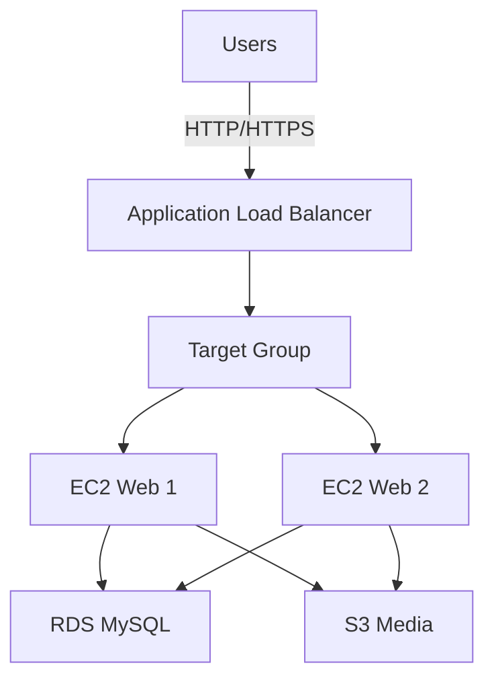

# Scenario 2: EC2-Based Web Hosting with High Availability (WordPress)

## Problem Statement
Deploy a resilient WordPress blog using EC2, ALB, RDS MySQL, and S3-backed media storage across two Availability Zones. Complete within 120 minutes, balancing Free Tier usage with the unavoidable ALB cost.

## Architecture Components
- VPC with two public subnets (web) and two private subnets (database) across 2 AZs
- Application Load Balancer in public subnets
- Two EC2 instances (t2.micro) with Apache/PHP and WordPress in public subnets
- RDS MySQL (db.t3.micro) in private subnet, Multi-AZ disabled for cost
- S3 bucket for media uploads (via WP Offload Media or s3fs plugin)
- Security groups for ALB, EC2, and RDS
- IAM instance profile on EC2 for S3 access

## Prerequisites
- Review [aws-worldskills-notes/03_ec2](aws-worldskills-notes/03_ec2)
- Review [aws-worldskills-notes/05_vpc](aws-worldskills-notes/05_vpc)
- Review [aws-worldskills-notes/06_alb](aws-worldskills-notes/06_alb)
- Review [aws-worldskills-notes/07_rds](aws-worldskills-notes/07_rds)

## High-Level Diagram

## Time-Boxed Implementation (120 minutes)
1. **Create VPC with two public and two private subnets (15 min)**
   - /16 VPC CIDR (e.g., 10.0.0.0/16).
   - Two /24 public subnets in different AZs (e.g., 10.0.1.0/24, 10.0.2.0/24); enable Auto-assign Public IP.
   - Two /24 private subnets in different AZs (e.g., 10.0.11.0/24, 10.0.12.0/24); no Auto-assign Public IP.
2. **Create Internet Gateway and route tables (8 min)**
   - Attach IGW.
   - Public route table with 0.0.0.0/0 -> IGW; associate both public subnets.
   - Private route table with no internet route (local only); associate both private subnets.
3. **Create security groups (12 min)**
   - ALB SG: inbound 80/443 from 0.0.0.0/0; outbound all.
   - EC2 SG: inbound 80 from ALB SG, 22 from admin IP; outbound all.
   - RDS SG: inbound 3306 from EC2 SG; outbound all.
4. **Create RDS subnet group and launch MySQL (10 min create + 5-8 min wait)**
   - Create DB subnet group named `wordpress-db-subnet-group` with both private subnets.
   - Launch RDS MySQL: Single-AZ db.t3.micro, storage 20GB GP2, username/password noted.
   - Select the `wordpress-db-subnet-group` subnet group and RDS SG.
   - Ensure "Publicly accessible" is set to No.
5. **Create S3 bucket for media (5 min)**
   - Versioning optional; block public access on; later grant via WordPress plugin.
6. **Create IAM role for EC2 with S3 access (8 min)**
   - Attach `AmazonS3FullAccess` (scope down to bucket if time) and `AmazonSSMManagedInstanceCore` for Session Manager.
7. **Launch two EC2 instances with WordPress userdata (20 min)**
   - AMI: Amazon Linux 2023; instance type t2.micro; subnets: both public; attach EC2 SG and IAM role.
   - User data installs Apache/PHP, downloads WordPress, configures wp-config.php with RDS endpoint.
8. **Create ALB and target group (15 min)**
   - Target type: instance; health check path `/`; register both EC2 instances; listener 80 -> target group.
9. **Configure WordPress to use RDS and S3 (15 min)**
   - Complete browser installer using RDS endpoint; install S3 offload plugin or configure s3fs mounting `/var/www/html/wp-content/uploads`.
10. **Test load balancing and failover (12 min)**
    - Hit ALB DNS; stop one instance to confirm continuity; verify media stored in S3.

## Verification Checklist
- ALB DNS shows WordPress homepage.
- Both EC2 instances are healthy in target group and located in public subnets.
- RDS instance is in private subnets with no public endpoint.
- WordPress connects to RDS via private IP (no database connection errors).
- Media uploads appear in S3 bucket; public URLs load.
- Stopping one EC2 instance leaves site available via the other.
- Security groups restrict traffic to required sources only (RDS only accessible from EC2 SG).

## Common Mistakes
- RDS SG not allowing 3306 from EC2 SG (DB connection fails).
- RDS accidentally launched in public subnets or with public accessibility enabled.
- Forgetting to create DB subnet group before RDS launch.
- EC2 instances mistakenly placed in private subnets (cannot yum install packages without NAT).
- ALB health check path misconfigured (targets stay unhealthy).
- wp-config.php missing correct DB endpoint/credentials.
- IAM instance profile not attached (S3 uploads fail).

## Cost Breakdown
- EC2: 2 x t2.micro ≈ $0 (within 750 Free Tier hours if sole usage).
- RDS: db.t3.micro ≈ $0 (750 Free Tier hours if sole usage).
- ALB: ~$0.0225/hour → ~$16.20/month (no Free Tier).
- S3: $0.023/GB (Free Tier 5GB storage; requests minimal in lab).
- Expected monthly: ~$16.20 driven by ALB.

## WorldSkills Marking Criteria (weights)
- Architecture design (HA, subnets, SGs): 20%
- Implementation accuracy (WordPress + RDS + ALB): 30%
- Security best practices (SG scoping, no public DB): 20%
- Cost optimization (Free Tier usage, ALB awareness): 15%
- Documentation and verification proof: 15%

## Time Management Tips
- Parallelize: start RDS creation while building VPC and SGs.
- Critical path: RDS creation wait time; launch EC2 and install WordPress during wait.
- Checkpoints: VPC/SGs (T+20), RDS creating (T+25), EC2 launch + WordPress setup (T+60), ALB + health (T+90), S3 media test (T+105).

## Exam Simulation Mode (2-hour cap)
- Must-have: VPC + subnets, SGs, two EC2, RDS, ALB with healthy checks, WordPress running on ALB DNS.
- Nice-to-have: S3 offload, IAM scope-down, HTTPS via ACM + ALB.
- If behind: skip S3 offload; configure media locally; postpone ACM/HTTPS; keep health check path `/`.

## Cleanup
- Delete ALB (listeners first), target group, EC2 instances, launch templates, RDS instance and snapshots, S3 bucket, IAM role, security groups, and VPC resources (route tables, subnets, IGW).

## Related Scenarios
- Serverless alternative: [aws-worldskills-notes/09_full_server_scenarios/scenario_1_serverless_web_app.md](aws-worldskills-notes/09_full_server_scenarios/scenario_1_serverless_web_app.md).
- Security-first VPC build: [aws-worldskills-notes/09_full_server_scenarios/scenario_3_secure_private_vpc.md](aws-worldskills-notes/09_full_server_scenarios/scenario_3_secure_private_vpc.md).
- Cost-first serverless architecture: [aws-worldskills-notes/09_full_server_scenarios/scenario_4_cost_optimized_architecture.md](aws-worldskills-notes/09_full_server_scenarios/scenario_4_cost_optimized_architecture.md).

## Next Steps
- Move to IndiaSkills prep once published: [aws-worldskills-notes/10_indskills](aws-worldskills-notes/10_indskills).
