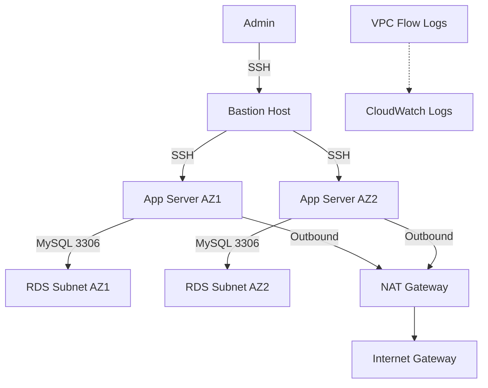

# Scenario 3: Secure Private VPC Architecture (3-Tier with Bastion)

## Problem Statement
Build a security-focused 3-tier architecture with restricted access: bastion-only SSH, private application layer, isolated database subnets, and monitored traffic. Target 100 minutes with emphasis on correctness and hardening.

## Architecture Components
- VPC with six subnets across two AZs: 2 public (bastion), 2 private (app), 2 isolated (database)
- Bastion host (t2.micro) in public subnet for SSH entry
- NAT Gateway in public subnet for private app internet egress
- Two application servers (t2.micro) in private subnets
- RDS MySQL in isolated subnets (no public IP)
- Network ACLs per tier for additional stateless filtering
- Security groups with strict ingress/egress; VPC Flow Logs to CloudWatch

## Prerequisites
- Review [aws-worldskills-notes/05_vpc](aws-worldskills-notes/05_vpc)
- Review [aws-worldskills-notes/03_ec2](aws-worldskills-notes/03_ec2)
- Review [aws-worldskills-notes/07_rds](aws-worldskills-notes/07_rds)

## High-Level Diagram

## Time-Boxed Implementation (100 minutes)
1. **Create VPC with six subnets (20 min)**
   - /16 VPC; two /24 per tier (public, private, isolated) across 2 AZs.
2. **Create IGW and NAT Gateway (10 min)**
   - Attach IGW; deploy NAT in one public subnet; allocate Elastic IP.
3. **Configure three route tables (15 min)**
   - Public RT: 0.0.0.0/0 -> IGW; associate public subnets.
   - Private RT: 0.0.0.0/0 -> NAT; associate private subnets.
   - Isolated RT: no internet route; associate isolated subnets.
4. **Create Network ACLs (12 min)**
   - Public NACL: allow 22/80/443 in; ephemeral responses out.
   - Private NACL: allow SSH from public subnet CIDRs; allow 3306 to isolated; allow ephemeral to NAT.
   - Isolated NACL: allow 3306 from private subnet CIDRs only; deny all else.
5. **Create security groups (15 min)**
   - Bastion SG: inbound 22 from admin IP; outbound all.
   - App SG: inbound 22 from Bastion SG, 80/443 from ALB (future) or Bastion for tests; outbound all.
   - DB SG: inbound 3306 from App SG only; outbound all.
6. **Launch bastion host (8 min)**
   - t2.micro, public subnet, Bastion SG, key pair downloaded; enable SSM if preferred.
7. **Launch two app servers (12 min)**
   - t2.micro in private subnets, App SG, no public IP, user data to install app stack (e.g., Nginx + sample app).
8. **Launch RDS in isolated subnets (8 min)
   - db.t3.micro, subnet group using isolated subnets, DB SG, no public access.
9. **Configure VPC Flow Logs (5 min)**
   - Flow Logs to CloudWatch Logs with IAM role.
10. **Test SSH tunneling and connectivity (15 min)**
    - SSH to bastion; SSH onward to app servers; from apps, connect to RDS on 3306; verify internet egress via NAT; confirm RDS cannot reach internet.

## Verification Checklist
- Bastion reachable via SSH from admin IP; key-based auth works.
- App servers reachable only from bastion (no direct public access).
- App servers can access internet via NAT (e.g., yum update succeeds).
- RDS reachable only from app servers; no public endpoint.
- Network ACLs allow expected paths and block unauthorized traffic.
- VPC Flow Logs present in CloudWatch Logs.

## Common Mistakes
- Missing NAT route in private RT (no outbound internet for apps).
- NACL return rules absent (stateless) causing blocked traffic.
- Overly permissive SGs (0.0.0.0/0 to DB or SSH).
- RDS subnet group not set to isolated subnets before launch.
- Bastion key pair not saved; cannot SSH.
- Flow Logs role lacking CloudWatch permissions.

## Cost Breakdown
- EC2: 3 x t2.micro ≈ $0 (within Free Tier hours if sole usage).
- NAT Gateway: ~$0.045/hour → ~$32.40/month (main cost driver; per-hour + data processing).
- RDS: db.t3.micro ≈ $0 (Free Tier hours if sole usage).
- Flow Logs: ~$0.50/GB ingested (minimal in lab).
- Expected monthly: ~$33 driven by NAT Gateway.

## WorldSkills Marking Criteria (weights)
- Architecture design (tiering, routing, NACL layering): 20%
- Implementation accuracy (routing, SG/NACL alignment): 30%
- Security best practices (least privilege, no public DB, bastion-only SSH): 20%
- Cost optimization (NAT awareness, right-sizing): 15%
- Documentation and verification evidence: 15%

## Time Management Tips
- Parallelize: build SGs and NACLs while NAT deploys.
- Critical path: NAT creation and RDS launch; start these early.
- Checkpoints: VPC/subnets (T+20), RTs/NAT (T+35), SG/NACL (T+50), EC2 (T+65), RDS (T+80), tests (T+95).

## Exam Simulation Mode (2-hour cap)
- Must-have: VPC with 3 tiered subnets, IGW, NAT, route tables, SGs, bastion + app servers + RDS, Flow Logs enabled.
- Nice-to-have: NACL hardening, SSM Session Manager on bastion, ALB in front of apps.
- If behind: skip NACL customization; rely on SGs; launch one app server; add Flow Logs last.

## Cleanup
- Delete RDS instance and snapshots, app instances, bastion, Flow Logs, NAT Gateway + Elastic IP, route tables, subnets, IGW, and VPC. Remove CloudWatch log groups if created.

## Related Scenarios
- Serverless alternative: [aws-worldskills-notes/09_full_server_scenarios/scenario_1_serverless_web_app.md](aws-worldskills-notes/09_full_server_scenarios/scenario_1_serverless_web_app.md).
- EC2 + ALB WordPress: [aws-worldskills-notes/09_full_server_scenarios/scenario_2_ec2_web_hosting.md](aws-worldskills-notes/09_full_server_scenarios/scenario_2_ec2_web_hosting.md).
- Cost-first build with budgets and alarms: [aws-worldskills-notes/09_full_server_scenarios/scenario_4_cost_optimized_architecture.md](aws-worldskills-notes/09_full_server_scenarios/scenario_4_cost_optimized_architecture.md).

## Next Steps
- Proceed to IndiaSkills preparation (placeholder): [aws-worldskills-notes/10_indskills](aws-worldskills-notes/10_indskills).
