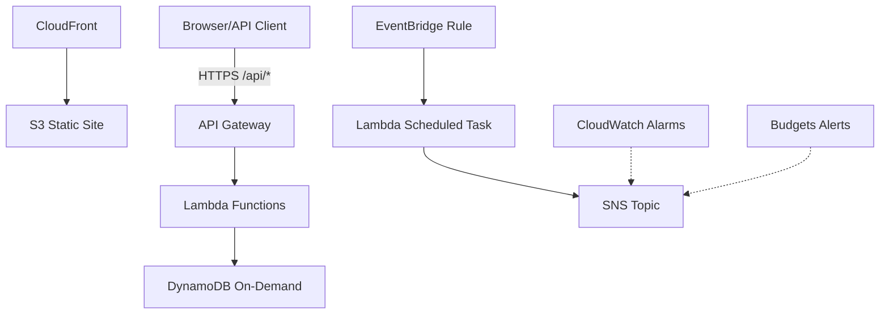

# Scenario 4: Cost-Optimized Architecture (Free Tier First)

## Problem Statement
Design and implement a web application stack that maximizes AWS Free Tier while remaining reliable. Use serverless services, proactive cost monitoring, and lifecycle controls. Target 80 minutes.

## Architecture Components
- S3 + CloudFront for static content delivery
- Lambda + API Gateway for backend APIs
- DynamoDB (on-demand) for data storage
- EventBridge scheduled rules for periodic tasks
- SNS for notifications
- CloudWatch Alarms for billing signals
- AWS Budgets for monthly spend alerts

## Prerequisites
- Review [aws-worldskills-notes/01_lambda](aws-worldskills-notes/01_lambda)
- Review [aws-worldskills-notes/02_api_gateway](aws-worldskills-notes/02_api_gateway)
- Review [aws-worldskills-notes/04_s3](aws-worldskills-notes/04_s3)
- Review [aws-worldskills-notes/05_vpc](aws-worldskills-notes/05_vpc)
- Review [aws-worldskills-notes/06_alb](aws-worldskills-notes/06_alb)
- Review [aws-worldskills-notes/07_rds](aws-worldskills-notes/07_rds)
- Review [aws-worldskills-notes/08_caching](aws-worldskills-notes/08_caching)

## High-Level Diagram

## Time-Boxed Implementation (80 minutes)
1. **Create cost budget with $10 threshold (5 min)**
   - Monthly cost budget; alert at 80% + 100% to email (SNS optional).
2. **Create DynamoDB table on-demand (5 min)**
   - Table name `AppData`, partition key `id` (String), on-demand billing, PITR off.
3. **Deploy Lambda functions for API logic (15 min)**
   - Python 3.11, memory 256 MB, timeout 10s, env var `TABLE_NAME=AppData`.
   - Handlers for CRUD; return CORS headers; package as zipped deployments.
4. **Create API Gateway with usage plan (12 min)**
   - REST API with /items (GET, POST) and /items/{id} (GET, DELETE).
   - Usage plan with API key and throttle 10 req/s, burst 5; associate a stage.
5. **Create S3 bucket and upload static site (10 min)**
   - Block Public Access off for this lab; enable static website hosting; upload SPA hitting API.
6. **Configure CloudFront distribution (10 min)**
   - Origin: S3 website endpoint; default TTL 300s; Viewer HTTPS; optional OAC if time (else bucket policy for CloudFront).
7. **Create SNS topic for notifications (5 min)**
   - Subscribe email; publish test message.
8. **Create EventBridge rule for scheduled tasks (8 min)**
   - Rate(5 minutes) triggering Lambda `cleanup` or `report`; ensure IAM allow InvokeFunction.
9. **Set up CloudWatch billing alarm (10 min)**
   - Alarm on `EstimatedCharges` > $5 USD; action: SNS topic.

## Verification Checklist
- CloudFront domain serves static site from S3.
- API Gateway endpoints respond with correct data and CORS headers.
- DynamoDB stores and returns items; on-demand billing active.
- SNS topic receives test email.
- EventBridge rule triggers Lambda on schedule (check CloudWatch Logs).
- CloudWatch billing alarm in `OK` state; triggers when threshold breached (simulate by lowering threshold if testing in sandbox).
- AWS Budget shows active and email recipients confirmed.

## Cost Optimization Strategies
- Prefer S3 + CloudFront over EC2 web servers (saves ~$8/month).
- Use Lambda instead of always-on EC2 (saves compute hours when idle).
- DynamoDB on-demand to avoid over-provisioning; enable TTL for stale items.
- Enable API Gateway caching to cut Lambda invocations.
- S3 lifecycle to Glacier for old assets; Intelligent-Tiering for variable access.
- Set CloudWatch Logs retention to 7 days; delete unused log groups.
- Remove unused EBS snapshots, AMIs, Elastic IPs; stop instances outside test windows.
- Avoid NAT Gateway unless absolutely needed (save ~$32/month).

## Common Mistakes
- No billing alarms or budgets leading to surprise charges.
- Leaving NAT Gateway running in mixed architectures.
- Using provisioned DynamoDB capacity instead of on-demand.
- Forgetting to enable CORS on API methods.
- Not cleaning CloudFront cache after major frontend changes.
- Leaving CloudWatch Logs at infinite retention.

## Cost Monitoring Dashboard
- CloudWatch dashboard tiles: Lambda invocations, API Gateway requests, DynamoDB RCUs/WCUs, S3 storage + requests, EstimatedCharges.
- Use Cost Explorer to track trends and service breakdowns.

## Cost Breakdown (Free Tier aligned)
- S3: $0 within 5GB storage + 15GB transfer.
- CloudFront: $0 within 1TB for 12 months (new accounts).
- Lambda: $0 within 1M requests + 400k GB-s.
- API Gateway: $0 within 1M REST requests for 12 months.
- DynamoDB: $0 within 25GB storage.
- SNS: $0 within 1,000 notifications.
- CloudWatch: $0 within 10 custom metrics + basic alarms; minimal logs with retention.
- Expected monthly: $0 under Free Tier limits.

## WorldSkills Marking Criteria (weights)
- Architecture design (serverless + monitoring): 20%
- Implementation accuracy (APIs, events, notifications): 30%
- Security best practices (least privilege, HTTPS, no public keys): 20%
- Cost optimization (budgets, alarms, Free Tier alignment): 15%
- Documentation and verification evidence: 15%

## Time Management Tips
- Start with budgets and alarms first to avoid forgetting them.
- Deploy Lambda + API before CloudFront to test APIs directly.
- Cache invalidations can take minutes; plan final UI deploy 10 minutes before end.
- Checkpoints: budgets (T+5), DynamoDB+Lambda (T+25), API+usage plan (T+40), S3 site (T+50), CloudFront (T+60), events+alarms (T+75).

## Exam Simulation Mode (2-hour cap)
- Must-have: DynamoDB, Lambda CRUD, API Gateway with CORS, S3 static site, SNS topic, CloudWatch alarm, AWS Budget.
- Nice-to-have: CloudFront, API usage plan, EventBridge scheduled task, OAC on S3.
- If behind: skip CloudFront (use S3 website URL), skip usage plan, set billing alarm only (add Budget later), defer EventBridge rule.

## Cleanup
- Delete CloudFront distribution (wait for disable), S3 bucket, API Gateway, Lambda functions, DynamoDB table, SNS topic/subscriptions, EventBridge rule, CloudWatch alarms and dashboards, AWS Budget.

## Related Scenarios
- Serverless blog build: [aws-worldskills-notes/09_full_server_scenarios/scenario_1_serverless_web_app.md](aws-worldskills-notes/09_full_server_scenarios/scenario_1_serverless_web_app.md).
- EC2 + ALB WordPress: [aws-worldskills-notes/09_full_server_scenarios/scenario_2_ec2_web_hosting.md](aws-worldskills-notes/09_full_server_scenarios/scenario_2_ec2_web_hosting.md).
- Secure tiered VPC: [aws-worldskills-notes/09_full_server_scenarios/scenario_3_secure_private_vpc.md](aws-worldskills-notes/09_full_server_scenarios/scenario_3_secure_private_vpc.md).

## Next Steps
- Continue with IndiaSkills prep content when available: [aws-worldskills-notes/10_indskills](aws-worldskills-notes/10_indskills).
