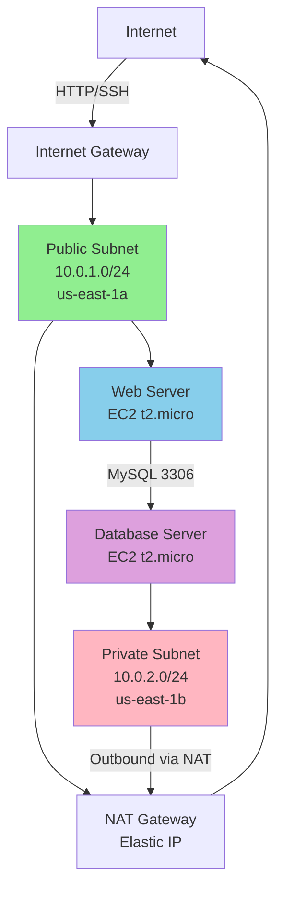

# Q1: Custom VPC Implementation - Solved

**Duration:** 40 minutes  
**Marks:** 30/100  
**Difficulty:** State-Level  
**Reference:** Sikkim 2025 State Exam Pattern

---

## Section 1: Scenario Understanding

### Problem Statement

Deploy a custom VPC with public and private subnets, Internet Gateway for public access, NAT Gateway for private subnet egress, proper route table configuration, and security groups allowing web server in public subnet to communicate with database in private subnet.

### Key Requirements

- **VPC CIDR:** 10.0.0.0/16
- **Public Subnet:** 10.0.1.0/24 in us-east-1a
- **Private Subnet:** 10.0.2.0/24 in us-east-1b
- **Internet Gateway:** Attached to VPC for public internet access
- **NAT Gateway:** In public subnet with Elastic IP for private subnet egress
- **EC2 Web Server:** In public subnet, accessible via SSH (22) and HTTP (80) from internet
- **EC2 Database:** In private subnet, accessible only from web server on MySQL port (3306)

### Constraints

- **Region:** us-east-1
- **Instance Types:** t2.micro (Free Tier eligible)
- **Time Limit:** 40 minutes
- **Cost:** Minimize costs using Free Tier resources

### What Problem is Being Solved

Network isolation for multi-tier architecture with secure database tier and internet-accessible web tier. The web server handles public traffic while the database remains protected in a private subnet, accessible only from the application layer. NAT Gateway enables database server to download updates while preventing inbound internet access.

---

## Section 2: Architecture Explanation (Marks-Oriented)

### Components Used

1. **Custom VPC** (10.0.0.0/16): Isolated network environment
2. **2 Subnets**: Public (10.0.1.0/24) and Private (10.0.2.0/24) in different AZs
3. **Internet Gateway**: Enables public subnet instances to access internet
4. **NAT Gateway**: Enables private subnet instances to access internet for updates
5. **Elastic IP**: Static public IP for NAT Gateway
6. **2 Route Tables**: Public route (IGW) and Private route (NAT)
7. **2 Security Groups**: Web tier and database tier with least-privilege rules
8. **2 EC2 Instances**: Web server (public) and database server (private)

### Why Each Component

- **VPC for Isolation**: Dedicated virtual network separate from other AWS customers
- **Public Subnet**: Hosts internet-facing resources (web server) with IGW route
- **Private Subnet**: Hosts sensitive resources (database) with no direct internet access
- **NAT Gateway**: Allows private instances to initiate outbound connections (yum updates) while blocking inbound
- **Security Groups**: Instance-level firewall rules enforcing least-privilege access
- **Different AZs**: Foundation for high availability (though single instance per tier here)

### Architecture Diagram



### Security Awareness

- **Security Groups**: Database SG restricts MySQL access to web server SG only (not 0.0.0.0/0)
- **Private Subnet**: Database has no direct internet route, only via NAT Gateway
- **Least Privilege**: Web server allows only necessary ports (22, 80), database allows only 3306 from specific source
- **NAT Gateway**: One-way internet access for private subnet (outbound only)

### Cost Awareness

- **Free Tier**: VPC, subnets, IGW, security groups, route tables all free
- **NAT Gateway**: ~$0.045/hour (~$1/day, ~$32/month) - main cost driver
- **Elastic IP**: Free when attached to running NAT Gateway; $0.005/hour if unattached
- **EC2 t2.micro**: 750 hours/month Free Tier per instance
- **Data Transfer**: Within same AZ free; NAT Gateway data processing $0.045/GB

---

## Section 3: Step-by-Step Implementation

### Console Steps (Primary Method)

#### 1. Create VPC

1. Navigate to **VPC Dashboard** in AWS Console
2. Click **Create VPC**
3. Configure:
   - **Name tag:** `indskills-exam-vpc`
   - **IPv4 CIDR block:** `10.0.0.0/16`
   - **IPv6 CIDR block:** No IPv6 CIDR block
   - **Tenancy:** Default
4. Click **Create VPC**
5. Select the created VPC → **Actions** → **Edit VPC settings**
6. Enable **DNS resolution** and **DNS hostnames** (both checkboxes)
7. Click **Save**
8. **Note VPC ID** (e.g., vpc-0a1b2c3d4e5f6g7h8)

#### 2. Create Subnets

**Public Subnet:**
1. VPC Dashboard → **Subnets** → **Create subnet**
2. Configure:
   - **VPC ID:** Select `indskills-exam-vpc`
   - **Subnet name:** `indskills-public-1a`
   - **Availability Zone:** `us-east-1a`
   - **IPv4 CIDR block:** `10.0.1.0/24`
3. Click **Create subnet**
4. Select `indskills-public-1a` → **Actions** → **Edit subnet settings**
5. Enable **Auto-assign public IPv4 address**
6. Click **Save**
7. **Note Subnet ID** (e.g., subnet-0a1b2c3d4e5f6g7h8)

**Private Subnet:**
1. Click **Create subnet**
2. Configure:
   - **VPC ID:** Select `indskills-exam-vpc`
   - **Subnet name:** `indskills-private-1b`
   - **Availability Zone:** `us-east-1b`
   - **IPv4 CIDR block:** `10.0.2.0/24`
3. Click **Create subnet**
4. **Note Subnet ID** (e.g., subnet-9h8g7f6e5d4c3b2a1)

#### 3. Create and Attach Internet Gateway

1. VPC Dashboard → **Internet Gateways** → **Create internet gateway**
2. Configure:
   - **Name tag:** `indskills-exam-igw`
3. Click **Create internet gateway**
4. Select `indskills-exam-igw` → **Actions** → **Attach to VPC**
5. Select `indskills-exam-vpc`
6. Click **Attach internet gateway**
7. **Note IGW ID** (e.g., igw-0a1b2c3d4e5f6g7h8)

#### 4. Allocate Elastic IP for NAT Gateway

1. VPC Dashboard → **Elastic IPs** → **Allocate Elastic IP address**
2. Configure:
   - **Network Border Group:** us-east-1
   - **Public IPv4 address pool:** Amazon's pool of IPv4 addresses
   - **Name tag:** `indskills-nat-eip`
3. Click **Allocate**
4. **Note Allocation ID** and **Elastic IP address** (e.g., eipalloc-0a1b2c3d, 54.123.45.67)

#### 5. Create NAT Gateway

1. VPC Dashboard → **NAT Gateways** → **Create NAT gateway**
2. Configure:
   - **Name:** `indskills-nat-gw`
   - **Subnet:** Select `indskills-public-1a` (MUST be public subnet)
   - **Connectivity type:** Public
   - **Elastic IP allocation ID:** Select `indskills-nat-eip`
3. Click **Create NAT gateway**
4. **Wait 5-10 minutes** for status to change from "Pending" to **"Available"**
5. **Note NAT Gateway ID** (e.g., nat-0a1b2c3d4e5f6g7h8)

#### 6. Configure Route Tables

**Public Route Table:**
1. VPC Dashboard → **Route Tables** → **Create route table**
2. Configure:
   - **Name:** `indskills-public-rt`
   - **VPC:** Select `indskills-exam-vpc`
3. Click **Create route table**
4. Select `indskills-public-rt` → **Routes** tab → **Edit routes**
5. Click **Add route**
6. Configure:
   - **Destination:** `0.0.0.0/0`
   - **Target:** Internet Gateway → Select `indskills-exam-igw`
7. Click **Save changes**
8. **Subnet Associations** tab → **Edit subnet associations**
9. Select `indskills-public-1a` checkbox
10. Click **Save associations**

**Private Route Table:**
1. Click **Create route table**
2. Configure:
   - **Name:** `indskills-private-rt`
   - **VPC:** Select `indskills-exam-vpc`
3. Click **Create route table**
4. Select `indskills-private-rt` → **Routes** tab → **Edit routes**
5. Click **Add route**
6. Configure:
   - **Destination:** `0.0.0.0/0`
   - **Target:** NAT Gateway → Select `indskills-nat-gw`
7. Click **Save changes**
8. **Subnet Associations** tab → **Edit subnet associations**
9. Select `indskills-private-1b` checkbox
10. Click **Save associations**

#### 7. Create Security Groups

**Web Server Security Group:**
1. EC2 Dashboard → **Security Groups** → **Create security group**
2. Configure:
   - **Security group name:** `indskills-web-sg`
   - **Description:** Web server security group
   - **VPC:** Select `indskills-exam-vpc`
3. **Inbound rules:**
   - Click **Add rule**
   - Type: HTTP, Port: 80, Source: 0.0.0.0/0, Description: "Allow HTTP from internet"
   - Click **Add rule**
   - Type: SSH, Port: 22, Source: My IP (or your specific IP), Description: "Allow SSH from admin"
4. **Outbound rules:** Leave default (allow all)
5. Click **Create security group**
6. **Note Security Group ID** (e.g., sg-0a1b2c3d4e5f6g7h8)

**Database Security Group:**
1. Click **Create security group**
2. Configure:
   - **Security group name:** `indskills-db-sg`
   - **Description:** Database server security group
   - **VPC:** Select `indskills-exam-vpc`
3. **Inbound rules:**
   - Click **Add rule**
   - Type: MYSQL/Aurora, Port: 3306, Source: Custom → Select `indskills-web-sg`, Description: "Allow MySQL from web tier"
4. **Outbound rules:** Leave default (allow all)
5. Click **Create security group**
6. **Note Security Group ID** (e.g., sg-9h8g7f6e5d4c3b2a1)

#### 8. Launch EC2 Instances

**Web Server:**
1. EC2 Dashboard → **Instances** → **Launch instances**
2. Configure:
   - **Name:** `indskills-web-server`
   - **AMI:** Amazon Linux 2 AMI (HVM), SSD Volume Type
   - **Instance type:** t2.micro
   - **Key pair:** Select existing or create new key pair (download .pem file)
3. **Network settings** → **Edit**:
   - **VPC:** `indskills-exam-vpc`
   - **Subnet:** `indskills-public-1a`
   - **Auto-assign public IP:** Enable
   - **Firewall (security groups):** Select existing → `indskills-web-sg`
4. **Advanced details** → **User data** (paste script):
   ```bash
   #!/bin/bash
   yum update -y
   yum install -y httpd
   systemctl start httpd
   systemctl enable httpd
   echo "<h1>Web Server - Public Subnet - $(hostname -f)</h1>" > /var/www/html/index.html
   ```
5. Click **Launch instance**
6. Wait for instance state: **Running** and status checks: **2/2 passed**
7. **Note Public IP address** (e.g., 54.123.45.67)

**Database Server:**
1. Click **Launch instances**
2. Configure:
   - **Name:** `indskills-db-server`
   - **AMI:** Amazon Linux 2 AMI (HVM), SSD Volume Type
   - **Instance type:** t2.micro
   - **Key pair:** Same key pair as web server
3. **Network settings** → **Edit**:
   - **VPC:** `indskills-exam-vpc`
   - **Subnet:** `indskills-private-1b`
   - **Auto-assign public IP:** Disable
   - **Firewall (security groups):** Select existing → `indskills-db-sg`
4. **Advanced details** → **User data** (paste script):
   ```bash
   #!/bin/bash
   yum update -y
   yum install -y mysql
   ```
5. Click **Launch instance**
6. Wait for instance state: **Running**
7. **Note Private IP address** (e.g., 10.0.2.45)

### AWS CLI Commands (Optional)

```bash
# Set variables
VPC_CIDR="10.0.0.0/16"
PUBLIC_CIDR="10.0.1.0/24"
PRIVATE_CIDR="10.0.2.0/24"
REGION="us-east-1"
KEY_NAME="indskills-keypair"

# Create VPC
VPC_ID=$(aws ec2 create-vpc --cidr-block $VPC_CIDR --region $REGION \
  --tag-specifications 'ResourceType=vpc,Tags=[{Key=Name,Value=indskills-exam-vpc}]' \
  --query 'Vpc.VpcId' --output text)

# Enable DNS
aws ec2 modify-vpc-attribute --vpc-id $VPC_ID --enable-dns-hostnames --region $REGION
aws ec2 modify-vpc-attribute --vpc-id $VPC_ID --enable-dns-support --region $REGION

# Create subnets
PUBLIC_SUBNET_ID=$(aws ec2 create-subnet --vpc-id $VPC_ID --cidr-block $PUBLIC_CIDR \
  --availability-zone us-east-1a --region $REGION \
  --tag-specifications 'ResourceType=subnet,Tags=[{Key=Name,Value=indskills-public-1a}]' \
  --query 'Subnet.SubnetId' --output text)

PRIVATE_SUBNET_ID=$(aws ec2 create-subnet --vpc-id $VPC_ID --cidr-block $PRIVATE_CIDR \
  --availability-zone us-east-1b --region $REGION \
  --tag-specifications 'ResourceType=subnet,Tags=[{Key=Name,Value=indskills-private-1b}]' \
  --query 'Subnet.SubnetId' --output text)

# Enable auto-assign public IP on public subnet
aws ec2 modify-subnet-attribute --subnet-id $PUBLIC_SUBNET_ID \
  --map-public-ip-on-launch --region $REGION

# Create and attach Internet Gateway
IGW_ID=$(aws ec2 create-internet-gateway --region $REGION \
  --tag-specifications 'ResourceType=internet-gateway,Tags=[{Key=Name,Value=indskills-exam-igw}]' \
  --query 'InternetGateway.InternetGatewayId' --output text)

aws ec2 attach-internet-gateway --vpc-id $VPC_ID --internet-gateway-id $IGW_ID --region $REGION

# Allocate Elastic IP for NAT Gateway
EIP_ALLOC=$(aws ec2 allocate-address --domain vpc --region $REGION \
  --tag-specifications 'ResourceType=elastic-ip,Tags=[{Key=Name,Value=indskills-nat-eip}]' \
  --query 'AllocationId' --output text)

# Create NAT Gateway
NAT_GW_ID=$(aws ec2 create-nat-gateway --subnet-id $PUBLIC_SUBNET_ID \
  --allocation-id $EIP_ALLOC --region $REGION \
  --tag-specifications 'ResourceType=nat-gateway,Tags=[{Key=Name,Value=indskills-nat-gw}]' \
  --query 'NatGateway.NatGatewayId' --output text)

# Wait for NAT Gateway to be available
echo "Waiting for NAT Gateway to become available (5-10 minutes)..."
aws ec2 wait nat-gateway-available --nat-gateway-ids $NAT_GW_ID --region $REGION

# Create route tables
PUBLIC_RT_ID=$(aws ec2 create-route-table --vpc-id $VPC_ID --region $REGION \
  --tag-specifications 'ResourceType=route-table,Tags=[{Key=Name,Value=indskills-public-rt}]' \
  --query 'RouteTable.RouteTableId' --output text)

PRIVATE_RT_ID=$(aws ec2 create-route-table --vpc-id $VPC_ID --region $REGION \
  --tag-specifications 'ResourceType=route-table,Tags=[{Key=Name,Value=indskills-private-rt}]' \
  --query 'RouteTable.RouteTableId' --output text)

# Add routes
aws ec2 create-route --route-table-id $PUBLIC_RT_ID --destination-cidr-block 0.0.0.0/0 \
  --gateway-id $IGW_ID --region $REGION

aws ec2 create-route --route-table-id $PRIVATE_RT_ID --destination-cidr-block 0.0.0.0/0 \
  --nat-gateway-id $NAT_GW_ID --region $REGION

# Associate route tables with subnets
aws ec2 associate-route-table --route-table-id $PUBLIC_RT_ID \
  --subnet-id $PUBLIC_SUBNET_ID --region $REGION

aws ec2 associate-route-table --route-table-id $PRIVATE_RT_ID \
  --subnet-id $PRIVATE_SUBNET_ID --region $REGION

# Create security groups
WEB_SG_ID=$(aws ec2 create-security-group --group-name indskills-web-sg \
  --description "Web server security group" --vpc-id $VPC_ID --region $REGION \
  --query 'GroupId' --output text)

DB_SG_ID=$(aws ec2 create-security-group --group-name indskills-db-sg \
  --description "Database server security group" --vpc-id $VPC_ID --region $REGION \
  --query 'GroupId' --output text)

# Add security group rules
aws ec2 authorize-security-group-ingress --group-id $WEB_SG_ID \
  --protocol tcp --port 80 --cidr 0.0.0.0/0 --region $REGION

aws ec2 authorize-security-group-ingress --group-id $WEB_SG_ID \
  --protocol tcp --port 22 --cidr $(curl -s https://checkip.amazonaws.com)/32 --region $REGION

aws ec2 authorize-security-group-ingress --group-id $DB_SG_ID \
  --protocol tcp --port 3306 --source-group $WEB_SG_ID --region $REGION

echo "VPC Setup Complete!"
echo "VPC ID: $VPC_ID"
echo "Public Subnet: $PUBLIC_SUBNET_ID"
echo "Private Subnet: $PRIVATE_SUBNET_ID"
echo "Web SG: $WEB_SG_ID"
echo "DB SG: $DB_SG_ID"
```

---

## Section 4: Verification/Proof

### Verification Steps

#### 1. Test Web Server Internet Access

**Purpose:** Verify web server in public subnet can reach internet via Internet Gateway

**Steps:**
1. SSH to web server using public IP:
   ```bash
   ssh -i keypair.pem ec2-user@54.123.45.67
   ```
2. Test outbound internet connectivity:
   ```bash
   curl -I http://www.google.com
   ```

**Expected Output:**
```
HTTP/1.1 200 OK
Content-Type: text/html; charset=ISO-8859-1
...
```

**Screenshot Required:** Terminal showing successful curl output with HTTP 200 status

#### 2. Test Web Server HTTP Response

**Purpose:** Verify web server is accessible from internet via HTTP

**Steps:**
1. Open browser and navigate to: `http://54.123.45.67` (use your web server public IP)
2. Alternatively, use curl from local machine:
   ```bash
   curl http://54.123.45.67
   ```

**Expected Output:**
```html
<h1>Web Server - Public Subnet - ip-10-0-1-x.ec2.internal</h1>
```

**Screenshot Required:** Browser showing web page or terminal showing HTML response

#### 3. Test Database Server MySQL Connectivity from Web Server

**Purpose:** Verify web server can connect to database server on MySQL port 3306 using private IP

**Steps:**
1. From web server SSH session, install netcat for port testing:
   ```bash
   sudo yum install -y nc
   ```

2. Test MySQL port (3306) connectivity to database server:
   ```bash
   nc -zv 10.0.2.45 3306
   ```

**Expected Output:**
```
Connection to 10.0.2.45 3306 port [tcp/mysql] succeeded!
```

**Alternative Method (if MySQL client installed):**
```bash
sudo yum install -y mysql
mysql -h 10.0.2.45 -P 3306 -u testuser -p
# This will prompt for password (connection attempt validates port access)
# Expected: "ERROR 1045 (28000): Access denied" (proves port is reachable)
```

**Screenshot Required:** Terminal showing successful netcat connection to port 3306

**Note:** Database security group allows only MySQL port 3306 from web server, not SSH (22). This test verifies the intended database access pattern without requiring SSH to the database instance.

#### 4. Test Database Server Internet Access via NAT

**Purpose:** Verify database server in private subnet can reach internet via NAT Gateway

**Steps:**
1. **Option A: Test from Web Server (Recommended)**
   - From web server SSH session, test database server can download packages via NAT:
   ```bash
   # SSH to web server first, then from web, use AWS Systems Manager Session Manager
   # Or, temporarily add SSH rule to DB SG for verification only
   ```

2. **Option B: Add Temporary SSH Access (then remove)**
   - Console: EC2 Dashboard → Security Groups → `indskills-db-sg`
   - Add temporary inbound rule: Type SSH (22), Source `indskills-web-sg`
   - From web server SSH session:
   ```bash
   # Copy private key to web server (one-time)
   nano ~/.ssh/keypair.pem  # Paste key content
   chmod 400 ~/.ssh/keypair.pem
   
   # SSH to database server
   ssh -i ~/.ssh/keypair.pem ec2-user@10.0.2.45
   
   # Test internet access from database server
   curl -I http://www.google.com
   ```
   - **After verification, remove the temporary SSH rule from `indskills-db-sg`**

3. **Option C: Use CloudWatch Logs or VPC Flow Logs**
   - Verify NAT Gateway activity shows database server traffic in VPC Flow Logs
   - Check database instance can download yum updates (visible in user data execution logs)

**Expected Output:**
```
HTTP/1.1 200 OK
Content-Type: text/html; charset=ISO-8859-1
...
```

**Screenshot Required:** Terminal showing successful curl from private instance

#### 5. Verify Route Tables

**Purpose:** Confirm route table configurations are correct

**Steps:**
1. Console: VPC Dashboard → **Route Tables**
2. Select `indskills-public-rt` → **Routes** tab
3. Verify route: Destination `0.0.0.0/0` → Target `indskills-exam-igw`
4. Select `indskills-private-rt` → **Routes** tab
5. Verify route: Destination `0.0.0.0/0` → Target `indskills-nat-gw`

**Expected Configuration:**
- Public RT: Local route (10.0.0.0/16) + Internet route (0.0.0.0/0 → IGW)
- Private RT: Local route (10.0.0.0/16) + Internet route (0.0.0.0/0 → NAT)

**Screenshot Required:** Route tables showing correct routes

#### 6. Verify Security Groups

**Purpose:** Confirm security group rules follow least-privilege principle

**Steps:**
1. Console: EC2 Dashboard → **Security Groups**
2. Select `indskills-web-sg` → **Inbound rules** tab
3. Verify rules: Port 80 from 0.0.0.0/0, Port 22 from specific IP
4. Select `indskills-db-sg` → **Inbound rules** tab
5. Verify rule: Port 3306 from `indskills-web-sg` (security group ID as source)

**Expected Configuration:**
- Web SG: HTTP (80) and SSH (22) allowed from internet/admin
- DB SG: MySQL (3306) allowed ONLY from Web SG, not from 0.0.0.0/0

**Screenshot Required:** Security group rules configuration

### Success Criteria

- ✅ Web server accessible from internet via HTTP and SSH
- ✅ Database server MySQL port (3306) accessible only from web server (not from internet)
- ✅ Database server can reach internet via NAT Gateway for updates
- ✅ All route tables correctly configured with appropriate routes
- ✅ Security groups follow least-privilege principle (database not exposed to internet, only MySQL port allowed)

### Failure Scenarios

| Symptom | Possible Causes | Solution |
|---------|----------------|----------|
| Web server not accessible via HTTP | IGW not attached, route table missing IGW route, security group blocking port 80, Apache not running | Check IGW attachment, verify public route table has 0.0.0.0/0 → IGW, verify security group allows port 80, SSH to instance and check `sudo systemctl status httpd` |
| Cannot SSH to web server | Security group not allowing port 22 from your IP, wrong key pair, instance not running | Verify security group allows port 22 from your public IP, use correct key pair file, check instance state is "Running" |
| Database server accessible from internet | Database launched in public subnet, security group allows 0.0.0.0/0 | Terminate database instance, relaunch in private subnet with correct security group |
| Database server cannot reach internet | NAT Gateway not in "Available" status, private route table missing NAT route, NAT Gateway in wrong subnet | Check NAT Gateway status, verify private route table has 0.0.0.0/0 → NAT, ensure NAT Gateway is in public subnet with IGW route |
| Cannot connect to database MySQL port from web | Database security group not allowing port 3306 from web SG, wrong private IP, netcat not installed | Verify database SG allows port 3306 from web SG (not 0.0.0.0/0), use correct private IP (10.0.2.x), install netcat: `sudo yum install -y nc` |

---

## Section 5: Common Mistakes (State Exam)

### 1. NAT Gateway in Wrong Subnet
**Mistake:** Placing NAT Gateway in private subnet instead of public subnet

**Why Wrong:** NAT Gateway itself needs internet access via IGW to function. If placed in private subnet without IGW route, NAT Gateway cannot reach internet.

**Correct Approach:** Always place NAT Gateway in public subnet that has route 0.0.0.0/0 → IGW

### 2. Missing Route Table Association
**Mistake:** Creating route tables but forgetting to associate them with subnets

**Why Wrong:** Subnets without explicit route table association use the VPC's main (default) route table, which may not have correct routes.

**Correct Approach:** After creating route table and adding routes, go to "Subnet Associations" tab and explicitly associate with target subnet.

### 3. Security Group Source Misconfiguration
**Mistake:** Using 0.0.0.0/0 as source for database security group instead of web server security group ID

**Why Wrong:** Allows database access from entire internet, violating security best practices and exam requirements.

**Correct Approach:** Use security group ID (e.g., sg-0a1b2c3d) as source in database security group rule, not CIDR block.

### 4. Overlapping CIDR Blocks
**Mistake:** Using overlapping subnet CIDRs like 10.0.1.0/24 and 10.0.1.128/25

**Why Wrong:** Creates routing conflicts; AWS will reject overlapping subnets in same VPC.

**Correct Approach:** Use non-overlapping CIDR blocks: 10.0.1.0/24, 10.0.2.0/24, 10.0.3.0/24

### 5. Forgetting DNS Settings
**Mistake:** Not enabling DNS resolution and DNS hostnames on VPC

**Why Wrong:** Instances cannot resolve public domain names (like `www.google.com`), causing curl/yum commands to fail.

**Correct Approach:** After VPC creation, edit VPC settings and enable both "DNS resolution" and "DNS hostnames".

### 6. Wrong Subnet for EC2 Instances
**Mistake:** Launching web server in private subnet or database in public subnet

**Why Wrong:** Web server in private subnet cannot receive internet traffic; database in public subnet is exposed to internet.

**Correct Approach:** Web server in public subnet (10.0.1.0/24), database in private subnet (10.0.2.0/24).

### 7. Not Waiting for NAT Gateway
**Mistake:** Attempting to test database internet access before NAT Gateway reaches "Available" status

**Why Wrong:** NAT Gateway takes 5-10 minutes to provision; testing before completion results in connection timeouts.

**Correct Approach:** Wait until NAT Gateway status shows "Available" (green) in Console before testing.

### 8. Elastic IP Not Allocated
**Mistake:** Attempting to create NAT Gateway without first allocating Elastic IP

**Why Wrong:** NAT Gateway requires Elastic IP; creation will fail without it.

**Correct Approach:** Allocate Elastic IP first, then select it when creating NAT Gateway.

### 9. Security Group Protocol Mismatch
**Mistake:** Allowing TCP port 80 in security group but testing with ICMP ping

**Why Wrong:** Ping uses ICMP protocol, not TCP; security group doesn't allow ICMP, causing ping to fail even though HTTP works.

**Correct Approach:** Use appropriate testing method (curl for HTTP, not ping), or add ICMP rule if ping testing required.

### 10. Testing Wrong Port for Database Connectivity
**Mistake:** Attempting to SSH (port 22) to database from web server when security group only allows MySQL (port 3306)

**Why Wrong:** Database security group restricts access to MySQL port only; SSH connection will timeout/refuse.

**Correct Approach:** Test MySQL port 3306 connectivity using netcat (`nc -zv <db-private-ip> 3306`) or MySQL client, not SSH. If SSH needed for NAT verification, temporarily add SSH rule to DB SG, verify, then remove rule.

---

## Section 6: Mark Mapping

**Total Marks: 30/100**

| Task | Marks | Evaluation Criteria |
|------|-------|---------------------|
| **VPC Creation** | 2 | VPC created with correct CIDR block 10.0.0.0/16, DNS resolution and DNS hostnames enabled |
| **Subnet Creation** | 3 | Public subnet 10.0.1.0/24 in us-east-1a with auto-assign public IP enabled, Private subnet 10.0.2.0/24 in us-east-1b |
| **Internet Gateway** | 2 | IGW created and attached to VPC |
| **NAT Gateway** | 3 | NAT Gateway created in public subnet with Elastic IP allocated, status "Available" |
| **Route Tables** | 5 | Public route table with 0.0.0.0/0 → IGW associated with public subnet (2 marks), Private route table with 0.0.0.0/0 → NAT associated with private subnet (2 marks), Local routes present (1 mark) |
| **Security Groups** | 4 | Web SG allows HTTP (80) from 0.0.0.0/0 and SSH (22) from admin IP (2 marks), DB SG allows MySQL (3306) from Web SG only, not 0.0.0.0/0 (2 marks) |
| **EC2 Instances** | 3 | Web server in public subnet with public IP (1.5 marks), Database server in private subnet without public IP (1.5 marks), Both t2.micro instance type |
| **Web Server Verification** | 3 | HTTP accessible from internet with screenshot of browser or curl output (2 marks), Web server can reach internet with curl output (1 mark) |
| **Database Connectivity** | 3 | MySQL port (3306) connectivity test from web server to database using private IP successful with netcat or MySQL client (2 marks), Screenshot of successful connection output provided (1 mark) |
| **NAT Verification** | 2 | Database server reaches internet via NAT Gateway, curl output from private instance provided as proof |

### Partial Mark Guidelines

- **VPC (2 marks):** 1 mark if CIDR correct but DNS not enabled, 0 marks if wrong CIDR
- **Subnets (3 marks):** Partial marks for correct CIDR but wrong AZ (2 marks), or correct subnets but auto-assign public IP not enabled (2 marks)
- **Route Tables (5 marks):** Major deduction if associations missing (−2 marks), partial marks if routes correct but associations wrong
- **Security Groups (4 marks):** Deduct 2 marks if DB SG allows 0.0.0.0/0 (critical security error)
- **Verification (8 marks total):** Award marks only with clear screenshots or command outputs; no marks for "working" without proof

### Marking Notes for Evaluators

1. **Naming Conventions:** Deduct 1 mark total if resource names are not descriptive or consistent (e.g., "vpc-1" instead of "indskills-exam-vpc")
2. **Critical Errors:** NAT Gateway in wrong subnet (private instead of public) results in 0 marks for NAT Gateway task (−3 marks)
3. **Security Violations:** Database security group allowing 0.0.0.0/0 deducts 2 marks from security group score
4. **Verification Requirements:** Full verification marks awarded only with clear, legible screenshots showing:
   - Terminal outputs with visible commands and responses
   - Browser screenshots showing web page content
   - Nested SSH session demonstrating private subnet connectivity
5. **Incomplete Solutions:** Functional but incomplete solutions receive partial marks; evaluator discretion for unique approaches meeting requirements

---

**Exam Tip:** Always test connectivity after each major step (IGW, NAT Gateway) rather than waiting until end. This allows early detection of configuration errors and saves time during the exam.
