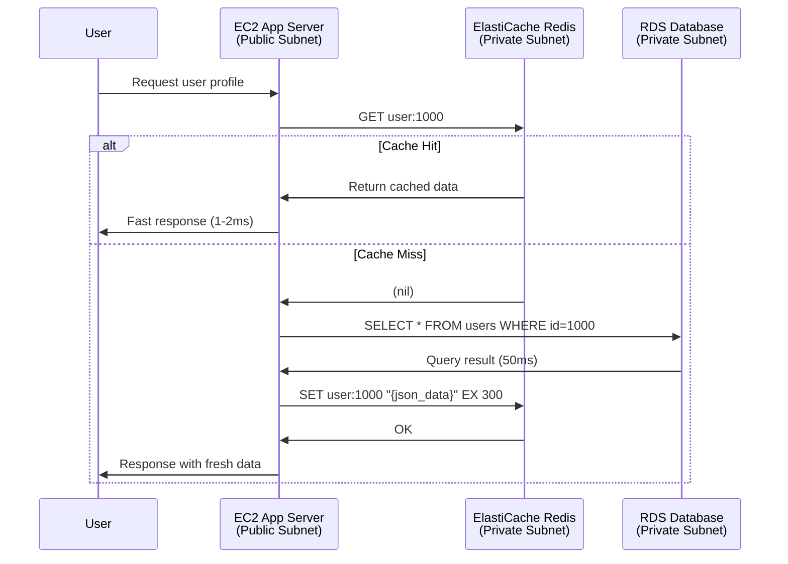

# Q2: Database Performance Optimization with ElastiCache Redis - Solved

**Duration:** 40 minutes  
**Marks:** 30/100  
**Difficulty:** State-Level  
**Reference:** Sikkim 2025 State Exam Pattern

---

## Section 1: Scenario Understanding

### Problem Statement

Application experiences slow database query performance due to repeated queries for same data. Implement ElastiCache Redis to cache frequently accessed data, reducing database load and improving response times. Deploy Redis cluster in private subnet, configure security groups, connect from EC2 application server, implement caching logic, and verify performance improvement.

### Key Requirements

- **Redis Cluster:** cache.t2.micro node type in private subnet
- **Security Group:** Allow port 6379 from application tier security group only
- **EC2 Instance:** Application server in public subnet with redis-cli installed
- **Subnet Group:** Minimum 2 private subnets in different AZs for Redis
- **Testing:** Demonstrate connection, basic Redis operations, cache hit/miss pattern, TTL functionality
- **Verification:** Clear proof of successful connectivity and caching operations

### Constraints

- **Region:** us-east-1
- **Instance Types:** cache.t2.micro (Free Tier eligible for 12 months)
- **Time Limit:** 40 minutes
- **VPC:** Use existing VPC from Q1 or create simple VPC with public/private subnets
- **Cost:** Minimize costs using Free Tier resources

### What Problem is Being Solved

Reduce database query latency by caching frequently accessed data in-memory using Redis. Application queries check Redis cache first; on cache hit, data returned immediately (sub-millisecond latency). On cache miss, application queries RDS database, stores result in Redis, then returns data. Subsequent queries for same data hit cache, dramatically improving response time and reducing database load.

---

## Section 2: Architecture Explanation (Marks-Oriented)

### Components Used

1. **ElastiCache Redis Cluster:** cache.t2.micro node, single node (no replication for Free Tier)
2. **Subnet Group:** Collection of private subnets in different AZs where Redis nodes deploy
3. **Security Group (Redis):** Allows inbound port 6379 from application security group only
4. **EC2 Application Server:** t2.micro in public subnet, runs redis-cli for testing
5. **Security Group (Application):** Allows SSH from admin, outbound to Redis on port 6379
6. **VPC with Public/Private Subnets:** Network isolation for Redis in private tier

### Why Each Component

- **Redis for In-Memory Caching:** Stores data in RAM for sub-millisecond access latency (vs. 10-50ms for RDS queries)
- **Private Subnet:** Redis has no public endpoint, not accessible from internet, security best practice
- **Subnet Group:** ElastiCache requires subnet group with 2+ subnets in different AZs for high availability foundation
- **Security Group for Access Control:** Restricts Redis access to application tier only, prevents unauthorized connections
- **EC2 for Testing:** Simulates application server that reads/writes cache data via redis-cli commands
- **cache.t2.micro:** Free Tier eligible (750 hours/month for 12 months), sufficient for development/testing workloads

### Architecture Diagram



### Security Awareness

- **Redis in Private Subnet:** No public IP, not accessible from internet, only from application tier
- **Security Group Restriction:** Port 6379 allowed only from application security group (not 0.0.0.0/0)
- **No Encryption at Rest/Transit (Free Tier):** Production systems should enable encryption; exam focuses on functionality
- **Network Isolation:** Redis and application in same VPC; cross-VPC access requires VPC peering
- **Access Control:** No Redis password authentication in basic setup; consider Redis AUTH for production

### Cost Awareness

- **cache.t2.micro:** Free Tier eligible for 750 hours/month (12 months for new accounts), covers 24/7 operation
- **Data Transfer:** Within same VPC/AZ free; cross-AZ data transfer $0.01/GB (minimal for cache operations)
- **Backup Storage:** Not applicable (backups disabled for Free Tier)
- **CloudWatch Metrics:** Basic metrics (CPUUtilization, CacheHits, CacheMisses) included free
- **After Free Tier:** cache.t2.micro ~$0.017/hour (~$12/month) in us-east-1

---

## Section 3: Step-by-Step Implementation

### Console Steps (Primary Method)

#### 1. Prepare VPC and Subnets (if not using Q1 VPC)

**Option A: Use Existing VPC from Q1**
- Use `indskills-exam-vpc` (10.0.0.0/16)
- Use existing private subnets:
  - `indskills-private-1b` (10.0.2.0/24) in us-east-1b
  - Create additional private subnet if needed

**Option B: Create Simple VPC (if Q1 not completed)**
1. Create VPC: `indskills-cache-vpc`, CIDR `10.0.0.0/16`
2. Create public subnet: `10.0.1.0/24` in us-east-1a (for EC2)
3. Create private subnet 1: `10.0.2.0/24` in us-east-1a (for Redis)
4. Create private subnet 2: `10.0.3.0/24` in us-east-1b (for Redis subnet group requirement)
5. Create IGW, attach to VPC, add route in public subnet route table

**For this solution, we assume Q1 VPC exists. If not, create additional private subnet:**

1. VPC Dashboard → **Subnets** → **Create subnet**
2. Configure:
   - **VPC:** Select `indskills-exam-vpc`
   - **Subnet name:** `indskills-private-1a`
   - **Availability Zone:** `us-east-1a`
   - **IPv4 CIDR block:** `10.0.3.0/24`
3. Click **Create subnet**

#### 2. Create Subnet Group for Redis

1. Navigate to **ElastiCache Dashboard**
2. Left menu → **Subnet groups** → **Create subnet group**
3. Configure:
   - **Name:** `indskills-redis-subnet-group`
   - **Description:** Subnet group for Redis cluster
   - **VPC:** Select `indskills-exam-vpc`
4. **Availability Zones:** Select at least 2 AZs:
   - ✅ us-east-1a
   - ✅ us-east-1b
5. **Subnets:** Select private subnets only:
   - ✅ `indskills-private-1a` (10.0.3.0/24)
   - ✅ `indskills-private-1b` (10.0.2.0/24)
   - ⚠️ Do NOT select public subnet (security risk)
6. Click **Create**
7. **Note:** Subnet group name for next steps

#### 3. Create Security Group for Redis

1. Navigate to **EC2 Dashboard** → **Security Groups**
2. Click **Create security group**
3. Configure:
   - **Security group name:** `indskills-redis-sg`
   - **Description:** Redis cluster security group
   - **VPC:** Select `indskills-exam-vpc`
4. **Inbound rules:**
   - Click **Add rule**
   - Type: **Custom TCP**
   - Port range: **6379**
   - Source: **Custom** → Select `indskills-web-sg` (application security group from Q1)
     - If web-sg doesn't exist, note to create it in step 6 and come back
   - Description: "Allow Redis from application tier"
5. **Outbound rules:** Leave default (allow all outbound)
6. Click **Create security group**
7. **Note Security Group ID** (e.g., sg-0a1b2c3d4e5f6g7h8)

#### 4. Create Redis Cluster

1. Navigate to **ElastiCache Dashboard**
2. Left menu → **Redis clusters** → **Create Redis cluster**
3. **Cluster creation method:**
   - Select **Easy create** (or **Configure and create** for full control)
4. **Cluster info:**
   - **Name:** `indskills-redis-cluster`
   - **Description:** Redis cache for performance optimization
   - **Location:** AWS Cloud
5. **Cluster settings:**
   - **Engine version:** Redis 7.0 or latest (default)
   - **Port:** 6379 (default)
   - **Parameter group:** default.redis7 (default)
   - **Node type:** cache.t2.micro
   - **Number of replicas:** 0 (single node for Free Tier)
6. **Connectivity:**
   - **Network type:** IPv4
   - **Subnet group:** Select `indskills-redis-subnet-group`
   - **Security groups:** Select `indskills-redis-sg`
7. **Advanced settings:**
   - **Encryption at rest:** Disabled (not available in Free Tier)
   - **Encryption in transit:** Disabled (not available in Free Tier)
   - **Backup:** Disabled (not available in Free Tier)
   - **Maintenance window:** No preference (or select specific window)
8. Click **Create**
9. **Wait 5-10 minutes** for cluster status to change to **"Available"**
10. Monitor creation progress in **Redis clusters** list

#### 5. Retrieve Redis Endpoint

1. ElastiCache Dashboard → **Redis clusters**
2. Click on `indskills-redis-cluster`
3. **Cluster details** section → **Primary Endpoint**
4. Copy endpoint (format: `indskills-redis-cluster.xxxxx.0001.use1.cache.amazonaws.com:6379`)
5. **Example:** `indskills-redis-cluster.abc123.0001.use1.cache.amazonaws.com:6379`
6. **Note:** Port 6379 is included in endpoint string
7. Save endpoint for connection testing

#### 6. Launch EC2 Application Server (if not using Q1 instance)

1. Navigate to **EC2 Dashboard** → **Instances** → **Launch instances**
2. Configure:
   - **Name:** `indskills-app-server`
   - **AMI:** Amazon Linux 2 AMI (HVM), SSD Volume Type
   - **Instance type:** t2.micro
   - **Key pair:** Select existing or create new
3. **Network settings** → **Edit:**
   - **VPC:** `indskills-exam-vpc`
   - **Subnet:** `indskills-public-1a` (public subnet)
   - **Auto-assign public IP:** Enable
   - **Firewall (security groups):** Select existing `indskills-web-sg` or create new
     - If creating new: Allow SSH (22) from your IP
4. Click **Launch instance**
5. Wait for instance state: **Running**
6. **Note Public IP address** (e.g., 54.123.45.67)

#### 7. Install redis-cli on EC2

1. SSH to EC2 instance:
   ```bash
   ssh -i keypair.pem ec2-user@54.123.45.67
   ```

2. **Method 1: Install from Source (Amazon Linux 2)**
   ```bash
   # Update system packages
   sudo yum update -y
   
   # Install build tools
   sudo yum install -y gcc make
   
   # Download Redis source
   wget http://download.redis.io/redis-stable.tar.gz
   
   # Extract archive
   tar xvzf redis-stable.tar.gz
   
   # Build Redis (only redis-cli needed)
   cd redis-stable
   make
   
   # Copy redis-cli to system path
   sudo cp src/redis-cli /usr/local/bin/
   
   # Verify installation
   redis-cli --version
   # Expected output: redis-cli 7.x.x
   ```

3. **Method 2: Install from Package (Amazon Linux 2023)**
   ```bash
   # Update system packages
   sudo yum update -y
   
   # Install redis6 package (includes redis-cli)
   sudo yum install -y redis6
   
   # Verify installation
   redis-cli --version
   # Expected output: redis-cli 6.x.x
   ```

4. Keep SSH session open for testing

### AWS CLI Commands (Optional)

```bash
# Set variables
REGION="us-east-1"
VPC_ID="vpc-0a1b2c3d4e5f6g7h8"  # Replace with your VPC ID
PRIVATE_SUBNET_1="subnet-xxx"    # Replace with private subnet 1 ID
PRIVATE_SUBNET_2="subnet-yyy"    # Replace with private subnet 2 ID
WEB_SG_ID="sg-xxx"               # Replace with web security group ID

# Create subnet group
aws elasticache create-cache-subnet-group \
  --cache-subnet-group-name indskills-redis-subnet-group \
  --cache-subnet-group-description "Subnet group for Redis cluster" \
  --subnet-ids $PRIVATE_SUBNET_1 $PRIVATE_SUBNET_2 \
  --region $REGION

# Create security group for Redis
REDIS_SG_ID=$(aws ec2 create-security-group \
  --group-name indskills-redis-sg \
  --description "Redis cluster security group" \
  --vpc-id $VPC_ID \
  --region $REGION \
  --query 'GroupId' --output text)

# Add inbound rule (port 6379 from web SG)
aws ec2 authorize-security-group-ingress \
  --group-id $REDIS_SG_ID \
  --protocol tcp \
  --port 6379 \
  --source-group $WEB_SG_ID \
  --region $REGION

# Create Redis cluster
aws elasticache create-cache-cluster \
  --cache-cluster-id indskills-redis-cluster \
  --engine redis \
  --cache-node-type cache.t2.micro \
  --num-cache-nodes 1 \
  --cache-subnet-group-name indskills-redis-subnet-group \
  --security-group-ids $REDIS_SG_ID \
  --region $REGION

# Wait for cluster to be available (5-10 minutes)
echo "Waiting for Redis cluster to become available..."
aws elasticache wait cache-cluster-available \
  --cache-cluster-id indskills-redis-cluster \
  --region $REGION

# Get Redis endpoint
REDIS_ENDPOINT=$(aws elasticache describe-cache-clusters \
  --cache-cluster-id indskills-redis-cluster \
  --show-cache-node-info \
  --region $REGION \
  --query 'CacheClusters[0].CacheNodes[0].Endpoint.Address' \
  --output text)

echo "Redis Endpoint: $REDIS_ENDPOINT:6379"
```

---

## Section 4: Verification/Proof

### Verification Steps

#### 1. Test Redis Connectivity

**Purpose:** Verify EC2 can reach Redis cluster on port 6379

**Steps:**
1. From EC2 SSH session, test connection with PING command:
   ```bash
   redis-cli -h indskills-redis-cluster.abc123.0001.use1.cache.amazonaws.com ping
   ```
   
**Expected Output:**
```
PONG
```

**Success Indicator:** Receiving "PONG" response confirms successful connection

**Screenshot Required:** Terminal showing redis-cli PING command and PONG response

**Troubleshooting:**
- If timeout: Check security group allows port 6379 from EC2 security group
- If "connection refused": Check Redis cluster status is "Available"
- If "could not resolve hostname": Check endpoint spelling and DNS settings

#### 2. Test Basic Redis Operations (SET/GET)

**Purpose:** Verify basic key-value storage and retrieval

**Steps:**
1. Set a key-value pair:
   ```bash
   redis-cli -h indskills-redis-cluster.abc123.0001.use1.cache.amazonaws.com SET testkey "Hello Redis"
   ```

2. Get the value:
   ```bash
   redis-cli -h indskills-redis-cluster.abc123.0001.use1.cache.amazonaws.com GET testkey
   ```

**Expected Output:**
```
OK
"Hello Redis"
```

**Screenshot Required:** Terminal showing both SET and GET commands with outputs

#### 3. Demonstrate Cache Hit/Miss Pattern

**Purpose:** Simulate real-world caching scenario with cache miss followed by cache hit

**Steps:**
1. Query non-existent key (cache miss):
   ```bash
   redis-cli -h indskills-redis-cluster.abc123.0001.use1.cache.amazonaws.com GET user:1000:name
   ```

2. Store data in cache (simulating database query result):
   ```bash
   redis-cli -h indskills-redis-cluster.abc123.0001.use1.cache.amazonaws.com SET user:1000:name "John Doe"
   ```

3. Query same key again (cache hit):
   ```bash
   redis-cli -h indskills-redis-cluster.abc123.0001.use1.cache.amazonaws.com GET user:1000:name
   ```

**Expected Output:**
```
(nil)          # Cache miss - key doesn't exist
OK             # Store operation successful
"John Doe"     # Cache hit - data returned from cache
```

**Screenshot Required:** Terminal showing sequence of cache miss, SET, then cache hit

**Explanation for Evaluator:** This demonstrates typical caching workflow: first request misses cache (query database), store result in cache, subsequent requests hit cache (fast response without database query).

#### 4. Test TTL (Time-To-Live)

**Purpose:** Verify automatic key expiration for preventing stale data

**Steps:**
1. Set key with 60-second expiration:
   ```bash
   redis-cli -h indskills-redis-cluster.abc123.0001.use1.cache.amazonaws.com SETEX session:abc123 60 "user_id:1000"
   ```

2. Check remaining time-to-live:
   ```bash
   redis-cli -h indskills-redis-cluster.abc123.0001.use1.cache.amazonaws.com TTL session:abc123
   ```

3. Retrieve value before expiration:
   ```bash
   redis-cli -h indskills-redis-cluster.abc123.0001.use1.cache.amazonaws.com GET session:abc123
   ```

**Expected Output:**
```
OK                # SETEX successful
(integer) 58      # TTL countdown (seconds remaining)
"user_id:1000"    # Value retrieved before expiration
```

**Screenshot Required:** Terminal showing SETEX, TTL countdown, and GET before expiration

**Use Case:** Session data, temporary tokens, rate limiting counters

#### 5. Test Hash Operations (User Profile)

**Purpose:** Demonstrate Redis hash data structure for complex objects

**Steps:**
1. Store user profile fields:
   ```bash
   redis-cli -h indskills-redis-cluster.abc123.0001.use1.cache.amazonaws.com HSET user:2000 name "Jane Smith"
   redis-cli -h indskills-redis-cluster.abc123.0001.use1.cache.amazonaws.com HSET user:2000 email "jane@example.com"
   redis-cli -h indskills-redis-cluster.abc123.0001.use1.cache.amazonaws.com HSET user:2000 age 28
   ```

2. Retrieve all hash fields:
   ```bash
   redis-cli -h indskills-redis-cluster.abc123.0001.use1.cache.amazonaws.com HGETALL user:2000
   ```

**Expected Output:**
```
(integer) 1        # First HSET creates hash
(integer) 1        # Additional fields added
(integer) 1
1) "name"
2) "Jane Smith"
3) "email"
4) "jane@example.com"
5) "age"
6) "28"
```

**Screenshot Required:** Terminal showing HSET commands and HGETALL output

**Use Case:** User profiles, product details, session attributes

#### 6. Verify Security Group Configuration

**Purpose:** Confirm Redis security group restricts access to application tier only

**Steps:**
1. Console: **EC2 Dashboard** → **Security Groups**
2. Search for `indskills-redis-sg`
3. Select security group → **Inbound rules** tab
4. Verify rule:
   - **Type:** Custom TCP
   - **Port:** 6379
   - **Source:** `indskills-web-sg` (security group ID, NOT 0.0.0.0/0)

**Expected Configuration:**
- Single inbound rule allowing port 6379 from specific security group
- No rule allowing 0.0.0.0/0 (entire internet)

**Screenshot Required:** Security group inbound rules showing source as security group ID

#### 7. Check CloudWatch Metrics (Optional)

**Purpose:** Verify Redis cluster is generating metrics

**Steps:**
1. Console: **ElastiCache Dashboard** → **Redis clusters**
2. Click `indskills-redis-cluster`
3. **Metrics** tab
4. View metrics:
   - **CPUUtilization:** Should show activity after commands
   - **CacheHits:** Increments on GET for existing keys
   - **CacheMisses:** Increments on GET for non-existent keys
   - **NetworkBytesIn/Out:** Shows data transfer

**Screenshot Required (Optional):** CloudWatch metrics showing activity

### Success Criteria

- ✅ Redis cluster status: "Available"
- ✅ Successful PING response from EC2 application server
- ✅ SET/GET operations work correctly
- ✅ Cache hit/miss pattern clearly demonstrated
- ✅ TTL functionality verified with countdown
- ✅ Hash operations (HSET/HGETALL) work correctly
- ✅ Security group restricts access to application tier only (not 0.0.0.0/0)
- ✅ All screenshots/command outputs provided as proof

### Failure Scenarios

| Symptom | Possible Causes | Solution |
|---------|----------------|----------|
| Connection timeout | Security group not allowing port 6379 from EC2 SG, Redis in different VPC, EC2 no outbound to port 6379 | Verify Redis SG allows inbound 6379 from EC2 SG, check both in same VPC, verify EC2 SG allows outbound (default: all) |
| "Connection refused" | Redis cluster not in "Available" status, wrong port | Wait for cluster to reach "Available" status (5-10 minutes), ensure using port 6379 |
| "Could not resolve hostname" | Incorrect endpoint, DNS not enabled on VPC | Double-check endpoint spelling, ensure VPC has DNS resolution enabled |
| NOAUTH error | Redis AUTH password required but not provided | For basic setup, AUTH not required; if enabled, use `redis-cli -h <endpoint> -a <password>` |
| Commands fail with errors | redis-cli not installed, syntax errors | Verify redis-cli installed: `redis-cli --version`, check command syntax |

---

## Section 5: Common Mistakes (State Exam)

### 1. Redis in Public Subnet
**Mistake:** Creating Redis cluster in public subnet instead of private subnet

**Why Wrong:** Security risk; Redis exposed to internet if security group misconfigured. Best practice is private subnet with no public IP.

**Correct Approach:** Always place Redis in private subnets; select private subnets when creating subnet group.

### 2. Security Group Too Permissive
**Mistake:** Allowing port 6379 from 0.0.0.0/0 instead of specific application security group

**Why Wrong:** Allows entire internet to attempt Redis connections if Redis were in public subnet or VPN connected. Violates least-privilege principle.

**Correct Approach:** Use application security group ID as source (e.g., sg-0a1b2c3d), not CIDR block 0.0.0.0/0.

### 3. Wrong Subnet Group Configuration
**Mistake:** Selecting public subnets for Redis subnet group

**Why Wrong:** Redis should not be internet-accessible; public subnets have IGW routes.

**Correct Approach:** Select only private subnets when creating subnet group; verify subnets have no route to IGW.

### 4. Missing redis-cli Installation
**Mistake:** Attempting to connect to Redis without installing redis-cli on EC2

**Why Wrong:** No client tool available to test connectivity and operations.

**Correct Approach:** Install redis-cli before testing: `sudo yum install -y redis6` (Amazon Linux 2023) or build from source.

### 5. Incorrect Endpoint Format
**Mistake:** Using endpoint without port, or wrong port number

**Why Wrong:** Redis listens on port 6379; connection fails if port omitted or incorrect.

**Correct Approach:** Use full endpoint with port: `hostname:6379` or specify with `-p 6379` flag.

### 6. Not Waiting for Available Status
**Mistake:** Testing connection before Redis cluster reaches "Available" status

**Why Wrong:** Cluster still provisioning; endpoint not yet accepting connections.

**Correct Approach:** Wait 5-10 minutes after creation; verify status shows "Available" (green) before testing.

### 7. VPC Mismatch
**Mistake:** Redis cluster and EC2 instance in different VPCs

**Why Wrong:** No network connectivity between different VPCs without VPC peering or Transit Gateway.

**Correct Approach:** Ensure Redis subnet group and EC2 instance both in same VPC.

### 8. Forgetting TTL
**Mistake:** Not setting expiration on cached data using SET instead of SETEX

**Why Wrong:** Cached data never expires; memory fills up with stale data over time.

**Correct Approach:** Use SETEX for data with expiration needs: `SETEX key seconds value`, or use EXPIRE after SET.

### 9. Wrong Port in Security Group
**Mistake:** Allowing port 3306 (MySQL) or 5432 (PostgreSQL) instead of 6379 (Redis)

**Why Wrong:** Redis listens on port 6379, not database ports.

**Correct Approach:** Verify security group rule allows TCP port 6379, not other port numbers.

### 10. No Verification Screenshots
**Mistake:** Not providing proof of successful connection and operations

**Why Wrong:** Evaluators cannot verify functionality without evidence; no marks awarded for verification section.

**Correct Approach:** Take clear screenshots showing terminal with commands and outputs, or copy-paste full command outputs into exam documentation.

---

## Section 6: Mark Mapping

**Total Marks: 30/100**

| Task | Marks | Evaluation Criteria |
|------|-------|---------------------|
| **Subnet Group Creation** | 2 | Subnet group created with correct private subnets in 2+ different AZs, no public subnets included |
| **Security Group Configuration** | 3 | Redis SG created with inbound rule allowing port 6379 from application SG only (not 0.0.0.0/0) |
| **Redis Cluster Creation** | 4 | Cluster created with cache.t2.micro node type, Redis 7.0 engine, correct subnet group and security group selected |
| **Cluster Available Status** | 2 | Redis cluster reaches "Available" status, visible in Console or CLI output |
| **Endpoint Retrieval** | 1 | Primary endpoint correctly noted with port 6379 |
| **redis-cli Installation** | 2 | redis-cli installed on EC2 instance, version output shown |
| **Connection Test (PING)** | 3 | PONG response received from Redis cluster, screenshot provided showing command and output |
| **SET/GET Operations** | 3 | Basic key-value operations demonstrated, both SET OK and GET value shown with screenshot |
| **Cache Hit/Miss Demo** | 4 | Clear demonstration of cache miss (nil), SET, then cache hit (value returned), screenshot showing sequence |
| **TTL Verification** | 2 | SETEX command used with expiration, TTL shows countdown, GET retrieves value before expiration |
| **Hash Operations** | 2 | HSET commands add fields to hash, HGETALL retrieves all fields correctly |
| **Security Verification** | 2 | Security group rules verified and documented with screenshot, showing source is SG ID not 0.0.0.0/0 |

### Partial Mark Guidelines

- **Subnet Group (2 marks):** 1 mark if created but includes public subnet (security issue), 0 marks if missing or wrong VPC
- **Security Group (3 marks):** Deduct 2 marks if allows 0.0.0.0/0 (critical security error), 1 mark if port wrong
- **Redis Cluster (4 marks):** Partial marks for correct node type but wrong subnet group (2 marks), or correct config but not Available (2 marks)
- **Connection Test (3 marks):** 1 mark for showing redis-cli attempt even if fails, 0 marks without screenshot
- **Cache Hit/Miss (4 marks):** Full marks only for clear sequence showing (nil) → SET → value; partial marks (2) for just SET/GET without miss demonstration
- **Verification (14 marks total across tests):** Award marks only with clear screenshots or terminal outputs; no marks for "it works" without proof

### Marking Notes for Evaluators

1. **Critical Security Errors:**
   - Redis in public subnet: Deduct 2 marks from subnet group score
   - Security group allows 0.0.0.0/0: Deduct 2 marks from security group score
   - Both errors: Deduct 4 marks total (serious security violations)

2. **Verification Requirements:**
   - Full marks require clear, legible screenshots showing:
     - Terminal prompt with full redis-cli command including endpoint
     - Command output (PONG, OK, values)
     - Timestamp or instance hostname for authenticity
   - Copy-pasted text outputs acceptable if formatted clearly
   - No marks without proof, even if candidate claims "working"

3. **Partial Credit Scenarios:**
   - Cluster created but connection fails: Award marks for creation (6 marks), 0 for tests (14 marks)
   - Connection works but advanced tests (TTL, hash) missing: Award proportional marks
   - redis-cli installed but wrong version (incompatible): Partial marks if workaround shown

4. **Bonus Consideration (not additional marks, but tiebreaker):**
   - CloudWatch metrics screenshot showing CacheHits/CacheMisses
   - Multiple data types demonstrated (strings, hashes, lists)
   - Proper error handling documentation if issues encountered

5. **Time Management:**
   - Candidates running out of time may submit partial solutions
   - Award all marks for completed tasks even if final steps incomplete
   - Connection test (PING) worth 3 marks; prioritize this over advanced operations if time limited

---

**Exam Tip:** Always verify Redis cluster status is "Available" before testing connectivity. Connection attempts during "Creating" status will fail and waste valuable exam time. Use Console Status column or CLI `describe-cache-clusters` to check status.

**Performance Note:** For evaluators - cache hit/miss pattern is core concept; award full 4 marks only if candidate clearly demonstrates understanding by showing nil (miss), then populating cache, then successful retrieval (hit). Single SET/GET without context earns only partial credit.
