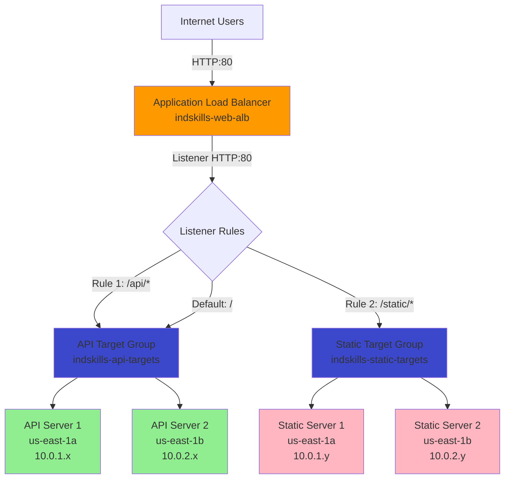

# Q3: Traffic Distribution with Application Load Balancer - Solved

**Duration:** 40 minutes  
**Marks:** 40/100  
**Difficulty:** State-Level  
**Reference:** Sikkim 2025 State Exam Pattern

---

## Section 1: Scenario Understanding

### Problem Statement

Deploy Application Load Balancer to distribute traffic across multiple EC2 web servers based on URL path. Implement path-based routing where `/api/*` requests go to API server instances and `/static/*` requests go to static content server instances. Configure health checks, verify traffic distribution, and test failover when one instance becomes unhealthy.

### Key Requirements

- **ALB:** Internet-facing load balancer in public subnets across 2 AZs
- **Target Groups:** Two target groups (api-targets, static-targets)
- **EC2 Instances:** 2 API server instances + 2 static content server instances (total 4 instances)
- **Availability Zones:** Instances distributed across us-east-1a and us-east-1b
- **Path-Based Routing:**
  - `/api/*` requests → API target group
  - `/static/*` requests → Static target group
  - Default (root `/`) → API target group
- **Health Checks:** Health check path `/health` on all instances
- **Verification:** DNS validation, traffic distribution testing, failover demonstration

### Constraints

- **Region:** us-east-1
- **Instance Types:** t2.micro (Free Tier eligible)
- **Time Limit:** 40 minutes
- **VPC:** Use existing VPC with 2 public subnets or create simple VPC
- **Cost:** ALB ~$16/month (not Free Tier), EC2 instances Free Tier eligible

### What Problem is Being Solved

Distribute traffic across multiple servers for high availability and performance. Route requests to appropriate backend services based on URL path for microservices architecture. Automatically remove unhealthy instances from rotation to maintain service availability. ALB provides Layer 7 (HTTP/HTTPS) routing capabilities with path-based and host-based routing rules.

---

## Section 2: Architecture Explanation (Marks-Oriented)

### Components Used

1. **Application Load Balancer (ALB):** Internet-facing, distributes HTTP traffic across targets
2. **2 Target Groups:** Logical grouping of instances for path-based routing
3. **4 EC2 Instances:** 2 API servers + 2 static servers (t2.micro)
4. **2 Public Subnets:** Across different AZs (us-east-1a, us-east-1b) for high availability
5. **Security Groups:** ALB SG (allow 80/443 from internet) + EC2 SG (allow 80 from ALB only)
6. **Listener Rules:** HTTP:80 listener with path-based routing rules
7. **Health Checks:** HTTP health checks on `/health` endpoint with 30-second intervals

### Why Each Component

- **ALB for Layer 7 Routing:** Provides content-based routing (path, host, headers); superior to CLB for microservices
- **Target Groups:** Enable routing to different backends based on request attributes; single ALB serves multiple services
- **Multiple AZs:** Distributes instances across failure domains; ALB continues operating if one AZ fails
- **Path-Based Routing:** `/api/*` → API microservice, `/static/*` → CDN-like static content; architecture decoupling
- **Health Checks:** Automatically detect and remove unhealthy instances; traffic routes only to healthy targets
- **Security Group Chaining:** ALB allows internet (0.0.0.0/0), EC2 allows only ALB SG; prevents direct instance access

### Architecture Diagram



### Security Awareness

- **ALB Security Group:** Allows HTTP (80) and HTTPS (443) from 0.0.0.0/0 (internet-facing requirement)
- **EC2 Security Group:** Allows HTTP (80) only from ALB security group (not from 0.0.0.0/0)
- **Security Group Chaining:** EC2 instances not directly accessible from internet; all traffic flows through ALB
- **Private Instance IPs:** Even in public subnets, instances use private IPs for ALB communication
- **Health Check Endpoint:** Dedicated `/health` endpoint separate from application logic for monitoring

### Cost Awareness

- **ALB:** ~$0.0225/hour (~$16.20/month) + $0.008/LCU-hour (Load Balancer Capacity Unit)
  - Not Free Tier eligible, main cost driver
  - Single ALB can serve multiple applications (cost-effective)
- **EC2 t2.micro:** 4 instances × 750 hours = 3,000 hours (exceeds Free Tier 750 hours/month per account)
  - First 750 hours free, remaining 2,250 hours charged (~$18/month)
  - Exam environment often provides unlimited hours
- **Data Transfer:** First 100GB outbound free per month, then $0.09/GB
- **Estimated Monthly Cost:** ~$16 (ALB) + ~$0-18 (EC2 if beyond Free Tier) = $16-34

---

## Section 3: Step-by-Step Implementation

### Console Steps (Primary Method)

#### 1. Prepare VPC and Subnets (if not using Q1 VPC)

**Option A: Use Existing VPC from Q1**
- Use `indskills-exam-vpc` (10.0.0.0/16)
- Use existing public subnets:
  - `indskills-public-1a` (10.0.1.0/24) in us-east-1a
  - Create second public subnet in us-east-1b if needed

**Option B: Create Simple VPC (if Q1 not completed)**
1. Create VPC: `indskills-alb-vpc`, CIDR `10.0.0.0/16`, DNS enabled
2. Create public subnet 1: `10.0.1.0/24` in us-east-1a, auto-assign public IP enabled
3. Create public subnet 2: `10.0.2.0/24` in us-east-1b, auto-assign public IP enabled
4. Create IGW, attach to VPC
5. Create route table with 0.0.0.0/0 → IGW, associate both subnets

**For this solution, create second public subnet if needed:**

1. VPC Dashboard → **Subnets** → **Create subnet**
2. Configure:
   - **VPC:** Select `indskills-exam-vpc`
   - **Subnet name:** `indskills-public-1b`
   - **Availability Zone:** `us-east-1b`
   - **IPv4 CIDR block:** `10.0.2.0/24`
3. Enable **Auto-assign public IPv4 address**
4. Associate with public route table (0.0.0.0/0 → IGW)

#### 2. Create Security Group for ALB

1. Navigate to **EC2 Dashboard** → **Security Groups**
2. Click **Create security group**
3. Configure:
   - **Security group name:** `indskills-alb-sg`
   - **Description:** Application Load Balancer security group
   - **VPC:** Select `indskills-exam-vpc`
4. **Inbound rules:**
   - Click **Add rule**
   - Type: **HTTP**, Port: **80**, Source: **0.0.0.0/0**, Description: "Allow HTTP from internet"
   - Click **Add rule**
   - Type: **HTTPS**, Port: **443**, Source: **0.0.0.0/0**, Description: "Allow HTTPS from internet (optional)"
5. **Outbound rules:** Leave default (allow all outbound)
6. Click **Create security group**
7. **Note Security Group ID** (e.g., sg-alb123456)

#### 3. Create Security Group for EC2 Instances

1. Click **Create security group**
2. Configure:
   - **Security group name:** `indskills-web-instances-sg`
   - **Description:** Web server instances security group
   - **VPC:** Select `indskills-exam-vpc`
3. **Inbound rules:**
   - Click **Add rule**
   - Type: **HTTP**, Port: **80**, Source: **Custom** → Select `indskills-alb-sg`, Description: "Allow HTTP from ALB"
   - Click **Add rule**
   - Type: **SSH**, Port: **22**, Source: **My IP** (or your specific IP), Description: "Allow SSH for management"
4. **Outbound rules:** Leave default (allow all outbound)
5. Click **Create security group**
6. **Note Security Group ID** (e.g., sg-web123456)

#### 4. Launch EC2 Instances for API Servers

**API Server Instance 1:**

1. Navigate to **EC2 Dashboard** → **Instances** → **Launch instances**
2. Configure:
   - **Name:** `indskills-api-server-1`
   - **AMI:** Amazon Linux 2 AMI (HVM), SSD Volume Type
   - **Instance type:** t2.micro
   - **Key pair:** Select existing or create new
3. **Network settings** → **Edit:**
   - **VPC:** `indskills-exam-vpc`
   - **Subnet:** `indskills-public-1a` (us-east-1a)
   - **Auto-assign public IP:** Enable
   - **Firewall (security groups):** Select existing → `indskills-web-instances-sg`
4. **Advanced details** → **User data:** Paste script:
   ```bash
   #!/bin/bash
   yum update -y
   yum install -y httpd
   systemctl start httpd
   systemctl enable httpd
   echo "<h1>API Server - Instance 1 - AZ: us-east-1a</h1>" > /var/www/html/index.html
   mkdir -p /var/www/html/api
   echo "<h1>API Response from Instance 1</h1><p>Processing your API request...</p>" > /var/www/html/api/index.html
   echo "OK" > /var/www/html/health
   ```
5. Click **Launch instance**
6. Wait for instance state: **Running**

**API Server Instance 2:**

1. Click **Launch instances**
2. Configure:
   - **Name:** `indskills-api-server-2`
   - **AMI:** Amazon Linux 2 AMI
   - **Instance type:** t2.micro
   - **Key pair:** Same as instance 1
3. **Network settings** → **Edit:**
   - **VPC:** `indskills-exam-vpc`
   - **Subnet:** `indskills-public-1b` (us-east-1b)
   - **Auto-assign public IP:** Enable
   - **Firewall:** `indskills-web-instances-sg`
4. **User data:**
   ```bash
   #!/bin/bash
   yum update -y
   yum install -y httpd
   systemctl start httpd
   systemctl enable httpd
   echo "<h1>API Server - Instance 2 - AZ: us-east-1b</h1>" > /var/www/html/index.html
   mkdir -p /var/www/html/api
   echo "<h1>API Response from Instance 2</h1><p>Processing your API request...</p>" > /var/www/html/api/index.html
   echo "OK" > /var/www/html/health
   ```
5. Click **Launch instance**

#### 5. Launch EC2 Instances for Static Content Servers

**Static Server Instance 1:**

1. Click **Launch instances**
2. Configure:
   - **Name:** `indskills-static-server-1`
   - **AMI:** Amazon Linux 2 AMI
   - **Instance type:** t2.micro
   - **Key pair:** Same as previous instances
3. **Network settings:**
   - **Subnet:** `indskills-public-1a` (us-east-1a)
   - **Security group:** `indskills-web-instances-sg`
4. **User data:**
   ```bash
   #!/bin/bash
   yum update -y
   yum install -y httpd
   systemctl start httpd
   systemctl enable httpd
   echo "<h1>Static Server - Instance 1 - AZ: us-east-1a</h1>" > /var/www/html/index.html
   mkdir -p /var/www/html/static
   echo "<h1>Static Content from Instance 1</h1><p>Serving static files: images, CSS, JS</p>" > /var/www/html/static/index.html
   echo "OK" > /var/www/html/health
   ```
5. Click **Launch instance**

**Static Server Instance 2:**

1. Click **Launch instances**
2. Configure:
   - **Name:** `indskills-static-server-2`
   - **AMI:** Amazon Linux 2 AMI
   - **Instance type:** t2.micro
   - **Key pair:** Same as previous instances
3. **Network settings:**
   - **Subnet:** `indskills-public-1b` (us-east-1b)
   - **Security group:** `indskills-web-instances-sg`
4. **User data:**
   ```bash
   #!/bin/bash
   yum update -y
   yum install -y httpd
   systemctl start httpd
   systemctl enable httpd
   echo "<h1>Static Server - Instance 2 - AZ: us-east-1b</h1>" > /var/www/html/index.html
   mkdir -p /var/www/html/static
   echo "<h1>Static Content from Instance 2</h1><p>Serving static files: images, CSS, JS</p>" > /var/www/html/static/index.html
   echo "OK" > /var/www/html/health
   ```
5. Click **Launch instance**
6. **Wait 2-3 minutes** for all instances to complete initialization and status checks (2/2 passed)

#### 6. Create Target Groups

**API Target Group:**

1. Navigate to **EC2 Dashboard** → **Target Groups** → **Create target group**
2. **Choose target type:** Instances
3. Configure:
   - **Target group name:** `indskills-api-targets`
   - **Protocol:** HTTP
   - **Port:** 80
   - **VPC:** Select `indskills-exam-vpc`
4. **Health checks:**
   - **Health check protocol:** HTTP
   - **Health check path:** `/health`
5. **Advanced health check settings:**
   - **Healthy threshold:** 2
   - **Unhealthy threshold:** 2
   - **Timeout:** 5 seconds
   - **Interval:** 30 seconds
   - **Success codes:** 200
6. Click **Next**
7. **Register targets:**
   - Select **indskills-api-server-1** and **indskills-api-server-2**
   - **Ports for the selected instances:** 80
   - Click **Include as pending below**
8. Click **Create target group**

**Static Target Group:**

1. Click **Create target group**
2. **Choose target type:** Instances
3. Configure:
   - **Target group name:** `indskills-static-targets`
   - **Protocol:** HTTP
   - **Port:** 80
   - **VPC:** Select `indskills-exam-vpc`
4. **Health checks:**
   - **Health check path:** `/health`
   - Same advanced settings as API target group
5. Click **Next**
6. **Register targets:**
   - Select **indskills-static-server-1** and **indskills-static-server-2**
   - Ports: 80
   - Click **Include as pending below**
7. Click **Create target group**
8. **Wait 1-2 minutes**, then verify both target groups show targets as **Healthy**

#### 7. Create Application Load Balancer

1. Navigate to **EC2 Dashboard** → **Load Balancers** → **Create load balancer**
2. Select **Application Load Balancer**
3. **Basic configuration:**
   - **Load balancer name:** `indskills-web-alb`
   - **Scheme:** Internet-facing
   - **IP address type:** IPv4
4. **Network mapping:**
   - **VPC:** Select `indskills-exam-vpc`
   - **Mappings:** Select at least 2 Availability Zones
     - ✅ us-east-1a → Select `indskills-public-1a`
     - ✅ us-east-1b → Select `indskills-public-1b`
5. **Security groups:**
   - Remove default security group
   - Select `indskills-alb-sg`
6. **Listeners and routing:**
   - **Protocol:** HTTP
   - **Port:** 80
   - **Default action:** Forward to → Select `indskills-api-targets`
7. Click **Create load balancer**
8. **Wait 2-3 minutes** for provisioning state to change to **Active**
9. Copy **DNS name** (e.g., `indskills-web-alb-1234567890.us-east-1.elb.amazonaws.com`)

#### 8. Configure Path-Based Routing Rules

1. Select `indskills-web-alb` → **Listeners** tab
2. Click on **HTTP:80** listener
3. Click **View/edit rules**
4. Click **Add rule** (+ icon or Insert rule button)

**Rule 1: API Path Routing**

1. Click **Insert Rule** (before default rule, priority 1)
2. **Add condition:**
   - Click **Add condition** → **Path**
   - **is** → `/api/*`
3. **Add action:**
   - Click **Add action** → **Forward to**
   - **Target group:** `indskills-api-targets`
   - Weight: 100
4. **Priority:** 1
5. Click **Save**

**Rule 2: Static Path Routing**

1. Click **Insert Rule** (after rule 1, priority 2)
2. **Add condition:**
   - Click **Add condition** → **Path**
   - **is** → `/static/*`
3. **Add action:**
   - Click **Add action** → **Forward to**
   - **Target group:** `indskills-static-targets`
   - Weight: 100
4. **Priority:** 2
5. Click **Save**

**Verify Rules:**
- Rule Priority 1: IF Path is `/api/*` THEN Forward to indskills-api-targets
- Rule Priority 2: IF Path is `/static/*` THEN Forward to indskills-static-targets
- Default rule: Forward to indskills-api-targets (catches root path `/`)

6. Return to Load Balancers list, note ALB DNS name for testing

### AWS CLI Commands (Optional)

```bash
# Set variables
REGION="us-east-1"
VPC_ID="vpc-xxx"
PUBLIC_SUBNET_1="subnet-xxx"
PUBLIC_SUBNET_2="subnet-yyy"
KEY_NAME="indskills-keypair"
AMI_ID="ami-0c55b159cbfafe1f0"  # Amazon Linux 2 (verify latest AMI ID)

# Create security groups
ALB_SG_ID=$(aws ec2 create-security-group \
  --group-name indskills-alb-sg \
  --description "ALB security group" \
  --vpc-id $VPC_ID \
  --region $REGION \
  --query 'GroupId' --output text)

EC2_SG_ID=$(aws ec2 create-security-group \
  --group-name indskills-web-instances-sg \
  --description "Web instances security group" \
  --vpc-id $VPC_ID \
  --region $REGION \
  --query 'GroupId' --output text)

# Add security group rules
aws ec2 authorize-security-group-ingress \
  --group-id $ALB_SG_ID \
  --protocol tcp --port 80 --cidr 0.0.0.0/0 --region $REGION

aws ec2 authorize-security-group-ingress \
  --group-id $EC2_SG_ID \
  --protocol tcp --port 80 --source-group $ALB_SG_ID --region $REGION

aws ec2 authorize-security-group-ingress \
  --group-id $EC2_SG_ID \
  --protocol tcp --port 22 --cidr $(curl -s https://checkip.amazonaws.com)/32 --region $REGION

# Create target groups
API_TG_ARN=$(aws elbv2 create-target-group \
  --name indskills-api-targets \
  --protocol HTTP --port 80 \
  --vpc-id $VPC_ID \
  --health-check-path /health \
  --region $REGION \
  --query 'TargetGroups[0].TargetGroupArn' --output text)

STATIC_TG_ARN=$(aws elbv2 create-target-group \
  --name indskills-static-targets \
  --protocol HTTP --port 80 \
  --vpc-id $VPC_ID \
  --health-check-path /health \
  --region $REGION \
  --query 'TargetGroups[0].TargetGroupArn' --output text)

# Launch instances (add user data as file)
# (Abbreviated for space - see Console steps for full user data)

# Create ALB
ALB_ARN=$(aws elbv2 create-load-balancer \
  --name indskills-web-alb \
  --subnets $PUBLIC_SUBNET_1 $PUBLIC_SUBNET_2 \
  --security-groups $ALB_SG_ID \
  --scheme internet-facing \
  --type application \
  --ip-address-type ipv4 \
  --region $REGION \
  --query 'LoadBalancers[0].LoadBalancerArn' --output text)

# Create listener
LISTENER_ARN=$(aws elbv2 create-listener \
  --load-balancer-arn $ALB_ARN \
  --protocol HTTP --port 80 \
  --default-actions Type=forward,TargetGroupArn=$API_TG_ARN \
  --region $REGION \
  --query 'Listeners[0].ListenerArn' --output text)

# Add path-based routing rules
aws elbv2 create-rule \
  --listener-arn $LISTENER_ARN \
  --priority 1 \
  --conditions Field=path-pattern,Values='/api/*' \
  --actions Type=forward,TargetGroupArn=$API_TG_ARN \
  --region $REGION

aws elbv2 create-rule \
  --listener-arn $LISTENER_ARN \
  --priority 2 \
  --conditions Field=path-pattern,Values='/static/*' \
  --actions Type=forward,TargetGroupArn=$STATIC_TG_ARN \
  --region $REGION

echo "Setup complete! ALB DNS:"
aws elbv2 describe-load-balancers \
  --load-balancer-arns $ALB_ARN \
  --query 'LoadBalancers[0].DNSName' \
  --output text --region $REGION
```

---

## Section 4: Verification/Proof

### Verification Steps

#### 1. Verify Target Health

**Purpose:** Confirm all instances registered and healthy in target groups

**Steps:**
1. Console: **EC2 Dashboard** → **Target Groups**
2. Select `indskills-api-targets` → **Targets** tab
3. Verify Status: **Healthy** for both indskills-api-server-1 and indskills-api-server-2
4. Select `indskills-static-targets` → **Targets** tab
5. Verify Status: **Healthy** for both indskills-static-server-1 and indskills-static-server-2

**Expected Output:**
- All 4 targets show Status: **Healthy** (green checkmark)
- Health status details show HTTP 200 OK responses

**Screenshot Required:** Target groups showing all targets with "Healthy" status

#### 2. Test Default Route (Root Path)

**Purpose:** Verify root path forwards to API target group

**Steps:**
1. Browser: Navigate to `http://indskills-web-alb-1234567890.us-east-1.elb.amazonaws.com/`
2. Refresh page multiple times (press F5 or Ctrl+R 5-10 times)
3. Observe response alternating between Instance 1 and Instance 2

**Expected Output:**
```html
<h1>API Server - Instance 1 - AZ: us-east-1a</h1>
```
or
```html
<h1>API Server - Instance 2 - AZ: us-east-1b</h1>
```

**Alternative (curl):**
```bash
curl http://indskills-web-alb-1234567890.us-east-1.elb.amazonaws.com/
```

**Screenshot Required:** Browser showing API server response, refresh multiple times to show load balancing

#### 3. Test API Path Routing

**Purpose:** Verify `/api/*` path routes to API target group

**Steps:**
1. Browser: Navigate to `http://indskills-web-alb-1234567890.us-east-1.elb.amazonaws.com/api/`
2. Refresh page multiple times

**Expected Output:**
```html
<h1>API Response from Instance 1</h1>
<p>Processing your API request...</p>
```
or
```html
<h1>API Response from Instance 2</h1>
<p>Processing your API request...</p>
```

**Alternative (curl):**
```bash
curl http://indskills-web-alb-1234567890.us-east-1.elb.amazonaws.com/api/
```

**Screenshot Required:** Browser or terminal showing API-specific response

#### 4. Test Static Path Routing

**Purpose:** Verify `/static/*` path routes to static target group

**Steps:**
1. Browser: Navigate to `http://indskills-web-alb-1234567890.us-east-1.elb.amazonaws.com/static/`
2. Refresh page multiple times

**Expected Output:**
```html
<h1>Static Content from Instance 1</h1>
<p>Serving static files: images, CSS, JS</p>
```
or
```html
<h1>Static Content from Instance 2</h1>
<p>Serving static files: images, CSS, JS</p>
```

**Alternative (curl):**
```bash
curl http://indskills-web-alb-1234567890.us-east-1.elb.amazonaws.com/static/
```

**Screenshot Required:** Browser or terminal showing static content response

#### 5. Test Health Check Endpoint

**Purpose:** Verify health check path accessible through ALB

**Steps:**
1. Command: `curl http://indskills-web-alb-1234567890.us-east-1.elb.amazonaws.com/health`

**Expected Output:**
```
OK
```

**Screenshot Required:** Terminal showing curl command and "OK" response

#### 6. Test Failover (Simulate Unhealthy Instance)

**Purpose:** Demonstrate automatic instance removal from rotation when unhealthy

**Steps:**
1. SSH to indskills-api-server-1:
   ```bash
   ssh -i keypair.pem ec2-user@<api-server-1-public-ip>
   ```

2. Stop Apache web server:
   ```bash
   sudo systemctl stop httpd
   ```

3. **Wait 1-2 minutes** for health checks to detect failure (2 consecutive fails at 30-second intervals)

4. Console: **Target Groups** → `indskills-api-targets` → **Targets** tab

5. Verify indskills-api-server-1 shows Status: **Unhealthy**

6. Browser: Navigate to `http://<alb-dns>/api/` and refresh 10 times

7. **Expected behavior:** Only see "API Response from Instance 2"; no responses from Instance 1

8. Restart Apache to simulate recovery:
   ```bash
   sudo systemctl start httpd
   ```

9. **Wait 1-2 minutes** for health checks to detect recovery (2 consecutive successes)

10. Verify indskills-api-server-1 returns to **Healthy** status

11. Browser: Refresh `/api/` multiple times; responses now alternate between both instances again

**Expected Sequence:**
1. Both instances healthy → traffic alternates
2. Instance 1 becomes unhealthy → traffic goes only to Instance 2
3. Instance 1 recovers → traffic alternates again

**Screenshot Required:** 
- Target group showing Instance 1 as "Unhealthy"
- Target group showing Instance 1 as "Healthy" after recovery
- Browser/curl outputs demonstrating traffic routing behavior

#### 7. Verify DNS Resolution

**Purpose:** Confirm ALB DNS resolves to multiple IP addresses (ALB nodes in different AZs)

**Steps:**
1. Command: `nslookup indskills-web-alb-1234567890.us-east-1.elb.amazonaws.com`
   
**Expected Output:**
```
Server:  8.8.8.8
Address:  8.8.8.8

Non-authoritative answer:
Name:    indskills-web-alb-1234567890.us-east-1.elb.amazonaws.com
Addresses:  52.1.2.3
            54.4.5.6
```

**Alternative (dig):**
```bash
dig indskills-web-alb-1234567890.us-east-1.elb.amazonaws.com
```

**Screenshot Required:** Terminal showing DNS resolution with multiple IP addresses

#### 8. Verify Listener Rules

**Purpose:** Confirm path-based routing rules configured correctly

**Steps:**
1. Console: **Load Balancers** → `indskills-web-alb` → **Listeners** tab
2. Click **HTTP:80** listener
3. Click **View/edit rules**
4. Verify rules:
   - **Priority 1:** IF Path is `/api/*` THEN Forward to indskills-api-targets
   - **Priority 2:** IF Path is `/static/*` THEN Forward to indskills-static-targets
   - **Default:** Forward to indskills-api-targets

**Screenshot Required:** Listener rules showing path conditions and target group forwards

### Success Criteria

- ✅ ALB status: **Active**
- ✅ All 4 EC2 instances registered and **Healthy** in respective target groups
- ✅ Root path `/` routes to API servers
- ✅ Path `/api/*` routes to API servers
- ✅ Path `/static/*` routes to static servers
- ✅ Traffic distributes across multiple instances in same target group
- ✅ Unhealthy instance automatically removed from rotation
- ✅ DNS resolves to multiple ALB node IP addresses
- ✅ All screenshots/command outputs provided as proof

### Failure Scenarios

| Symptom | Possible Causes | Solution |
|---------|----------------|----------|
| Targets show "Unhealthy" | Health check path /health doesn't exist, Apache not running, security group blocking ALB → EC2 traffic, wrong health check port | SSH to instance, verify `sudo systemctl status httpd` running, check `/var/www/html/health` file exists, verify EC2 SG allows port 80 from ALB SG |
| Path routing not working | Listener rules not configured, wrong path pattern (missing `/*`), rule priority incorrect | Verify listener rules exist with correct priority, check path pattern is `/api/*` not `/api`, ensure rules before default rule |
| ALB not accessible from internet | ALB in private subnets, no IGW route, ALB security group blocking port 80, ALB still "Provisioning" | Verify ALB in public subnets with IGW route (0.0.0.0/0 → IGW), check ALB SG allows port 80 from 0.0.0.0/0, wait for "Active" status |
| Traffic not distributing | Only one target registered, other targets unhealthy, caching in browser | Verify all targets registered in target group, check all targets "Healthy" status, refresh browser with Ctrl+Shift+R (hard refresh), use curl to avoid browser cache |
| Failover not working | Health check interval/threshold too lenient, Apache restart too fast | Increase unhealthy threshold to 2, wait full interval period (30s × 2 = 60s minimum), verify target status in Console before testing |

---

## Section 5: Common Mistakes (State Exam)

### 1. ALB in Private Subnets
**Mistake:** Creating internet-facing ALB in private subnets without IGW route

**Why Wrong:** ALB cannot receive internet traffic without public IP and IGW route; internet-facing scheme requires public subnets.

**Correct Approach:** Select public subnets (with 0.0.0.0/0 → IGW route) when creating ALB; verify subnet route tables before ALB creation.

### 2. Wrong Security Group Source for EC2
**Mistake:** EC2 security group allows port 80 from 0.0.0.0/0 instead of ALB security group

**Why Wrong:** Bypasses ALB; clients can access instances directly if public IPs known; violates architecture requirement.

**Correct Approach:** EC2 security group inbound rule source = ALB security group ID (e.g., sg-0a1b2c3d), not 0.0.0.0/0 or instance public IPs.

### 3. Missing Health Check Path
**Mistake:** Health check path `/health` not created on instances

**Why Wrong:** Health checks return 404 Not Found; targets stay "Unhealthy"; ALB returns 503 Service Unavailable.

**Correct Approach:** User data script must create `/var/www/html/health` file with content (e.g., "OK"); verify with `curl http://localhost/health` on instance.

### 4. Incorrect Path Pattern
**Mistake:** Using path `/api` instead of `/api/*` in listener rule

**Why Wrong:** Exact match only; `/api/users` doesn't match `/api`; requests not routed correctly.

**Correct Approach:** Use wildcard pattern `/api/*` to match `/api` and all subpaths like `/api/users`, `/api/orders`, etc.

### 5. Single AZ Deployment
**Mistake:** Launching all instances in one Availability Zone (e.g., all in us-east-1a)

**Why Wrong:** No high availability; if AZ fails, all instances unavailable; violates exam requirement of multi-AZ.

**Correct Approach:** Distribute instances across at least 2 AZs; ALB also requires subnets in 2+ AZs for creation.

### 6. Wrong Target Registration
**Mistake:** Registering API instances in static target group or vice versa

**Why Wrong:** Path routing sends requests to wrong backend; `/api/*` shows static content; `/static/*` shows API responses.

**Correct Approach:** Double-check instance names/IDs when registering targets; API servers in api-targets, static servers in static-targets.

### 7. Listener Rule Priority Issues
**Mistake:** Default rule has higher priority (lower number) than path rules

**Why Wrong:** Default rule evaluated first, matches all requests; path rules never evaluated.

**Correct Approach:** Path-specific rules must have lower priority numbers (1, 2) than default rule (last); Console automatically manages this if rules inserted correctly.

### 8. Not Waiting for Health Checks
**Mistake:** Testing ALB immediately after creation before targets become healthy

**Why Wrong:** Targets initially "Initial" status, transitioning to "Healthy"; testing during transition returns 503 errors.

**Correct Approach:** Wait 1-2 minutes after target registration; verify all targets show "Healthy" status before testing traffic routing.

### 9. Forgetting to Register Targets
**Mistake:** Creating target group but not registering any instances

**Why Wrong:** Target group empty; ALB has nowhere to route traffic; returns 503 Service Unavailable.

**Correct Approach:** After creating target group, immediately register instances; click "Targets" tab, "Register targets", select instances, save.

### 10. Security Group Circular Dependency
**Mistake:** ALB security group references itself as source instead of allowing internet traffic

**Why Wrong:** ALB blocks all inbound traffic from internet; cannot receive HTTP requests.

**Correct Approach:** ALB security group inbound rule source = 0.0.0.0/0 for internet-facing ALB; EC2 security group references ALB SG.

---

## Section 6: Mark Mapping

**Total Marks: 40/100**

| Task | Marks | Evaluation Criteria |
|------|-------|---------------------|
| **Security Group Creation** | 3 | ALB SG allows HTTP (80) from 0.0.0.0/0, EC2 SG allows HTTP (80) from ALB SG only (not 0.0.0.0/0) |
| **EC2 Instance Launch** | 6 | 4 instances (2 API + 2 static) launched in 2 different AZs (us-east-1a, us-east-1b), correct user data scripts creating /health and content paths |
| **Target Group Creation** | 4 | 2 target groups created with correct names, HTTP protocol, port 80, health check path `/health` configured |
| **Target Registration** | 3 | Correct instances registered in respective target groups (API servers in api-targets, static servers in static-targets) |
| **Target Health Status** | 3 | All 4 targets show "Healthy" status in Console, screenshot provided |
| **ALB Creation** | 4 | Internet-facing ALB created with correct name, 2 public subnets in different AZs selected, ALB security group attached, status "Active" |
| **Path-Based Routing Rules** | 6 | Rule 1: `/api/*` → indskills-api-targets (2 marks), Rule 2: `/static/*` → indskills-static-targets (2 marks), Default rule → indskills-api-targets (2 marks) |
| **Default Route Test** | 2 | Root path `/` accessed via ALB DNS, returns API server response, screenshot or curl output provided |
| **API Path Test** | 3 | Path `/api/` accessed via ALB DNS, returns API-specific response from api-targets, screenshot or curl output provided |
| **Static Path Test** | 3 | Path `/static/` accessed via ALB DNS, returns static content response from static-targets, screenshot or curl output provided |
| **Failover Test** | 4 | Instance stopped/Apache killed → target becomes "Unhealthy" → traffic stops routing to unhealthy instance → instance restarted → target becomes "Healthy" → traffic resumes, screenshots showing unhealthy and healthy states |
| **DNS Verification** | 2 | nslookup or dig command shows multiple IP addresses for ALB DNS, output provided |
| **Documentation Quality** | 2 | Clear naming conventions used, resources organized, evaluator can navigate Console easily, all required screenshots provided |

### Partial Mark Guidelines

- **Security Groups (3 marks):** Deduct 1 mark if EC2 SG allows 0.0.0.0/0 (security violation but functional), 0 marks if ALB SG blocks internet
- **EC2 Instances (6 marks):** Partial marks for correct launch but single AZ (4 marks), or wrong user data but instances running (3 marks)
- **Target Groups (4 marks):** 2 marks per target group; partial credit if created but health check path wrong (1 mark each)
- **Target Registration (3 marks):** Deduct 1 mark per incorrect registration (e.g., API instance in static target group)
- **Path Routing (6 marks):** Award marks per rule; if one rule correct but another missing, proportional marks
- **Verification Tests (14 marks total):** Award marks only with clear screenshots or command outputs; no marks for "working" claims without proof
- **Failover Test (4 marks):** Full marks only for complete demonstration (unhealthy → healthy transition); partial marks (2) for just showing unhealthy state

### Marking Notes for Evaluators

1. **Critical Architecture Errors:**
   - ALB in private subnets: 0 marks for ALB Creation (−4 marks), cannot test routing
   - EC2 SG allows 0.0.0.0/0: Deduct 1 mark from Security Groups (functional but wrong)
   - All instances in single AZ: Deduct 2 marks from EC2 Launch (violates HA requirement)

2. **Path Routing Requirements:**
   - Each rule must have correct path pattern (exact `/api/*` not `/api`)
   - Each rule must forward to correct target group
   - Rule priorities must allow path rules to evaluate before default
   - Award marks per rule independently; one correct rule earns proportional marks

3. **Verification Evidence:**
   - Screenshots must show:
     - Full URL in browser address bar or curl command
     - Response content clearly visible
     - Terminal with readable text (not too small)
   - Copy-pasted curl outputs acceptable if formatted
   - Target health screenshots must show all 4 instances with status column visible

4. **Failover Test Importance:**
   - This test demonstrates understanding of health checks and automatic failover
   - Full 4 marks requires showing both unhealthy and recovery states
   - Partial credit (2 marks) if only unhealthy state shown
   - Extra credit consideration (not additional marks) for testing multiple instances or showing CloudWatch metrics

5. **Time Management:**
   - If candidate runs out of time:
     - ALB functional but path routing not configured: Award marks for ALB/targets/instances but 0 for routing rules
     - Instances registered but health checks failing: Award creation marks but 0 for health status and tests
     - Functional but missing verification screenshots: Deduct 50% from verification sections

6. **Alternative Solutions:**
   - Host-based routing instead of path-based: 0 marks for path routing section (different requirement)
   - More than 2 instances per target group: Full marks if all healthy and distributing
   - HTTPS listener with ACM certificate: Bonus consideration but not required

---

**Exam Tip:** Register targets immediately after creating target group and verify health status before proceeding to ALB creation. Waiting until end to check health wastes time if issues need troubleshooting. Path-based routing rules can be added/edited after ALB creation, so prioritize getting ALB operational first.

**Priority Reminder:** If running out of time, ensure these minimum requirements completed:
1. ALB created and Active (4 marks)
2. All 4 instances launched (6 marks)
3. Both target groups created with targets registered (7 marks)
4. At least one verification test completed with screenshot (2-3 marks)

This guarantees ~19-20 marks minimum even if path routing and advanced tests incomplete.
