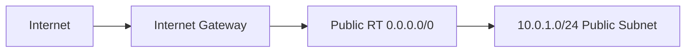
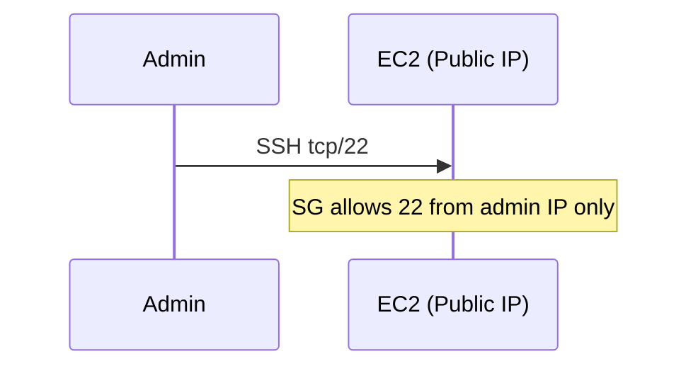
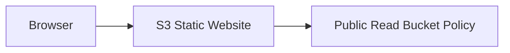
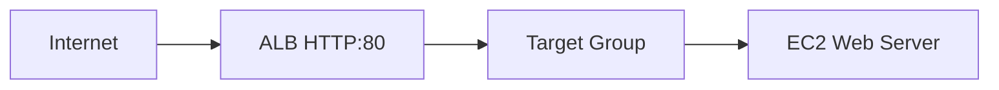
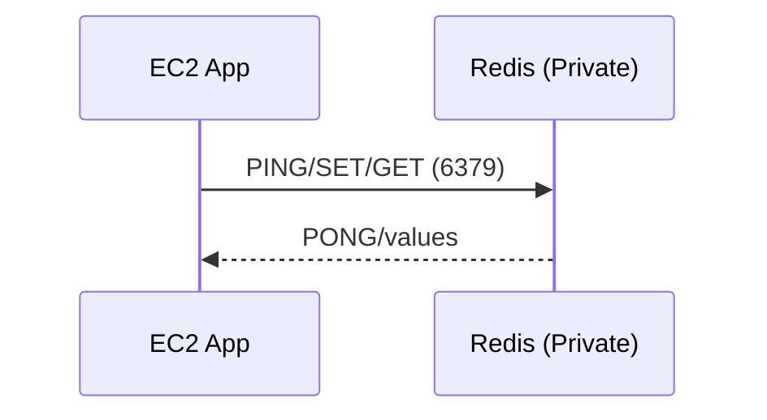
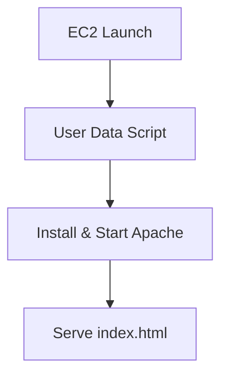
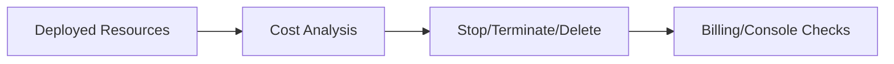

# IndiaSkills State-Level Practice Questions with Full Solutions

This set contains **8 State-Level practice questions** with full solutions. Each question is solvable in **30-40 minutes**, uses **us-east-1**, and stays within **AWS Free Tier** (t2.micro, db.t2.micro, cache.t2.micro). Follow the 6-section structure per question: Scenario Understanding, Architecture Explanation, Step-by-Step Implementation, Verification/Proof, Common Mistakes, Mark Mapping.

## Table of Contents
1. Q1 – VPC & CIDR Planning (Public Subnet + IGW)
2. Q2 – Public Subnet EC2 SSH Connectivity
3. Q3 – S3 Static Website Hosting
4. Q4 – RDS MySQL Backup & Restore
5. Q5 – ALB Basics (Single Target)
6. Q6 – ElastiCache Redis Performance Testing
7. Q7 – EC2 Web Server with User Data
8. Q8 – Cost Optimization & Cleanup

---

## Q1: VPC & CIDR Planning (Public Subnet + IGW)

### Section 1: Scenario Understanding
- Create VPC `10.0.0.0/16`, one public subnet `10.0.1.0/24` in us-east-1a
- Attach Internet Gateway; create public route table with 0.0.0.0/0 → IGW; associate subnet
- Goal: basic internet-enabled subnet for future workloads

### Section 2: Architecture Explanation
- Components: VPC, public subnet, IGW, route table
- Why: Isolated network with controlled internet egress via IGW
- Cost: VPC, subnets, IGW, routes = $0



### Section 3: Step-by-Step Implementation
**Console**
1) VPC: Create VPC → Name `practice-vpc-q1` → CIDR `10.0.0.0/16` → DNS hostnames/resolution ON.  
2) Subnet A: Create subnet → VPC `practice-vpc-q1` → AZ us-east-1a → CIDR `10.0.1.0/24` → enable Auto-assign public IPv4.  
3) Subnet B (for ALB later): Create subnet → VPC `practice-vpc-q1` → AZ us-east-1b → CIDR `10.0.2.0/24` → enable Auto-assign public IPv4.  
4) IGW: Create IGW `practice-igw-q1` → Attach to VPC.  
5) Route Table: Create RT `practice-public-rt-q1` → Add route 0.0.0.0/0 → IGW → Associate both public subnets `10.0.1.0/24` and `10.0.2.0/24`.

**CLI (bash)**
```bash
REGION=us-east-1
VPC_ID=$(aws ec2 create-vpc --cidr-block 10.0.0.0/16 --region $REGION \
  --tag-specifications 'ResourceType=vpc,Tags=[{Key=Name,Value=practice-vpc-q1}]' \
  --query 'Vpc.VpcId' --output text)
aws ec2 modify-vpc-attribute --vpc-id $VPC_ID --enable-dns-hostnames --region $REGION
aws ec2 modify-vpc-attribute --vpc-id $VPC_ID --enable-dns-support --region $REGION
PUB_SUBNET=$(aws ec2 create-subnet --vpc-id $VPC_ID --cidr-block 10.0.1.0/24 \
  --availability-zone us-east-1a --region $REGION \
  --tag-specifications 'ResourceType=subnet,Tags=[{Key=Name,Value=practice-public-1a}]' \
  --query 'Subnet.SubnetId' --output text)
aws ec2 modify-subnet-attribute --subnet-id $PUB_SUBNET --map-public-ip-on-launch --region $REGION
PUB_SUBNET_B=$(aws ec2 create-subnet --vpc-id $VPC_ID --cidr-block 10.0.2.0/24 \
  --availability-zone us-east-1b --region $REGION \
  --tag-specifications 'ResourceType=subnet,Tags=[{Key=Name,Value=practice-public-1b}]' \
  --query 'Subnet.SubnetId' --output text)
aws ec2 modify-subnet-attribute --subnet-id $PUB_SUBNET_B --map-public-ip-on-launch --region $REGION
IGW_ID=$(aws ec2 create-internet-gateway --region $REGION \
  --tag-specifications 'ResourceType=internet-gateway,Tags=[{Key=Name,Value=practice-igw-q1}]' \
  --query 'InternetGateway.InternetGatewayId' --output text)
aws ec2 attach-internet-gateway --internet-gateway-id $IGW_ID --vpc-id $VPC_ID --region $REGION
RT_ID=$(aws ec2 create-route-table --vpc-id $VPC_ID --region $REGION \
  --tag-specifications 'ResourceType=route-table,Tags=[{Key=Name,Value=practice-public-rt-q1}]' \
  --query 'RouteTable.RouteTableId' --output text)
aws ec2 create-route --route-table-id $RT_ID --destination-cidr-block 0.0.0.0/0 --gateway-id $IGW_ID --region $REGION
aws ec2 associate-route-table --route-table-id $RT_ID --subnet-id $PUB_SUBNET --region $REGION
aws ec2 associate-route-table --route-table-id $RT_ID --subnet-id $PUB_SUBNET_B --region $REGION
```

### Section 4: Verification/Proof
- Launch a temporary t2.micro in `practice-public-1a` with public IP; SG allow SSH from your IP
- From instance: `ping -c 3 8.8.8.8` (or `curl -I http://example.com`)
- Console: Route Tables → confirm 0.0.0.0/0 → IGW and subnet association
- ✅ Success criteria: public subnet has internet via IGW; route table attached; DNS enabled

### Section 5: Common Mistakes
1) Wrong CIDR (e.g., /20 overlapping later subnets)  
2) IGW created but not attached  
3) Route table created but not associated  
4) Missing 0.0.0.0/0 route  
5) DNS hostnames not enabled (breaks name resolution)

### Section 6: Mark Mapping (25 marks)
| Task | Marks | Criteria |
|------|-------|----------|
| VPC creation | 3 | Correct CIDR, DNS on |
| Subnet creation | 3 | 10.0.1.0/24, AZ set, auto-assign on |
| IGW | 3 | Created + attached |
| Route table | 4 | RT created, named |
| Default route | 4 | 0.0.0.0/0 → IGW added |
| Association | 3 | Subnet associated to RT |
| Verification | 5 | Internet test + route table proof |

---

## Q2: Public Subnet EC2 SSH Connectivity

### Section 1: Scenario Understanding
- Launch t2.micro EC2 in public subnet with SSH access from admin IP
- Security group limited to port 22 from your IP (not 0.0.0.0/0)

### Section 2: Architecture Explanation
- Components: EC2, key pair, SG (22 from admin IP), public IP
- Cost: EC2 Free Tier 750 hrs/month



### Section 3: Step-by-Step Implementation
**Console**
1) Key pair: Create `practice-key-q2` (.pem).  
2) SG: `practice-ssh-sg` → Inbound SSH 22 from My IP.  
3) EC2: t2.micro Amazon Linux 2 → Subnet public (with auto-assign public IP) → SG `practice-ssh-sg` → Launch.  
4) SSH: `ssh -i practice-key-q2.pem ec2-user@<public-ip>` (Linux/Mac) or PuTTY on Windows.

**CLI (bash)**
```bash
REGION=us-east-1
ADMIN_IP=$(curl -s https://checkip.amazonaws.com)/32
KEY_NAME=practice-key-q2
aws ec2 create-key-pair --key-name $KEY_NAME --region $REGION \
  --query 'KeyMaterial' --output text > ${KEY_NAME}.pem
chmod 400 ${KEY_NAME}.pem
SG_ID=$(aws ec2 create-security-group --group-name practice-ssh-sg --description "SSH from admin IP" \
  --vpc-id $VPC_ID --region $REGION --query 'GroupId' --output text)
aws ec2 authorize-security-group-ingress --group-id $SG_ID --protocol tcp --port 22 --cidr $ADMIN_IP --region $REGION
AL2_AMI=$(aws ssm get-parameter --name /aws/service/ami-amazon-linux-latest/amzn2-ami-hvm-x86_64-gp2 \
  --region $REGION --query 'Parameter.Value' --output text)
INSTANCE_ID=$(aws ec2 run-instances --image-id $AL2_AMI --instance-type t2.micro \
  --key-name $KEY_NAME --security-group-ids $SG_ID --subnet-id $PUB_SUBNET \
  --associate-public-ip-address --region $REGION \
  --tag-specifications 'ResourceType=instance,Tags=[{Key=Name,Value=practice-ec2-q2}]' \
  --query 'Instances[0].InstanceId' --output text)
aws ec2 wait instance-running --instance-ids $INSTANCE_ID --region $REGION
PUBLIC_IP=$(aws ec2 describe-instances --instance-ids $INSTANCE_ID --region $REGION \
  --query 'Reservations[0].Instances[0].PublicIpAddress' --output text)
echo "SSH with: ssh -i ${KEY_NAME}.pem ec2-user@${PUBLIC_IP}"
```

**Verification commands**
```bash
whoami
curl -s ifconfig.me   # show public egress IP
```

### Section 4: Verification/Proof
- Successful SSH prompt (`[ec2-user@ip-... ~]$`)
- `whoami` outputs `ec2-user`
- `curl -s ifconfig.me` returns public IP
- Console: SG shows SSH rule from your IP

### Section 5: Common Mistakes
1) SG allows 0.0.0.0/0 for SSH (security risk)  
2) Key file permissions not 400 → SSH denied  
3) Public IP disabled  
4) Wrong subnet (private)  
5) Wrong username (`ec2-user` for AL2)

### Section 6: Mark Mapping (25 marks)
| Task | Marks | Criteria |
|------|-------|----------|
| Key pair | 2 | Created/downloaded |
| SG rule | 4 | SSH 22 from admin IP only |
| EC2 launch | 4 | t2.micro, correct subnet |
| Public IP | 2 | Assigned/enabled |
| SSH connect | 5 | Successful login screenshot |
| Internet test | 3 | curl/ifconfig.me output |
| SG verification | 3 | Rule shown in console |
| Documentation | 2 | Steps + outputs recorded |

---

## Q3: S3 Static Website Hosting

### Section 1: Scenario Understanding
- Create S3 bucket, upload `index.html` and `error.html`, enable static website hosting, allow public read

### Section 2: Architecture Explanation
- Components: S3 bucket, bucket policy, website endpoint
- Cost: 5GB storage + 20k GET/month Free Tier



### Section 3: Step-by-Step Implementation
**Console**
1) Bucket: Create unique name `state-practice-site-q3` in us-east-1; disable "Block all public access".  
2) Upload files: `index.html`, `error.html`.  
3) Static hosting: Enable → index `index.html`, error `error.html`.  
4) Bucket policy:
```json
{
  "Version": "2012-10-17",
  "Statement": [
    {
      "Sid": "PublicRead",
      "Effect": "Allow",
      "Principal": "*",
      "Action": "s3:GetObject",
      "Resource": "arn:aws:s3:::state-practice-site-q3/*"
    }
  ]
}
```

**CLI**
```bash
aws s3api create-bucket --bucket state-practice-site-q3 --region us-east-1
aws s3api put-public-access-block --bucket state-practice-site-q3 --region us-east-1 \
  --public-access-block-configuration 'BlockPublicAcls=false,IgnorePublicAcls=false,BlockPublicPolicy=false,RestrictPublicBuckets=false'
# Disable block **before** policy + website hosting so the site becomes reachable
aws s3api put-bucket-policy --bucket state-practice-site-q3 --policy file://policy.json
aws s3 cp index.html s3://state-practice-site-q3/
aws s3 cp error.html s3://state-practice-site-q3/
```

### Section 4: Verification/Proof
- Browser: `http://state-practice-site-q3.s3-website-us-east-1.amazonaws.com` shows index
- Force 404: `/nonexistent` shows error page
- `curl -I http://...` returns 200/404 as expected
- Bucket policy JSON visible in console

### Section 5: Common Mistakes
1) Block public access left ON  
2) Wrong ARN in policy (missing /*)  
3) No index document configured  
4) Bucket name not unique  
5) Wrong region URL

### Section 6: Mark Mapping (25 marks)
| Task | Marks | Criteria |
|------|-------|----------|
| Bucket creation | 3 | Correct region/name |
| Public access config | 3 | Block public off |
| File upload | 2 | index/error uploaded |
| Hosting enable | 3 | Static site turned on |
| Bucket policy | 5 | Valid public-read policy |
| Index/error config | 2 | Proper docs set |
| Verification | 5 | Endpoint + 404 tested |
| Documentation | 2 | Evidence captured |

---

## Q4: RDS MySQL Backup & Restore

### Section 1: Scenario Understanding
- Launch MySQL 8.0 db.t2.micro (single AZ), backups retained 7 days
- Create one manual snapshot; understand automated vs manual backups

### Section 2: Architecture Explanation
- Components: RDS instance, automated backups, manual snapshot
- Cost: db.t2.micro Free Tier 750 hrs; backups within allocated storage free

```mermaid
flowchart TD
  RDS[RDS MySQL] --> Auto[Automated Backups (7d)]
  RDS --> Snap[Manual Snapshot]
```

### Section 3: Step-by-Step Implementation
**Console**
1) Create DB: MySQL 8.0, db.t2.micro, storage 20GB gp2, Public access **No**, VPC default or practice VPC, SG allow 3306 from your IP (or app SG).  
2) Backups: Enable automated backups, retention **7 days**, pick backup window.  
3) Launch DB, wait for **Available**.  
4) Manual snapshot: Actions → Take snapshot → `practice-rds-snap-q4`.

**CLI**
```bash
REGION=us-east-1
aws rds create-db-instance --db-instance-identifier practice-rds-q4 \
  --db-instance-class db.t2.micro --engine mysql --master-username admin \
  --master-user-password TempPass123! --allocated-storage 20 \
  --backup-retention-period 7 --no-publicly-accessible --region $REGION
aws rds wait db-instance-available --db-instance-identifier practice-rds-q4 --region $REGION
aws rds create-db-snapshot --db-instance-identifier practice-rds-q4 \
  --db-snapshot-identifier practice-rds-snap-q4 --region $REGION
```

### Section 4: Verification/Proof
- Console: RDS status **Available**; Backup retention = 7 days; snapshot status **Available**
- Screenshots: DB details page, Snapshots list showing `practice-rds-snap-q4`

### Section 5: Common Mistakes
1) Backup retention set to 0 (disables automated backups)  
2) Public accessibility enabled (security risk)  
3) Wrong engine version  
4) SG allows 0.0.0.0/0 on 3306  
5) Forgetting manual snapshot

### Section 6: Mark Mapping (25 marks)
| Task | Marks | Criteria |
|------|-------|----------|
| DB creation | 4 | MySQL 8.0, db.t2.micro |
| Engine config | 2 | Correct version/settings |
| Automated backups | 4 | Enabled, retention set |
| Retention period | 2 | 7 days configured |
| Manual snapshot | 4 | Created + available |
| Backup verification | 4 | Console shows backups |
| Security settings | 3 | Public off, SG scoped |
| Documentation | 2 | Screenshots recorded |

---

## Q5: Application Load Balancer Basics (Single Target)

### Section 1: Scenario Understanding
- Create ALB (internet-facing) with one EC2 web server target; verify traffic via ALB DNS

### Section 2: Architecture Explanation
- Components: ALB, target group, listener HTTP:80, health check `/`
- Cost: ALB ~$16/month (not Free Tier)



### Section 3: Step-by-Step Implementation
**Console**
1) EC2: t2.micro in both public subnets from Q1 (`practice-public-1a` us-east-1a and `practice-public-1b` us-east-1b) with user data:
```bash
#!/bin/bash
yum update -y
yum install -y httpd
systemctl enable --now httpd
echo "<h1>ALB Single Target</h1>" > /var/www/html/index.html
```
2) SGs: ALB SG allow 80 from 0.0.0.0/0; EC2 SG allow 80 from ALB SG.  
3) Target Group: HTTP, port 80, health check path `/`, register EC2.  
4) ALB: Internet-facing, select both public subnets (`10.0.1.0/24` us-east-1a and `10.0.2.0/24` us-east-1b), attach ALB SG, listener HTTP:80 → default action forward to TG.

**CLI (abbrev)**
```bash
REGION=us-east-1
PUB1=$PUB_SUBNET        # from Q1 (practice-public-1a)
PUB2=$PUB_SUBNET_B      # from Q1 (practice-public-1b)
# create TG
TG_ARN=$(aws elbv2 create-target-group --name practice-tg-q5 --protocol HTTP --port 80 \
  --vpc-id $VPC_ID --health-check-path / --region $REGION --query 'TargetGroups[0].TargetGroupArn' --output text)
# create ALB
ALB_ARN=$(aws elbv2 create-load-balancer --name practice-alb-q5 --subnets $PUB1 $PUB2 \
  --security-groups $ALB_SG --scheme internet-facing --type application --region $REGION \
  --query 'LoadBalancers[0].LoadBalancerArn' --output text)
# listener
aws elbv2 create-listener --load-balancer-arn $ALB_ARN --protocol HTTP --port 80 \
  --default-actions Type=forward,TargetGroupArn=$TG_ARN --region $REGION
```

### Section 4: Verification/Proof
- Target health: `healthy`
- Browser: `http://<alb-dns>` shows "ALB Single Target"
- `curl http://<alb-dns>` returns HTML

### Section 5: Common Mistakes
1) ALB placed in private subnets  
2) Target not registered  
3) Health check path wrong  
4) EC2 SG not allowing from ALB SG  
5) ALB SG missing port 80

### Section 6: Mark Mapping (25 marks)
| Task | Marks | Criteria |
|------|-------|----------|
| EC2 web server | 3 | User data installs httpd |
| Target group | 4 | Created with correct port/path |
| Health check | 3 | Path `/`, healthy status |
| ALB creation | 4 | Internet-facing, subnets set |
| Listener | 2 | HTTP:80 → TG |
| Target registration | 3 | EC2 attached |
| Health verification | 4 | Healthy + reachable |
| DNS access test | 2 | Browser/curl proof |

---

## Q6: ElastiCache Redis Performance Testing

### Section 1: Scenario Understanding
- Deploy cache.t2.micro Redis in private subnets; test with redis-cli from EC2 in public subnet

### Section 2: Architecture Explanation
- Components: Redis cluster, subnet group (2 private subnets), SG (6379 from EC2 SG), EC2 with redis-cli
- Cost: cache.t2.micro Free Tier 12 months (750 hrs)



### Section 3: Step-by-Step Implementation
**Console**
1) Private subnets: Create two private subnets `10.0.11.0/24` (us-east-1a) and `10.0.12.0/24` (us-east-1b); create a private route table (no IGW route) and associate both subnets to it.  
2) Subnet Group: select those two private subnets.  
3) SG: `redis-sg` allow TCP 6379 from `app-sg` (your EC2 app SG).  
4) Redis: cache.t2.micro, no replicas, subnet group, SG.  
5) EC2: t2.micro in public subnet with SG `app-sg` (SSH from your IP). Install redis-cli:
```bash
sudo yum update -y
sudo yum install -y gcc make
wget http://download.redis.io/redis-stable.tar.gz
tar xvzf redis-stable.tar.gz
cd redis-stable && make
sudo cp src/redis-cli /usr/local/bin/
redis-cli --version
```

**CLI (bash)**
```bash
REGION=us-east-1
# Private route table and subnets
PRIVATE_RT_ID=$(aws ec2 create-route-table --vpc-id $VPC_ID --region $REGION \
  --tag-specifications 'ResourceType=route-table,Tags=[{Key=Name,Value=practice-private-rt-q6}]' \
  --query 'RouteTable.RouteTableId' --output text)
PRIV_SUBNET_A=$(aws ec2 create-subnet --vpc-id $VPC_ID --cidr-block 10.0.11.0/24 \
  --availability-zone us-east-1a --region $REGION \
  --tag-specifications 'ResourceType=subnet,Tags=[{Key=Name,Value=practice-private-1a}]' \
  --query 'Subnet.SubnetId' --output text)
PRIV_SUBNET_B=$(aws ec2 create-subnet --vpc-id $VPC_ID --cidr-block 10.0.12.0/24 \
  --availability-zone us-east-1b --region $REGION \
  --tag-specifications 'ResourceType=subnet,Tags=[{Key=Name,Value=practice-private-1b}]' \
  --query 'Subnet.SubnetId' --output text)
aws ec2 associate-route-table --route-table-id $PRIVATE_RT_ID --subnet-id $PRIV_SUBNET_A --region $REGION
aws ec2 associate-route-table --route-table-id $PRIVATE_RT_ID --subnet-id $PRIV_SUBNET_B --region $REGION

# Subnet group and SG
aws elasticache create-cache-subnet-group --cache-subnet-group-name practice-redis-subnets-q6 \
  --cache-subnet-group-description "Private subnets for Redis" \
  --subnet-ids $PRIV_SUBNET_A $PRIV_SUBNET_B --region $REGION
APP_SG=$SG_ID   # app SG from Q2
REDIS_SG=$(aws ec2 create-security-group --group-name redis-sg-q6 --description "Redis 6379 from app SG" \
  --vpc-id $VPC_ID --region $REGION --query 'GroupId' --output text)
aws ec2 authorize-security-group-ingress --group-id $REDIS_SG --protocol tcp --port 6379 \
  --source-group $APP_SG --region $REGION

# Redis cluster
aws elasticache create-cache-cluster --cache-cluster-id practice-redis-q6 --engine redis \
  --cache-node-type cache.t2.micro --num-cache-nodes 1 --cache-subnet-group-name practice-redis-subnets-q6 \
  --security-group-ids $REDIS_SG --region $REGION
```

### Section 4: Verification/Proof
```bash
redis-cli -h <endpoint> ping          # expect PONG
redis-cli -h <endpoint> SET demo "hello"
redis-cli -h <endpoint> GET demo      # expect "hello"
redis-cli -h <endpoint> GET missing   # expect (nil)
redis-cli -h <endpoint> SETEX ttlkey 60 "temp"
redis-cli -h <endpoint> TTL ttlkey    # shows countdown
```
- ✅ Success: PONG + SET/GET + cache miss + TTL countdown

### Section 5: Common Mistakes
1) Redis in public subnet  
2) SG allows 0.0.0.0/0  
3) Wrong endpoint/port  
4) Testing before status "Available"  
5) redis-cli not installed

### Section 6: Mark Mapping (25 marks)
| Task | Marks | Criteria |
|------|-------|----------|
| Subnet group | 2 | Two private subnets |
| SG config | 3 | 6379 from app SG only |
| Redis creation | 4 | cache.t2.micro, correct SG/subnets |
| redis-cli install | 2 | Installed/verified |
| PING test | 3 | PONG proof |
| SET/GET | 3 | Works with outputs |
| Cache hit/miss | 4 | (nil) then value |
| TTL test | 2 | SETEX + TTL output |
| Documentation | 2 | Screens/proof |

---

## Q7: EC2 Web Server with User Data

### Section 1: Scenario Understanding
- Launch EC2 with user data to install Apache and serve custom page

### Section 2: Architecture Explanation
- Components: EC2, user data script, SG (HTTP 80), public IP
- Cost: t2.micro Free Tier



### Section 3: Step-by-Step Implementation
**Console**
1) SG: `web-sg-q7` allow HTTP 80 from 0.0.0.0/0.  
2) EC2: t2.micro, public subnet, public IP enabled, user data:
```bash
#!/bin/bash
yum update -y
yum install -y httpd
systemctl enable --now httpd
echo "<h1>User Data Web Server</h1>" > /var/www/html/index.html
```
3) Launch and wait for status checks.

**CLI (abbrev)**: use `--user-data file://userdata.sh` with same script.

### Section 4: Verification/Proof
- Browser: `http://<public-ip>` shows heading
- `curl http://<public-ip>` returns HTML
- SSH (optional): `sudo systemctl status httpd`; `cat /var/log/cloud-init-output.log`

### Section 5: Common Mistakes
1) Missing shebang `#!/bin/bash`  
2) httpd not started  
3) SG missing port 80  
4) Public IP disabled  
5) Wrong AMI (non-AL2)

### Section 6: Mark Mapping (25 marks)
| Task | Marks | Criteria |
|------|-------|----------|
| User data script | 5 | Installs/starts httpd |
| SG HTTP rule | 3 | Port 80 open |
| EC2 launch | 3 | Correct type/subnet |
| Public IP | 2 | Enabled |
| Apache install | 3 | Confirmed installed |
| Service running | 3 | httpd active |
| HTTP access test | 4 | Browser/curl proof |
| Log verification | 2 | cloud-init log checked |

---

## Q8: Cost Optimization & Resource Cleanup

### Section 1: Scenario Understanding
- Identify cost risks; clean up resources from prior tasks to avoid charges

### Section 2: Architecture Explanation
- Components: EC2, RDS, ElastiCache, ALB, S3; Free Tier limits vs paid items
- Cost focus: ALB ~$16/mo, NAT/GW if any, EBS/Snapshots, Elastic IP idle charges



### Section 3: Step-by-Step Implementation
**Console Cleanup**
- EC2: Terminate instances; delete key pairs if exam account allows
- EBS: Delete unattached volumes/snapshots (unless needed)
- RDS: Delete DB; choose final snapshot as needed; remove snapshots after download decision
- ElastiCache: Delete cluster
- ALB/Target Groups: Delete listeners → ALB → target groups
- S3: Empty buckets, then delete buckets
- Elastic IPs: Release unassociated EIPs
- Budgets/Alarms: Set billing alarm at $5 if not present

**CLI (examples)**
```bash
aws ec2 terminate-instances --instance-ids i-123 i-456 --region us-east-1
aws rds delete-db-instance --db-instance-identifier practice-rds-q4 --skip-final-snapshot --region us-east-1
aws elasticache delete-cache-cluster --cache-cluster-id practice-redis-q6 --region us-east-1
aws elbv2 delete-load-balancer --load-balancer-arn $ALB_ARN --region us-east-1
aws s3 rm s3://state-practice-site-q3 --recursive
aws s3api delete-bucket --bucket state-practice-site-q3 --region us-east-1
```

### Section 4: Verification/Proof
- EC2 console shows **0 running instances**
- RDS/ElastiCache/ALB lists empty
- S3 bucket deleted; `aws s3 ls` no bucket
- Billing dashboard/Cost Explorer shows no new charges

### Section 5: Common Mistakes
1) Stopping EC2 but leaving EBS/Elastic IP (still billed)  
2) Forgetting to delete ALB (hourly + LCU)  
3) Leaving RDS snapshots (storage billed)  
4) Not emptying S3 before delete  
5) Not releasing Elastic IPs

### Section 6: Mark Mapping (25 marks)
| Task | Marks | Criteria |
|------|-------|----------|
| Cost analysis | 4 | Identify billed items |
| EC2 termination | 3 | Instances removed |
| RDS deletion | 3 | DB removed/snapshot choice |
| ElastiCache deletion | 2 | Cluster removed |
| ALB deletion | 3 | Load balancer removed |
| S3 cleanup | 3 | Bucket emptied/deleted |
| Verification | 5 | Consoles/billing show clean |
| Documentation | 2 | Steps & proof logged |

---

## Summary & Study Recommendations

| Question | Topic | Time | Marks | Notes |
|----------|-------|------|-------|-------|
| Q1 | VPC + Public Subnet | 30-35m | 25 | IGW + routes |
| Q2 | EC2 SSH Public | 30-35m | 25 | SG least-privilege |
| Q3 | S3 Static Site | 30-35m | 25 | Public policy correctness |
| Q4 | RDS Backups | 35-40m | 25 | Retention + snapshot |
| Q5 | ALB Basics | 35-40m | 25 | Health checks |
| Q6 | Redis Cache | 35-40m | 25 | PING/SET/GET/TTL |
| Q7 | EC2 User Data | 30-35m | 25 | Apache auto-install |
| Q8 | Cost Cleanup | 25-30m | 25 | Delete + verify |

### Recommended Order
1) Start with Q1 → Q2 to cement networking and SSH basics.  
2) Do Q3 to practice IAM/bucket policies.  
3) Move to Q7 for user data automation.  
4) Attempt Q5 (ALB) and Q6 (Redis) once comfortable.  
5) Finish with Q4 (RDS backups) and Q8 (cleanup) to solidify ops discipline.

### Cross-References
- EC2 basics: [03_ec2](../03_ec2)  
- S3 hosting: [04_s3](../04_s3)  
- VPC routing: [05_vpc](../05_vpc)  
- ALB: [06_alb](../06_alb)  
- RDS: [07_rds](../07_rds)  
- Caching: [08_caching](../08_caching)  
- Full scenarios: [09_full_server_scenarios](../09_full_server_scenarios)

> For State++ practice, use the solved Q1–Q3 files in this module and extend with NAT Gateway, multi-subnet routing, and ALB path rules.
