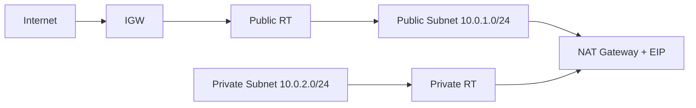
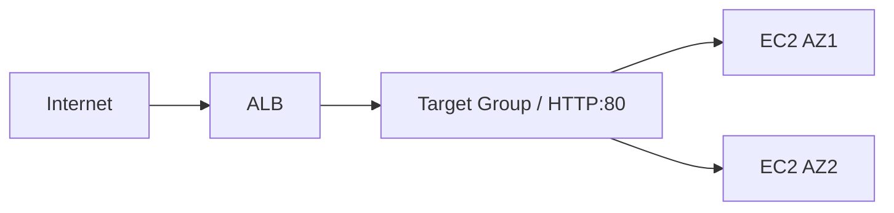
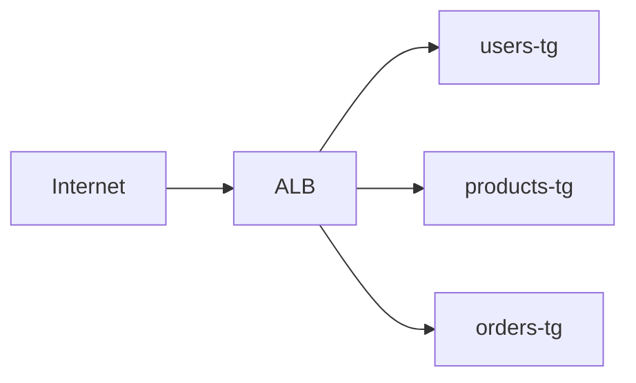
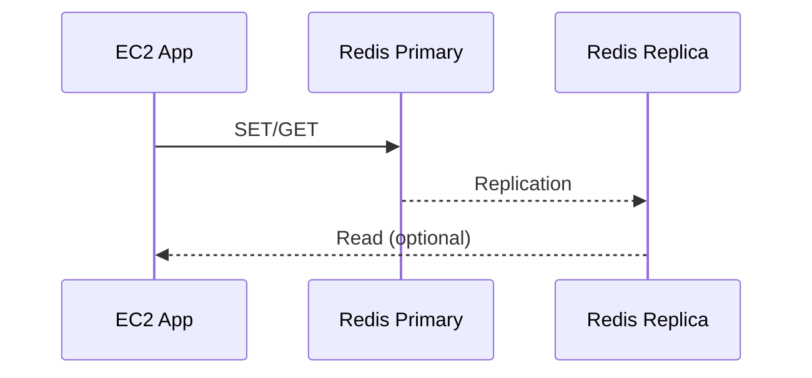
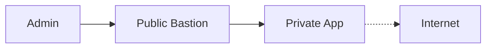

# IndiaSkills State++ Level Practice Questions

Challenging State++ set (7 questions) designed for 2-hour completion each, focused on multi-subnet, NAT, ALB, RDS resilience, and security hardening. Region: **us-east-1**. Expect AZ diversity, least-privilege security groups, and clean verification evidence. Difficulty indicators: 🔵 Moderate, 🟠 Advanced.

## Table of Contents
1. Q1 – Secure Multi-Tier VPC with NAT Gateway (🟠)
2. Q2 – ALB with Two EC2 Instances Across AZs (🔵)
3. Q3 – RDS Backup & Restore: Snapshots vs PITR (🟠)
4. Q4 – Path-Based Routing with ALB (🔵)
5. Q5 – ElastiCache Redis Failover Testing (🟠)
6. Q6 – Cost-Optimized Multi-Tier (Free Tier-first) (🔵)
7. Q7 – Bastion-Only Access to Private Subnet (🔵)

---

## Q1: Secure Multi-Tier VPC with NAT Gateway (🟠)

### Section 1: Scenario Understanding
Deploy a web tier (public) and DB tier (private) where private instances need outbound internet for updates via NAT. Two AZs for availability. Single NAT Gateway for cost.

### Task
- Create VPC with public and private subnets across 2 AZs
- Configure Internet Gateway for public subnet and NAT Gateway for private subnet outbound access
- Set up route tables with correct associations (public → IGW, private → NAT)
- Deploy security groups: web tier (80/443 inbound, SSH from admin), DB tier (3306 from web SG only)

### Constraints
- Region: `us-east-1`
- Single NAT Gateway (cost optimization)
- Public subnet: `10.0.1.0/24` (us-east-1a), Private subnet: `10.0.2.0/24` (us-east-1b)
- Instance types: t2.micro
- Time limit: 2 hours

### Section 2: Architecture Explanation
- VPC `10.0.0.0/16`, public subnet `10.0.1.0/24` (us-east-1a), private subnet `10.0.2.0/24` (us-east-1b)
- IGW for public egress; NAT Gateway (Elastic IP) in public subnet for private outbound
- Route tables: public RT → 0.0.0.0/0 via IGW; private RT → 0.0.0.0/0 via NAT
- SGs: web-sg (80/443 from 0.0.0.0/0, 22 from admin IP), db-sg (3306 from web-sg only)



### Section 3: Step-by-Step Implementation (Console)
1) VPC 10.0.0.0/16 with DNS hostnames/support ON.  
2) Subnets: public `10.0.1.0/24` (1a) with auto-assign public IP; private `10.0.2.0/24` (1b).  
3) IGW: create + attach to VPC.  
4) NAT: allocate Elastic IP; create NAT Gateway in public subnet.  
5) Route tables: Public RT -> 0.0.0.0/0 -> IGW; associate public subnet. Private RT -> 0.0.0.0/0 -> NAT; associate private subnet.  
6) SGs: `web-sg` allow 80/443 from 0.0.0.0/0 and 22 from your IP; `db-sg` allow 3306 from `web-sg` only.  
7) EC2: web t2.micro in public subnet (user data optional), DB t2.micro in private subnet (no public IP) with `db-sg`.

### Section 4: Verification/Proof
- Web host: `curl -I http://example.com` (works; outbound via IGW)  
- DB host: `curl -I http://example.com` (works; via NAT); `ping 8.8.8.8` blocked ICMP maybe—use HTTP test  
- From internet: cannot reach DB private IP; can reach web on 80/443  
- Route tables show correct 0.0.0.0/0 targets

### Section 5: Common Mistakes
- NAT placed in private subnet (breaks)  
- No Elastic IP on NAT  
- Private RT still points to IGW  
- `db-sg` opened to 0.0.0.0/0  
- Auto-assign public IP disabled on public subnet

### Section 6: Mark Mapping (20 marks)
| Task | Marks | Criteria |
|------|-------|----------|
| VPC + DNS | 2 | 10.0.0.0/16 with DNS ON |
| Subnets | 3 | Public 1a + Private 1b CIDRs set |
| IGW | 2 | Created + attached |
| NAT Gateway | 4 | In public subnet with EIP |
| Route tables | 4 | Public→IGW, Private→NAT associations |
| Security groups | 3 | Web/DB scoped correctly |
| Verification | 2 | Outbound via NAT, no inbound to private |

> Examiner note: deduct if NAT is missing or private RT targets IGW.

---

## Q2: ALB with Two EC2 Instances Across AZs (🔵)

### Section 1: Scenario Understanding
HA web app across 2 AZs using ALB to distribute HTTP traffic and remove unhealthy nodes.

### Task
- Create VPC with two public subnets in different availability zones
- Launch two EC2 instances with distinct web content (one per AZ)
- Configure Application Load Balancer with target group and health checks
- Verify traffic distribution and failover behavior

### Constraints
- Region: `us-east-1`
- Availability Zones: us-east-1a and us-east-1b
- Instance type: t2.micro (2 instances)
- Protocol: HTTP only (port 80)
- Time limit: 2 hours

### Section 2: Architecture Explanation
- VPC with two public subnets (1a `10.0.1.0/24`, 1b `10.0.2.0/24`)
- ALB internet-facing in both subnets; target group HTTP:80; health check `/`
- Two EC2 t2.micro (one per AZ) serving distinct pages
- SGs: ALB SG 80 from 0.0.0.0/0; EC2 SG 80 from ALB SG



### Section 3: Step-by-Step Implementation (Console)
1) Subnets: ensure two public subnets exist (1a/1b) with auto-assign public IP.  
2) SGs: `alb-sg` allow 80 from all; `web-sg` allow 80 from `alb-sg`.  
3) EC2: launch two t2.micro AL2, one in each subnet, user data sets unique page text (Instance A/B).  
4) Target Group: HTTP:80, health check `/`, register both instances.  
5) ALB: internet-facing, attach to both subnets, use `alb-sg`, listener HTTP:80 → target group.

### Section 4: Verification/Proof
- `curl http://<alb-dns>` repeatedly → alternating Instance A/B content  
- Stop one instance → traffic continues to healthy instance  
- Console: target health shows 1/2 then 2/2 healthy

### Section 5: Common Mistakes
- ALB only in one AZ  
- Instances in same AZ  
- Health check path typo  
- EC2 SG not referencing ALB SG  
- Testing before healthy status

### Section 6: Mark Mapping (20 marks)
| Task | Marks | Criteria |
|------|-------|----------|
| Subnets ready | 2 | Two public AZs |
| EC2 setup | 3 | Two t2.micro, unique pages |
| Target group | 3 | HTTP:80, health check set |
| ALB creation | 4 | Internet-facing, both subnets |
| Listener | 2 | HTTP:80 → TG |
| Health checks | 3 | Instances healthy |
| Verification | 3 | Alternating responses / failover |

> Examiner note: reward demonstration of failover by stopping one instance.

---

## Q3: RDS Backup & Restore — Snapshots vs PITR (🟠)

### Section 1: Scenario Understanding
DBA must recover from accidental deletion using both manual snapshot restore and point-in-time recovery (PITR) within 7-day retention.

### Task
- Create RDS MySQL instance with automated backups enabled (7-day retention)
- Populate database with test data and create manual snapshot
- Simulate data loss scenario
- Perform PITR restore to timestamp before deletion
- Perform snapshot restore and compare both recovery methods

### Constraints
- Region: `us-east-1`
- Instance class: db.t3.micro
- Engine: MySQL 8.0
- Storage: 20 GB
- Backup retention: 7 days
- Public access: disabled
- Time limit: 2 hours

### Section 2: Architecture Explanation
- RDS MySQL 8.0 db.t3.micro, storage 20 GB, automated backups 7 days
- Automated backups = daily snapshot + transaction logs → PITR within window
- Manual snapshot = user-triggered, restore only to snapshot timestamp

| Aspect | Automated Backups (PITR) | Manual Snapshot |
|--------|--------------------------|-----------------|
| Trigger | Automatic daily + logs | On-demand | 
| Restore point | Any second in retention | Snapshot time only |
| Use case | Accidental deletes | Before risky changes |

### Section 3: Step-by-Step Implementation (Console)
1) Create RDS MySQL: db.t3.micro, MySQL 8.0, 20GB gp2, backup retention 7 days, window set, public access Off.  
2) Security: SG allow 3306 from app EC2 SG.  
3) App host: EC2 in same VPC; connect and create DB/table; insert baseline rows; note timestamp T1.  
4) Manual snapshot: take `statepp-rds-snap`.  
5) Add more data; note timestamp T2.  
6) Simulate deletion: delete rows.  
7) PITR restore: Actions → Restore to point in time (just before delete, between T1 and T2) → new instance `statepp-rds-pitr`.  
8) Snapshot restore: Restore `statepp-rds-snap` → new instance `statepp-rds-snaprestore`.  
9) Compare data between restored endpoints.

### Section 4: Verification/Proof
- Connect to PITR instance: data present up to chosen timestamp (pre-delete)  
- Connect to snapshot restore: data matches snapshot time (T1 state)  
- RDS console shows automated backups enabled, snapshots available

### Section 5: Common Mistakes
- Automated backups disabled (no PITR)  
- Trying to restore over same instance ID  
- Wrong timestamp/time zone for PITR  
- Security group not allowing app host  
- Not updating app connection string to new endpoint

### Section 6: Mark Mapping (20 marks)
| Task | Marks | Criteria |
|------|-------|----------|
| RDS creation | 3 | db.t3.micro, backups 7d |
| Backup config | 2 | Window/retention set |
| Manual snapshot | 2 | Created before change |
| PITR restore | 5 | Restored to pre-delete time |
| Snapshot restore | 3 | Restored from manual snap |
| Comparison explanation | 3 | Differences articulated |
| Verification | 2 | Connected and validated data |

> Examiner note: must show both restored endpoints and data states.

---

## Q4: Path-Based Routing with ALB (🔵)

### Section 1: Scenario Understanding
Single ALB fronting three microservices; route by URL paths `/users`, `/products`, `/orders`.

### Task
- Deploy three EC2 instances with distinct microservice content (users, products, orders)
- Create three target groups and register appropriate instances
- Configure ALB with path-based routing rules for each service
- Set up default action (404) and verify path-based traffic distribution

### Constraints
- Region: `us-east-1`
- Instance type: t2.micro (3 instances)
- Protocol: HTTP (port 80)
- Single ALB with three target groups
- Path patterns: `/users/*`, `/products/*`, `/orders/*`
- Time limit: 2 hours

### Section 2: Architecture Explanation
- One ALB internet-facing in two public subnets
- Three target groups, one instance each (t2.micro) with distinct content
- Listener rules with priorities: `/users/*` (1), `/products/*` (2), `/orders/*` (3), default 404



### Section 3: Step-by-Step Implementation (Console)
1) Launch three EC2 (User/Product/Order) in public subnets; user data writes service-specific index.  
2) SGs: ALB SG 80 from 0.0.0.0/0; app SG 80 from ALB SG.  
3) Create three target groups (HTTP:80) and register corresponding instances.  
4) Create ALB (internet-facing, two subnets) with listener HTTP:80.  
5) Add rules: `/users/*` → users-tg (priority 1); `/products/*` → products-tg (2); `/orders/*` → orders-tg (3); default fixed 404 response.

### Section 4: Verification/Proof
- `curl http://<alb-dns>/users` → User Service content  
- `curl .../products` → Product content  
- `curl .../orders` → Order content  
- `curl .../` → 404 default  
- Target health all healthy

### Section 5: Common Mistakes
- Missing `/*` in path pattern  
- Wrong rule priority ordering  
- Instances registered to wrong target groups  
- ALB listener default still forwards instead of 404  
- Testing before health checks pass

### Section 6: Mark Mapping (20 marks)
| Task | Marks | Criteria |
|------|-------|----------|
| EC2 setup | 3 | Three services deployed |
| Target groups | 3 | One per service |
| ALB creation | 2 | Internet-facing, two subnets |
| Path rules | 6 | Correct patterns + priorities |
| Default action | 2 | 404 configured |
| Verification | 4 | Path tests + health |

> Examiner note: mis-prioritized rules should lose marks.

---

## Q5: ElastiCache Redis Failover Testing (🟠)

### Section 1: Scenario Understanding
Validate Redis replication and automatic failover for session data durability.

### Task
- Deploy ElastiCache Redis replication group with primary and replica nodes
- Configure security groups and subnet group for private subnet placement
- Test read/write operations from EC2 client
- Simulate primary node failure and verify automatic failover

### Constraints
- Region: `us-east-1`
- Node type: cache.t3.micro
- Replication: 1 primary + 1 replica (2 nodes total)
- Cluster mode: disabled
- Automatic failover: enabled
- Placement: private subnets across 2 AZs
- Protocol: Redis (port 6379)
- Time limit: 2 hours

### Section 2: Architecture Explanation
- VPC private subnets for Redis; EC2 app host in public subnet as client
- Redis replication group (cluster mode disabled) with 1 primary + 1 replica, automatic failover enabled
- SG: Redis SG allows 6379 from app SG only



### Section 3: Step-by-Step Implementation (Console)
1) Networking: ensure private subnets in two AZs; app EC2 in public subnet with `app-sg` (SSH from your IP).  
2) SG: `redis-sg` allow TCP 6379 from `app-sg`.  
3) Subnet group: include two private subnets.  
4) Create replication group: name `statepp-redis`, cache.t3.micro, 2 nodes (1 primary, 1 replica), automatic failover ON, subnet group, `redis-sg`.  
5) On app EC2 install redis-cli (build from source or amazon-linux-extras).  
6) Connect and test:
```bash
redis-cli -h <primary-endpoint> SET session user1
redis-cli -h <primary-endpoint> GET session
redis-cli -h <replica-endpoint> GET session   # read-only
```
7) Simulate failure: reboot primary node (Console → Reboot primary). Wait for failover.  
8) Re-run SET/GET against primary endpoint (should point to new primary).

### Section 4: Verification/Proof
- Primary endpoint continues to serve writes after failover  
- Replica promoted in console; role change visible  
- CloudWatch events show failover

### Section 5: Common Mistakes
- Automatic failover disabled  
- SG open to 0.0.0.0/0  
- Using node endpoint instead of primary endpoint  
- Testing before status "available"  
- Placing Redis in public subnets

### Section 6: Mark Mapping (20 marks)
| Task | Marks | Criteria |
|------|-------|----------|
| Subnet group | 2 | Two private AZs |
| SG config | 3 | 6379 scoped to app SG |
| Redis creation | 4 | 2 nodes, failover on |
| Client setup | 2 | redis-cli installed |
| Read/write test | 3 | SET/GET success |
| Failover simulation | 3 | Reboot + observe promotion |
| Verification | 3 | Endpoint works post-failover |

> Examiner note: ensure they test post-failover write on primary endpoint.

---

## Q6: Cost-Optimized Multi-Tier (Free Tier-first) (🔵)

### Section 1: Scenario Understanding
Deploy a minimal-cost web stack using mostly Free Tier while noting unavoidable ALB cost.

### Task
- Design and deploy cost-optimized architecture with VPC, subnets, and route tables
- Launch two t2.micro EC2 instances with ALB for high availability
- Create RDS MySQL single-AZ instance (Free Tier)
- Set up S3 bucket for static assets with public read access
- Document cost breakdown (Free Tier vs paid components)

### Constraints
- Region: `us-east-1`
- EC2: t2.micro (2 instances, Free Tier)
- RDS: t3.micro MySQL single-AZ (Free Tier)
- S3: 5GB storage (Free Tier)
- ALB: internet-facing (paid, ~$16/month)
- Availability Zones: 2 (for ALB requirement)
- Time limit: 2 hours

### Section 2: Architecture Explanation
- VPC with two public subnets (for ALB + EC2) and one private subnet for RDS
- ALB (paid) fronting two t2.micro web servers (Free Tier)  
- RDS MySQL t3.micro single-AZ (Free Tier)  
- S3 bucket for static assets (Free Tier)  
- SGs: ALB 80 from all; EC2 80 from ALB SG; RDS 3306 from EC2 SG

### Section 3: Step-by-Step Implementation (Console)
1) VPC + subnets: two public (1a/1b), one private (1c e.g., `10.0.3.0/24`), IGW, public RT to IGW; private RT (optional NAT if updates needed).  
2) EC2: two t2.micro in public subnets with Apache; serve dynamic content referencing S3 assets.  
3) S3: bucket `statepp-static-q6`, upload assets, add public-read bucket policy.  
4) RDS: MySQL t3.micro, single-AZ, 20GB, backups on; SG allows 3306 from EC2 SG.  
5) ALB: internet-facing in both public subnets; target group HTTP:80; register EC2; listener HTTP:80.  
6) Wire app to RDS endpoint; reference S3 asset URLs in HTML.

### Section 4: Verification/Proof
- `curl http://<alb-dns>` loads page with images/CSS from S3  
- On EC2: `mysql -h <rds-endpoint> -u admin -p -e 'select version();'` succeeds  
- Billing: estimate ALB ~$16/mo; confirm EC2/RDS within Free Tier hours

### Section 5: Common Mistakes
- Using t3.micro for EC2 (not Free Tier)  
- Multi-AZ RDS (paid)  
- Missing bucket policy → 403 on assets  
- ALB in one subnet only  
- Overrunning Free Tier hours with always-on multiple instances

### Section 6: Mark Mapping (20 marks)
| Task | Marks | Criteria |
|------|-------|----------|
| VPC/subnets | 2 | Public+private defined |
| EC2 Free Tier | 3 | Two t2.micro configured |
| RDS config | 3 | t3.micro single-AZ, SG scoped |
| S3 integration | 3 | Assets public/readable |
| ALB setup | 2 | Two subnets, listener OK |
| Security groups | 2 | Scoped 80/3306 correctly |
| Cost notes | 3 | ALB cost + Free Tier usage |
| Verification | 2 | Page + DB tested |

> Examiner note: require cost call-out for ALB vs Free Tier items.

---

## Q7: Bastion-Only Access to Private Subnet (🔵)

### Section 1: Scenario Understanding
Secure SSH maintenance via bastion while keeping private app servers unreachable from the internet.

### Task
- Create VPC with public subnet (bastion) and private subnet (application servers)
- Deploy bastion host in public subnet with restricted SSH access
- Deploy application server in private subnet with no public IP or internet access
- Configure security groups for SSH hop: admin → bastion → private instance
- Verify direct access to private instance is blocked and no outbound internet

### Constraints
- Region: `us-east-1`
- Instance type: t2.micro (bastion and app server)
- Public subnet: IGW route only
- Private subnet: no IGW/NAT (no internet access)
- SSH port 22: bastion from admin IP only, app from bastion SG only
- Key-based authentication with agent forwarding
- Time limit: 2 hours

### Section 2: Architecture Explanation
- VPC with public subnet (bastion) and private subnet (app)  
- IGW for public subnet; private subnet has no IGW/NAT  
- SGs: bastion-sg allows 22 from admin IP; app-sg allows 22 from bastion-sg only



### Section 3: Step-by-Step Implementation (Console)
1) VPC 10.0.0.0/16; public subnet 10.0.1.0/24 (1a) with public RT to IGW; private subnet 10.0.2.0/24 (1b) with private RT (no IGW/NAT).  
2) Key pair for bastion/app (or reuse).  
3) SGs: `bastion-sg` allow SSH 22 from your IP; `app-sg` allow SSH 22 from `bastion-sg`.  
4) Bastion EC2 t2.micro in public subnet with public IP, SG `bastion-sg`.  
5) App EC2 t2.micro in private subnet, no public IP, SG `app-sg`.  
6) SSH flow: local → bastion (`ssh -A -i key.pem ec2-user@bastion-ip`) → private (`ssh ec2-user@<private-ip>`).  
7) Validate no direct SSH from internet to private; validate no internet egress from private (curl to public site fails).

### Section 4: Verification/Proof
- SSH hop succeeds via bastion  
- Direct SSH to private IP from local fails/timeouts  
- `curl http://example.com` from private fails (no NAT)  
- SGs show scoped rules

### Section 5: Common Mistakes
- Allowing 0.0.0.0/0 to app-sg  
- Adding IGW route to private RT  
- Not using agent forwarding or secure key copy  
- Assigning public IP to private instance  
- Reusing same SG for both bastion and app

### Section 6: Mark Mapping (20 marks)
| Task | Marks | Criteria |
|------|-------|----------|
| VPC/subnets | 3 | Public + private separated |
| Bastion setup | 3 | Public IP, SG scoped |
| App setup | 2 | Private, no public IP |
| SG rules | 5 | 22 only from admin/bastion |
| SSH verification | 3 | Hop works, direct fails |
| Security explanation | 2 | Isolation justified |
| No-internet proof | 2 | Outbound blocked |

> Examiner note: fail if private instance has public IP or IGW route.
