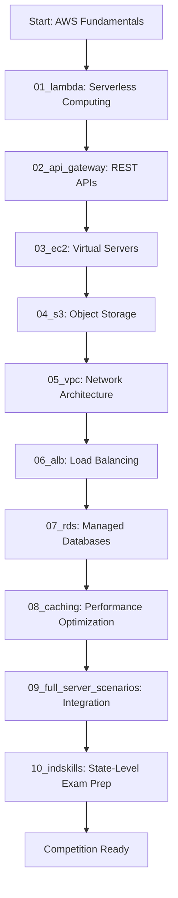

# AWS WorldSkills State-Level Competition Notes

This comprehensive documentation project provides structured learning materials for AWS Cloud Computing aligned with WorldSkills State-Level competition standards. The content is designed to take learners from serverless fundamentals through complex infrastructure scenarios, preparing them for real-world cloud architecture challenges.

**Target Audience:** WorldSkills State-Level Cloud Computing competitors  
**Skill Level:** Beginner to Competition-ready  
**Project Scope:** 10 modules covering Lambda, API Gateway, EC2, S3, VPC, ALB, RDS, Caching, full integration scenarios, and IndiaSkills State-Level exam preparation

---

## Learning Path Overview

The following diagram illustrates the recommended study sequence. Each module builds upon concepts from previous modules, creating a progressive learning journey from serverless computing to complete infrastructure solutions.



---

## Module Structure

The following table provides a comprehensive overview of all 10 modules, including key topics, file counts, estimated study time, and prerequisites.

| Module | Topics | Files | Time | Prerequisites |
|--------|--------|-------|------|---------------|
| 01_lambda | Serverless computing, Python runtime, IAM roles, event sources | 6 | 4-6 hours | AWS account, Python basics |
| 02_api_gateway | REST APIs, HTTP methods, Lambda integration, CORS, authentication | 7 | 5-7 hours | Lambda knowledge |
| 03_ec2 | Instance types, Security Groups, SSH access, user data, AMIs | 7 | 6-8 hours | Linux basics |
| 04_s3 | Buckets, IAM policies, versioning, static website hosting, lifecycle rules | 6 | 4-6 hours | None |
| 05_vpc | Subnets, routing tables, NAT Gateway, Internet Gateway, network ACLs | 6 | 8-10 hours | Networking basics (CIDR, TCP/IP) |
| 06_alb | Application Load Balancers, target groups, SSL/TLS, health checks | 5 | 4-5 hours | EC2, VPC |
| 07_rds | Relational databases, Multi-AZ deployments, read replicas, backups, security | 5 | 5-6 hours | SQL basics |
| 08_caching | ElastiCache, Redis, caching patterns, performance optimization | 4 | 3-4 hours | RDS knowledge |
| 09_full_server_scenarios | End-to-end architectures, multi-tier applications, integration patterns | 4 | 10-12 hours | All previous modules |
| 10_indskills | IndiaSkills State-Level exam preparation, Sikkim 2025 pattern, timed practice | 1 | 20-30 hours | Modules 03, 05, 06, 07, 08 |

**Total Learning Time:** Approximately 69-92 hours of focused study and hands-on practice

---

## How to Use These Notes

### Sequential Learning
Follow modules 01-09 in order for structured learning. Each module builds upon concepts introduced in previous modules. Skipping modules may result in knowledge gaps that affect understanding of advanced topics.

### Lab-First Approach
Each module contains a `server_lab.md` file with hands-on exercises. Theory and practice are tightly integrated. Complete each lab exercise immediately after reading the conceptual material to reinforce learning through application.

### Competition Focus
All content is aligned with WorldSkills evaluation criteria, including:
- Functionality: Does the solution work as specified?
- Security: Are best practices implemented?
- Cost-optimization: Is the solution using resources efficiently?
- Documentation: Can judges understand your architecture?

### Cost Management
Every module includes Free Tier optimization strategies to keep learning costs at or near zero. Always follow cleanup procedures after completing labs.

### Verification
Each lab includes verification checklists to confirm correct implementation. Use these to validate your work before moving to the next topic.

---

## WorldSkills Competition Context

### Time Constraints
WorldSkills State-Level Cloud Computing competitions typically run 4-6 hours. During this time, competitors must design, implement, and document complete cloud solutions. Time management is critical.

### Evaluation Criteria
Judges evaluate solutions based on:
1. **Functionality (40%):** Does the solution meet all requirements?
2. **Security (25%):** Are security best practices implemented?
3. **Cost-Optimization (15%):** Is the solution resource-efficient?
4. **Documentation (10%):** Is the architecture clearly documented?
5. **Code Quality (10%):** Is the code well-structured and maintainable?

### Common Scenarios
Typical competition tasks include:
- Deploying serverless REST APIs with Lambda and API Gateway
- Hosting static websites on S3 with CloudFront CDN
- Building secure multi-tier VPC architectures with public and private subnets
- Implementing auto-scaling web applications with ALB and EC2
- Configuring RDS databases with Multi-AZ high availability
- Creating complete e-commerce or content management system architectures

### Scoring Focus
Judges prioritize working solutions over perfect solutions. Key principles:
- **Complete > Perfect:** A fully functional solution with minor issues scores higher than a partially implemented perfect design
- **Security First:** Security violations result in major point deductions
- **Document Decisions:** Explain architectural choices in brief comments
- **Test Everything:** Verify functionality before submission

---

## Prerequisites and Setup

### Required AWS Account
- AWS Free Tier account (create at aws.amazon.com/free)
- Configure billing alerts at $5, $10, and $20 thresholds
- Enable MFA for root account security
- Create an IAM admin user for daily operations (never use root account)

### Required Tools
- **AWS CLI:** Install and configure with access keys
  - Download: aws.amazon.com/cli
  - Configure: `aws configure` with access key, secret key, and default region
- **Python 3.8+:** Required for Lambda development
  - Install boto3: `pip install boto3`
- **SSH Client:** For EC2 instance access
  - Windows: PuTTY or OpenSSH (built into Windows 10+)
  - Linux/Mac: OpenSSH (pre-installed)
- **Text Editor or IDE:** VS Code recommended for syntax highlighting and AWS extensions
  - Install AWS Toolkit extension for enhanced functionality

### Required Knowledge
- **Linux Commands:** Basic file operations, permissions, process management
- **Python Programming:** Functions, error handling, JSON manipulation
- **Networking Concepts:** IP addressing, CIDR notation, ports, protocols
- **SQL Basics:** SELECT, INSERT, UPDATE, DELETE queries
- **Version Control:** Git fundamentals for code management (optional but recommended)

---

## File Naming Conventions

Each module follows a consistent file structure for easy navigation:

- **overview.md:** Conceptual introduction and service fundamentals. Start here to understand what the service does and when to use it.
- **architecture.md:** Design patterns and component relationships. Learn how services fit into larger architectures.
- **server_lab.md:** Hands-on practical exercises with step-by-step instructions. The core learning activity for each module.
- **cost_optimization.md:** Free Tier usage and cost-saving strategies. Essential for keeping learning costs at zero.
- **Service-specific files:** Deep dives into particular features or methods (e.g., `lambda_event_sources.md`, `api_gateway_integration_types.md`)

### Typical Module Structure
```
01_lambda/
├── overview.md                    # Service introduction
├── architecture.md                # Design patterns
├── lambda_basics.md               # Core concepts
├── lambda_iam_roles.md            # Permissions
├── server_lab.md                  # Hands-on exercises
└── cost_optimization.md           # Free Tier strategies
```

---

## Cost Optimization Strategy

### Always Use Free Tier
AWS Free Tier provides generous monthly allowances for most services:
- **EC2:** 750 hours/month of t2.micro or t3.micro instances
- **Lambda:** 1 million requests and 400,000 GB-seconds compute time per month
- **S3:** 5 GB storage, 20,000 GET requests, 2,000 PUT requests
- **RDS:** 750 hours/month of db.t2.micro or db.t3.micro instances
- **API Gateway:** 1 million API calls per month

### Cleanup After Labs
Immediately delete resources after completing each lab:
1. Terminate all EC2 instances
2. Delete RDS database instances
3. Empty S3 buckets and delete the buckets
4. Release Elastic IP addresses
5. Delete NAT Gateways (charged hourly)
6. Remove API Gateway stages
7. Delete Lambda functions (optional - no cost when not invoked)

### Set Billing Alarms
Configure CloudWatch billing alarms to receive email notifications:
- **$5 Alert:** Early warning for unexpected charges
- **$10 Alert:** Review all running resources immediately
- **$20 Alert:** Critical - stop all resources and investigate

### Use AWS Budgets
AWS Budgets provides advanced cost tracking:
- Set monthly budget at $10-$25 depending on usage intensity
- Enable forecasting to predict month-end costs
- Configure actions to automatically stop resources when budget threshold is reached

### Shutdown Checklist
Use this checklist after every lab session:
- [ ] Terminate all EC2 instances
- [ ] Stop or delete RDS databases
- [ ] Empty and delete S3 buckets
- [ ] Release Elastic IP addresses
- [ ] Delete NAT Gateways
- [ ] Delete load balancers
- [ ] Remove ElastiCache clusters
- [ ] Check billing dashboard for unexpected charges

---

## Security Best Practices

All modules in this learning path emphasize security as a fundamental design principle, not an afterthought.

### IAM Least Privilege
Grant only the minimum permissions necessary for each task:
- Lambda functions receive roles with only required service access
- EC2 instances use instance profiles instead of embedded credentials
- S3 bucket policies restrict access to specific principals
- Never use wildcard permissions (*) in production-style architectures

### Network Isolation
Design architectures with defense in depth:
- **Public Subnets:** Only for load balancers and NAT Gateways
- **Private Subnets:** All application servers, databases, and backend services
- **Database Subnets:** Isolated tier with no internet access
- **Security Groups:** Act as instance-level firewalls with restrictive rules

### Encryption
Enable encryption for data protection:
- **At Rest:** Enable S3 bucket encryption, RDS encryption, EBS encryption
- **In Transit:** Use HTTPS/SSL for all API endpoints and application traffic
- **Key Management:** Use AWS KMS for encryption key management

### Security Groups
Apply the principle of least privilege to network access:
- Restrict inbound rules to specific IP addresses or CIDR ranges
- Allow only required ports (e.g., 443 for HTTPS, 22 for SSH)
- Use security group chaining (reference other security groups as sources)
- Document the purpose of each rule with descriptions

### Key Management
Protect credentials and sensitive data:
- Never commit AWS access keys to version control
- Use IAM roles for EC2 and Lambda instead of hardcoded credentials
- Store SSH private keys securely and never share them
- Rotate access keys every 90 days
- Use AWS Secrets Manager for database credentials and API keys

---

## Sustainability and Reliability

Modern cloud architectures must balance performance, cost, environmental impact, and availability.

### Sustainability
Minimize environmental impact through efficient resource utilization:
- **Serverless-First Approach:** Lambda functions consume resources only during execution, eliminating idle compute
- **Right-Sizing:** Use smallest instance types that meet performance requirements (t2.micro/t3.micro)
- **Auto-Scaling:** Scale resources dynamically based on demand instead of over-provisioning
- **Lifecycle Policies:** Automatically transition S3 objects to cheaper storage classes or delete them when no longer needed

### Reliability
Design for failure to ensure high availability:
- **Multi-AZ Deployments:** Distribute resources across multiple availability zones
- **Health Checks:** Configure load balancer health checks to detect and route around failures
- **Auto-Scaling:** Replace failed instances automatically
- **Database Backups:** Enable automated backups with 7-35 day retention
- **Read Replicas:** Distribute read traffic and provide failover capability

### Accessibility
Make learning materials accessible to all competitors:
- **Clear Documentation:** Every concept explained with examples
- **Minimal Tool Requirements:** Only free, widely-available tools required
- **Free Tier Focus:** Learn without financial barriers
- **Step-by-Step Labs:** Detailed instructions for all skill levels

---

## Quick Start Guide

Follow these 5 steps to begin your WorldSkills cloud computing preparation:

### Step 1: Clone or Download This Repository
```bash
git clone <repository-url>
cd aws-worldskills-notes
```

### Step 2: Set Up AWS Account and Configure AWS CLI
1. Create AWS Free Tier account at aws.amazon.com/free
2. Create IAM user with AdministratorAccess policy
3. Generate access keys for the IAM user
4. Configure AWS CLI:
   ```bash
   aws configure
   AWS Access Key ID: YOUR_ACCESS_KEY
   AWS Secret Access Key: YOUR_SECRET_KEY
   Default region name: us-east-1
   Default output format: json
   ```

### Step 3: Start with Lambda Fundamentals
Open and read [01_lambda/overview.md](01_lambda/overview.md) to understand serverless computing concepts.

### Step 4: Complete Each Server Lab in Sequence
Work through each module's `server_lab.md` file:
1. Read the lab objectives and requirements
2. Follow step-by-step instructions
3. Verify your implementation using provided checklists
4. Clean up resources after completion
5. Move to the next module

### Step 5: Finish with Integration Scenarios
After completing modules 01-08, tackle the integration scenarios in [09_full_server_scenarios/](09_full_server_scenarios/) to practice building complete architectures under time constraints.

### Step 6: IndiaSkills Exam Preparation (Optional)
If preparing for IndiaSkills State-Level competitions, proceed to [10_indskills/](10_indskills/) for Sikkim 2025 pattern questions, timed practice, and marking criteria.

---

## Additional Resources

### AWS Official Documentation
- **AWS Free Tier Details:** aws.amazon.com/free
- **AWS Documentation:** docs.aws.amazon.com
- **AWS Well-Architected Framework:** aws.amazon.com/architecture/well-architected
- **AWS Training and Certification:** aws.amazon.com/training

### WorldSkills Resources
- **WorldSkills International:** worldskills.org
- **WorldSkills Cloud Computing Skill Specification:** Official competition standards document
- **Competition Sample Projects:** Practice with previous competition scenarios

### Community and Support
- **AWS Forums:** forums.aws.amazon.com
- **Stack Overflow:** Tag questions with `amazon-web-services` and relevant service tags
- **AWS Subreddit:** reddit.com/r/aws
- **AWS Developer Center:** developer.aws.amazon.com

### Video Learning
- **AWS YouTube Channel:** Official tutorials and service introductions
- **A Cloud Guru / Linux Academy:** Comprehensive AWS training courses
- **freeCodeCamp AWS Courses:** Free full-length AWS certification prep

---

## Contributing and Feedback

This documentation project is designed to evolve with the WorldSkills competition standards and learner needs.

### Reporting Issues
If you discover errors, outdated information, or areas needing clarification:
- Document the specific file and section
- Describe the issue or inaccuracy
- Suggest corrections if possible

### Suggesting Improvements
Contributions are welcome for:
- Additional hands-on labs or scenarios
- Cost optimization techniques
- Security best practices
- Clearer explanations of complex concepts
- Real-world competition experiences and tips

### Content Updates
As AWS services evolve and competition standards change, content may require updates:
- Service feature additions or deprecations
- Pricing model changes
- New security best practices
- Updated WorldSkills evaluation criteria

---

## License and Disclaimer

### Educational Use
This documentation is provided for educational purposes to support WorldSkills State-Level competition preparation. Content is designed to teach cloud computing concepts and AWS service usage.

### AWS Costs Disclaimer
**IMPORTANT:** While this documentation emphasizes AWS Free Tier usage, you are responsible for monitoring and managing your AWS account costs. AWS charges may occur if:
- You exceed Free Tier limits
- You forget to delete resources after labs
- You deploy resources outside Free Tier eligibility
- You use services not covered by Free Tier

**Always configure billing alarms and regularly check your AWS billing dashboard.**

### No Warranty
This documentation is provided "as is" without warranty of any kind. The authors and contributors are not responsible for:
- AWS charges incurred while following these labs
- Data loss or security incidents
- Competition performance or results
- Service availability or functionality changes

### AWS Trademarks
Amazon Web Services, AWS, Lambda, EC2, S3, RDS, and other AWS service names are trademarks of Amazon.com, Inc. or its affiliates.

### Content Accuracy
While every effort is made to ensure accuracy, AWS services change frequently. Always refer to official AWS documentation for the most current information.

---

## Project Statistics

- **Total Modules:** 10
- **Total Documentation Files:** 50+ markdown files
- **Estimated Learning Time:** 69-92 hours
- **Services Covered:** Lambda, API Gateway, EC2, S3, VPC, ALB, RDS, ElastiCache, CloudWatch, IAM, and more
- **Lab Exercises:** 9 comprehensive hands-on labs + IndiaSkills exam preparation
- **Cost:** Free Tier eligible (approximately $0-$25 if managed properly)

---

## Getting Started

Begin your WorldSkills cloud computing journey by navigating to [01_lambda/overview.md](01_lambda/overview.md).

Good luck with your competition preparation!
