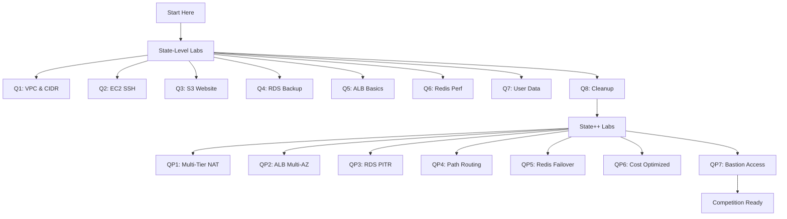

# Practice Labs: Beginner-Friendly Walkthroughs

## Overview and Purpose
These practice labs provide beginner-friendly, detailed walkthroughs for all 15 IndiaSkills State and State++ practice questions. They expand on the main question banks in ../10_indskills/state_level_practice.md and ../10_indskills/state_plus_practice.md with richer console guidance, screenshot placeholders, troubleshooting tips, and copy-paste CLI commands.

## Directory Structure
| Lab File | Question | Topic | Difficulty | Time |
|----------|----------|-------|------------|------|
| state_level/q1_vpc_cidr.md | Q1 | VPC & CIDR Planning | 🟢 Beginner | 30-35m |
| state_level/q2_ec2_ssh.md | Q2 | EC2 SSH Connectivity | 🟢 Beginner | 30-35m |
| state_level/q3_s3_website.md | Q3 | S3 Static Website Hosting | 🟢 Beginner | 35-40m |
| state_level/q4_rds_backup.md | Q4 | RDS MySQL Backup & Restore | 🟢 Beginner | 40-45m |
| state_level/q5_alb_basic.md | Q5 | ALB Basics (Single Target) | 🟢 Beginner | 35-45m |
| state_level/q6_redis_perf.md | Q6 | ElastiCache Redis Performance Testing | 🟢 Beginner | 35-45m |
| state_level/q7_ec2_userdata.md | Q7 | EC2 Web Server with User Data | 🟢 Beginner | 35-45m |
| state_level/q8_cost_cleanup.md | Q8 | Cost Optimization & Cleanup | 🟢 Beginner | 30-40m |
| state++_level/q1_multi_tier_nat.md | Q1 | Secure Multi-Tier VPC with NAT Gateway | 🟠 Intermediate | 60-75m |
| state++_level/q2_alb_two_az.md | Q2 | ALB with Two EC2 Instances Across AZs | 🟠 Intermediate | 60-80m |
| state++_level/q3_rds_pitr.md | Q3 | RDS Backup & Restore: Snapshots vs PITR | 🟠 Intermediate | 55-75m |
| state++_level/q4_path_routing.md | Q4 | Path-Based Routing with ALB | 🟠 Intermediate | 55-75m |
| state++_level/q5_redis_failover.md | Q5 | ElastiCache Redis Failover Testing | 🟠 Intermediate | 50-70m |
| state++_level/q6_cost_multi_tier.md | Q6 | Cost-Optimized Multi-Tier | 🟠 Intermediate | 50-70m |
| state++_level/q7_bastion_access.md | Q7 | Bastion-Only Access to Private Subnet | 🟠 Intermediate | 60-90m |

## Prerequisites and Setup
- AWS account with Free Tier eligibility
- IAM user with full access to EC2, VPC, RDS, S3, ElastiCache, ELB
- AWS CLI installed and configured (recommended)
- SSH client (PuTTY on Windows, OpenSSH on Linux/macOS)
- Text editor for notes and outputs
- Region: us-east-1 for all labs

## How to Use These Labs
1. Start with State-Level labs (Q1-Q8) before State++ labs.
2. Follow the recommended order within each level.
3. Take screenshots at verification points (placeholders are included).
4. Document errors and resolutions for learning.
5. Clean up resources after each lab to avoid charges; Q8 shows cleanup patterns.

## Lab Structure (What to Expect)
- Prerequisites check and estimated time
- Console navigation with click-by-click steps and screenshot placeholders
- CLI alternatives with copy-paste commands and variable hints
- Verification checklist with expected outputs
- Troubleshooting guide for common errors
- Cleanup instructions to avoid charges
- Mark mapping for exam-style scoring

## Beginner Tips
- Always stay in us-east-1; exam region is fixed.
- Use consistent naming (e.g., practice-vpc-q1, practice-web-sg).
- Enable MFA delete protection where available.
- Set a $5 billing alarm before starting.
- Keep notes of IPs, resource IDs, and endpoints.
- Verify incrementally; test each step before moving on.
- Read error messages closely; they usually point to the fix.

## Console Navigation Tips
- Bookmark frequently used services: EC2, VPC, RDS, S3, ElastiCache, Load Balancers.
- Use the console search bar instead of menus.
- Open multiple tabs for VPC, EC2, and the target service.
- Double-check the region indicator (top-right) is us-east-1.
- Use filters and Name tags to find lab resources quickly.

## Error Troubleshooting Framework
**Step 1: Identify the Error Type**
- Connectivity (timeouts, connection refused)
- Permission (Access Denied, UnauthorizedOperation)
- Resource (InvalidParameterValue, ResourceNotFound)
- Quota (LimitExceeded)

**Step 2: Common Error Patterns**
| Error Pattern | Likely Cause | Quick Fix |
|---------------|--------------|-----------|
| Connection timeout | Security Group misconfiguration | Check SG inbound rules |
| Access Denied | IAM or bucket policy issues | Review IAM or bucket policy |
| InvalidParameterValue | Wrong CIDR, AZ, or resource ID | Verify parameter format |
| LimitExceeded | Free Tier or quota reached | Check service quotas |

**Step 3: Verification Commands**
```bash
# Check your public IP
curl -s https://checkip.amazonaws.com

# Test EC2 connectivity
ping <public-ip>
nc -zv <public-ip> 22

# Test HTTP endpoint
curl -I http://<endpoint>

# Check DNS resolution
nslookup <alb-dns>
```

## Verification Scripts
**VPC Verification Script**
```bash
#!/bin/bash
VPC_ID="vpc-xxxxx"
aws ec2 describe-vpcs --vpc-ids $VPC_ID --query 'Vpcs[0].[VpcId,CidrBlock,State]' --output table
aws ec2 describe-subnets --filters "Name=vpc-id,Values=$VPC_ID" --query 'Subnets[*].[SubnetId,CidrBlock,AvailabilityZone,MapPublicIpOnLaunch]' --output table
```

**Security Group Verification Script**
```bash
#!/bin/bash
SG_ID="sg-xxxxx"
aws ec2 describe-security-groups --group-ids $SG_ID --query 'SecurityGroups[0].IpPermissions[*].[IpProtocol,FromPort,ToPort,IpRanges[0].CidrIp]' --output table
```

**RDS Connection Test**
```bash
#!/bin/bash
RDS_ENDPOINT="<endpoint>"
mysql -h $RDS_ENDPOINT -u admin -p -e "SELECT VERSION();"
```

**Redis Connection Test**
```bash
#!/bin/bash
REDIS_ENDPOINT="<endpoint>"
redis-cli -h $REDIS_ENDPOINT ping
redis-cli -h $REDIS_ENDPOINT SET test "hello"
redis-cli -h $REDIS_ENDPOINT GET test
```

## Learning Path Recommendations
- Phase 1: Networking Fundamentals (State-Level Q1-Q2) – public subnet basics and SSH.
- Phase 2: Storage and Compute (State-Level Q3, Q7) – S3 static site, EC2 user data.
- Phase 3: Managed Services (State-Level Q4, Q6) – RDS backup/restore, Redis basics.
- Phase 4: Load Balancing (State-Level Q5) – ALB with a single target.
- Phase 5: Cost Management (State-Level Q8) – cleanup and Free Tier hygiene.
- Phase 6: Advanced Networking (State++ Q1, Q7) – multi-tier VPC, NAT, bastion.
- Phase 7: High Availability (State++ Q2, Q4) – ALB multi-AZ, path routing.
- Phase 8: Data Resilience (State++ Q3, Q5) – RDS PITR, Redis failover.
- Phase 9: Cost Optimization (State++ Q6) – multi-tier Free Tier analysis.

## Screenshot Placeholders Guide
- Labs include [SCREENSHOT: description] markers; capture at those points.
- Take screenshots of creation confirmations, CIDR/Security Group details, verification outputs, dashboards, and cleanup confirmations.
- Suggested tools: Windows Snipping Tool, macOS Screenshot, Linux Flameshot.

## Time Management Tips
- State-Level: 30-40 minutes each (total ~4-5 hours for all 8).
- State++: 45-120 minutes each (total ~7-10 hours for all 7).
- Practice under a timer; focus 20% of time on verification.
- Capture screenshots and notes during the lab, not at the end.

## Cross-References
- Main practice files: ../10_indskills/state_level_practice.md, ../10_indskills/state_plus_practice.md
- Solved examples: ../10_indskills/01_solved_q1_vpc.md, ../10_indskills/02_solved_q2_db_perf.md, ../10_indskills/03_solved_q3_alb.md
- Service guides: ../01_lambda/, ../03_ec2/, ../04_s3/, ../05_vpc/, ../06_alb/, ../07_rds/, ../08_caching/

## External Resources
- AWS Free Tier: https://aws.amazon.com/free/
- AWS CLI Documentation: https://docs.aws.amazon.com/cli/
- IndiaSkills Official Site: https://www.indiaskills.in/
- AWS Well-Architected Framework: https://aws.amazon.com/architecture/well-architected/

## Support and Feedback
- Check each lab's troubleshooting guide first.
- Confirm AWS Service Health Dashboard for regional issues.
- Use the main practice files for deeper architecture context.
- Document issues with screenshots and error text for review.

## Architecture Flow


## Lab Template (For All Labs)
```markdown
# [Lab Title]

## Lab Overview
- **Difficulty:** [Beginner/Intermediate]
- **Estimated Time:** [XX minutes]
- **AWS Services:** [List services]
- **Region:** us-east-1
- **Cost:** [Free Tier / Estimated cost]

## Prerequisites Check
- [ ] AWS account with Free Tier eligibility
- [ ] IAM permissions for [services]
- [ ] AWS CLI configured (optional)
- [ ] SSH client installed
- [ ] Billing alarm set at $5

## Learning Objectives
- [Objective 1]
- [Objective 2]
- [Objective 3]

## Architecture Overview
[Mermaid diagram]

## Step-by-Step Console Instructions

### Step 1: [Task Name]
**Console Navigation:** Services → [Service] → [Action]

**Detailed Steps:**
1. Click [Button/Link]
2. Enter [Field]: `[Value]`
3. Select [Option]
4. Click [Button]

[SCREENSHOT: Description of what to capture]

**Expected Result:** [What you should see]

### Step 2: [Next Task]
...

## CLI Alternative (Copy-Paste Ready)

```bash
# Set variables
REGION=us-east-1
[Other variables]

# Command 1 with explanation
aws [service] [action] --[parameter] [value] --region $REGION
# Expected output: [description]

# Command 2
...
```

## Verification Checklist

### Verification 1: [What to verify]
**Method:** [Console/CLI/Browser/SSH]

**Steps:**
1. [Step]
2. [Step]

**Expected Output:**
```
[Expected result]
```

[SCREENSHOT: Verification proof]

**Success Criteria:** [What indicates success]

### Verification 2: [Next verification]
...

## Troubleshooting Guide

### Issue 1: [Common error]
**Symptoms:** [What you see]

**Cause:** [Why it happens]

**Solution:**
1. [Fix step 1]
2. [Fix step 2]

**Verification:** [How to confirm fix]

### Issue 2: [Next common error]
...

## Cleanup Instructions

**Important:** Follow these steps to avoid charges

### Console Cleanup
1. [Service] → [Resource] → Delete
2. [Next resource]

### CLI Cleanup
```bash
aws [service] delete-[resource] --[id] [value] --region us-east-1
```

**Verification:** [How to confirm cleanup]

## Mark Mapping (Exam Scoring)

| Task | Marks | Criteria | Your Score |
|------|-------|----------|------------|
| [Task 1] | X | [Criteria] | [ ] |
| [Task 2] | X | [Criteria] | [ ] |
| **Total** | **XX** | | |

## Key Takeaways
- [Learning point 1]
- [Learning point 2]
- [Learning point 3]

## Next Steps
- Complete [Next lab]
- Review [Related concept]
- Practice [Skill]

## Related Resources
- Main practice file: [Link]
- Service guide: [Link]
- AWS documentation: [Link]
```
