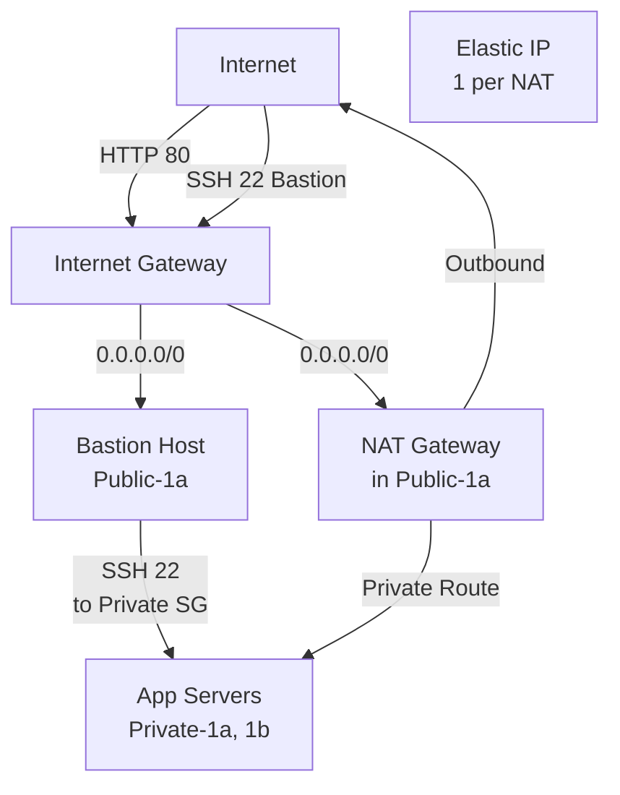

# Q1: Multi-Tier Architecture with NAT Gateway

## Lab Overview
- **Difficulty:** Intermediate
- **Estimated Time:** 50-60 minutes
- **AWS Services:** VPC, EC2, NAT Gateway, Security Groups, Elastic IP
- **Region:** us-east-1
- **Skills Focus:** Private subnets, NAT Gateway, security group chaining, bastion patterns

## Prerequisites Check
- [ ] Completed State-Level Q1-Q8
- [ ] Understanding of public/private subnets
- [ ] Understanding of NAT Gateway vs Internet Gateway

## Learning Objectives
- Design multi-tier VPC with public and private subnets across 2 AZs
- Deploy NAT Gateway for private subnet outbound access
- Configure security group chaining across tiers
- Implement bastion host pattern for private resource access
- Understand NAT Gateway costs and alternatives

## Architecture Overview


## Step-by-Step Console Instructions

### Step 1: Create Multi-AZ Public Subnets (Review Q1)
**Console Navigation:** VPC → Subnets

**Create Public Subnets:**
- Subnet A: 10.0.1.0/24 (us-east-1a)
- Subnet B: 10.0.2.0/24 (us-east-1b)
- Both: Enable auto-assign public IP

[SCREENSHOT: Public subnets with auto-assign enabled]

### Step 2: Create Multi-AZ Private Subnets
**Console Navigation:** VPC → Subnets

**Create Private Subnets:**
1. Subnet name: `practice-private-app-1a`
   - VPC: practice-vpc-q1
   - AZ: us-east-1a
   - CIDR: 10.0.11.0/24
   - DO NOT enable auto-assign public IP
   - Create

2. Subnet name: `practice-private-app-1b`
   - VPC: practice-vpc-q1
   - AZ: us-east-1b
   - CIDR: 10.0.12.0/24
   - Create

[SCREENSHOT: Private subnets created without public IP assignment]

### Step 3: Create NAT Gateway (High Cost Warning)
**Console Navigation:** VPC → NAT Gateways

**WARNING:** NAT Gateway costs ~$0.045/hour + data charges (not Free Tier!)

**Create NAT Gateway:**
1. Name: `practice-nat-q1-public-1a`
2. Subnet: `practice-public-subnet-1a` (must be public subnet!)
3. Elastic IP: Allocate new
   - Confirm EIP allocation
4. Create NAT Gateway
5. Wait for "Available" status (2-5 minutes)

[SCREENSHOT: NAT Gateway in Available state]

**Alternative Architecture (Cost-Free):** Skip NAT Gateway for practice; private subnets can only reach AWS services via VPC endpoints (not needed for this lab).

### Step 4: Create Public Route Table (Review Q1)
**Console Navigation:** VPC → Route Tables

**Create Public Route Table:**
1. Name: `practice-public-rt-q1`
2. VPC: practice-vpc-q1
3. Add route:
   - Destination: 0.0.0.0/0
   - Target: Internet Gateway
4. Associate public subnets (10.0.1.0/24, 10.0.2.0/24)

[SCREENSHOT: Public route table with IGW default route]

### Step 5: Create Private Route Table
**Console Navigation:** VPC → Route Tables

**Create Private Route Table:**
1. Name: `practice-private-rt-q1`
2. VPC: practice-vpc-q1
3. Add route:
   - Destination: 0.0.0.0/0
   - Target: NAT Gateway → select `practice-nat-q1-public-1a`
4. Associate private subnets (10.0.11.0/24, 10.0.12.0/24)

**Important:** All outbound traffic from private subnets goes through NAT Gateway, which adds cost.

[SCREENSHOT: Private route table with NAT Gateway route]

### Step 6: Create Security Groups for Three Tiers

**Tier 1 - Bastion SG (Internet-facing):**
1. Name: `practice-bastion-sg`
   - Inbound: SSH 22 from 0.0.0.0/0 (or your admin IP for production)
   - Outbound: All traffic

**Tier 2 - App SG (Private, accessed from Bastion):**
1. Name: `practice-app-sg`
   - Inbound: SSH 22 from `practice-bastion-sg` (source-group)
   - Inbound: HTTP 80 from 0.0.0.0/0 (for testing)
   - Outbound: All traffic

**Tier 3 - DB SG (Private, accessed from App):**
1. Name: `practice-db-sg`
   - Inbound: MySQL/Aurora 3306 from `practice-app-sg` (source-group)
   - Outbound: All traffic

[SCREENSHOT: Three security groups created with source-group references]

### Step 7: Launch Bastion Host
**Console Navigation:** EC2 → Instances → Launch

**Launch Settings:**
1. AMI: Amazon Linux 2023
2. Instance Type: t2.micro
3. VPC: practice-vpc-q1
4. Subnet: practice-public-subnet-1a
5. Auto-assign Public IP: Enable
6. Security Group: practice-bastion-sg
7. Key Pair: create `practice-bastion-key` or use existing
8. Tags: Name = practice-bastion-q1
9. Launch and wait for running + 2/2 status checks

[SCREENSHOT: Bastion instance running with public IP]

### Step 8: Launch Private App Servers
**Console Navigation:** EC2 → Instances → Launch

**Launch Bastion Distribution Setup:**
1. Repeat 2 times (for each private subnet):

**Settings:**
1. AMI: Amazon Linux 2023
2. Instance Type: t2.micro
3. VPC: practice-vpc-q1
4. Subnet: practice-private-app-1a (first), then practice-private-app-1b (second)
5. Auto-assign Public IP: Disable (or leave default)
6. Security Group: practice-app-sg
7. User Data (Optional):
   ```bash
   #!/bin/bash
   yum update -y
   yum install -y httpd
   systemctl enable httpd
   systemctl start httpd
   cat > /var/www/html/index.html <<EOF
   <html><h1>Private App Server in $HOSTNAME</h1></html>
   EOF
   ```
8. Key Pair: Same as bastion (`practice-bastion-key`) for SSH from bastion
9. Tags: Name = practice-app-server-q1-1a, practice-app-server-q1-1b
10. Launch and wait for 2/2 status checks

**Note:** Private instances have no public IP; can only access via bastion or session manager.

[SCREENSHOT: Two private instances running without public IPs]

### Step 9: Test Bastion Access to Private Servers
**Terminal on your local machine:**

```bash
# 1. SSH to bastion
ssh -i practice-bastion-key.pem ec2-user@<bastion-public-ip>

# 2. From bastion, check private network (should fail - can't SSH yet)
ssh -i practice-bastion-key.pem ec2-user@10.0.11.x
# Error: connection refused (key file not on bastion)

# 3. On bastion, check private instance connectivity
ping 10.0.11.x
# Should succeed (both in same VPC)

# 4. Check HTTP access to private app server
curl http://10.0.11.x
# Should return "Private App Server in ..."
```

**Required:** Copy private key to bastion for SSH access (or use AWS Systems Manager Session Manager instead).

[SCREENSHOT: SSH to bastion; curl to private server HTTP]

### Step 10: Verify NAT Gateway Outbound Access
**On Bastion (or private instance with key):**

```bash
# Check public IP of outbound traffic (should be NAT EIP, not instance IP)
curl http://checkip.amazonaws.com
# Returns NAT Gateway's Elastic IP (e.g., 54.123.45.67)
# NOT the bastion public IP or private instance IP
```

**Significance:** All private subnet outbound traffic uses NAT Gateway's EIP; this masks the private IP.

[SCREENSHOT: curl showing NAT Gateway EIP]

## CLI Alternative

```bash
REGION=us-east-1

# Get VPC ID from Q1
VPC_ID=$(aws ec2 describe-vpcs --filters Name=tag:Name,Values=practice-vpc-q1 --query 'Vpcs[0].VpcId' --output text --region $REGION)
SUBNET_PUBLIC_1A=$(aws ec2 describe-subnets --filters Name=cidr-block,Values=10.0.1.0/24 Name=vpc-id,Values=$VPC_ID --query 'Subnets[0].SubnetId' --output text --region $REGION)

# 1. Create private subnets
SUBNET_PRIVATE_1A=$(aws ec2 create-subnet \
  --vpc-id $VPC_ID \
  --cidr-block 10.0.11.0/24 \
  --availability-zone us-east-1a \
  --query 'Subnet.SubnetId' \
  --output text \
  --region $REGION)

SUBNET_PRIVATE_1B=$(aws ec2 create-subnet \
  --vpc-id $VPC_ID \
  --cidr-block 10.0.12.0/24 \
  --availability-zone us-east-1b \
  --query 'Subnet.SubnetId' \
  --output text \
  --region $REGION)

# 2. Allocate Elastic IP for NAT
EIP_ALLOC=$(aws ec2 allocate-address \
  --domain vpc \
  --region $REGION \
  --output text \
  --query 'AllocationId')

# 3. Create NAT Gateway
NAT_ID=$(aws ec2 create-nat-gateway \
  --subnet-id $SUBNET_PUBLIC_1A \
  --allocation-id $EIP_ALLOC \
  --region $REGION \
  --query 'NatGateway.NatGatewayId' \
  --output text)

echo "Waiting for NAT Gateway to be available..."
aws ec2 wait nat-gateway-available --nat-gateway-ids $NAT_ID --region $REGION

# 4. Create private route table
RT_PRIVATE=$(aws ec2 create-route-table \
  --vpc-id $VPC_ID \
  --region $REGION \
  --query 'RouteTable.RouteTableId' \
  --output text)

aws ec2 create-route \
  --route-table-id $RT_PRIVATE \
  --destination-cidr-block 0.0.0.0/0 \
  --nat-gateway-id $NAT_ID \
  --region $REGION

# 5. Associate private subnets
aws ec2 associate-route-table --subnet-id $SUBNET_PRIVATE_1A --route-table-id $RT_PRIVATE --region $REGION
aws ec2 associate-route-table --subnet-id $SUBNET_PRIVATE_1B --route-table-id $RT_PRIVATE --region $REGION

# 6. Create security groups
BASTION_SG=$(aws ec2 create-security-group \
  --group-name practice-bastion-sg \
  --description "Bastion host SG" \
  --vpc-id $VPC_ID \
  --region $REGION \
  --query 'GroupId' \
  --output text)

APP_SG=$(aws ec2 create-security-group \
  --group-name practice-app-sg \
  --description "App servers SG" \
  --vpc-id $VPC_ID \
  --region $REGION \
  --query 'GroupId' \
  --output text)

# 7. Configure inbound rules
aws ec2 authorize-security-group-ingress \
  --group-id $BASTION_SG \
  --protocol tcp \
  --port 22 \
  --cidr 0.0.0.0/0 \
  --region $REGION

aws ec2 authorize-security-group-ingress \
  --group-id $APP_SG \
  --protocol tcp \
  --port 22 \
  --source-group $BASTION_SG \
  --region $REGION

aws ec2 authorize-security-group-ingress \
  --group-id $APP_SG \
  --protocol tcp \
  --port 80 \
  --cidr 0.0.0.0/0 \
  --region $REGION

# 8. Launch bastion
AMI_ID=$(aws ssm get-parameters --names /aws/service/ami-amazon-linux-latest/al2023-ami-minimal-kernel-default-x86_64 --query 'Parameters[0].Value' --output text --region $REGION)

BASTION_INSTANCE=$(aws ec2 run-instances \
  --image-id $AMI_ID \
  --instance-type t2.micro \
  --subnet-id $SUBNET_PUBLIC_1A \
  --security-group-ids $BASTION_SG \
  --key-name practice-bastion-key \
  --tag-specifications ResourceType=instance,Tags=[{Key=Name,Value=practice-bastion-q1}] \
  --query 'Instances[0].InstanceId' \
  --output text \
  --region $REGION)

echo "Waiting for bastion instance..."
aws ec2 wait instance-running --instance-ids $BASTION_INSTANCE --region $REGION

# 9. Launch app servers
APP_INSTANCE_1=$(aws ec2 run-instances \
  --image-id $AMI_ID \
  --instance-type t2.micro \
  --subnet-id $SUBNET_PRIVATE_1A \
  --security-group-ids $APP_SG \
  --key-name practice-bastion-key \
  --tag-specifications ResourceType=instance,Tags=[{Key=Name,Value=practice-app-server-q1-1a}] \
  --user-data file://userdata-app.sh \
  --query 'Instances[0].InstanceId' \
  --output text \
  --region $REGION)

APP_INSTANCE_2=$(aws ec2 run-instances \
  --image-id $AMI_ID \
  --instance-type t2.micro \
  --subnet-id $SUBNET_PRIVATE_1B \
  --security-group-ids $APP_SG \
  --key-name practice-bastion-key \
  --tag-specifications ResourceType=instance,Tags=[{Key=Name,Value=practice-app-server-q1-1b}] \
  --user-data file://userdata-app.sh \
  --query 'Instances[0].InstanceId' \
  --output text \
  --region $REGION)

echo "Waiting for app instances..."
aws ec2 wait instance-running --instance-ids $APP_INSTANCE_1 $APP_INSTANCE_2 --region $REGION

echo "Setup complete!"
echo "Bastion IP: $(aws ec2 describe-instances --instance-ids $BASTION_INSTANCE --query 'Reservations[0].Instances[0].PublicIpAddress' --output text --region $REGION)"
```

## Verification Checklist

1. **Private Subnets Created**
   - [ ] Subnet 10.0.11.0/24 in us-east-1a
   - [ ] Subnet 10.0.12.0/24 in us-east-1b
   - [ ] Both subnets in practice-vpc-q1
   - [SCREENSHOT: Subnets view]

2. **NAT Gateway Deployed**
   - [ ] NAT Gateway status: Available
   - [ ] Associated with public subnet (10.0.1.0/24)
   - [ ] Elastic IP allocated
   - [SCREENSHOT: NAT Gateway details]

3. **Route Tables Configured**
   - [ ] Public RT: 0.0.0.0/0 → IGW
   - [ ] Private RT: 0.0.0.0/0 → NAT Gateway
   - [ ] Public subnets associated with public RT
   - [ ] Private subnets associated with private RT
   - [SCREENSHOT: Route tables]

4. **Security Groups**
   - [ ] Bastion SG: SSH 22 from 0.0.0.0/0
   - [ ] App SG: SSH 22 from Bastion SG (source-group)
   - [ ] App SG: HTTP 80 from 0.0.0.0/0
   - [SCREENSHOT: SG inbound rules]

5. **Instances Running**
   - [ ] Bastion instance running with public IP
   - [ ] App instance 1 in private subnet (no public IP)
   - [ ] App instance 2 in private subnet (no public IP)
   - [SCREENSHOT: EC2 instances]

6. **Connectivity Tests**
   - [ ] SSH to bastion successful
   - [ ] ping 10.0.11.x from bastion succeeds
   - [ ] curl to private app HTTP returns content
   - [SCREENSHOT: Terminal with successful curl]

7. **NAT Gateway Outbound**
   - [ ] curl checkip.amazonaws.com shows NAT EIP
   - [ ] EIP is NOT bastion public IP or private instance IP
   - [SCREENSHOT: NAT EIP verification]

## Troubleshooting Guide

- **Private subnet instances unreachable from bastion**
  - Cause: SG doesn't allow SSH 22 from bastion SG
  - Fix: Add inbound rule to app SG: SSH 22, source = bastion SG ID

- **NAT Gateway creation fails**
  - Cause: Selected private subnet or no Elastic IP
  - Fix: NAT must be in PUBLIC subnet; ensure EIP allocated

- **Private instances can't access internet**
  - Cause: Private route table missing NAT route
  - Fix: Create 0.0.0.0/0 route → NAT Gateway; associate private subnets

- **Bastion can't reach private instance by name**
  - Cause: Route table not propagating or DNS resolution issues
  - Fix: Use private IP (10.0.x.x); ping to verify connectivity

- **NAT Gateway very slow**
  - Cause: All traffic through single NAT in one AZ (bottleneck)
  - Fix: Production would use NAT in each AZ; for practice, acceptable

- **High hourly AWS bill**
  - Cause: NAT Gateway costs ~$0.045/hour
  - Fix: Delete NAT when lab complete; don't leave running

## Cleanup Instructions

1. Terminate bastion and app instances
2. Delete security groups (bastion, app)
3. Delete private route table
4. Delete private subnets
5. Delete NAT Gateway (wait 5 min)
6. Release Elastic IP
7. [Delete public route table if not using in other labs]
8. [Delete VPC if not using in other labs]

```bash
# Quick cleanup
aws ec2 terminate-instances --instance-ids $BASTION_INSTANCE $APP_INSTANCE_1 $APP_INSTANCE_2 --region $REGION
aws ec2 delete-nat-gateway --nat-gateway-id $NAT_ID --region $REGION
aws ec2 release-address --allocation-id $EIP_ALLOC --region $REGION
```

## Mark Mapping (Exam Scoring)

| Task | Marks | Criteria | Your Score |
|------|-------|----------|------------|
| Private subnets | 3 | 2 AZs, correct CIDR, no auto-assign IP | [ ] |
| NAT Gateway | 4 | Deployed in public subnet, EIP allocated, available | [ ] |
| Route tables | 3 | Public/private separated, routes configured | [ ] |
| SG chaining | 3 | Bastion → App via source-group, HTTP allowed | [ ] |
| Bastion launch | 3 | Public subnet, public IP, 2/2 checks | [ ] |
| App servers | 3 | Private subnets, 2 instances across AZs | [ ] |
| Bastion access | 3 | SSH succeeds, ping to private works | [ ] |
| NAT verification | 2 | curl checkip shows NAT EIP, not instance IP | [ ] |
| **Total** | **24** | | **[ ]** |

## Key Takeaways
- **NAT Gateway is expensive:** ~$0.045/hour + data charges; consider VPC endpoints for AWS services only
- **Bastion pattern:** Public instance acts as gateway to private tier; SSH agent forwarding enhances security
- **Multi-AZ resilience:** App servers in both AZs provide redundancy
- **Security group chaining:** Source-group rules enforce least-privilege tier-to-tier communication
- **Route table separation:** Public subnets route to IGW; private subnets route to NAT

## Next Steps
- Progress to State++ Q2: ALB with multi-tier targets
- Explore VPC endpoints as NAT alternative for AWS services
- Review advanced bastion patterns (SSH agent forwarding)

## Related Resources
- Main VPC guide: `file:aws-worldskills-notes/05_vpc/overview.md`
- NAT Gateway documentation: https://docs.aws.amazon.com/vpc/latest/userguide/vpc-nat-gateway.html
- Security group best practices: https://docs.aws.amazon.com/vpc/latest/userguide/VPC_SecurityGroups.html
