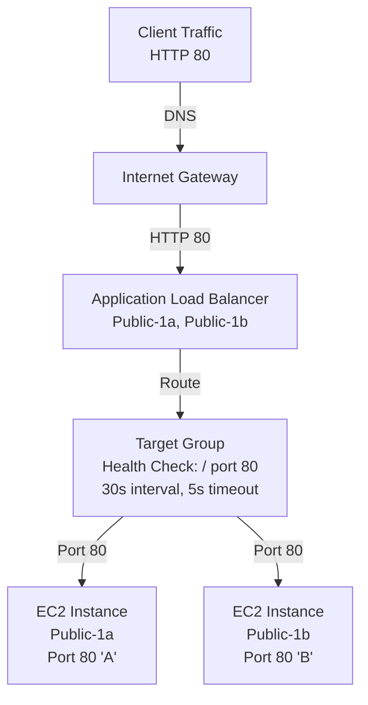

# Q2: ALB with Multi-AZ Target Groups

## Lab Overview
- **Difficulty:** Intermediate
- **Estimated Time:** 45-60 minutes
- **AWS Services:** ALB, EC2, Target Groups, Health Checks, Auto Scaling
- **Region:** us-east-1
- **Skills Focus:** ALB distribution, health check tuning, cross-AZ load balancing

## Prerequisites Check
- [ ] Completed State-Level Q5 (ALB basics)
- [ ] Understanding of target group health checks
- [ ] Understanding of ALB listener rules

## Learning Objectives
- Deploy ALB with targets in multiple AZs
- Configure advanced health check parameters
- Implement cross-AZ load balancing
- Monitor target health transitions
- Understand ALB algorithm and connection draining

## Architecture Overview


## Step-by-Step Console Instructions

### Step 1: Verify Multi-AZ Public Subnets
**Console Navigation:** VPC → Subnets

**Verify Setup from Q1:**
- [ ] Subnet 10.0.1.0/24 (us-east-1a) - public
- [ ] Subnet 10.0.2.0/24 (us-east-1b) - public
- [ ] Both have route to IGW (0.0.0.0/0)
- [ ] Both have auto-assign public IP enabled

[SCREENSHOT: Public subnets verified]

### Step 2: Create ALB Security Group
**Console Navigation:** EC2 → Security Groups → Create security group

**Settings:**
1. Name: `practice-alb-multi-sg`
2. Description: "ALB for multi-AZ targets"
3. VPC: practice-vpc-q1
4. Inbound Rules:
   - Type: HTTP
   - Protocol: TCP
   - Port: 80
   - Source: 0.0.0.0/0 (internet)
5. Outbound: All traffic (default)
6. Create

[SCREENSHOT: ALB security group]

### Step 3: Create Target EC2 Security Group
**Console Navigation:** EC2 → Security Groups → Create security group

**Settings:**
1. Name: `practice-target-multi-sg`
2. Description: "Web servers for ALB targets"
3. VPC: practice-vpc-q1
4. Inbound Rules:
   - Type: HTTP
   - Protocol: TCP
   - Port: 80
   - Source: practice-alb-multi-sg (source-group)
   - Type: SSH
   - Protocol: TCP
   - Port: 22
   - Source: your admin IP/32 (for debugging)
5. Outbound: All traffic
6. Create

[SCREENSHOT: Target security group with source-group rule]

### Step 4: Launch EC2 Targets in AZ-1a
**Console Navigation:** EC2 → Instances → Launch instances

**Settings:**
1. Name: `practice-target-multi-1a`
2. AMI: Amazon Linux 2023
3. Instance Type: t2.micro
4. VPC: practice-vpc-q1
5. Subnet: practice-public-subnet-1a
6. Auto-assign Public IP: Enable
7. Security Group: practice-target-multi-sg
8. User Data:
   ```bash
   #!/bin/bash
   yum update -y
   yum install -y httpd
   systemctl enable httpd
   systemctl start httpd
   cat > /var/www/html/index.html <<EOF
   <html>
   <h1>Target Server A (AZ-1a)</h1>
   <p>Server ID: $(curl -s http://169.254.169.254/latest/meta-data/instance-id)</p>
   <p>AZ: $(curl -s http://169.254.169.254/latest/meta-data/placement/availability-zone)</p>
   </html>
   EOF
   ```
9. Key Pair: your-key or create new
10. Tags: Name = practice-target-multi-1a
11. Launch and wait 2/2 checks

**Record instance ID and private IP for step 6**

[SCREENSHOT: Instance 1a running]

### Step 5: Launch EC2 Targets in AZ-1b
**Console Navigation:** EC2 → Instances → Launch instances

**Settings:** (Same as Step 4, but)
1. Name: `practice-target-multi-1b`
2. Subnet: practice-public-subnet-1b
3. Tags: Name = practice-target-multi-1b
4. Launch and wait 2/2 checks

**Record instance ID and private IP for step 6**

[SCREENSHOT: Both instances running in different AZs]

### Step 6: Create Target Group
**Console Navigation:** EC2 → Load Balancing → Target Groups → Create target group

**Settings:**
1. Choose a target type: Instances
2. Name: `practice-tg-multi`
3. Protocol: HTTP
4. Port: 80
5. VPC: practice-vpc-q1
6. Health check path: `/`
7. Health check protocol: HTTP
8. Health check port: 80
9. **Advanced health check settings:**
   - Healthy threshold: 2 (2 consecutive successful checks)
   - Unhealthy threshold: 3 (3 consecutive failed checks)
   - Timeout: 5 seconds (max wait for response)
   - Interval: 30 seconds (check frequency)
   - Success codes: 200 (which HTTP response codes = healthy)
10. Create target group

[SCREENSHOT: Target group with health checks configured]

### Step 7: Register Targets to Target Group
**Console Navigation:** EC2 → Target Groups → practice-tg-multi → Targets

**Register Targets:**
1. Click "Register targets"
2. Select both instances:
   - practice-target-multi-1a
   - practice-target-multi-1b
3. Port: 80
4. Click "Register as pending below"
5. Click "Register targets"
6. Monitor status (should change from Initial → Healthy within 30-60 seconds)

[SCREENSHOT: Both targets registered and Healthy]

### Step 8: Create ALB
**Console Navigation:** EC2 → Load Balancers → Create load balancer

**Settings:**
1. Type: Application Load Balancer
2. Name: `practice-alb-multi`
3. Scheme: Internet-facing
4. IP address type: IPv4
5. VPC: practice-vpc-q1
6. Subnets: Select both
   - practice-public-subnet-1a (10.0.1.0/24)
   - practice-public-subnet-1b (10.0.2.0/24)
7. Security Group: practice-alb-multi-sg
8. Listeners:
   - Protocol: HTTP
   - Port: 80
   - Forward to: practice-tg-multi (target group)
9. Create

[SCREENSHOT: ALB created and Active]

### Step 9: Verify ALB DNS Resolution
**Console Navigation:** EC2 → Load Balancers → practice-alb-multi

**Find ALB DNS Name:**
- Example: `practice-alb-multi-123456789.us-east-1.elb.amazonaws.com`
- Copy the DNS name

**Wait for DNS Propagation (2-3 minutes)**

[SCREENSHOT: ALB details showing DNS name]

### Step 10: Test Cross-AZ Load Balancing
**From your local terminal:**

```bash
ALB_DNS="practice-alb-multi-123456789.us-east-1.elb.amazonaws.com"

# Test 1: Check HTML response
curl http://$ALB_DNS
# Output: "Target Server A (AZ-1a)" or "Target Server B (AZ-1b)"

# Test 2: Multiple requests to verify round-robin
for i in {1..10}; do 
  curl -s http://$ALB_DNS | grep -o "AZ-1a\|AZ-1b"
done
# Output should alternate between 1a and 1b

# Test 3: Check response headers
curl -v http://$ALB_DNS
# Should see "Server: Apache/2.4..."
# Should see "Connection: keep-alive"

# Test 4: HTTP status
curl -w "\nStatus: %{http_code}\n" http://$ALB_DNS
# Status: 200
```

[SCREENSHOT: curl tests showing alternating responses]

### Step 11: Monitor Health Check Status
**Console Navigation:** EC2 → Target Groups → practice-tg-multi → Targets

**Health Check Details:**
1. Both targets should show "Healthy"
2. Click on target → "Health check reason" should be empty or "N/A" (means healthy)
3. "Target health description" should show target status
4. Each target's IP and port confirmed
5. If unhealthy (shows X), expand details:
   - Reason: Usually "Response Code Mismatch" or "Health Check Timeout"
   - Fix: SSH to instance, verify httpd running, check security group allows 80 from ALB SG

[SCREENSHOT: Both targets showing Healthy status with green checks]

### Step 12: Connection Draining (Optional Advanced Test)
**Console Navigation:** EC2 → Target Groups → practice-tg-multi → Attributes

**Modify Stickiness/Connection Draining:**
1. Deregistration delay: 30 seconds (allows existing connections to complete)
2. This is "connection draining" - important for zero-downtime deployments
3. When target deregistered, ALB stops sending NEW requests but waits 30s for existing requests
4. Test: Stop one instance mid-request to see draining behavior

[SCREENSHOT: Deregistration delay configured]

## CLI Alternative

```bash
REGION=us-east-1

# Get VPC and subnets
VPC_ID=$(aws ec2 describe-vpcs --filters Name=tag:Name,Values=practice-vpc-q1 --query 'Vpcs[0].VpcId' --output text --region $REGION)
SUBNET_1A=$(aws ec2 describe-subnets --filters Name=cidr-block,Values=10.0.1.0/24 --query 'Subnets[0].SubnetId' --output text --region $REGION)
SUBNET_1B=$(aws ec2 describe-subnets --filters Name=cidr-block,Values=10.0.2.0/24 --query 'Subnets[0].SubnetId' --output text --region $REGION)

# 1. Create security groups
ALB_SG=$(aws ec2 create-security-group \
  --group-name practice-alb-multi-sg \
  --description "ALB for multi-AZ targets" \
  --vpc-id $VPC_ID \
  --query 'GroupId' \
  --output text \
  --region $REGION)

TARGET_SG=$(aws ec2 create-security-group \
  --group-name practice-target-multi-sg \
  --description "Web servers for ALB targets" \
  --vpc-id $VPC_ID \
  --query 'GroupId' \
  --output text \
  --region $REGION)

# 2. Configure inbound rules
aws ec2 authorize-security-group-ingress \
  --group-id $ALB_SG \
  --protocol tcp --port 80 --cidr 0.0.0.0/0 \
  --region $REGION

aws ec2 authorize-security-group-ingress \
  --group-id $TARGET_SG \
  --protocol tcp --port 80 --source-group $ALB_SG \
  --region $REGION

aws ec2 authorize-security-group-ingress \
  --group-id $TARGET_SG \
  --protocol tcp --port 22 --cidr 0.0.0.0/0 \
  --region $REGION

# 3. Get AMI
AMI_ID=$(aws ssm get-parameters --names /aws/service/ami-amazon-linux-latest/al2023-ami-minimal-kernel-default-x86_64 --query 'Parameters[0].Value' --output text --region $REGION)

# 4. Launch instances
INSTANCE_1A=$(aws ec2 run-instances \
  --image-id $AMI_ID \
  --instance-type t2.micro \
  --subnet-id $SUBNET_1A \
  --security-group-ids $TARGET_SG \
  --user-data file://userdata-web.sh \
  --tag-specifications ResourceType=instance,Tags=[{Key=Name,Value=practice-target-multi-1a}] \
  --query 'Instances[0].InstanceId' \
  --output text \
  --region $REGION)

INSTANCE_1B=$(aws ec2 run-instances \
  --image-id $AMI_ID \
  --instance-type t2.micro \
  --subnet-id $SUBNET_1B \
  --security-group-ids $TARGET_SG \
  --user-data file://userdata-web.sh \
  --tag-specifications ResourceType=instance,Tags=[{Key=Name,Value=practice-target-multi-1b}] \
  --query 'Instances[0].InstanceId' \
  --output text \
  --region $REGION)

echo "Waiting for instances..."
aws ec2 wait instance-running --instance-ids $INSTANCE_1A $INSTANCE_1B --region $REGION
aws ec2 wait instance-status-ok --instance-ids $INSTANCE_1A $INSTANCE_1B --region $REGION

# 5. Get instance IPs
INSTANCE_1A_IP=$(aws ec2 describe-instances --instance-ids $INSTANCE_1A --query 'Reservations[0].Instances[0].PrivateIpAddress' --output text --region $REGION)
INSTANCE_1B_IP=$(aws ec2 describe-instances --instance-ids $INSTANCE_1B --query 'Reservations[0].Instances[0].PrivateIpAddress' --output text --region $REGION)

# 6. Create target group
TG_ARN=$(aws elbv2 create-target-group \
  --name practice-tg-multi \
  --protocol HTTP \
  --port 80 \
  --vpc-id $VPC_ID \
  --health-check-protocol HTTP \
  --health-check-path / \
  --health-check-interval-seconds 30 \
  --health-check-timeout-seconds 5 \
  --healthy-threshold-count 2 \
  --unhealthy-threshold-count 3 \
  --matcher HttpCode=200 \
  --query 'TargetGroups[0].TargetGroupArn' \
  --output text \
  --region $REGION)

# 7. Register targets
aws elbv2 register-targets \
  --target-group-arn $TG_ARN \
  --targets Id=$INSTANCE_1A Id=$INSTANCE_1B \
  --region $REGION

echo "Waiting for targets to become healthy..."
sleep 30

# 8. Create ALB
ALB_ARN=$(aws elbv2 create-load-balancer \
  --name practice-alb-multi \
  --subnets $SUBNET_1A $SUBNET_1B \
  --security-groups $ALB_SG \
  --scheme internet-facing \
  --query 'LoadBalancers[0].LoadBalancerArn' \
  --output text \
  --region $REGION)

ALB_DNS=$(aws elbv2 describe-load-balancers \
  --load-balancer-arns $ALB_ARN \
  --query 'LoadBalancers[0].DNSName' \
  --output text \
  --region $REGION)

# 9. Create listener
aws elbv2 create-listener \
  --load-balancer-arn $ALB_ARN \
  --protocol HTTP \
  --port 80 \
  --default-actions Type=forward,TargetGroupArn=$TG_ARN \
  --region $REGION

echo "ALB DNS: $ALB_DNS"
echo "Test with: curl http://$ALB_DNS"
```

## Verification Checklist

1. **Target Group**
   - [ ] Created with correct health check settings
   - [ ] Interval: 30s, Timeout: 5s, Healthy threshold: 2, Unhealthy threshold: 3
   - [ ] [SCREENSHOT: Target group details]

2. **Instances Registered**
   - [ ] Both instances show in target group
   - [ ] Both show "Healthy" status (green)
   - [ ] Private IPs and ports correct
   - [ ] [SCREENSHOT: Targets list]

3. **ALB Created**
   - [ ] Status: Active
   - [ ] Scheme: Internet-facing
   - [ ] Subnets: Both public subnets selected
   - [ ] DNS name resolvable
   - [ ] [SCREENSHOT: ALB details]

4. **Listener Configured**
   - [ ] Protocol: HTTP, Port: 80
   - [ ] Forward to: practice-tg-multi
   - [ ] [SCREENSHOT: Listener rules]

5. **DNS Propagation**
   - [ ] ALB DNS name resolves to IP
   - [ ] nslookup shows multiple IPs (A records)
   - [ ] [SCREENSHOT: nslookup output]

6. **Load Balancing**
   - [ ] curl to ALB returns target content
   - [ ] Multiple requests alternate between 1a and 1b
   - [ ] Response includes server ID and AZ
   - [ ] [SCREENSHOT: curl showing alternating responses]

7. **Health Check Monitoring**
   - [ ] Both targets show "Healthy"
   - [ ] No health check failures in logs
   - [ ] Connection count increases with load
   - [ ] [SCREENSHOT: Target health details]

8. **HTTP Status**
   - [ ] curl -v returns 200 OK
   - [ ] No 502 (Bad Gateway) or 503 (Service Unavailable)
   - [ ] Response time < 100ms typically
   - [ ] [SCREENSHOT: HTTP headers]

## Troubleshooting Guide

- **Targets showing Unhealthy**
  - Cause: SG doesn't allow 80 from ALB SG; httpd not running; health check path wrong
  - Fix: Verify SG rule (source = ALB SG); SSH to target and `sudo systemctl status httpd`; check health check path matches (/)

- **ALB not distributing traffic**
  - Cause: All requests going to one target
  - Fix: Normal if one target unhealthy; both healthy should alternate; restart targets to reset connections

- **DNS not resolving**
  - Cause: ALB still creating (takes 2-5 min) or DNS cache
  - Fix: Wait 5 minutes; flush DNS cache (macOS: `dscacheutil -flushcache`)

- **curl returns 502 Bad Gateway**
  - Cause: All targets unhealthy or deregistering
  - Fix: Check target group health; restart httpd on instances

- **High latency**
  - Cause: Connection pooling; ALB between instances in different AZs (network latency)
  - Fix: Normal for cross-AZ; typically <10ms; check CloudWatch metrics

- **Cannot reach ALB from internet**
  - Cause: ALB SG missing rule for 80 from 0.0.0.0/0
  - Fix: Add inbound HTTP 80 from 0.0.0.0/0 to ALB SG

- **Deregistration draining not working**
  - Cause: Deregistration delay set to 0 or connection handling misconfigured
  - Fix: Set deregistration delay > 0; graceful shutdown requires proper application handling

## Cleanup Instructions

1. Delete ALB (waits for targets to drain)
2. Delete target group
3. Terminate EC2 instances
4. Delete security groups
5. [Optional: Delete public subnets if not reusing]

```bash
# Quick cleanup
aws elbv2 delete-load-balancer --load-balancer-arn $ALB_ARN --region $REGION
sleep 30
aws elbv2 delete-target-group --target-group-arn $TG_ARN --region $REGION
aws ec2 terminate-instances --instance-ids $INSTANCE_1A $INSTANCE_1B --region $REGION
aws ec2 delete-security-group --group-id $ALB_SG --region $REGION
aws ec2 delete-security-group --group-id $TARGET_SG --region $REGION
```

## Mark Mapping (Exam Scoring)

| Task | Marks | Criteria | Your Score |
|------|-------|----------|------------|
| Multi-AZ setup | 3 | Two instances across us-east-1a/1b | [ ] |
| SG source-group | 3 | Target SG allows 80 from ALB SG | [ ] |
| Target group | 3 | Health checks: 30s, 5s, threshold 2/3 | [ ] |
| ALB creation | 3 | Internet-facing, both subnets, Active | [ ] |
| Listener config | 2 | HTTP 80 forward to TG | [ ] |
| Target health | 3 | Both Healthy, no errors | [ ] |
| DNS resolution | 2 | DNS name resolves to ALB IP | [ ] |
| Load balancing | 3 | Requests alternate between targets | [ ] |
| **Total** | **22** | | **[ ]** |

## Key Takeaways
- **Cross-AZ ALB:** Provides automatic failover and load distribution across availability zones
- **Health check tuning:** Interval/timeout balance between responsiveness and false positives
- **Source-group rules:** Enforce least-privilege security by limiting to ALB SG only
- **Round-robin algorithm:** ALB distributes new connections; existing connections stick to target
- **Deregistration draining:** Allows graceful shutdown without dropping in-flight requests

## Next Steps
- Progress to State++ Q3: RDS backup and recovery patterns
- Explore ALB path-based routing (Q4)
- Review Auto Scaling to replace failed targets

## Related Resources
- State-Level Q5 (ALB basics): `file:aws-worldskills-notes/practice/state_level/q5_alb_basic.md`
- ALB documentation: https://docs.aws.amazon.com/elasticloadbalancing/latest/application/application-load-balancers.html
- Target group health checks: https://docs.aws.amazon.com/elasticloadbalancing/latest/application/target-group-health-checks.html
