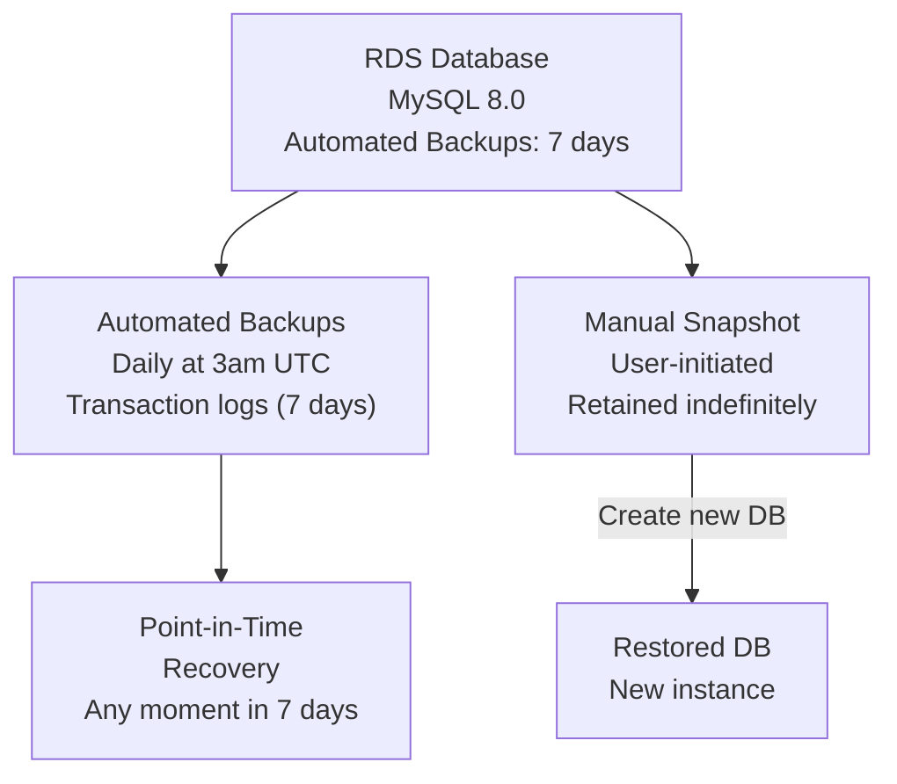

# Q3: RDS Backup & Restore - Snapshots vs PITR

## Lab Overview
- **Difficulty:** Intermediate
- **Estimated Time:** 60-75 minutes
- **AWS Services:** RDS, EC2, Snapshots, Point-in-Time Recovery (PITR), MySQL
- **Region:** us-east-1
- **Skills Focus:** Database backups, recovery strategies, RPO/RTO concepts

## Prerequisites Check
- [ ] Completed State-Level Q4 (basic RDS)
- [ ] Understanding of automated backups vs manual snapshots
- [ ] MySQL client familiarity

## Learning Objectives
- Compare automated backups vs manual snapshots vs PITR
- Create and restore from manual snapshots
- Understand backup retention policies
- Perform point-in-time recovery
- Monitor backup storage costs

## Architecture Overview


## Step-by-Step Console Instructions

### Step 1: Create RDS Database with Backups Enabled
**Console Navigation:** RDS → Databases → Create database

**Database Configuration:**
1. Engine: MySQL
2. Engine Version: 8.0.35
3. Templates: Dev/Test
4. DB Instance Identifier: `practice-rds-pitr`
5. Master username: `admin`
6. Master password: `TempPass123!` (strong password)
7. DB Instance Class: db.t3.micro (Free Tier)
8. Storage: General Purpose (gp2), 20 GB
9. **Backup Configuration:**
   - Automated backups: Enable
   - Backup retention period: **7 days** (max for Free Tier)
   - Backup window: No preference (default 3am UTC)
   - Multi-AZ: Disable (for practice; production would enable)
10. **Monitoring:**
    - Enable CloudWatch monitoring: Yes
    - Enhanced monitoring: Disable (additional cost)
11. Database options:
    - Initial database name: `practicedb`
    - Port: 3306
12. Encryption: Disable (for practice)
13. Create database

Wait for "Available" status (5-10 minutes)

[SCREENSHOT: RDS database being created]

### Step 2: Create DB Subnet Group (if needed)
**Console Navigation:** RDS → Subnet Groups

**Verify:** If creating new database requires new subnet group:
1. Create DB Subnet Group: `practice-db-subnet-group`
2. VPC: practice-vpc-q1
3. Add subnets: Both public subnets (us-east-1a, us-east-1b)
4. Create

[SCREENSHOT: DB subnet group created]

### Step 3: Verify Automated Backup Settings
**Console Navigation:** RDS → Databases → practice-rds-pitr

**Check:**
1. Status: Available
2. Automated backups: Enabled
3. Backup retention period: 7 days
4. Latest restorable time: Should show recent timestamp
5. Backup window: Default (UTC)

[SCREENSHOT: RDS backup settings]

### Step 4: Connect to Database and Create Test Data
**From EC2 instance or local machine with MySQL client:**

```bash
# Install MySQL client (if needed)
sudo yum install -y mariadb105
# or macOS: brew install mysql-client

# Connect to RDS
mysql -h practice-rds-pitr.xxxxx.us-east-1.rds.amazonaws.com \
      -u admin \
      -p'TempPass123!' \
      practicedb

# Create test table
mysql> CREATE TABLE students (
  id INT AUTO_INCREMENT PRIMARY KEY,
  name VARCHAR(100),
  score INT,
  created_at TIMESTAMP DEFAULT CURRENT_TIMESTAMP
);

mysql> INSERT INTO students (name, score) VALUES
  ('Alice', 95),
  ('Bob', 87),
  ('Charlie', 92);

mysql> SELECT * FROM students;
# Output:
# | id | name    | score | created_at          |
# | 1  | Alice   | 95    | 2024-01-15 10:30:45 |
# | 2  | Bob     | 87    | 2024-01-15 10:30:45 |
# | 3  | Charlie | 92    | 2024-01-15 10:30:45 |

mysql> EXIT;
```

[SCREENSHOT: MySQL terminal showing data inserted]

### Step 5: Create Manual Snapshot
**Console Navigation:** RDS → Databases → practice-rds-pitr → Actions → Create snapshot

**Snapshot Settings:**
1. Snapshot identifier: `practice-snap-before-delete`
2. Create snapshot

Wait for "Available" status (1-5 minutes depending on database size)

[SCREENSHOT: Manual snapshot creation in progress]

### Step 6: Delete Records and Create PITR Scenario
**Back to MySQL terminal:**

```bash
mysql -h practice-rds-pitr.xxxxx.us-east-1.rds.amazonaws.com \
      -u admin \
      -p'TempPass123!' \
      practicedb

# Accidentally delete all students!
mysql> DELETE FROM students WHERE score < 90;

# Check damage
mysql> SELECT * FROM students;
# Output: Only Alice (95) remains; Bob and Charlie deleted

# Get current timestamp (for PITR)
mysql> SELECT NOW();
# 2024-01-15 10:45:30

mysql> EXIT;
```

[SCREENSHOT: Accidental deletion showing only one record]

### Step 7: Restore from Manual Snapshot
**Console Navigation:** RDS → Snapshots → practice-snap-before-delete

**Restore Snapshot:**
1. Select snapshot
2. Actions → Restore from DB Snapshot
3. DB Instance Identifier: `practice-rds-restored-from-snap`
4. DB Instance Class: db.t3.micro
5. Multi-AZ: Disable
6. Storage: Same as original (20 GB)
7. Restore DB Instance

Wait for new instance to become "Available" (5-10 minutes)

[SCREENSHOT: Snapshot restoration in progress]

### Step 8: Verify Restored Data from Snapshot
**Connect to Restored Database:**

```bash
mysql -h practice-rds-restored-from-snap.xxxxx.us-east-1.rds.amazonaws.com \
      -u admin \
      -p'TempPass123!' \
      practicedb

mysql> SELECT * FROM students;
# Output: All 3 students restored!
# | id | name    | score | created_at          |
# | 1  | Alice   | 95    | 2024-01-15 10:30:45 |
# | 2  | Bob     | 87    | 2024-01-15 10:30:45 |
# | 3  | Charlie | 92    | 2024-01-15 10:30:45 |

mysql> EXIT;
```

[SCREENSHOT: Restored database showing all original data]

### Step 9: Perform Point-in-Time Recovery (PITR)
**Console Navigation:** RDS → Databases → practice-rds-pitr → Actions → Restore to point in time

**PITR Settings:**
1. DB Instance Identifier: `practice-rds-restored-pitr`
2. Restore time: Use specific time (select timestamp before deletion, e.g., 10:45:00)
3. DB Instance Class: db.t3.micro
4. Multi-AZ: Disable
5. Storage: Same (20 GB)
6. Restore to DB Instance

Wait for new instance "Available" (5-10 minutes)

[SCREENSHOT: PITR restoration dialog showing timestamp selection]

### Step 10: Verify PITR Restored Data
**Connect to PITR Restored Database:**

```bash
mysql -h practice-rds-restored-pitr.xxxxx.us-east-1.rds.amazonaws.com \
      -u admin \
      -p'TempPass123!' \
      practicedb

mysql> SELECT * FROM students;
# Output: All 3 students restored via PITR!
# | id | name    | score | created_at          |
# | 1  | Alice   | 95    | 2024-01-15 10:30:45 |
# | 2  | Bob     | 87    | 2024-01-15 10:30:45 |
# | 3  | Charlie | 92    | 2024-01-15 10:30:45 |

mysql> EXIT;
```

[SCREENSHOT: PITR database also showing restored data]

### Step 11: Compare Backup Methods
**Console Navigation:** RDS → Snapshots & RDS → Automated Backups

| Aspect | Automated Backup | Manual Snapshot | PITR |
|--------|-----------------|-----------------|------|
| Trigger | Automatic daily | Manual (user) | On-demand |
| Retention | 1-35 days (7 free tier) | Indefinite (storage charged) | Within retention period |
| Granularity | Full database backup + transaction logs | Full database backup | Specific timestamp |
| Cost | Included in DB instance | $0.095/GB/month | Included in backups |
| Creation Time | ~1-2 minutes daily | ~1-5 minutes | Immediate (new instance) |
| Use Case | Default recovery | Long-term retention | Point-in-time recovery |

[SCREENSHOT: Snapshots list showing manual and automated backups]

### Step 12: Monitor Backup Storage
**Console Navigation:** RDS → Databases → practice-rds-pitr → Monitoring

**Check Metrics:**
1. Storage used: Shows backup storage separately
2. Backup storage: Visible if backups > free tier limit
3. Database size: 20 GB + backup transaction logs

For Free Tier:
- First 20 GB of backup storage free (per month)
- Additional backups charged at $0.095/GB/month

[SCREENSHOT: RDS metrics showing storage usage]

## CLI Alternative

```bash
REGION=us-east-1
DB_IDENTIFIER="practice-rds-pitr"
DB_SUBNET_GROUP="default"
MASTER_USER="admin"
MASTER_PASSWORD="TempPass123!"

# 1. Create RDS instance
aws rds create-db-instance \
  --db-instance-identifier $DB_IDENTIFIER \
  --db-instance-class db.t3.micro \
  --engine mysql \
  --engine-version 8.0.35 \
  --master-username $MASTER_USER \
  --master-user-password $MASTER_PASSWORD \
  --allocated-storage 20 \
  --storage-type gp2 \
  --backup-retention-period 7 \
  --db-subnet-group-name $DB_SUBNET_GROUP \
  --no-publicly-accessible \
  --region $REGION

echo "Waiting for database..."
aws rds wait db-instance-available --db-instance-identifier $DB_IDENTIFIER --region $REGION

# 2. Create manual snapshot
aws rds create-db-snapshot \
  --db-instance-identifier $DB_IDENTIFIER \
  --db-snapshot-identifier practice-snap-before-delete \
  --region $REGION

echo "Waiting for snapshot..."
aws rds wait db-snapshot-available --db-snapshot-identifier practice-snap-before-delete --region $REGION

# 3. Restore from snapshot
aws rds restore-db-instance-from-db-snapshot \
  --db-instance-identifier practice-rds-restored-from-snap \
  --db-snapshot-identifier practice-snap-before-delete \
  --db-instance-class db.t3.micro \
  --no-publicly-accessible \
  --region $REGION

echo "Waiting for restored instance..."
aws rds wait db-instance-available --db-instance-identifier practice-rds-restored-from-snap --region $REGION

# 4. Restore to point in time
RESTORE_TIME="2024-01-15T10:45:00Z"

aws rds restore-db-instance-to-point-in-time \
  --source-db-instance-identifier $DB_IDENTIFIER \
  --target-db-instance-identifier practice-rds-restored-pitr \
  --restore-time $RESTORE_TIME \
  --use-latest-restorable-time=false \
  --db-instance-class db.t3.micro \
  --region $REGION

echo "Waiting for PITR instance..."
aws rds wait db-instance-available --db-instance-identifier practice-rds-restored-pitr --region $REGION

# 5. List snapshots
aws rds describe-db-snapshots --region $REGION

# 6. Monitor backups
aws rds describe-db-instances \
  --db-instance-identifier $DB_IDENTIFIER \
  --query 'DBInstances[0].[DBInstanceIdentifier,BackupRetentionPeriod,LatestRestorableTime]' \
  --region $REGION
```

## Verification Checklist

1. **Original Database**
   - [ ] Status: Available
   - [ ] Automated backups: Enabled
   - [ ] Retention: 7 days
   - [ ] Test data: 3 students in table
   - [ ] [SCREENSHOT: Database details]

2. **Manual Snapshot**
   - [ ] Status: Available
   - [ ] Identifier: practice-snap-before-delete
   - [ ] Size shows in console
   - [ ] [SCREENSHOT: Snapshots list]

3. **Accidental Deletion Scenario**
   - [ ] DELETE statement executed
   - [ ] Only 1 student remains (Alice)
   - [ ] Timestamp recorded before deletion
   - [ ] [SCREENSHOT: MySQL showing deletion]

4. **Snapshot Restoration**
   - [ ] New instance: practice-rds-restored-from-snap
   - [ ] Status: Available
   - [ ] All 3 students restored
   - [ ] Data identical to original
   - [ ] [SCREENSHOT: Restored data]

5. **PITR Restoration**
   - [ ] New instance: practice-rds-restored-pitr
   - [ ] Status: Available
   - [ ] All 3 students restored
   - [ ] Data as of specified timestamp
   - [ ] [SCREENSHOT: PITR restored data]

6. **Backup Comparison**
   - [ ] Manual snapshot verified
   - [ ] Automated backup visible in retention period
   - [ ] PITR available within 7-day window
   - [ ] [SCREENSHOT: Backup methods table]

7. **Storage Monitoring**
   - [ ] Database size: 20 GB
   - [ ] Backup storage: < 20 GB (within free tier)
   - [ ] No storage charges incurred
   - [ ] [SCREENSHOT: Storage metrics]

## Troubleshooting Guide

- **PITR not available (timestamp too old)**
  - Cause: Selected timestamp outside 7-day retention window
  - Fix: Choose timestamp within latest restorable time; check LatestRestorableTime in CLI

- **Cannot connect to restored database**
  - Cause: Security group not allowing 3306; restored instance in wrong subnet
  - Fix: Verify SG allows 3306 from EC2 SG; verify subnet group has both AZ subnets

- **Snapshot creation takes too long**
  - Cause: Large database or high write load during backup
  - Fix: Normal; up to 5-10 minutes for 20GB; can continue working during backup

- **Restored database missing tables**
  - Cause: Wrong snapshot selected or snapshot created before data inserted
  - Fix: Verify snapshot ID in restore dialog; create new snapshot after data inserted

- **PITR showing empty database**
  - Cause: Restore time after table deletion but before checking data
  - Fix: Choose timestamp slightly before accidental DELETE; check exact time of deletion

- **Backup retention period not updating**
  - Cause: Change takes effect after next automated backup
  - Fix: Can manually create snapshot in interim; automated backups respect new retention

- **High backup storage costs**
  - Cause: Multiple snapshots or very long retention period
  - Fix: Delete unnecessary snapshots; reduce backup retention; use PITR window instead

## Cleanup Instructions

1. Delete snapshot: `practice-snap-before-delete`
2. Delete restored instance: `practice-rds-restored-from-snap`
3. Delete PITR instance: `practice-rds-restored-pitr`
4. Delete original database: `practice-rds-pitr` (skip final snapshot)

```bash
# Cleanup
aws rds delete-db-snapshot --db-snapshot-identifier practice-snap-before-delete --region $REGION
aws rds delete-db-instance --db-instance-identifier practice-rds-restored-from-snap --skip-final-snapshot --region $REGION
aws rds delete-db-instance --db-instance-identifier practice-rds-restored-pitr --skip-final-snapshot --region $REGION
aws rds delete-db-instance --db-instance-identifier practice-rds-pitr --skip-final-snapshot --region $REGION
```

## Mark Mapping (Exam Scoring)

| Task | Marks | Criteria | Your Score |
|------|-------|----------|------------|
| RDS setup | 3 | Backup enabled, 7-day retention, automated backups | [ ] |
| Test data | 2 | Table created, 3+ records inserted | [ ] |
| Manual snapshot | 3 | Snapshot created, available, size recorded | [ ] |
| Deletion scenario | 2 | DELETE executed, deletion timestamp noted | [ ] |
| Snapshot restore | 3 | New instance created, data verified, all 3 records restored | [ ] |
| PITR restore | 3 | PITR instance created, timestamp specific, data verified | [ ] |
| Data comparison | 3 | Original, snapshot-restored, PITR-restored all identical | [ ] |
| Storage monitoring | 2 | Backup storage checked, free tier limits understood | [ ] |
| **Total** | **21** | | **[ ]** |

## Key Takeaways
- **Snapshots are point-in-time:** Manual snapshots capture database state at creation; stored separately from DB
- **PITR window:** Can recover to any moment within retention period (1-35 days; 7 for free tier)
- **Recovery objectives:** RPO (how old data can be) = retention period; RTO (recovery time) = 5-10 min to new instance
- **Cost implications:** Snapshots retained indefinitely cost storage; keep automated backup retention modest
- **Production strategy:** Combine automated backups (short retention, low cost) with scheduled snapshots (long-term)

## Next Steps
- Progress to State++ Q4: Path-based ALB routing
- Explore cross-region snapshots for disaster recovery
- Review Multi-AZ for synchronous replication

## Related Resources
- State-Level Q4 (basic RDS): `file:aws-worldskills-notes/practice/state_level/q4_rds_backup.md`
- RDS backup documentation: https://docs.aws.amazon.com/AmazonRDS/latest/UserGuide/USER_CreateSnapshot.html
- PITR documentation: https://docs.aws.amazon.com/AmazonRDS/latest/UserGuide/USER_PIT.html
