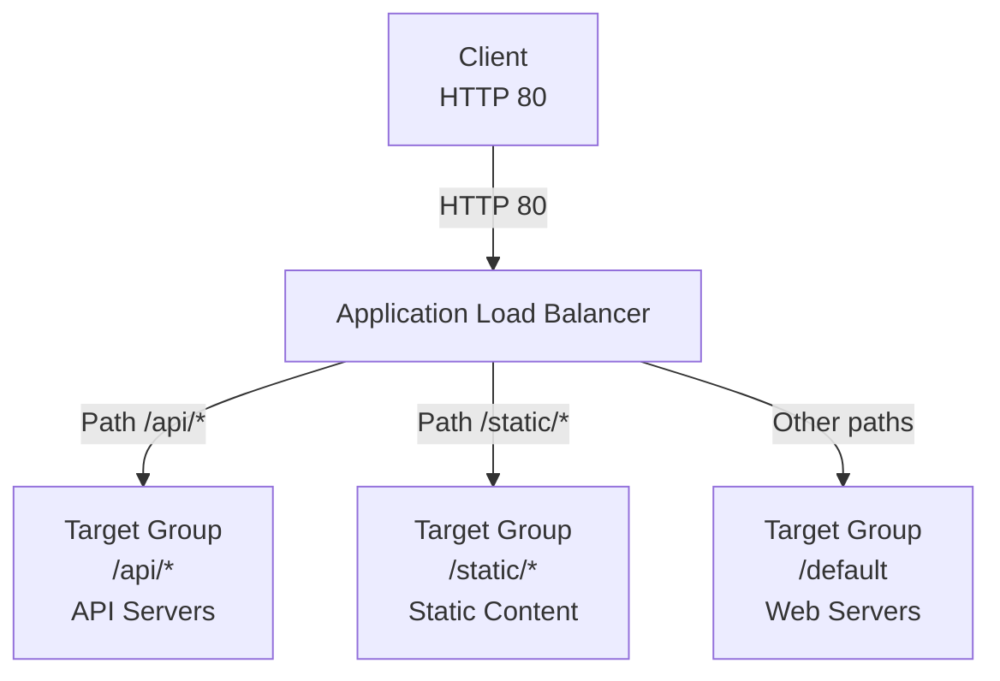

# Q4: Path-Based Routing with ALB

## Lab Overview
- **Difficulty:** Intermediate
- **Estimated Time:** 45-60 minutes
- **AWS Services:** ALB, EC2, Listener Rules, Target Groups
- **Region:** us-east-1
- **Skills Focus:** Advanced ALB routing, listener rules, path patterns, hostname routing

## Prerequisites Check
- [ ] Completed State-Level Q5 (ALB basics)
- [ ] Completed State++ Q2 (multi-AZ ALB)
- [ ] Understanding of ALB listener rules

## Learning Objectives
- Configure path-based routing (/api/*, /static/*)
- Implement hostname-based routing (api.example.com vs www.example.com)
- Route different traffic patterns to different target groups
- Use advanced rule conditions for traffic segmentation

## Architecture Overview


## Step-by-Step Console Instructions

### Step 1: Create Three Target Groups
**Console Navigation:** EC2 → Load Balancing → Target Groups

**Target Group 1: API**
1. Name: `practice-tg-api`
2. Protocol: HTTP, Port: 8080
3. VPC: practice-vpc-q1
4. Health check path: `/health`
5. Create

**Target Group 2: Static**
1. Name: `practice-tg-static`
2. Protocol: HTTP, Port: 8000
3. VPC: practice-vpc-q1
4. Health check path: `/`
5. Create

**Target Group 3: Web**
1. Name: `practice-tg-web`
2. Protocol: HTTP, Port: 80
3. VPC: practice-vpc-q1
4. Health check path: `/`
5. Create

[SCREENSHOT: Three target groups created]

### Step 2: Launch API Server
**Console Navigation:** EC2 → Instances → Launch

**Settings:**
1. Name: `practice-api-server`
2. AMI: Amazon Linux 2023
3. Instance Type: t2.micro
4. VPC: practice-vpc-q1
5. Subnet: practice-public-subnet-1a
6. Public IP: Enable
7. SG: Create or use existing with HTTP 80, 8080 allowed
8. User Data:
   ```bash
   #!/bin/bash
   yum update -y
   yum install -y python3
   cat > /tmp/api_server.py <<'EOF'
   from http.server import HTTPServer, BaseHTTPRequestHandler
   import json
   
   class APIHandler(BaseHTTPRequestHandler):
       def do_GET(self):
           if self.path == '/health':
               self.send_response(200)
               self.send_header('Content-Type', 'application/json')
               self.end_headers()
               self.wfile.write(json.dumps({"status": "healthy"}).encode())
           elif self.path.startswith('/api/'):
               self.send_response(200)
               self.send_header('Content-Type', 'application/json')
               self.end_headers()
               data = {"message": "API Response", "path": self.path}
               self.wfile.write(json.dumps(data).encode())
           else:
               self.send_response(404)
               self.end_headers()
   
   server = HTTPServer(('0.0.0.0', 8080), APIHandler)
   print("API Server running on port 8080")
   server.serve_forever()
   EOF
   
   python3 /tmp/api_server.py &
   disown
   ```
9. Launch and wait 2/2 checks

[SCREENSHOT: API server running]

### Step 3: Launch Static Content Server
**Console Navigation:** EC2 → Instances → Launch

**Settings:**
1. Name: `practice-static-server`
2. AMI: Amazon Linux 2023
3. Instance Type: t2.micro
4. VPC: practice-vpc-q1
5. Subnet: practice-public-subnet-1b
6. Public IP: Enable
7. SG: HTTP 8000 allowed
8. User Data:
   ```bash
   #!/bin/bash
   yum update -y
   python3 -m http.server 8000 --directory /tmp &
   mkdir -p /tmp/static
   cat > /tmp/static/style.css <<EOF
   body { background-color: #f0f0f0; }
   EOF
   cat > /tmp/static/script.js <<EOF
   console.log("Static content served");
   EOF
   disown
   ```
9. Launch and wait 2/2 checks

[SCREENSHOT: Static content server running]

### Step 4: Launch Web Server
**Console Navigation:** EC2 → Instances → Launch

**Settings:**
1. Name: `practice-web-server`
2. AMI: Amazon Linux 2023
3. Instance Type: t2.micro
4. VPC: practice-vpc-q1
5. Subnet: practice-public-subnet-1a
6. Public IP: Enable
7. SG: HTTP 80 allowed
8. User Data:
   ```bash
   #!/bin/bash
   yum update -y
   yum install -y httpd
   systemctl enable httpd
   systemctl start httpd
   cat > /var/www/html/index.html <<EOF
   <html>
   <h1>Welcome to Main Website</h1>
   <p>For API: <a href="/api/users">/api/users</a></p>
   <p>For Static: <a href="/static/style.css">/static/style.css</a></p>
   </html>
   EOF
   ```
9. Launch and wait 2/2 checks

[SCREENSHOT: All three servers running]

### Step 5: Register Targets to Target Groups
**Console Navigation:** EC2 → Target Groups

**For practice-tg-api:**
1. Register targets: practice-api-server (port 8080)

**For practice-tg-static:**
1. Register targets: practice-static-server (port 8000)

**For practice-tg-web:**
1. Register targets: practice-web-server (port 80)

Wait for all targets to show "Healthy"

[SCREENSHOT: All targets healthy across three TGs]

### Step 6: Create ALB with Single Listener
**Console Navigation:** EC2 → Load Balancers → Create

**Settings:**
1. Type: Application Load Balancer
2. Name: `practice-alb-path-routing`
3. Subnets: Both public subnets (1a, 1b)
4. SG: Allow HTTP 80 from 0.0.0.0/0
5. Listeners: HTTP 80
   - For now: Forward to default TG (will add rules next)
6. Create

Wait for Active status

[SCREENSHOT: ALB created and Active]

### Step 7: Create Path-Based Listener Rules
**Console Navigation:** EC2 → Load Balancers → practice-alb-path-routing → Listener Rules (HTTP 80)

**Add Rule 1: Path /api/*:**
1. Click "Add rule" or "Insert rule"
2. Condition Type: Path
3. Path pattern: `/api/*`
4. Forward to: practice-tg-api
5. Save

**Add Rule 2: Path /static/*:**
1. Click "Add rule"
2. Condition Type: Path
3. Path pattern: `/static/*`
4. Forward to: practice-tg-static
5. Save

**Default Rule (catch-all):**
1. Edit default forward rule
2. Forward to: practice-tg-web
3. Save

[SCREENSHOT: All three listener rules configured]

### Step 8: Verify ALB Rules Order
**Console Navigation:** EC2 → Load Balancers → practice-alb-path-routing → Rules (HTTP 80)

**Rule Priority (displayed in order):**
1. Rule 1: Path /api/* → practice-tg-api
2. Rule 2: Path /static/* → practice-tg-static
3. Default: → practice-tg-web

**Note:** ALB evaluates rules in order; first match wins

[SCREENSHOT: Listener rules in priority order]

### Step 9: Test Path-Based Routing
**Get ALB DNS Name:**

```bash
ALB_DNS="practice-alb-path-routing-123456789.us-east-1.elb.amazonaws.com"

# Test 1: Root path (should go to web server on port 80)
curl http://$ALB_DNS/
# Output: "Welcome to Main Website"

# Test 2: API path (should go to API server on port 8080)
curl http://$ALB_DNS/api/users
# Output: {"message": "API Response", "path": "/api/users"}

# Test 3: API health check (should go to API server)
curl http://$ALB_DNS/api/health
# Output: {"status": "healthy"}

# Test 4: Static path (should go to static server on port 8000)
curl http://$ALB_DNS/static/style.css
# Output: (CSS content)

# Test 5: Non-matching path (should go to web server default)
curl http://$ALB_DNS/about
# Output: "Welcome to Main Website"
```

[SCREENSHOT: curl tests showing different targets]

### Step 10: Add Hostname-Based Routing (Optional Advanced)
**Console Navigation:** EC2 → Load Balancers → practice-alb-path-routing → Rules

**Add New Listener (if using custom domain):**
1. **Prerequisite:** Have DNS or /etc/hosts entry for:
   - api.example.local
   - static.example.local
   - www.example.local

**Add Rule with Hostname:**
1. Condition: Host header
2. Value: `api.example.local`
3. Forward to: practice-tg-api
4. Save

Alternatively, edit existing path rules to include hostname conditions:
1. Existing rule: Path /api/* → practice-tg-api
2. Could add condition: AND Host header = api.example.local

[SCREENSHOT: Hostname-based rule added]

### Step 11: Monitor Target Health by Path
**Console Navigation:** EC2 → Target Groups

**For each TG, verify:**
1. Target group health: All targets showing Healthy
2. Registered targets: Correct port for each TG
3. Health check path: Specific to each service (/health for API, / for others)

[SCREENSHOT: Health checks passing for all three TGs]

## CLI Alternative

```bash
REGION=us-east-1

# Get VPC and subnets
VPC_ID=$(aws ec2 describe-vpcs --filters Name=tag:Name,Values=practice-vpc-q1 --query 'Vpcs[0].VpcId' --output text --region $REGION)
SUBNET_1A=$(aws ec2 describe-subnets --filters Name=cidr-block,Values=10.0.1.0/24 --query 'Subnets[0].SubnetId' --output text --region $REGION)
SUBNET_1B=$(aws ec2 describe-subnets --filters Name=cidr-block,Values=10.0.2.0/24 --query 'Subnets[0].SubnetId' --output text --region $REGION)

# 1. Create target groups
TG_API=$(aws elbv2 create-target-group \
  --name practice-tg-api \
  --protocol HTTP --port 8080 \
  --vpc-id $VPC_ID \
  --health-check-path /health \
  --query 'TargetGroups[0].TargetGroupArn' \
  --output text --region $REGION)

TG_STATIC=$(aws elbv2 create-target-group \
  --name practice-tg-static \
  --protocol HTTP --port 8000 \
  --vpc-id $VPC_ID \
  --query 'TargetGroups[0].TargetGroupArn' \
  --output text --region $REGION)

TG_WEB=$(aws elbv2 create-target-group \
  --name practice-tg-web \
  --protocol HTTP --port 80 \
  --vpc-id $VPC_ID \
  --query 'TargetGroups[0].TargetGroupArn' \
  --output text --region $REGION)

# 2. Get AMI and launch instances
AMI=$(aws ssm get-parameters --names /aws/service/ami-amazon-linux-latest/al2023-ami-minimal-kernel-default-x86_64 --query 'Parameters[0].Value' --output text --region $REGION)

API_INSTANCE=$(aws ec2 run-instances --image-id $AMI --instance-type t2.micro --subnet-id $SUBNET_1A --user-data file://userdata-api.sh --query 'Instances[0].InstanceId' --output text --region $REGION)
STATIC_INSTANCE=$(aws ec2 run-instances --image-id $AMI --instance-type t2.micro --subnet-id $SUBNET_1B --user-data file://userdata-static.sh --query 'Instances[0].InstanceId' --output text --region $REGION)
WEB_INSTANCE=$(aws ec2 run-instances --image-id $AMI --instance-type t2.micro --subnet-id $SUBNET_1A --user-data file://userdata-web.sh --query 'Instances[0].InstanceId' --output text --region $REGION)

echo "Waiting for instances..."
aws ec2 wait instance-running --instance-ids $API_INSTANCE $STATIC_INSTANCE $WEB_INSTANCE --region $REGION

# 3. Register targets
aws elbv2 register-targets --target-group-arn $TG_API --targets Id=$API_INSTANCE --region $REGION
aws elbv2 register-targets --target-group-arn $TG_STATIC --targets Id=$STATIC_INSTANCE --region $REGION
aws elbv2 register-targets --target-group-arn $TG_WEB --targets Id=$WEB_INSTANCE --region $REGION

# 4. Create SG and ALB
ALB_SG=$(aws ec2 create-security-group --group-name practice-alb-path-sg --description "ALB path routing" --vpc-id $VPC_ID --query 'GroupId' --output text --region $REGION)
aws ec2 authorize-security-group-ingress --group-id $ALB_SG --protocol tcp --port 80 --cidr 0.0.0.0/0 --region $REGION

ALB=$(aws elbv2 create-load-balancer \
  --name practice-alb-path-routing \
  --subnets $SUBNET_1A $SUBNET_1B \
  --security-groups $ALB_SG \
  --query 'LoadBalancers[0].LoadBalancerArn' \
  --output text --region $REGION)

ALB_DNS=$(aws elbv2 describe-load-balancers --load-balancer-arns $ALB --query 'LoadBalancers[0].DNSName' --output text --region $REGION)

# 5. Create listener
LISTENER=$(aws elbv2 create-listener \
  --load-balancer-arn $ALB \
  --protocol HTTP --port 80 \
  --default-actions Type=forward,TargetGroupArn=$TG_WEB \
  --query 'Listeners[0].ListenerArn' \
  --output text --region $REGION)

# 6. Add rules
aws elbv2 create-rule \
  --listener-arn $LISTENER \
  --priority 1 \
  --conditions Field=path-pattern,Values=/api/* \
  --actions Type=forward,TargetGroupArn=$TG_API \
  --region $REGION

aws elbv2 create-rule \
  --listener-arn $LISTENER \
  --priority 2 \
  --conditions Field=path-pattern,Values=/static/* \
  --actions Type=forward,TargetGroupArn=$TG_STATIC \
  --region $REGION

echo "ALB DNS: $ALB_DNS"
echo "Test: curl http://$ALB_DNS/api/users"
echo "Test: curl http://$ALB_DNS/static/style.css"
echo "Test: curl http://$ALB_DNS/"
```

## Verification Checklist

1. **Target Groups**
   - [ ] practice-tg-api: Port 8080, health check /health
   - [ ] practice-tg-static: Port 8000, health check /
   - [ ] practice-tg-web: Port 80, health check /
   - [ ] [SCREENSHOT: All TGs created]

2. **EC2 Instances**
   - [ ] API server running on port 8080
   - [ ] Static server running on port 8000
   - [ ] Web server running on port 80
   - [ ] All 2/2 status checks passing
   - [ ] [SCREENSHOT: Instances running]

3. **Targets Registered**
   - [ ] Each TG has correct target(s) registered
   - [ ] All targets showing Healthy status
   - [ ] Health checks succeeding (no errors)
   - [ ] [SCREENSHOT: Healthy targets for each TG]

4. **ALB Created**
   - [ ] Status: Active
   - [ ] Listener: HTTP 80
   - [ ] DNS name resolved
   - [ ] [SCREENSHOT: ALB details]

5. **Listener Rules**
   - [ ] Rule 1: /api/* → practice-tg-api
   - [ ] Rule 2: /static/* → practice-tg-static
   - [ ] Default: → practice-tg-web
   - [ ] Rules in correct priority order
   - [ ] [SCREENSHOT: All rules configured]

6. **Path Routing Tests**
   - [ ] curl / returns "Welcome to Main Website"
   - [ ] curl /api/users returns API JSON response
   - [ ] curl /api/health returns {"status": "healthy"}
   - [ ] curl /static/style.css returns CSS content
   - [ ] curl /about returns web server response (default)
   - [ ] [SCREENSHOT: All curl tests passing]

7. **DNS Resolution**
   - [ ] nslookup shows ALB IP
   - [ ] DNS propagated within 2-3 minutes
   - [ ] [SCREENSHOT: DNS resolution]

## Troubleshooting Guide

- **Path rules not matching (all requests go to default)**
  - Cause: Path pattern syntax wrong (e.g., missing trailing *) or rule priority incorrect
  - Fix: Verify pattern: `/api/*` not `/api`; check rule priority order (1, 2, default)

- **Wrong target receiving traffic**
  - Cause: Rule priority reversed or SG not allowing traffic from ALB
  - Fix: Check rule priority; verify each SG allows traffic from ALB SG on correct port

- **Target showing Unhealthy**
  - Cause: Service not running on specified port; health check path wrong
  - Fix: SSH to instance, verify service running: `curl http://localhost:8080/health`

- **ALB returning 504 Gateway Timeout**
  - Cause: All targets unhealthy or service very slow
  - Fix: Check target health status; restart services on instances

- **Rules not applying (old behavior)**
  - Cause: ALB caching or listener not updated
  - Fix: Wait 5-10 seconds after rule change; refresh console

- **Multiple paths matching same target (collision)**
  - Cause: Rules not specific enough (e.g., `/api*` matches `/api`, `/apply`, `/apples`)
  - Fix: Use exact pattern: `/api/*` (requires trailing slash after /api)

## Cleanup Instructions

1. Delete ALB
2. Delete all target groups
3. Terminate EC2 instances
4. Delete security groups

```bash
aws elbv2 delete-load-balancer --load-balancer-arn $ALB --region $REGION
sleep 30
aws elbv2 delete-target-group --target-group-arn $TG_API --region $REGION
aws elbv2 delete-target-group --target-group-arn $TG_STATIC --region $REGION
aws elbv2 delete-target-group --target-group-arn $TG_WEB --region $REGION
aws ec2 terminate-instances --instance-ids $API_INSTANCE $STATIC_INSTANCE $WEB_INSTANCE --region $REGION
aws ec2 delete-security-group --group-id $ALB_SG --region $REGION
```

## Mark Mapping (Exam Scoring)

| Task | Marks | Criteria | Your Score |
|------|-------|----------|------------|
| Target groups | 3 | Three TGs with correct ports and health checks | [ ] |
| EC2 servers | 3 | API/static/web servers on correct ports | [ ] |
| Target registration | 2 | Targets registered to correct TGs | [ ] |
| ALB creation | 2 | Active, internet-facing, subnets correct | [ ] |
| Path-based rules | 3 | /api/* and /static/* rules created | [ ] |
| Rule priority | 2 | Rules in correct order; default last | [ ] |
| Path routing | 3 | Each path correctly routed to TG | [ ] |
| Target health | 2 | All targets Healthy for their paths | [ ] |
| **Total** | **20** | | **[ ]** |

## Key Takeaways
- **Path-based routing:** ALB matches path patterns in order; first match wins
- **Wildcard patterns:** Use `/path/*` for prefix matching; exact matches without *
- **Multiple TGs:** Each path pattern can point to different target group (different ports, instances)
- **Health check specificity:** Each TG can have different health check path
- **Rule priority:** ALB evaluates rules 1, 2, 3..., then default; reorder via console

## Next Steps
- Progress to State++ Q5: ElastiCache failover testing
- Explore hostname-based routing for multi-tenant applications
- Advanced: Combine path + hostname conditions

## Related Resources
- State-Level Q5: `file:aws-worldskills-notes/practice/state_level/q5_alb_basic.md`
- ALB listener rules: https://docs.aws.amazon.com/elasticloadbalancing/latest/application/listener-update-rules.html
- Path patterns: https://docs.aws.amazon.com/elasticloadbalancing/latest/application/listener-update-rules.html#modify-rules
