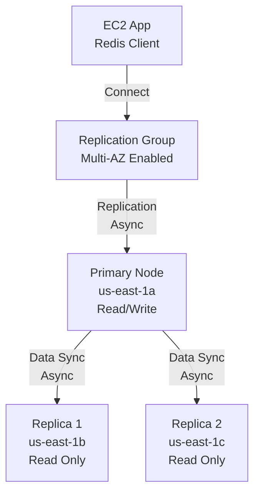

# Q5: ElastiCache Redis Failover & Replication

## Lab Overview
- **Difficulty:** Intermediate
- **Estimated Time:** 60-75 minutes
- **AWS Services:** ElastiCache, EC2, Redis, CloudWatch
- **Region:** us-east-1
- **Skills Focus:** Replication groups, failover testing, read replicas, monitoring

## Prerequisites Check
- [ ] Completed State-Level Q6 (basic Redis)
- [ ] Understanding of cache failover behavior
- [ ] redis-cli familiarity

## Learning Objectives
- Deploy Redis replication group with Multi-AZ failover
- Test automatic failover mechanism
- Monitor replica synchronization
- Understand RPO/RTO for caching tier
- Configure read-only replicas

## Architecture Overview


## Step-by-Step Console Instructions

### Step 1: Create Private Subnets in Third AZ (Optional)
**Console Navigation:** VPC → Subnets

**Already have subnets from previous labs:**
- 10.0.11.0/24 (us-east-1a) - private
- 10.0.12.0/24 (us-east-1b) - private

**Optional: Create third subnet for third replica:**
- 10.0.13.0/24 (us-east-1c) - private

For this lab, using 2 AZs is sufficient.

[SCREENSHOT: Private subnets ready]

### Step 2: Create ElastiCache Subnet Group
**Console Navigation:** ElastiCache → Subnet Groups

**Create DB Subnet Group:**
1. Name: `practice-redis-subnet-group-multi`
2. Description: "Multi-AZ Redis subnet group"
3. VPC: practice-vpc-q1
4. Subnets: Select both private subnets
   - 10.0.11.0/24 (us-east-1a)
   - 10.0.12.0/24 (us-east-1b)
5. Create

[SCREENSHOT: Subnet group with both AZs]

### Step 3: Create Security Group for Redis
**Console Navigation:** EC2 → Security Groups

**Create SG:**
1. Name: `practice-redis-multi-sg`
2. VPC: practice-vpc-q1
3. Inbound Rule:
   - Protocol: TCP
   - Port: 6379
   - Source: practice-app-sg (or your EC2 security group)
4. Create

[SCREENSHOT: Redis security group]

### Step 4: Create Redis Replication Group
**Console Navigation:** ElastiCache → Redis Clusters → Create cluster

**Settings:**
1. Cluster mode: Disabled (single node design)
2. Name: `practice-redis-replication-multi`
3. Engine: Redis
4. Engine version: 7.0 (latest stable)
5. Node type: cache.t3.micro (Free Tier first 12 months)
6. Number of replicas: **2** (for Multi-AZ failover)
   - This creates: 1 Primary + 2 Replicas
7. Subnet group: practice-redis-subnet-group-multi
8. Security group: practice-redis-multi-sg
9. **Multi-AZ:** Enable automatic failover (checkbox)
10. **Backup & Maintenance:**
    - Automatic backups: Disable (adds cost)
    - Maintenance window: anytime
11. Create

Wait for cluster to be "Available" (5-10 minutes)

[SCREENSHOT: Replication group creation in progress]

### Step 5: Verify Replication Group Status
**Console Navigation:** ElastiCache → Redis Clusters → practice-redis-replication-multi

**Check Details:**
1. Status: Available
2. Cluster mode: Disabled
3. Number of replicas: 2
4. Multi-AZ: Automatic failover enabled
5. Nodes section:
   - Primary node: us-east-1a (role: primary)
   - Replica 1: us-east-1b (role: replica)
   - Replica 2: us-east-1b (role: replica)
6. Primary endpoint: `practice-redis-replication-multi.xxxxx.cache.amazonaws.com:6379`
7. Reader endpoint: `practice-redis-replication-multi-ro.xxxxx.cache.amazonaws.com:6379`

[SCREENSHOT: Replication group details showing primary + replicas]

### Step 6: Launch EC2 Redis Client
**Console Navigation:** EC2 → Instances → Launch

**Settings:**
1. Name: `practice-redis-client-multi`
2. AMI: Amazon Linux 2023
3. Instance Type: t2.micro
4. VPC: practice-vpc-q1
5. Subnet: practice-public-subnet-1a (or any public subnet)
6. Public IP: Enable
7. SG: practice-app-sg (SSH + outbound)
8. User Data:
   ```bash
   #!/bin/bash
   yum update -y
   yum install -y gcc make
   
   # Download and compile redis-cli
   cd /tmp
   wget https://github.com/redis/redis/archive/7.0.tar.gz
   tar xzf 7.0.tar.gz
   cd redis-7.0
   make
   cp src/redis-cli /usr/local/bin/
   ```
9. Tags: Name = practice-redis-client-multi
10. Launch and wait 2/2 checks

[SCREENSHOT: EC2 instance running]

### Step 7: Connect to Primary and Insert Data
**SSH to EC2 instance:**

```bash
ssh -i your-key.pem ec2-user@<public-ip>

# Get primary endpoint
REDIS_PRIMARY="practice-redis-replication-multi.xxxxx.cache.amazonaws.com"

# Connect to primary (write endpoint)
redis-cli -h $REDIS_PRIMARY -p 6379

# Test connectivity
redis-cli -h $REDIS_PRIMARY PING
# Output: PONG

# Insert test data
redis-cli -h $REDIS_PRIMARY SET counter 100
redis-cli -h $REDIS_PRIMARY SET message "Hello Replication"
redis-cli -h $REDIS_PRIMARY HSET user:1 name "Alice" email "alice@example.com"

# Verify data
redis-cli -h $REDIS_PRIMARY GET counter
# Output: "100"

redis-cli -h $REDIS_PRIMARY HGETALL user:1
# Output: name, Alice, email, alice@example.com
```

[SCREENSHOT: Redis CLI with inserted data]

### Step 8: Read from Replica Using Reader Endpoint
**On same EC2 instance:**

```bash
# Get reader endpoint (read-only)
REDIS_READER="practice-redis-replication-multi-ro.xxxxx.cache.amazonaws.com"

# Connect to read-only endpoint (distributed across replicas)
redis-cli -h $REDIS_READER -p 6379 GET counter
# Output: "100" (replicated from primary)

redis-cli -h $REDIS_READER -p 6379 HGETALL user:1
# Output: alice, alice@example.com (same data)

# Verify we can't write to replica (read-only)
redis-cli -h $REDIS_READER -p 6379 SET readonly-test "should fail"
# Output: READONLY You can't write against a read only replica.
```

[SCREENSHOT: Reading from replica endpoint]

### Step 9: Monitor Replication Lag
**Check Replication Status:**

```bash
# Connect to primary
redis-cli -h $REDIS_PRIMARY -p 6379 INFO replication

# Output includes:
# role:master
# connected_slaves:2
# slave0:ip=10.0.12.x,port=6379,state=online,offset=xxxxx
# slave1:ip=10.0.12.y,port=6379,state=online,offset=xxxxx
# replication_backlog_size:1048576
```

[SCREENSHOT: INFO replication output]

### Step 10: Simulate Failover (CloudWatch Monitoring)
**Console Navigation:** CloudWatch → Metrics → ElastiCache

**Before Failover:**
1. Note Primary node ID and AZ
2. Monitor: "EngineCPUUtilization" (should be near 0%)
3. Monitor: "SwapUsage" (should be 0)
4. Monitor: "ReplicationLag" (should be near 0)

**Trigger Failover:**
1. ElastiCache → Replication Groups → practice-redis-replication-multi
2. Click "Reboot" or Actions → Failover
3. Confirm failover
4. Monitor cluster status (should show "Rebooting")

[SCREENSHOT: Failover initiated]

### Step 11: Verify Failover Completed
**After 2-3 minutes:**

```bash
# Check if replica promoted to primary
redis-cli -h $REDIS_PRIMARY -p 6379 INFO replication

# Output should show:
# role:master (but different node than before)
# connected_slaves:2 (system reelected primary and rebuilds replicas)

# Verify data still intact
redis-cli -h $REDIS_PRIMARY -p 6379 GET counter
# Output: "100" (data preserved)

redis-cli -h $REDIS_PRIMARY -p 6379 GET message
# Output: "Hello Replication"
```

[SCREENSHOT: Redis still available after failover]

### Step 12: Monitor Failover in CloudWatch
**Console Navigation:** CloudWatch → Metrics → ElastiCache → practice-redis-replication-multi

**Observations During Failover:**
1. Metrics drop to 0 during failover (40-90 seconds typical)
2. After failover completes:
   - CPU usage may spike briefly
   - Memory usage stable
   - Replication lag returns to 0
3. Timeline view shows exact failover moment

[SCREENSHOT: CloudWatch metrics showing failover event]

## CLI Alternative

```bash
REGION=us-east-1

# 1. Create subnet group
SUBNET_GROUP=$(aws elasticache create-cache-subnet-group \
  --cache-subnet-group-name practice-redis-subnet-group-multi \
  --cache-subnet-group-description "Multi-AZ Redis" \
  --subnet-ids subnet-11111111 subnet-22222222 \
  --region $REGION \
  --output text)

# 2. Get SG ID
SG_ID=$(aws ec2 create-security-group \
  --group-name practice-redis-multi-sg \
  --description "Redis Multi-AZ SG" \
  --vpc-id $VPC_ID \
  --query 'GroupId' \
  --output text \
  --region $REGION)

aws ec2 authorize-security-group-ingress \
  --group-id $SG_ID \
  --protocol tcp --port 6379 --cidr 10.0.0.0/16 \
  --region $REGION

# 3. Create replication group
aws elasticache create-replication-group \
  --replication-group-id practice-redis-replication-multi \
  --replication-group-description "Redis replication with failover" \
  --engine redis \
  --engine-version 7.0 \
  --cache-node-type cache.t3.micro \
  --num-cache-clusters 3 \
  --automatic-failover-enabled \
  --multi-az \
  --cache-subnet-group-name practice-redis-subnet-group-multi \
  --security-group-ids $SG_ID \
  --region $REGION

echo "Waiting for replication group..."
aws elasticache wait replication-group-available \
  --replication-group-id practice-redis-replication-multi \
  --region $REGION

# 4. Get endpoint
aws elasticache describe-replication-groups \
  --replication-group-id practice-redis-replication-multi \
  --query 'ReplicationGroups[0].[PrimaryEndpoint.Address,ReaderEndpoint.Address]' \
  --region $REGION

# 5. Trigger failover
aws elasticache test-failover \
  --replication-group-id practice-redis-replication-multi \
  --node-group-id-to-test 0 \
  --region $REGION

echo "Failover in progress... (60-90 seconds)"
```

## Verification Checklist

1. **Replication Group Deployed**
   - [ ] Status: Available
   - [ ] Engine: Redis 7.0
   - [ ] Cluster mode: Disabled
   - [ ] Number of replicas: 2
   - [ ] Multi-AZ: Automatic failover enabled
   - [ ] [SCREENSHOT: Replication group details]

2. **Nodes Across AZs**
   - [ ] Primary: us-east-1a
   - [ ] Replica 1: us-east-1b or 1c
   - [ ] Replica 2: us-east-1b or 1c
   - [ ] All nodes: Available
   - [ ] [SCREENSHOT: Node list]

3. **Endpoints**
   - [ ] Primary endpoint: Accessible
   - [ ] Reader endpoint: Returns read-only responses
   - [ ] Both resolve to cache IPs
   - [ ] [SCREENSHOT: Endpoints in console]

4. **EC2 Client**
   - [ ] Instance running with redis-cli installed
   - [ ] Public IP accessible
   - [ ] [SCREENSHOT: EC2 instance]

5. **Data Replication**
   - [ ] SET on primary successful
   - [ ] GET from reader endpoint returns same data
   - [ ] HSET/HGETALL works across primary and replica
   - [ ] [SCREENSHOT: Redis CLI showing replicated data]

6. **Replica Read-Only**
   - [ ] Write attempt to reader endpoint: READONLY error
   - [ ] Primary endpoint accepts writes
   - [ ] [SCREENSHOT: READONLY error]

7. **Replication Monitoring**
   - [ ] INFO replication shows 2 connected slaves
   - [ ] Replication offset increasing
   - [ ] Slave state: online
   - [ ] [SCREENSHOT: INFO replication output]

8. **Failover Test**
   - [ ] Failover triggered and completed
   - [ ] Cluster recovered in 2-3 minutes
   - [ ] Data still accessible post-failover
   - [ ] New primary elected from replicas
   - [ ] [SCREENSHOT: Failover successful, data intact]

9. **CloudWatch Metrics**
   - [ ] Pre-failover: CPU~0%, Connections stable
   - [ ] During failover: Metrics drop briefly
   - [ ] Post-failover: Metrics return to normal
   - [ ] [SCREENSHOT: CloudWatch timeline]

## Troubleshooting Guide

- **Replicas showing Unhealthy**
  - Cause: SG not allowing 6379 from nodes to each other; network issue
  - Fix: Update SG to allow 6379 from VPC CIDR (10.0.0.0/16); check subnet group has both AZs

- **Failover taking too long (>5 minutes)**
  - Cause: Large dataset; slow network
  - Fix: Normal for lab; in production, typical 60-90 seconds; can retry

- **Data loss after failover**
  - Cause: Should not happen in Redis cluster mode disabled; check if async replication had lag
  - Fix: Verify replication lag was near 0 before failover; consider enabling backup

- **Cannot connect after failover**
  - Cause: Endpoint IP changed; client still trying old primary
  - Fix: Use DNS endpoint (always points to current primary); avoid caching IPs in code

- **Reader endpoint always returns same replica**
  - Cause: Normal; reader endpoint load balances across replicas
  - Fix: For load testing, use individual replica endpoints if needed

- **Replication lag high (>1000ms)**
  - Cause: High write volume; slow network
  - Fix: For practice, lag should be <10ms; monitor with CloudWatch

- **Automatic failover not triggering**
  - Cause: Multi-AZ might be disabled; failover type might be manual
  - Fix: Verify "Automatic failover" enabled in replication group; try explicit failover

## Cleanup Instructions

1. Delete replication group (wait for replicas to terminate)
2. Delete subnet group
3. Delete security group
4. Terminate EC2 client
5. Release Elastic IPs (if any)

```bash
aws elasticache delete-replication-group \
  --replication-group-id practice-redis-replication-multi \
  --retain-primary-cluster \
  --region $REGION

aws elasticache delete-cache-subnet-group \
  --cache-subnet-group-name practice-redis-subnet-group-multi \
  --region $REGION

aws ec2 delete-security-group --group-id $SG_ID --region $REGION
aws ec2 terminate-instances --instance-ids $CLIENT_INSTANCE --region $REGION
```

## Mark Mapping (Exam Scoring)

| Task | Marks | Criteria | Your Score |
|------|-------|----------|------------|
| Replication group | 3 | Multi-AZ, 2+ replicas, automatic failover | [ ] |
| Subnet group | 2 | Both AZs represented | [ ] |
| Security group | 2 | Port 6379 open from VPC | [ ] |
| Data replication | 3 | Primary writes replicated to replicas | [ ] |
| Reader endpoint | 2 | Read-only, returns replicated data | [ ] |
| Write rejection | 2 | Reader endpoint rejects SET commands | [ ] |
| Failover test | 3 | Automatic failover completes, data intact | [ ] |
| Monitoring | 2 | CloudWatch shows failover event | [ ] |
| **Total** | **19** | | **[ ]** |

## Key Takeaways
- **Replication provides HA:** Primary failure triggers automatic failover to replica in different AZ
- **Async replication:** Data reaches replicas in milliseconds; small lag window possible
- **Reader endpoint:** Distributes read traffic across replicas; primary always for writes
- **RTO:** Recovery Time Objective ~60-90 seconds for automatic failover
- **No data loss guarantee:** In-memory cache; async replication means last writes might be lost on unplanned failure

## Next Steps
- Progress to State++ Q6: Cost-optimized multi-tier architecture
- Explore Redis Cluster mode (sharding) for horizontal scaling
- Review ElastiCache backup and restore patterns

## Related Resources
- State-Level Q6 (basic Redis): `file:aws-worldskills-notes/practice/state_level/q6_redis_perf.md`
- ElastiCache replication: https://docs.aws.amazon.com/AmazonElastiCache/latest/red-ug/Replication.html
- Failover behavior: https://docs.aws.amazon.com/AmazonElastiCache/latest/red-ug/AutoFailover.html
