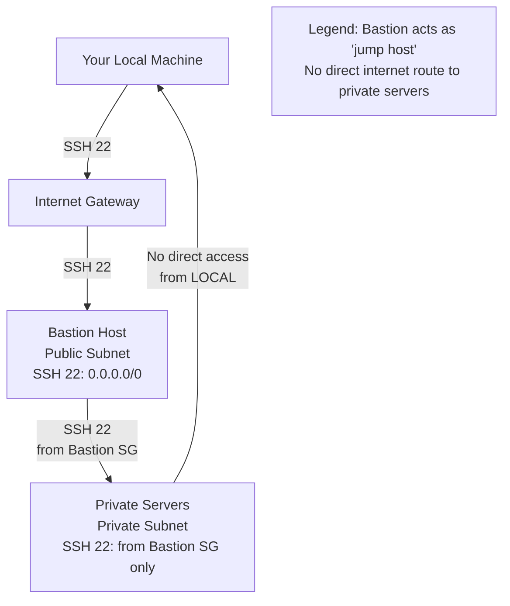

# Q7: Bastion Host & Private Subnet Access Patterns

## Lab Overview
- **Difficulty:** Intermediate
- **Estimated Time:** 50-60 minutes
- **AWS Services:** EC2, VPC, Security Groups, Systems Manager Session Manager
- **Region:** us-east-1
- **Skills Focus:** Bastion patterns, secure access, IAM role-based access, jump hosts

## Prerequisites Check
- [ ] Completed State-Level Q1, Q2 (VPC, EC2, SSH)
- [ ] Completed State++ Q1 (multi-tier, NAT)
- [ ] Understanding of public vs private subnets
- [ ] Understanding of IAM roles

## Learning Objectives
- Deploy bastion host for private subnet access
- Configure jump host (SSH through bastion)
- Use Systems Manager Session Manager (no SSH key needed)
- Implement least-privilege security group chaining
- Compare bastion vs SSM Session Manager patterns

## Architecture Overview


## Step-by-Step Console Instructions

### Step 1: Create VPC and Subnets (Review or Create)
**Prerequisite:** Should have from Q1/Q++1
- VPC: 10.0.0.0/16
- Public subnet: 10.0.1.0/24 (us-east-1a)
- Private subnet: 10.0.11.0/24 (us-east-1a or different)

[SCREENSHOT: VPC with public and private subnets]

### Step 2: Create Bastion Security Group
**Console Navigation:** EC2 → Security Groups

**Settings:**
1. Name: `practice-bastion-secure-sg`
2. VPC: practice-vpc-q1
3. **Inbound Rules:**
   - SSH port 22 from 0.0.0.0/0 (or your IP/32 for production)
   - HTTP port 80 from 0.0.0.0/0 (optional for testing)
4. **Outbound Rules:**
   - All traffic to 0.0.0.0/0 (needed for bastion to connect to internet/private servers)
5. Create

[SCREENSHOT: Bastion SG with SSH rule from 0.0.0.0/0]

### Step 3: Create Private Servers Security Group
**Console Navigation:** EC2 → Security Groups

**Settings:**
1. Name: `practice-private-secure-sg`
2. VPC: practice-vpc-q1
3. **Inbound Rules:**
   - SSH port 22 from `practice-bastion-secure-sg` (source-group ID)
   - Port 5432 (PostgreSQL) from same SG (for inter-server communication)
4. **Outbound Rules:**
   - All traffic to 0.0.0.0/0 (allows downloads, updates)
5. Create

[SCREENSHOT: Private SG with source-group ingress rule]

### Step 4: Launch Bastion Host
**Console Navigation:** EC2 → Instances → Launch

**Settings:**
1. Name: `practice-bastion-secure`
2. AMI: Amazon Linux 2023 (or Ubuntu 22.04)
3. Instance Type: t2.micro
4. VPC: practice-vpc-q1
5. Subnet: practice-public-subnet-1a
6. Auto-assign Public IP: **Enable** (bastion must be reachable from internet)
7. Security Group: practice-bastion-secure-sg
8. Key Pair: Create or use existing `practice-bastion-secure-key`
9. **User Data:** (optional - bastion can be minimal)
   ```bash
   #!/bin/bash
   yum update -y
   # Install tools for jump host
   yum install -y tmux vim curl
   ```
10. Tags: Name = practice-bastion-secure
11. Launch and wait 2/2 status checks

[SCREENSHOT: Bastion instance running with public IP]

### Step 5: Launch Private Server #1
**Console Navigation:** EC2 → Instances → Launch

**Settings:**
1. Name: `practice-private-server-1`
2. AMI: Amazon Linux 2023
3. Instance Type: t2.micro
4. VPC: practice-vpc-q1
5. Subnet: practice-private-subnet-1a (10.0.11.0/24)
6. Auto-assign Public IP: **Disable** (must be private)
7. Security Group: practice-private-secure-sg
8. Key Pair: **Same key as bastion** (`practice-bastion-secure-key`)
9. **User Data:**
   ```bash
   #!/bin/bash
   yum update -y
   yum install -y postgresql-client mysql-client
   # Create marker file to prove we accessed it
   echo "Private Server 1 - $(date)" > /tmp/server-info.txt
   ```
10. Tags: Name = practice-private-server-1
11. Launch and wait 2/2 status checks

**Record:** Private IP address (e.g., 10.0.11.x)

[SCREENSHOT: Private server running without public IP]

### Step 6: Copy SSH Key to Bastion
**From your local machine:**

```bash
# 1. SSH to bastion
ssh -i practice-bastion-secure-key.pem ec2-user@<bastion-public-ip>

# 2. Create .ssh directory on bastion
mkdir -p ~/.ssh
chmod 700 ~/.ssh

# 3. Exit bastion (back to local)
exit

# 4. Copy private key to bastion
scp -i practice-bastion-secure-key.pem \
    practice-bastion-secure-key.pem \
    ec2-user@<bastion-public-ip>:~/.ssh/

# 5. SSH back to bastion and set permissions
ssh -i practice-bastion-secure-key.pem ec2-user@<bastion-public-ip>

# 6. On bastion, set key permissions
chmod 600 ~/.ssh/practice-bastion-secure-key.pem

# 7. Verify key works from bastion
ssh -i ~/.ssh/practice-bastion-secure-key.pem ec2-user@10.0.11.x
# Should succeed - now on private server
```

[SCREENSHOT: SSH prompt showing private server hostname (e.g., ip-10-0-11-x)]

### Step 7: Test Bastion Jump Host (SSH Tunneling)
**Advanced Option - From local machine directly:**

```bash
# Method 1: SSH through bastion via ProxyCommand
ssh -i practice-bastion-secure-key.pem \
    -o ProxyCommand="ssh -i practice-bastion-secure-key.pem \
                     -W %h:%p \
                     ec2-user@<bastion-public-ip>" \
    ec2-user@10.0.11.x

# Method 2: Using ssh_config file
cat > ~/.ssh/config <<EOF
Host bastion
    HostName <bastion-public-ip>
    User ec2-user
    IdentityFile ~/.ssh/practice-bastion-secure-key.pem

Host private
    HostName 10.0.11.x
    User ec2-user
    IdentityFile ~/.ssh/practice-bastion-secure-key.pem
    ProxyJump bastion
EOF

ssh private
```

[SCREENSHOT: SSH through bastion successful]

### Step 8: Test Private-to-Private Communication
**From private server #1:**

```bash
# Already connected from Step 7
[ec2-user@ip-10-0-11-x ~]$ 

# Ping bastion (public IP not reachable from private)
ping <bastion-public-ip>
# No response - expected (private subnet has no internet route)

# Ping bastion via private IP (if in same VPC)
ping 10.0.1.x
# Should respond - same VPC connectivity

# Test access to private server #2 (if created)
ssh 10.0.11.y
# Should work - both in private subnets with source-group rule
```

[SCREENSHOT: Ping and SSH between private servers]

### Step 9: Deploy AWS Systems Manager Session Manager (Alternative)
**Prerequisites:**
1. EC2 instances have IAM role with `AmazonSSMManagedInstanceCore` policy
2. Systems Manager agent already installed on Amazon Linux 2023 (default)

**Console Navigation:** Systems Manager → Session Manager

**Start Session:**
1. Click "Start session"
2. Select target: practice-private-server-1
3. Start session

**No SSH key needed! Direct shell access to private instance.**

[SCREENSHOT: Session Manager started on private instance]

### Step 10: Compare Access Methods
**Console Navigation:** Compare use cases

| Method | Pros | Cons | Best For |
|--------|------|------|----------|
| **Bastion Jump Host** | Traditional SSH; audit logs; VPN can tunnel traffic | SSH key management; bastion costs $; IP whitelist on bastion | Legacy systems, existing SSH workflows |
| **AWS Systems Manager** | No SSH key; IAM-based; CloudTrail logs; no public IP needed | Requires IAM role; Systems Manager agent on instance; ~$0.30/month costs | Modern AWS workloads, sensitive environments |
| **VPN** (not in this lab) | All traffic encrypted; transparent to applications | Complex setup; higher latency; dedicated connection cost | Site-to-site connectivity, full network access |
| **Direct Public IP** | Simple, direct access | No HA; security risk; expensive EIP | Dev only, never production |

[SCREENSHOT: Comparison table]

### Step 11: Configure Bastion Security Hardening
**On Bastion (SSH connected):**

```bash
# 1. Check who's logged in
w
last

# 2. Review sshd configuration
sudo cat /etc/ssh/sshd_config | grep -E "^[^#]" | head -20

# 3. Recommended hardening (production):
sudo sed -i 's/#PermitRootLogin yes/PermitRootLogin no/' /etc/ssh/sshd_config
sudo sed -i 's/#PasswordAuthentication yes/PasswordAuthentication no/' /etc/ssh/sshd_config
sudo systemctl restart sshd

# 4. Check firewall rules
sudo iptables -L -n

# 5. Enable system logging
sudo systemctl status rsyslog
```

[SCREENSHOT: SSH config hardening]

### Step 12: Monitor Bastion Access
**Console Navigation:** EC2 Instance Connect (or CloudWatch Logs)

**Alternative: Enable VPC Flow Logs to track traffic**

**Console Navigation:** VPC → Flow Logs

**Create Flow Log:**
1. Resource type: Network Interface
2. Filter: Accept or Reject (to see denied connections)
3. Destination: CloudWatch Logs or S3
4. Log group: `/aws/vpc/flowlogs/bastion`
5. Create

**Query Flow Logs:**
```bash
# Bastion ACCEPT traffic (successful connections)
[version, account, eni, source, destination, srcport, destport="22", protocol="6", packets, bytes, windowstart, windowend, action="ACCEPT", flowlogstatus]

# Denied SSH attempts (security events)
[version, account, eni, source, destination, srcport, destport="22", action="REJECT"]
```

[SCREENSHOT: VPC Flow Logs for bastion connections]

## CLI Alternative

```bash
REGION=us-east-1

# 1. Create security groups
BASTION_SG=$(aws ec2 create-security-group \
  --group-name practice-bastion-secure-sg \
  --description "Bastion jump host" \
  --vpc-id $VPC_ID \
  --query 'GroupId' \
  --output text \
  --region $REGION)

PRIVATE_SG=$(aws ec2 create-security-group \
  --group-name practice-private-secure-sg \
  --description "Private servers accessed via bastion" \
  --vpc-id $VPC_ID \
  --query 'GroupId' \
  --output text \
  --region $REGION)

# 2. Configure inbound rules
aws ec2 authorize-security-group-ingress \
  --group-id $BASTION_SG \
  --protocol tcp --port 22 --cidr 0.0.0.0/0 \
  --region $REGION

aws ec2 authorize-security-group-ingress \
  --group-id $PRIVATE_SG \
  --protocol tcp --port 22 --source-group $BASTION_SG \
  --region $REGION

# 3. Get AMI and launch bastion
AMI=$(aws ssm get-parameters --names /aws/service/ami-amazon-linux-latest/al2023-ami-minimal-kernel-default-x86_64 --query 'Parameters[0].Value' --output text --region $REGION)

BASTION_ID=$(aws ec2 run-instances \
  --image-id $AMI \
  --instance-type t2.micro \
  --subnet-id $SUBNET_PUBLIC_1A \
  --security-group-ids $BASTION_SG \
  --key-name practice-bastion-secure-key \
  --associate-public-ip-address \
  --tag-specifications ResourceType=instance,Tags=[{Key=Name,Value=practice-bastion-secure}] \
  --query 'Instances[0].InstanceId' \
  --output text \
  --region $REGION)

# 4. Launch private server
PRIVATE_ID=$(aws ec2 run-instances \
  --image-id $AMI \
  --instance-type t2.micro \
  --subnet-id $SUBNET_PRIVATE_1A \
  --security-group-ids $PRIVATE_SG \
  --key-name practice-bastion-secure-key \
  --no-associate-public-ip-address \
  --tag-specifications ResourceType=instance,Tags=[{Key=Name,Value=practice-private-server-1}] \
  --query 'Instances[0].InstanceId' \
  --output text \
  --region $REGION)

echo "Waiting for instances..."
aws ec2 wait instance-running --instance-ids $BASTION_ID $PRIVATE_ID --region $REGION

# 5. Get IPs
BASTION_IP=$(aws ec2 describe-instances --instance-ids $BASTION_ID --query 'Reservations[0].Instances[0].PublicIpAddress' --output text --region $REGION)
PRIVATE_IP=$(aws ec2 describe-instances --instance-ids $PRIVATE_ID --query 'Reservations[0].Instances[0].PrivateIpAddress' --output text --region $REGION)

echo "Bastion public IP: $BASTION_IP"
echo "Private server private IP: $PRIVATE_IP"
```

## Verification Checklist

1. **Security Groups**
   - [ ] Bastion SG: SSH 22 from 0.0.0.0/0
   - [ ] Private SG: SSH 22 from Bastion SG (source-group)
   - [ ] [SCREENSHOT: Both SGs with correct rules]

2. **Bastion Instance**
   - [ ] Running with public IP assigned
   - [ ] SSH accessible from local machine
   - [ ] 2/2 status checks passing
   - [ ] [SCREENSHOT: Bastion details]

3. **Private Server**
   - [ ] Running without public IP
   - [ ] No direct internet access (ping public fails)
   - [ ] 2/2 status checks passing
   - [ ] [SCREENSHOT: Private server details]

4. **SSH Key on Bastion**
   - [ ] Private key copied to bastion ~/.ssh/
   - [ ] Permissions: 600 (`chmod 600`)
   - [ ] Directory permissions: 700
   - [ ] [SCREENSHOT: ls -la ~/.ssh/ on bastion]

5. **Bastion Jump Host Test**
   - [ ] SSH through bastion to private: Success
   - [ ] ProxyCommand works: Success
   - [ ] ssh_config ProxyJump works: Success
   - [ ] [SCREENSHOT: SSH prompt on private server]

6. **Private Server Connectivity**
   - [ ] ping to bastion private IP: Success
   - [ ] Access to other private servers: Success (if multiple)
   - [ ] Cannot ping bastion public IP (expected): Confirmed
   - [ ] [SCREENSHOT: Ping between private servers]

7. **Systems Manager Session Manager (Optional)**
   - [ ] IAM role attached to private instance
   - [ ] Session Manager accessible from console
   - [ ] Session started without SSH key
   - [ ] [SCREENSHOT: Session Manager terminal]

8. **Access Methods Comparison**
   - [ ] Bastion jump host tested and working
   - [ ] Systems Manager Session Manager tested
   - [ ] Comparison table completed (methods, pros, cons)
   - [ ] [SCREENSHOT: Access methods comparison]

9. **Bastion Hardening**
   - [ ] SSH key-only authentication enforced
   - [ ] Root login disabled
   - [ ] Password auth disabled
   - [ ] [SCREENSHOT: sshd_config changes]

10. **Audit Logging (Optional)**
    - [ ] VPC Flow Logs enabled for bastion traffic
    - [ ] CloudTrail logs Systems Manager sessions
    - [ ] Query shows successful connections
    - [ ] [SCREENSHOT: Flow logs or audit trail]

## Troubleshooting Guide

- **Cannot SSH to bastion public IP**
  - Cause: SG doesn't allow SSH 22 from your IP; bastion still starting
  - Fix: Verify SG has SSH 22 from 0.0.0.0/0; wait 2-3 min for instance startup

- **Cannot SSH from bastion to private server**
  - Cause: Private SG doesn't have source-group rule for bastion SG; key not on bastion
  - Fix: Add inbound SSH 22 source-group rule to private SG; copy key to ~/.ssh/

- **Private server shows public IP (unexpected)**
  - Cause: Auto-assign public IP enabled for private subnet
  - Fix: Verify subnet settings; instance shouldn't be in public subnet

- **ProxyCommand fails**
  - Cause: ssh_config syntax wrong; bastion can't reach private IP
  - Fix: Verify ssh_config indentation; test bastion → private SSH directly first

- **Permission denied with copied key**
  - Cause: Key permissions too open (644 instead of 600)
  - Fix: `chmod 600 ~/.ssh/practice-bastion-secure-key.pem` on bastion

- **Session Manager won't start**
  - Cause: EC2 instance missing IAM role or role missing SSM policy; EC2 can't reach SSM
  - Fix: Attach `AmazonSSMManagedInstanceCore` policy to instance role; verify outbound HTTPS

- **Bastion very slow**
  - Cause: t2.micro CPU throttled; high network latency
  - Fix: Normal for single t2.micro under continuous load; upgrade to t2.small if needed

- **Can't escalate to root on private server**
  - Cause: EC2 user doesn't have sudo access or sudo not installed
  - Fix: Amazon Linux 2023 allows `sudo` for ec2-user by default; verify sudoers file

## Cleanup Instructions

1. Terminate bastion instance
2. Terminate private server instances
3. Delete security groups (bastion, then private)
4. Delete VPC Flow Logs (if created)
5. Delete SSH key pair (optional)

```bash
aws ec2 terminate-instances --instance-ids $BASTION_ID $PRIVATE_ID --region $REGION
aws ec2 delete-security-group --group-id $BASTION_SG --region $REGION
aws ec2 delete-security-group --group-id $PRIVATE_SG --region $REGION
```

## Mark Mapping (Exam Scoring)

| Task | Marks | Criteria | Your Score |
|------|-------|----------|------------|
| Bastion SG | 2 | SSH 22 from 0.0.0.0/0; outbound allowed | [ ] |
| Private SG | 2 | SSH 22 from Bastion SG source-group | [ ] |
| Bastion launch | 2 | Public subnet, public IP, 2/2 checks | [ ] |
| Private server | 2 | Private subnet, no public IP, 2/2 checks | [ ] |
| SSH key copy | 2 | Key on bastion, permissions 600 | [ ] |
| Jump host test | 2 | SSH through bastion to private succeeds | [ ] |
| ProxyCommand | 2 | SSH via ProxyCommand works from local | [ ] |
| Private connectivity | 1 | Private → private SSH works | [ ] |
| SSM alternative | 1 | Session Manager starts without SSH key | [ ] |
| Hardening | 2 | Key-only auth, root disabled on sshd_config | [ ] |
| **Total** | **18** | | **[ ]** |

## Key Takeaways
- **Bastion pattern:** Public jump host mediates access to private servers; traditional but requires key management
- **Source-group rules:** Private SG allows only from bastion SG ID (not IP); scales as bastion fleet grows
- **No direct internet:** Private servers can't reach internet directly; need NAT or VPC endpoint for outbound
- **SSH agent forwarding:** Allows seamless SSH from local → bastion → private without copying keys
- **Systems Manager:** Modern alternative to bastion; requires IAM role but no SSH key; CloudTrail auditing

## Next Steps
- Production: Implement MFA on bastion SSH access
- Production: Set up bastion as hardened AMI (minimal install)
- Advanced: Bastion in Auto Scaling group for HA (behind NLB)
- Advanced: Explore AWS Systems Manager Session Manager as bastion replacement

## Related Resources
- State-Level Q1: `file:aws-worldskills-notes/practice/state_level/q1_vpc_cidr.md`
- State-Level Q2: `file:aws-worldskills-notes/practice/state_level/q2_ec2_ssh.md`
- State++ Q1: `file:aws-worldskills-notes/practice/state++_level/q1_multi_tier_nat.md`
- Bastion patterns: https://docs.aws.amazon.com/quickstart/latest/linux-bastion/
- Systems Manager Session Manager: https://docs.aws.amazon.com/systems-manager/latest/userguide/session-manager.html
