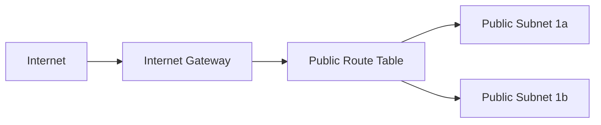

# Q1: VPC & CIDR Planning

## Lab Overview
- **Difficulty:** Beginner
- **Estimated Time:** 30-35 minutes
- **AWS Services:** VPC, Subnets, Internet Gateway, Route Tables
- **Region:** us-east-1
- **Cost:** Free Tier

## Prerequisites Check
- [ ] AWS account with Free Tier eligibility
- [ ] IAM permissions for VPC/EC2
- [ ] AWS CLI configured (optional)
- [ ] Billing alarm set at $5

## Learning Objectives
- Plan a VPC CIDR and carve public subnets
- Create and configure VPC with DNS hostnames
- Attach Internet Gateway and set up public route table
- Associate public subnets for internet access

## Architecture Overview


## Step-by-Step Console Instructions

### Step 1: Create VPC
**Console Navigation:** AWS Console → Search "VPC" → VPC Dashboard → Create VPC

**Detailed Steps:**
1. Click "VPC only"
2. Name tag: `practice-vpc-q1`
3. IPv4 CIDR: `10.0.0.0/16`
4. Tenancy: Default
5. Enable DNS resolution: Yes (checkbox)
6. Enable DNS hostnames: Yes (checkbox)
7. Click "Create VPC"

[SCREENSHOT: VPC creation confirmation with VPC ID]

**Expected Result:** VPC created with state "Available"

### Step 2: Create Public Subnets (Two for ALB compatibility)
**Console Navigation:** VPC Dashboard → Subnets → Create subnet

**Detailed Steps:**
1. Select VPC: `practice-vpc-q1`
2. Subnet 1:
   - Name: `practice-public-1a`
   - AZ: us-east-1a
   - CIDR: `10.0.1.0/24`
3. Click "Add new subnet"
4. Subnet 2:
   - Name: `practice-public-1b`
   - AZ: us-east-1b
   - CIDR: `10.0.2.0/24`
5. Click "Create subnet"
6. For each subnet: Actions → Edit subnet settings → Enable "Auto-assign public IPv4 address" → Save

[SCREENSHOT: Subnet list showing both subnets]

### Step 3: Create and Attach Internet Gateway
**Console Navigation:** VPC Dashboard → Internet Gateways → Create internet gateway

**Detailed Steps:**
1. Name: `practice-igw-q1`
2. Click "Create internet gateway"
3. Select IGW → Actions → Attach to VPC → Choose `practice-vpc-q1` → Attach

[SCREENSHOT: IGW attached state]

### Step 4: Create Public Route Table
**Console Navigation:** VPC Dashboard → Route Tables → Create route table

**Detailed Steps:**
1. Name: `practice-public-rt-q1`
2. VPC: `practice-vpc-q1`
3. Click "Create route table"
4. Select the route table → Routes tab → Edit routes → Add route
5. Destination: `0.0.0.0/0`
6. Target: Internet Gateway → `practice-igw-q1`
7. Save changes

[SCREENSHOT: Route table with 0.0.0.0/0 → IGW route]

### Step 5: Associate Subnets to Route Table
**Console Navigation:** Route table → Subnet associations tab → Edit subnet associations

**Detailed Steps:**
1. Select `practice-public-1a` and `practice-public-1b`
2. Save associations

[SCREENSHOT: Subnet associations showing both subnets]

## CLI Alternative (Copy-Paste Ready)
```bash
# Set region variable
REGION=us-east-1

# Create VPC with DNS support
VPC_ID=$(aws ec2 create-vpc --cidr-block 10.0.0.0/16 --region $REGION \
  --tag-specifications 'ResourceType=vpc,Tags=[{Key=Name,Value=practice-vpc-q1}]' \
  --query 'Vpc.VpcId' --output text)
echo "VPC ID: $VPC_ID"

# Enable DNS hostnames and support
aws ec2 modify-vpc-attribute --vpc-id $VPC_ID --enable-dns-hostnames --region $REGION
aws ec2 modify-vpc-attribute --vpc-id $VPC_ID --enable-dns-support --region $REGION

# Create public subnet in us-east-1a
PUB_SUBNET_A=$(aws ec2 create-subnet --vpc-id $VPC_ID --cidr-block 10.0.1.0/24 \
  --availability-zone us-east-1a --region $REGION \
  --tag-specifications 'ResourceType=subnet,Tags=[{Key=Name,Value=practice-public-1a}]' \
  --query 'Subnet.SubnetId' --output text)
echo "Public Subnet A: $PUB_SUBNET_A"

# Enable auto-assign public IP for subnet A
aws ec2 modify-subnet-attribute --subnet-id $PUB_SUBNET_A --map-public-ip-on-launch --region $REGION

# Create public subnet in us-east-1b
PUB_SUBNET_B=$(aws ec2 create-subnet --vpc-id $VPC_ID --cidr-block 10.0.2.0/24 \
  --availability-zone us-east-1b --region $REGION \
  --tag-specifications 'ResourceType=subnet,Tags=[{Key=Name,Value=practice-public-1b}]' \
  --query 'Subnet.SubnetId' --output text)
echo "Public Subnet B: $PUB_SUBNET_B"

# Enable auto-assign public IP for subnet B
aws ec2 modify-subnet-attribute --subnet-id $PUB_SUBNET_B --map-public-ip-on-launch --region $REGION

# Create Internet Gateway
IGW_ID=$(aws ec2 create-internet-gateway --region $REGION \
  --tag-specifications 'ResourceType=internet-gateway,Tags=[{Key=Name,Value=practice-igw-q1}]' \
  --query 'InternetGateway.InternetGatewayId' --output text)
echo "IGW ID: $IGW_ID"

# Attach IGW to VPC
aws ec2 attach-internet-gateway --internet-gateway-id $IGW_ID --vpc-id $VPC_ID --region $REGION

# Create public route table
RT_ID=$(aws ec2 create-route-table --vpc-id $VPC_ID --region $REGION \
  --tag-specifications 'ResourceType=route-table,Tags=[{Key=Name,Value=practice-public-rt-q1}]' \
  --query 'RouteTable.RouteTableId' --output text)
echo "Route Table ID: $RT_ID"

# Add default route to IGW
aws ec2 create-route --route-table-id $RT_ID --destination-cidr-block 0.0.0.0/0 \
  --gateway-id $IGW_ID --region $REGION

# Associate subnets to route table
aws ec2 associate-route-table --route-table-id $RT_ID --subnet-id $PUB_SUBNET_A --region $REGION
aws ec2 associate-route-table --route-table-id $RT_ID --subnet-id $PUB_SUBNET_B --region $REGION

echo "VPC setup complete!"
```

## Verification Checklist

1. **VPC Configuration Verification**
   - Method: Console
   - VPC Dashboard → Your VPCs → `practice-vpc-q1`
   - Verify CIDR `10.0.0.0/16`, DNS resolution and hostnames enabled
   - [SCREENSHOT: VPC details page]
   - Success: Settings match configuration

2. **Subnet Verification**
   - Method: Console
   - Subnets list shows two subnets with correct CIDRs and AZs
   - Auto-assign public IPv4 enabled on both
   - [SCREENSHOT: Subnet list with settings]
   - Success: Both subnets in Available state

3. **Internet Gateway Verification**
   - Method: Console
   - Internet Gateways → IGW attached to `practice-vpc-q1`
   - State: Attached
   - [SCREENSHOT: IGW attachment status]

4. **Route Table Verification**
   - Method: Console
   - Route Tables → `practice-public-rt-q1`
   - Routes: `0.0.0.0/0` → IGW
   - Subnet associations: both public subnets
   - [SCREENSHOT: Routes and associations]

5. **Internet Connectivity Test (Optional)**
   - Method: Launch temporary EC2 in `practice-public-1a`
   - SSH in: `ssh -i key.pem ec2-user@<public-ip>`
   - Run `ping -c 3 8.8.8.8` (expect replies)
   - Run `curl -I http://example.com` (expect HTTP/1.1 200 OK)
   - [SCREENSHOT: Ping and curl outputs]
   - Terminate test instance after verification

## Troubleshooting Guide

- **VPC Creation Fails (CIDR overlap)**
  - Cause: Conflicts with existing VPC CIDR
  - Fix: Choose non-overlapping CIDR (e.g., 10.1.0.0/16) and adjust subnets

- **DNS Hostnames Option Not Available**
  - Cause: Needs enabling after creation
  - Fix: Select VPC → Actions → Edit VPC settings → Enable DNS hostnames

- **Subnet Auto-Assign Public IP Not Working**
  - Cause: Setting not enabled on subnet
  - Fix: Subnet → Actions → Edit subnet settings → Enable auto-assign public IPv4

- **Internet Gateway Not Attaching**
  - Cause: IGW already attached elsewhere
  - Fix: Create new IGW or detach from old VPC, then attach

- **Route to IGW Not Working**
  - Cause: Missing default route or no subnet association
  - Fix: Ensure `0.0.0.0/0` → IGW exists and subnets associated; verify instance has public IP

- **Wrong Availability Zone Selected**
  - Cause: Typo or unavailable AZ
  - Fix: Use dropdown; choose us-east-1a and us-east-1b (or -1c if needed)

## Cleanup Instructions

**Console Cleanup:**
1. Terminate test EC2 instances (if any)
2. Route table → Subnet associations → Deselect all → Save
3. Delete route table `practice-public-rt-q1`
4. Detach Internet Gateway `practice-igw-q1`
5. Delete Internet Gateway
6. Delete subnets `practice-public-1a` and `practice-public-1b`
7. Delete VPC `practice-vpc-q1`

**CLI Cleanup:**
```bash
REGION=us-east-1

# Terminate instances (if any)
# aws ec2 terminate-instances --instance-ids i-xxxxx --region $REGION

# Disassociate and delete route table
aws ec2 disassociate-route-table --association-id <assoc-id> --region $REGION
aws ec2 delete-route-table --route-table-id $RT_ID --region $REGION

# Detach and delete IGW
aws ec2 detach-internet-gateway --internet-gateway-id $IGW_ID --vpc-id $VPC_ID --region $REGION
aws ec2 delete-internet-gateway --internet-gateway-id $IGW_ID --region $REGION

# Delete subnets
aws ec2 delete-subnet --subnet-id $PUB_SUBNET_A --region $REGION
aws ec2 delete-subnet --subnet-id $PUB_SUBNET_B --region $REGION

# Delete VPC
aws ec2 delete-vpc --vpc-id $VPC_ID --region $REGION
```

**Verification:** VPC Dashboard shows no resources for this lab

## Mark Mapping (Exam Scoring)

| Task | Marks | Criteria | Your Score |
|------|-------|----------|------------|
| VPC creation | 3 | Correct CIDR 10.0.0.0/16, DNS hostnames/resolution enabled | [ ] |
| Subnet creation | 3 | Two subnets with correct CIDRs (10.0.1.0/24, 10.0.2.0/24), correct AZs, auto-assign public IP enabled | [ ] |
| IGW creation | 3 | IGW created and attached to VPC | [ ] |
| Route table creation | 4 | Route table created with proper name tag | [ ] |
| Default route | 4 | 0.0.0.0/0 → IGW route added correctly | [ ] |
| Subnet association | 3 | Both subnets associated to public route table | [ ] |
| Verification | 5 | Internet connectivity test successful, route table proof provided | [ ] |
| **Total** | **25** | | **[ ]** |

## Key Takeaways
- /16 CIDR gives space for multiple /24 subnets; /24 yields ~251 usable IPs each
- DNS hostnames must be enabled for public DNS resolution
- Internet Gateway plus route table default route enables internet access
- Route table associations control subnet reachability
- Auto-assign public IP is per-subnet; ensure enabled for public subnets
- Two AZ public subnets support ALB readiness

## Next Steps
- Complete Q2: EC2 SSH Connectivity to test VPC networking
- Review VPC concepts in 05_vpc/overview.md
- Practice CIDR calculations for different subnet sizes

## Related Resources
- Main practice file: 10_indskills/state_level_practice.md (Q1)
- VPC service guide: 05_vpc/
- AWS VPC Documentation: https://docs.aws.amazon.com/vpc/
