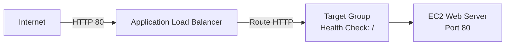

# Q5: ALB Basics (Single Target)

## Lab Overview
- **Difficulty:** Beginner
- **Estimated Time:** 35-40 minutes
- **AWS Services:** ALB, EC2, Target Groups, Security Groups
- **Region:** us-east-1
- **Cost:** ALB ~$16/month (NOT Free Tier eligible)

## Prerequisites Check
- [ ] Completed Q1 VPC with two public subnets in different AZs (us-east-1a, us-east-1b)
- [ ] Completed Q2 EC2 knowledge
- [ ] AWS CLI configured (optional)
- [ ] Understanding of HTTP and load balancing concepts

## Learning Objectives
- Create internet-facing Application Load Balancer
- Configure target groups with health checks
- Register EC2 instances as targets
- Test traffic distribution via ALB DNS name
- Understand ALB architecture and health check process

## Architecture Overview


## Step-by-Step Console Instructions

### Step 1: Launch EC2 Web Server
**Console Navigation:** EC2 Dashboard → Instances → Launch instances

**Detailed Steps:**
1. Name: `practice-web-q5`
2. AMI: Amazon Linux 2023
3. Instance type: `t2.micro`
4. Key pair: Select `practice-key-q2`
5. Network settings (Edit):
   - VPC: `practice-vpc-q1`
   - Subnet: `practice-public-1a` (us-east-1a)
   - Auto-assign public IP: Enable
   - Firewall: Select existing SG → Create new SG
6. New SG for ALB test:
   - Name: `practice-alb-test-sg`
   - Description: "Web server behind ALB"
   - Inbound: HTTP 80 from 0.0.0.0/0 (temporary for testing)
7. Advanced details → User data (paste script below):
```bash
#!/bin/bash
yum update -y
yum install -y httpd
systemctl enable httpd
systemctl start httpd
echo "<h1>ALB Single Target</h1><p>Instance: $(hostname -f)</p>" > /var/www/html/index.html
```
8. Launch instance

[SCREENSHOT: Instance launched with user data]

### Step 2: Create ALB Security Group
**Console Navigation:** EC2 → Security Groups → Create security group

**Detailed Steps:**
1. Name: `practice-alb-sg`
2. Description: "ALB facing internet"
3. VPC: `practice-vpc-q1`
4. Inbound rules:
   - Type: HTTP, Port: 80
   - Source: 0.0.0.0/0
   - Description: "HTTP from internet"
5. Outbound: default
6. Create security group

[SCREENSHOT: ALB security group created]

### Step 3: Update EC2 SG for ALB Communication
1. EC2 → Security Groups → `practice-alb-test-sg`
2. Inbound rules → Edit
3. Replace HTTP 0.0.0.0/0 with:
   - Type: HTTP, Port: 80
   - Source: Custom → `practice-alb-sg` (select from dropdown)
   - Description: "HTTP from ALB"
4. Save rules

[SCREENSHOT: EC2 SG updated with ALB SG source]

### Step 4: Create Target Group
**Console Navigation:** EC2 → Target Groups → Create target group

**Detailed Steps:**
1. Choose target type: Instances
2. Target group name: `practice-tg-q5`
3. Protocol: HTTP, Port: 80
4. VPC: `practice-vpc-q1`
5. Health check settings:
   - Protocol: HTTP
   - Path: `/`
   - Port: 80
   - Matcher: 200
   - Interval: 30 seconds
   - Timeout: 5 seconds
   - Healthy threshold: 2
   - Unhealthy threshold: 2
6. Tags: Name = `practice-tg-q5`
7. Create target group
8. Skip registering targets for now

[SCREENSHOT: Target group created with health check settings]

### Step 5: Register EC2 Instance to Target Group
1. Target group → Targets tab
2. Register targets → Select `practice-web-q5`
3. Port: 80
4. Register
5. Wait for status to change from "Initial" → "Healthy" (may take 2-3 minutes)

[SCREENSHOT: Target registered and healthy]

### Step 6: Create Application Load Balancer
**Console Navigation:** EC2 → Load Balancers → Create load balancer

**Detailed Steps:**
1. Select: Application Load Balancer
2. Basic configuration:
   - Name: `practice-alb-q5`
   - Scheme: Internet-facing
   - IP address type: IPv4
3. Network mapping:
   - VPC: `practice-vpc-q1`
   - Subnets: Select both:
     - `practice-public-1a` (us-east-1a)
     - `practice-public-1b` (us-east-1b)
   - Note: ALB requires minimum 2 subnets in different AZs
4. Security groups:
   - Select `practice-alb-sg`
5. Listeners and routing:
   - Leave default HTTP:80 listener
6. Create load balancer
7. Wait for state: Active (2-5 minutes)

[SCREENSHOT: ALB created and active]

### Step 7: Create Listener Rule (Default Target Group)
**Console Navigation:** ALB → Listeners → HTTP:80

**Detailed Steps:**
1. Listeners tab should already show HTTP:80
2. If not, add listener: Protocol HTTP, Port 80
3. Default action: Forward to target group → Select `practice-tg-q5`
4. Save
5. Verify listener shows "HTTP:80" with default action → target group

[SCREENSHOT: Listener configured with target group]

### Step 8: Verify ALB DNS and Test Access
1. ALB Details tab → DNS name (e.g., `practice-alb-q5-123456789.us-east-1.elb.amazonaws.com`)
2. Wait 2-3 minutes for DNS propagation
3. Copy DNS name

[SCREENSHOT: ALB DNS name visible]

## CLI Alternative (Copy-Paste Ready)
```bash
REGION=us-east-1

# Get VPC and subnet IDs from Q1
VPC_ID=$(aws ec2 describe-vpcs --filters "Name=tag:Name,Values=practice-vpc-q1" \
  --query 'Vpcs[0].VpcId' --output text --region $REGION)
SUBNET_A=$(aws ec2 describe-subnets --filters "Name=tag:Name,Values=practice-public-1a" \
  --query 'Subnets[0].SubnetId' --output text --region $REGION)
SUBNET_B=$(aws ec2 describe-subnets --filters "Name=tag:Name,Values=practice-public-1b" \
  --query 'Subnets[0].SubnetId' --output text --region $REGION)

# Get EC2 key and security group
KEY_NAME="practice-key-q2"
EC2_SG=$(aws ec2 describe-security-groups --filters "Name=group-name,Values=practice-ssh-sg" \
  --query 'SecurityGroups[0].GroupId' --output text --region $REGION)

# Get latest Amazon Linux 2023 AMI
AL2023_AMI=$(aws ssm get-parameter \
  --name /aws/service/ami-amazon-linux-latest/al2023-ami-kernel-default-x86_64 \
  --region $REGION \
  --query 'Parameter.Value' --output text)

# Create user data script
cat > /tmp/userdata-q5.sh <<'EOF'
#!/bin/bash
yum update -y
yum install -y httpd
systemctl enable httpd
systemctl start httpd
echo "<h1>ALB Single Target</h1><p>Instance: $(hostname -f)</p>" > /var/www/html/index.html
EOF

# Create ALB security group
ALB_SG=$(aws ec2 create-security-group \
  --group-name practice-alb-sg \
  --description "ALB facing internet" \
  --vpc-id $VPC_ID \
  --region $REGION \
  --query 'GroupId' --output text)
echo "ALB SG: $ALB_SG"

# Allow HTTP to ALB
aws ec2 authorize-security-group-ingress \
  --group-id $ALB_SG \
  --protocol tcp \
  --port 80 \
  --cidr 0.0.0.0/0 \
  --region $REGION

# Create web server SG
WEB_SG=$(aws ec2 create-security-group \
  --group-name practice-web-sg-q5 \
  --description "Web server behind ALB" \
  --vpc-id $VPC_ID \
  --region $REGION \
  --query 'GroupId' --output text)
echo "Web SG: $WEB_SG"

# Allow HTTP from ALB SG
aws ec2 authorize-security-group-ingress \
  --group-id $WEB_SG \
  --protocol tcp \
  --port 80 \
  --source-group $ALB_SG \
  --region $REGION

# Launch EC2 instance
INSTANCE_ID=$(aws ec2 run-instances \
  --image-id $AL2023_AMI \
  --instance-type t2.micro \
  --key-name $KEY_NAME \
  --security-group-ids $WEB_SG \
  --subnet-id $SUBNET_A \
  --associate-public-ip-address \
  --user-data file:///tmp/userdata-q5.sh \
  --tag-specifications 'ResourceType=instance,Tags=[{Key=Name,Value=practice-web-q5}]' \
  --region $REGION \
  --query 'Instances[0].InstanceId' --output text)
echo "Instance ID: $INSTANCE_ID"

# Wait for instance
echo "Waiting for instance to be running..."
aws ec2 wait instance-running --instance-ids $INSTANCE_ID --region $REGION

echo "Waiting for status checks..."
aws ec2 wait instance-status-ok --instance-ids $INSTANCE_ID --region $REGION

# Create target group
TG_ARN=$(aws elbv2 create-target-group \
  --name practice-tg-q5 \
  --protocol HTTP \
  --port 80 \
  --vpc-id $VPC_ID \
  --region $REGION \
  --health-check-protocol HTTP \
  --health-check-path / \
  --health-check-interval-seconds 30 \
  --health-check-timeout-seconds 5 \
  --healthy-threshold-count 2 \
  --unhealthy-threshold-count 2 \
  --matcher HttpCode=200 \
  --query 'TargetGroups[0].TargetGroupArn' --output text)
echo "Target Group ARN: $TG_ARN"

# Register target
aws elbv2 register-targets \
  --target-group-arn $TG_ARN \
  --targets Id=$INSTANCE_ID Port=80 \
  --region $REGION
echo "Target registered"

# Create ALB
ALB_ARN=$(aws elbv2 create-load-balancer \
  --name practice-alb-q5 \
  --subnets $SUBNET_A $SUBNET_B \
  --security-groups $ALB_SG \
  --scheme internet-facing \
  --type application \
  --ip-address-type ipv4 \
  --region $REGION \
  --query 'LoadBalancers[0].LoadBalancerArn' --output text)
echo "ALB ARN: $ALB_ARN"

# Get ALB DNS
ALB_DNS=$(aws elbv2 describe-load-balancers \
  --load-balancer-arns $ALB_ARN \
  --region $REGION \
  --query 'LoadBalancers[0].DNSName' --output text)
echo "ALB DNS: $ALB_DNS"

# Wait for ALB active
echo "Waiting for ALB to be active..."
while [ "$(aws elbv2 describe-load-balancers --load-balancer-arns $ALB_ARN --region $REGION --query 'LoadBalancers[0].State.Code' --output text)" != "active" ]; do
  sleep 5
done
echo "ALB is active"

# Create listener
aws elbv2 create-listener \
  --load-balancer-arn $ALB_ARN \
  --protocol HTTP \
  --port 80 \
  --default-actions Type=forward,TargetGroupArn=$TG_ARN \
  --region $REGION

echo "Listener created"
echo "Test at: http://$ALB_DNS"
```

## Verification Checklist

1. **Target Group Health**
   - Console: EC2 → Target Groups → `practice-tg-q5` → Targets tab
   - Status shows "Healthy" (green check)
   - Health checks section shows "Passed" responses
   - [SCREENSHOT: Target group with healthy target]

2. **ALB Active State**
   - Console: EC2 → Load Balancers → `practice-alb-q5`
   - State: Active (green)
   - DNS name visible
   - [SCREENSHOT: ALB active status]

3. **Listener Configured**
   - Listeners tab shows "HTTP:80"
   - Default action: Forward to `practice-tg-q5`
   - [SCREENSHOT: Listener with target group]

4. **DNS Resolution Test**
   - `nslookup <alb-dns>` returns IP addresses (multiple for ALB)
   - [SCREENSHOT: DNS resolution output]

5. **Browser Test (Index Page)**
   - Open `http://<alb-dns>` in browser
   - Page displays: "ALB Single Target" heading
   - Shows instance hostname
   - [SCREENSHOT: Website in browser]

6. **curl Test**
   - `curl -I http://<alb-dns>` → HTTP/1.1 200 OK
   - `curl http://<alb-dns>` → returns HTML with "ALB Single Target"
   - [SCREENSHOT: curl output]

7. **Health Check Verification**
   - Console: Target → Health checks tab
   - Shows successful health checks with timestamp
   - Response code: 200
   - [SCREENSHOT: Health check logs]

8. **ALB Logs (Optional)**
   - SSH to EC2: check `/var/log/httpd/access_log`
   - Shows GET requests from ALB health checks (every 30s)
   - `curl` requests also logged
   - [SCREENSHOT: HTTP access log]

## Troubleshooting Guide

- **Target shows "Unhealthy"**
  - Cause: EC2 SG doesn't allow port 80 from ALB SG, or httpd not running
  - Fix: Edit EC2 SG to allow HTTP from ALB SG; SSH in and verify `sudo systemctl status httpd` shows "active (running)"; check `/var/log/httpd/error_log` for errors

- **ALB DNS doesn't resolve**
  - Cause: DNS propagation takes 2-3 minutes
  - Fix: Wait 3-5 minutes; try again; verify ALB is in "active" state

- **Connection timeout accessing ALB**
  - Cause: ALB in private subnets or not internet-facing; SG doesn't allow HTTP
  - Fix: Verify ALB scheme is "Internet-facing"; verify subnets are public with IGW route; verify ALB SG allows HTTP 80 inbound

- **Target won't register**
  - Cause: Instance terminated or in different VPC
  - Fix: Verify instance is running; ensure same VPC; manually register from console

- **Wrong subnets selected for ALB**
  - Cause: Using only one subnet or subnets in same AZ
  - Fix: ALB requires minimum 2 subnets in different AZs; relaunch ALB with correct subnets

- **Health check failing but httpd running**
  - Cause: Health check path incorrect or index.html missing
  - Fix: Verify `/` exists with GET response 200; SSH in and check `curl http://localhost` returns HTML; check SG rules for both directions

## Cleanup Instructions

**Console Cleanup (in order):**
1. Delete ALB: EC2 → Load Balancers → `practice-alb-q5` → Delete → Confirm
2. Wait for ALB deletion (5-10 minutes)
3. Delete target group: EC2 → Target Groups → `practice-tg-q5` → Delete
4. Terminate EC2: EC2 → Instances → `practice-web-q5` → Terminate
5. Delete ALB SG: EC2 → Security Groups → `practice-alb-sg` → Delete
6. Delete web SG: EC2 → Security Groups → `practice-web-sg-q5` → Delete

**CLI Cleanup:**
```bash
REGION=us-east-1

# Delete ALB
aws elbv2 delete-load-balancer --load-balancer-arn $ALB_ARN --region $REGION
echo "Waiting for ALB deletion..."
sleep 30

# Delete target group
aws elbv2 delete-target-group --target-group-arn $TG_ARN --region $REGION

# Terminate instance
aws ec2 terminate-instances --instance-ids $INSTANCE_ID --region $REGION

# Delete security groups
aws ec2 delete-security-group --group-id $ALB_SG --region $REGION
aws ec2 delete-security-group --group-id $WEB_SG --region $REGION
```

**Verification:** ALB console shows zero load balancers

## Mark Mapping (Exam Scoring)

| Task | Marks | Criteria | Your Score |
|------|-------|----------|------------|
| EC2 web server | 3 | Correct subnet, public IP enabled, user data installs httpd | [ ] |
| ALB SG creation | 3 | Allows HTTP 80 from 0.0.0.0/0 | [ ] |
| EC2 SG scoped | 3 | Allows HTTP 80 from ALB SG only, not 0.0.0.0/0 | [ ] |
| Target group | 4 | HTTP port 80, health check path /, interval 30s, timeout 5s | [ ] |
| Listener setup | 2 | HTTP:80 listener with forward to target group | [ ] |
| Target registration | 3 | Instance registered, status healthy | [ ] |
| ALB configuration | 4 | Internet-facing, 2 subnets in different AZs, active state | [ ] |
| Health verification | 3 | Console shows healthy status with successful checks | [ ] |
| DNS access test | 2 | Browser and curl access ALB DNS returning 200 OK | [ ] |
| **Total** | **27** | | **[ ]** |

## Key Takeaways
- ALB requires minimum 2 subnets in different AZs (multi-AZ requirement)
- Target health depends on SG rules (EC2 must allow from ALB SG) and health check path
- ALB DNS takes 2-3 minutes to propagate; plan for this in exams
- Security groups should follow least privilege (EC2 only allows from ALB, not 0.0.0.0/0)
- User data executes on first boot; verify by checking httpd service and HTML content
- Health checks repeat every interval; unhealthy targets removed from rotation

## Next Steps
- Complete Q6: ElastiCache Redis for caching layer
- Complete Q5 with multiple targets across AZs for higher availability
- Review ALB advanced features in 06_alb/

## Related Resources
- Main practice file: 10_indskills/state_level_practice.md (Q5)
- ALB service guide: 06_alb/overview.md
- Target group guide: 06_alb/target_groups.md
- Health checks guide: 06_alb/health_checks.md
