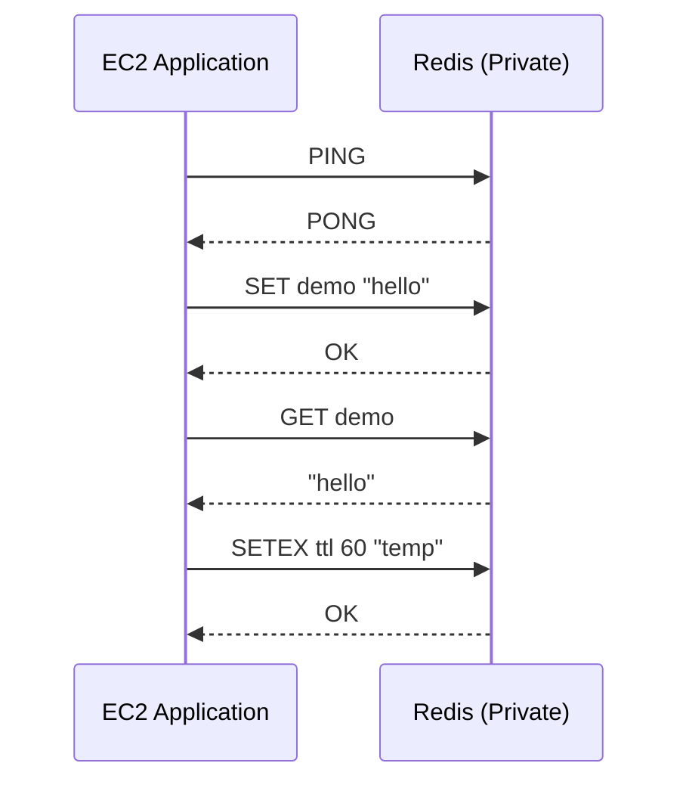

# Q6: ElastiCache Redis Performance Testing

## Lab Overview
- **Difficulty:** Beginner
- **Estimated Time:** 35-40 minutes
- **AWS Services:** ElastiCache, Redis, EC2, VPC, Security Groups
- **Region:** us-east-1
- **Cost:** Free Tier (cache.t2.micro 750 hours for 12 months)

## Prerequisites Check
- [ ] Completed Q1 VPC setup
- [ ] Completed Q2 EC2 SSH knowledge
- [ ] AWS CLI configured (optional)
- [ ] Basic understanding of key-value stores and caching

## Learning Objectives
- Create private subnets for ElastiCache resources
- Configure ElastiCache subnet group and security group
- Deploy Redis cluster using Free Tier instance
- Install redis-cli on EC2
- Test Redis operations (PING, SET, GET, TTL, cache patterns)

## Architecture Overview


## Step-by-Step Console Instructions

### Step 1: Create Private Subnets
**Console Navigation:** VPC → Subnets → Create subnet

**Detailed Steps:**
1. VPC: `practice-vpc-q1`
2. Subnet 1:
   - Name: `practice-private-redis-1a`
   - AZ: us-east-1a
   - CIDR: `10.0.11.0/24`
3. Create subnet
4. Repeat for Subnet 2:
   - Name: `practice-private-redis-1b`
   - AZ: us-east-1b
   - CIDR: `10.0.12.0/24`

[SCREENSHOT: Two private subnets created]

Note: Do NOT enable auto-assign public IP for these subnets

### Step 2: Create Private Route Table
**Console Navigation:** VPC → Route Tables → Create route table

**Detailed Steps:**
1. Name: `practice-private-rt`
2. VPC: `practice-vpc-q1`
3. Create route table
4. Subnet associations tab → Edit subnet associations
5. Select both private subnets: `practice-private-redis-1a` and `practice-private-redis-1b`
6. Save associations
7. Leave routes table with only local route (no IGW route)

[SCREENSHOT: Private route table with subnets associated]

### Step 3: Create ElastiCache Subnet Group
**Console Navigation:** ElastiCache → Subnet Groups → Create subnet group

**Detailed Steps:**
1. Name: `practice-redis-subnet-group`
2. Description: "Subnet group for Redis cache"
3. VPC: `practice-vpc-q1`
4. Availability Zones and Subnets:
   - us-east-1a: select `practice-private-redis-1a`
   - us-east-1b: select `practice-private-redis-1b`
5. Create

[SCREENSHOT: Subnet group with 2 subnets]

### Step 4: Create Redis Security Group
**Console Navigation:** EC2 → Security Groups → Create security group

**Detailed Steps:**
1. Name: `practice-redis-sg`
2. Description: "Redis access from EC2 app tier"
3. VPC: `practice-vpc-q1`
4. Inbound rule:
   - Type: Custom TCP
   - Port: 6379
   - Source: Custom → `practice-ssh-sg` (from Q2)
   - Description: "Redis from app servers"
5. Outbound: default
6. Create security group

[SCREENSHOT: Redis security group with 6379 rule]

### Step 5: Create Redis Cluster
**Console Navigation:** ElastiCache → Clusters → Create cluster

**Detailed Steps:**
1. Cluster engine: Redis
2. Cluster mode: Disabled (single shard)
3. Cluster settings:
   - Name: `practice-redis-q6`
   - Engine version: 7.x or latest stable
   - Port: 6379 (default)
   - Parameter group: default.redis7.x (or latest)
4. Cluster configuration:
   - Node type: cache.t2.micro (Free Tier)
   - Number of replicas: 0 (single node for lab)
   - Automatic failover: Disable (not needed for single node)
5. Subnet and security:
   - Subnet group: `practice-redis-subnet-group`
   - Security groups: `practice-redis-sg`
   - Publicly accessible: No (must be private)
6. Backup and maintenance:
   - Automatic backups: Disable (simplify cleanup)
   - Multi-AZ: Disable (single node)
7. Create

[SCREENSHOT: Redis cluster creation initiated]

### Step 6: Wait for Redis Cluster Availability
1. ElastiCache → Clusters → wait for status "available" (5-10 minutes)
2. Click cluster name `practice-redis-q6`
3. Note Primary endpoint (e.g., `practice-redis-q6.abc123.ng.0001.use1.cache.amazonaws.com:6379`)

[SCREENSHOT: Redis cluster available with endpoint]

### Step 7: Install redis-cli on EC2
**SSH into EC2 from Q2:** `ssh -i practice-key-q2.pem ec2-user@<public-ip>`

**Install from source (Amazon Linux 2023):**
```bash
# Update system
sudo yum update -y

# Install build tools
sudo yum install -y gcc make

# Download redis-stable
cd /tmp
wget http://download.redis.io/redis-stable.tar.gz
tar -xzf redis-stable.tar.gz
cd redis-stable

# Compile
make

# Install redis-cli to system path
sudo cp src/redis-cli /usr/local/bin/

# Verify installation
redis-cli --version
# Expected output: redis-cli 7.x.x
```

[SCREENSHOT: redis-cli installed and version shown]

### Step 8: Get Redis Endpoint
1. ElastiCache → Clusters → `practice-redis-q6`
2. Copy Primary endpoint (without :6379 suffix for redis-cli command)

[SCREENSHOT: Redis endpoint noted]

## CLI Alternative (Copy-Paste Ready)
```bash
REGION=us-east-1

# Get VPC ID
VPC_ID=$(aws ec2 describe-vpcs --filters "Name=tag:Name,Values=practice-vpc-q1" \
  --query 'Vpcs[0].VpcId' --output text --region $REGION)
echo "VPC ID: $VPC_ID"

# Create private subnets
PRIV_SUBNET_A=$(aws ec2 create-subnet \
  --vpc-id $VPC_ID \
  --cidr-block 10.0.11.0/24 \
  --availability-zone us-east-1a \
  --region $REGION \
  --tag-specifications 'ResourceType=subnet,Tags=[{Key=Name,Value=practice-private-redis-1a}]' \
  --query 'Subnet.SubnetId' --output text)
echo "Private Subnet A: $PRIV_SUBNET_A"

PRIV_SUBNET_B=$(aws ec2 create-subnet \
  --vpc-id $VPC_ID \
  --cidr-block 10.0.12.0/24 \
  --availability-zone us-east-1b \
  --region $REGION \
  --tag-specifications 'ResourceType=subnet,Tags=[{Key=Name,Value=practice-private-redis-1b}]' \
  --query 'Subnet.SubnetId' --output text)
echo "Private Subnet B: $PRIV_SUBNET_B"

# Create private route table (no IGW route)
PRIV_RT=$(aws ec2 create-route-table \
  --vpc-id $VPC_ID \
  --region $REGION \
  --tag-specifications 'ResourceType=route-table,Tags=[{Key=Name,Value=practice-private-rt}]' \
  --query 'RouteTable.RouteTableId' --output text)
echo "Private Route Table: $PRIV_RT"

# Associate subnets
aws ec2 associate-route-table --route-table-id $PRIV_RT --subnet-id $PRIV_SUBNET_A --region $REGION
aws ec2 associate-route-table --route-table-id $PRIV_RT --subnet-id $PRIV_SUBNET_B --region $REGION

# Create subnet group for ElastiCache
aws elasticache create-cache-subnet-group \
  --cache-subnet-group-name practice-redis-subnet-group \
  --cache-subnet-group-description "Subnet group for Redis cache" \
  --subnet-ids $PRIV_SUBNET_A $PRIV_SUBNET_B \
  --region $REGION

# Get EC2 security group
APP_SG=$(aws ec2 describe-security-groups --filters "Name=group-name,Values=practice-ssh-sg" \
  --query 'SecurityGroups[0].GroupId' --output text --region $REGION)

# Create Redis security group
REDIS_SG=$(aws ec2 create-security-group \
  --group-name practice-redis-sg \
  --description "Redis access from app tier" \
  --vpc-id $VPC_ID \
  --region $REGION \
  --query 'GroupId' --output text)
echo "Redis SG: $REDIS_SG"

# Allow 6379 from app SG
aws ec2 authorize-security-group-ingress \
  --group-id $REDIS_SG \
  --protocol tcp \
  --port 6379 \
  --source-group $APP_SG \
  --region $REGION

# Create Redis cluster
aws elasticache create-cache-cluster \
  --cache-cluster-id practice-redis-q6 \
  --engine redis \
  --cache-node-type cache.t2.micro \
  --engine-version 7.0 \
  --num-cache-nodes 1 \
  --cache-subnet-group-name practice-redis-subnet-group \
  --security-group-ids $REDIS_SG \
  --port 6379 \
  --auto-minor-version-upgrade \
  --region $REGION

echo "Creating Redis cluster..."
sleep 30

# Wait for Redis availability
ENDPOINT=$(aws elasticache describe-cache-clusters \
  --cache-cluster-id practice-redis-q6 \
  --show-cache-node-info \
  --region $REGION \
  --query 'CacheClusters[0].CacheNodes[0].Endpoint.Address' --output text)
echo "Redis Endpoint: $ENDPOINT"
```

## Verification Checklist

1. **Redis Cluster Status**
   - Console: ElastiCache → Clusters → `practice-redis-q6`
   - Status: Available
   - Node type: cache.t2.micro
   - Port: 6379
   - [SCREENSHOT: Cluster details showing available status]

2. **Subnet Group Configuration**
   - Console: ElastiCache → Subnet Groups
   - Name: `practice-redis-subnet-group`
   - Shows 2 subnets in us-east-1a and us-east-1b
   - [SCREENSHOT: Subnet group with 2 subnets]

3. **Security Group Configuration**
   - Console: EC2 → Security Groups → `practice-redis-sg`
   - Inbound: TCP 6379 from `practice-ssh-sg`
   - [SCREENSHOT: Redis SG rules]

4. **redis-cli Installation**
   - From EC2: `redis-cli --version`
   - Shows version (e.g., redis-cli 7.0.4)
   - [SCREENSHOT: redis-cli version]

5. **PING Test**
   - From EC2: `redis-cli -h <endpoint> ping`
   - Expected: PONG
   - [SCREENSHOT: PING command and response]

6. **SET Test**
   - `redis-cli -h <endpoint> SET demo "hello"`
   - Expected: OK
   - [SCREENSHOT: SET command]

7. **GET Test**
   - `redis-cli -h <endpoint> GET demo`
   - Expected: "hello"
   - [SCREENSHOT: GET command returning value]

8. **Cache Miss Test**
   - `redis-cli -h <endpoint> GET missing`
   - Expected: (nil)
   - Shows cache miss behavior
   - [SCREENSHOT: GET on missing key]

9. **TTL Test (Cache Expiration)**
   - `redis-cli -h <endpoint> SETEX ttlkey 60 "temp"`
   - Expected: OK
   - `redis-cli -h <endpoint> TTL ttlkey`
   - Expected: countdown (e.g., 55, 54, 53...)
   - `redis-cli -h <endpoint> GET ttlkey`
   - After 60s: (nil)
   - [SCREENSHOT: SETEX and TTL commands]

10. **Multiple Operations**
    - Session test: enter interactive mode `redis-cli -h <endpoint>`
    - Execute multiple commands showing persistence
    - [SCREENSHOT: Redis CLI interactive session]

## Troubleshooting Guide

- **Connection refused / timeout**
  - Cause: Redis SG doesn't allow 6379 from EC2 SG; wrong endpoint; cluster not available
  - Fix: Verify Redis SG inbound rule allows 6379 from app SG; ensure endpoint is correct; wait for cluster status "available"

- **redis-cli command not found**
  - Cause: Installation incomplete or PATH not updated
  - Fix: Complete installation steps; verify `/usr/local/bin/redis-cli` exists; try full path `/usr/local/bin/redis-cli`

- **Timeout connecting to Redis**
  - Cause: Wrong subnet group; Redis in public subnet; security group not scoped correctly
  - Fix: Verify subnet group has private subnets; verify no public IP on Redis node; verify SG allows only from app tier

- **Wrong endpoint format**
  - Cause: Using reader endpoint or incorrect format
  - Fix: Use primary endpoint from cluster details; format is `<name>.<id>.<region>.cache.amazonaws.com`; no :6379 needed in redis-cli command

- **Compilation errors (gcc, make not found)**
  - Cause: Build tools not installed
  - Fix: Run `sudo yum install -y gcc make` first; then recompile

- **Permission denied when copying redis-cli**
  - Cause: Need sudo to write to /usr/local/bin
  - Fix: Use `sudo cp src/redis-cli /usr/local/bin/`

## Cleanup Instructions

**Console Cleanup (in order):**
1. Delete Redis cluster: ElastiCache → Clusters → `practice-redis-q6` → Delete → No snapshot
2. Wait for deletion (5-10 minutes)
3. Delete subnet group: ElastiCache → Subnet Groups → `practice-redis-subnet-group` → Delete
4. Delete Redis SG: EC2 → Security Groups → `practice-redis-sg` → Delete
5. Disassociate and delete private route table: VPC → Route Tables → `practice-private-rt` → Disassociate subnets → Delete
6. Delete private subnets: VPC → Subnets → delete both `practice-private-redis-*` subnets

**CLI Cleanup:**
```bash
REGION=us-east-1

# Delete Redis cluster (no final snapshot)
aws elasticache delete-cache-cluster \
  --cache-cluster-id practice-redis-q6 \
  --skip-final-snapshot \
  --region $REGION

echo "Waiting for cluster deletion..."
sleep 30

# Delete subnet group
aws elasticache delete-cache-subnet-group \
  --cache-subnet-group-name practice-redis-subnet-group \
  --region $REGION

# Delete security group
aws ec2 delete-security-group --group-id $REDIS_SG --region $REGION

# Disassociate route table
aws ec2 disassociate-route-table --association-id <assoc-id> --region $REGION

# Delete route table
aws ec2 delete-route-table --route-table-id $PRIV_RT --region $REGION

# Delete subnets
aws ec2 delete-subnet --subnet-id $PRIV_SUBNET_A --region $REGION
aws ec2 delete-subnet --subnet-id $PRIV_SUBNET_B --region $REGION
```

**Verification:** ElastiCache console shows zero clusters

## Mark Mapping (Exam Scoring)

| Task | Marks | Criteria | Your Score |
|------|-------|----------|------------|
| Private subnet creation | 2 | Two subnets in different AZs, correct CIDR blocks | [ ] |
| Subnet group | 3 | Contains 2 private subnets, correct VPC | [ ] |
| Redis SG creation | 3 | Allows 6379 from app SG only | [ ] |
| Redis cluster | 4 | cache.t2.micro, engine Redis, private placement, available status | [ ] |
| redis-cli install | 2 | Installed and accessible from EC2 | [ ] |
| PING test | 3 | redis-cli command runs, returns PONG | [ ] |
| SET/GET operations | 3 | SET returns OK, GET returns stored value | [ ] |
| Cache miss | 2 | GET missing key returns (nil) | [ ] |
| TTL/Expiration | 3 | SETEX sets expiration, TTL counts down, key expires | [ ] |
| Documentation | 2 | Screenshots and evidence of all tests | [ ] |
| **Total** | **27** | | **[ ]** |

## Key Takeaways
- Redis must be in private subnets for security; applications in public tier access via security group rules
- redis-cli on Amazon Linux requires compilation; CentOS/RHEL systems have simpler installation
- SETEX combines SET with automatic expiration; useful for session caching, rate limiting
- Cache misses return (nil); applications must handle this and load from primary data source
- ElastiCache DNS may take 1-2 minutes to resolve; use IP if needed
- Single-node clusters lack high availability; production uses replicas and Multi-AZ

## Next Steps
- Complete Q4: RDS MySQL integration with Redis caching
- Explore advanced patterns in 08_caching/caching_patterns.md
- Combine Redis with RDS for query optimization

## Related Resources
- Main practice file: 10_indskills/state_level_practice.md (Q6)
- Caching service guide: 08_caching/
- Redis patterns: 08_caching/elasticache_redis.md
- Redis official: https://redis.io/docs/
